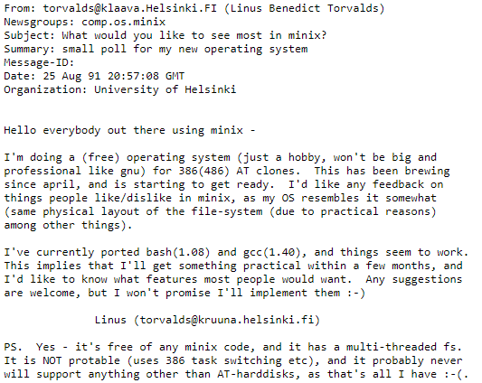
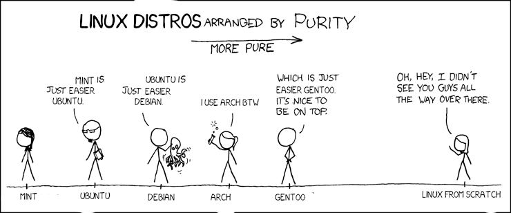
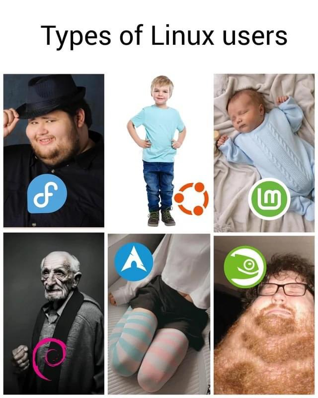

# Introduction

## Linux
Windows, made by Microsoft, is a well-known Operating System mostly used on Desktop computers, but there are other alternatives as well. One of the more popular ones are MacOSX, ChromeOS and, of course, Linux. Linux, using a desktop environment, is less prominent than the others.

In Server / IOT / mobile environments, a certain shift in used Operating Systems occurred. Linux is one of the most popular operating systems in these markets. Some interesting statements:
* [Most supercomputers run on Linux](https://www.top500.org/statistics/details/osfam/1/)
* [111+ Linux Statistics and Facts – Linux Rocks!](https://webtribunal.net/blog/linux-statistics/)
* [The most popular cloud infrastructure providers use Linux](https://www.linuxfoundation.org/blog/how-amazon-web-services-uses-linux-and-open-source/)

Linux is used in smartphones, (web) servers, tablets, IoT devices, Smart washing machines, self driving cars, modems, routers, PlayStations, ... In brief: Linux is used way more than you would initially think. Linux even has its own mascotte, the penguin named Tux!

### Unix
Dennis Ritchie and Ken Thompson created the Unix operating system in 1969. The source code from this OS was shared at that time. After a while the company AT&T Bell Labs decided they wanted to sell Unix commercially. BSD further developed the Operating System independently from Unix. This led to subsequent versions:
* Unix: The commercial version
* BSD Unix: The open source version

In the '80 there were different versions of Unix. Because Unix was commercialized (AT&T), the source code of Unix was rewritten: GNU project ("GNU is not unix"). The goal of GNU was the development of an open source Operating System where everyone could work on together as a community. The GNU project was missing a kernel.

### Linux
A student, named Linus Torvalds, created a post in a newsgroup about his own Operating System in the '90:

We are still using the Linux kernel today. The kernel is being further developed every day.  

* [The history of Linux - Timeline 1](https://en.wikipedia.org/wiki/Linux#/media/File:Unix_timeline.en.svg)  
* [The history of Linux - Timeline 2](https://www.linuxbe.com/images/linux_events30.jpg)  

#### Linux distributions
Linux distributions (distros in short) simplify the process of installing gnu/linux and other apps on your computer. Well-known distros are Ubuntu, RedHat, Fedora, CentOS, Debian, Archlinux and Oracle Linux. Because linux is very scalable, there are also special distros for a certain purpose, for example clonezilla.

<i class="fa-solid fa-film"></i> [Unix vs Linux (first 10:30 minutes)](https://www.youtube.com/watch?v=jowCUo_UGts)   

<i class="fa-solid fa-film"></i>  [What is linux?](https://www.youtube.com/watch?v=zA3vmx0GaO8)

<i class="fa-solid fa-earth-europe"></i> [High level overview Linux](https://www.linux.com/what-is-linux/)

<i class="fa-solid fa-earth-europe"></i> [Most popular linux distros](https://distrowatch.com/dwres.php?resource=popularity)

