# Installation

## Virtualisation
To install servers that offer services (such as a minecraft server!) you will need a server with a public IP address. Usually you would go to a cloud provider where you can rent a server for a fixed fee / month. For this course we will simulate this process by using a virtual machine.

Virtualisation is a concept where you can run a computer system with an operating system virtually on another system. This makes it possible to have multiple _guest operating systems_ with their own virtual hardware on one _host system_.


For this course we want to use and install the operating system [Ubuntu server](https://ubuntu.com/download/server) in a virtual environment. For this course we will use a debian based distro.

?> :fa-solid fa-list-check: _Download the `.iso` file for Ubuntu server using [this link](https://ubuntu.com/download/server). A `.iso` file is an exact copy of a CD/DVD. You will use this later to install the operating system in your virtual machine._


## Virtualisation software
To use virtualisation there are several options. The most common virtualisation software is:
- VMware Workstation
- Virtualbox
- Hyper-V

In this course we will use and support VMware Workstation but the other software packages have the same purpose. 

## Create a new VM
To create a new virtual machine (VM) in VMWare you go to the menu `File`>`New Virtual Machine`. The wizard to create a new VM will appear.


In the first screen we select the option `Typical`:

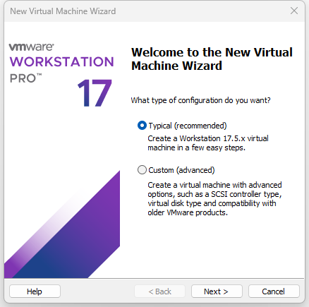

Next we choose to `I will install the operating system later`:


Next we choose the operating system `Linux`. In the version dropdown we select `Ubuntu 64 bit`. This is the Linux distribution that we will use during this course.


In the next screen we give the virtual machine a name. You can also specify a different folder to store the virtual machine on your computer.  

?> <i class="fa fa-exclamation-circle" style="font-size:48px;color:red"></i> Caution! Do not save your VM files to a directory on your host that is synced with the cloud (OneDrive, Dropbox, Google Drive)?. Your VM will crash and you will lose everything from within this VM!

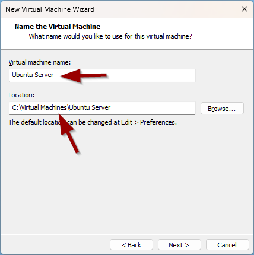

In the next screen we configure the virtual harddisk size for the VM. We will create a disk that has 20GB storage. We can expand this later if needed:

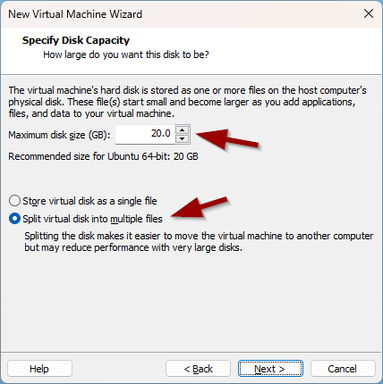

We have to click on `Customize Hardware` to configure the virtual machine a little more:

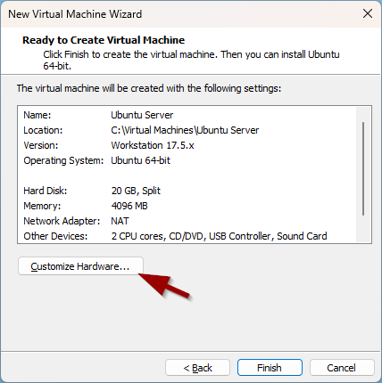

We still need to link the Ubuntu-server ISO file to the virtual CD-rom drive. We do this by selecting `New CD/DVD` and browsing to the downloaded `iso` file:


Click on `Finish` and the virtual machine will be created.


  
At this point we only need to change the bios to UEFI. To do this we click on `Edit virtual machine settings`. 
  
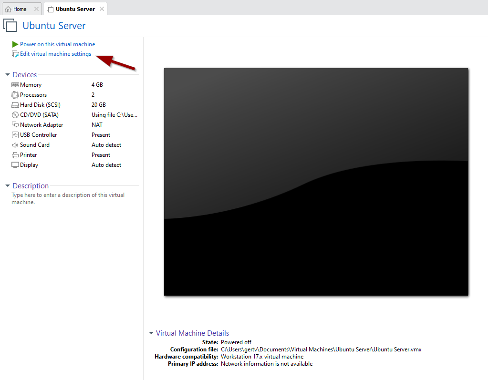 

Go to the tab `Options`, click on `Advanced` and select the option `UEFI`. Note that you'll also find the setting `Side channel mitigations` here in case you get a warning later on when starting your Virtual Machine. 
  
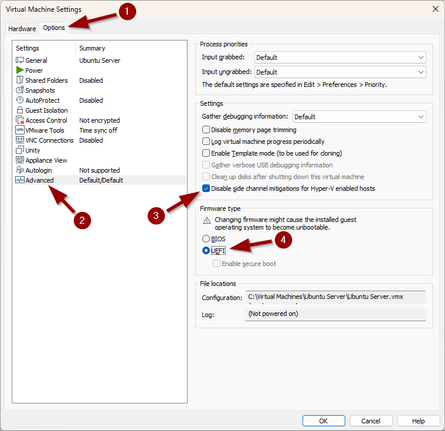 
  
You can now boot the VM by clicking the green arrow icon. This will boot the virtual machine and run the installation process.


## Installation Ubuntu server
As described before we will use the distro Ubuntu. After creating and booting the virtual machine there will be an installation process that we need to run through. You will notice that there is no mouse pointer available. We will use the keypoint arrow keys & enter key to navigate through the steps.

?> <i class="fa-solid fa-circle-info"></i> Does booting the VM result in the error `This host supports Intel VT-x, but Intel VT-x is diabled`? You will have to activate the VT-X option in the BIOS of your laptop. More information can be found in [this article](https://www.qtithow.com/2020/12/fix-error-this-host-supports-Intel-VT-x.html).

?> <i class="fa-solid fa-circle-info"></i> If you want to leave your VM and get your mouse back in the OS of your laptop (=Windows) you'll have to press `CTRL+ALT` !

We make the choice to Try or Install:


We start the installation process by selecting the language. We choose English:

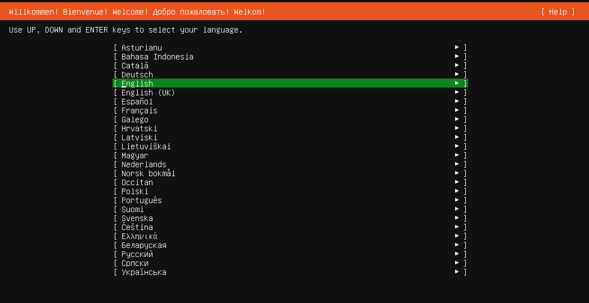

We skip the installer update if you see this screen:


Choose the correct keyboard layout. For `azerty` select `Belgian`:

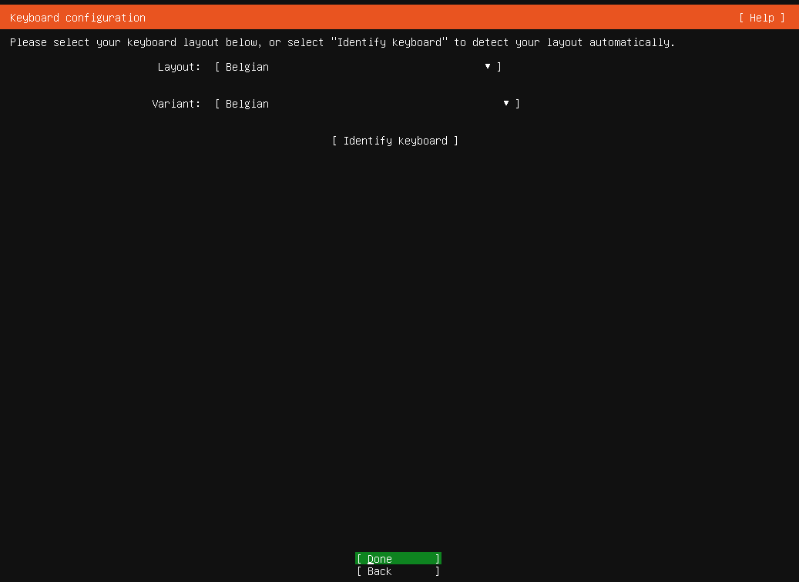

In the next 7 steps we dont make any changes. We just press `Done` or `Continue` :

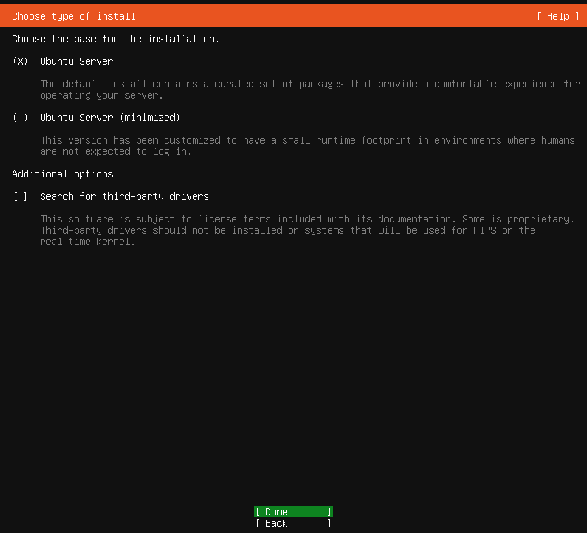

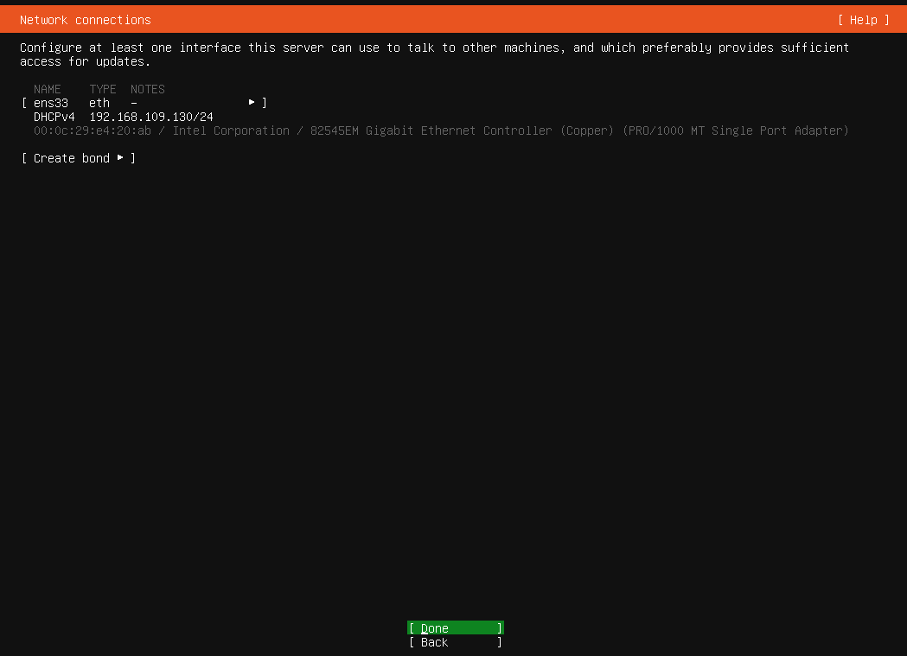

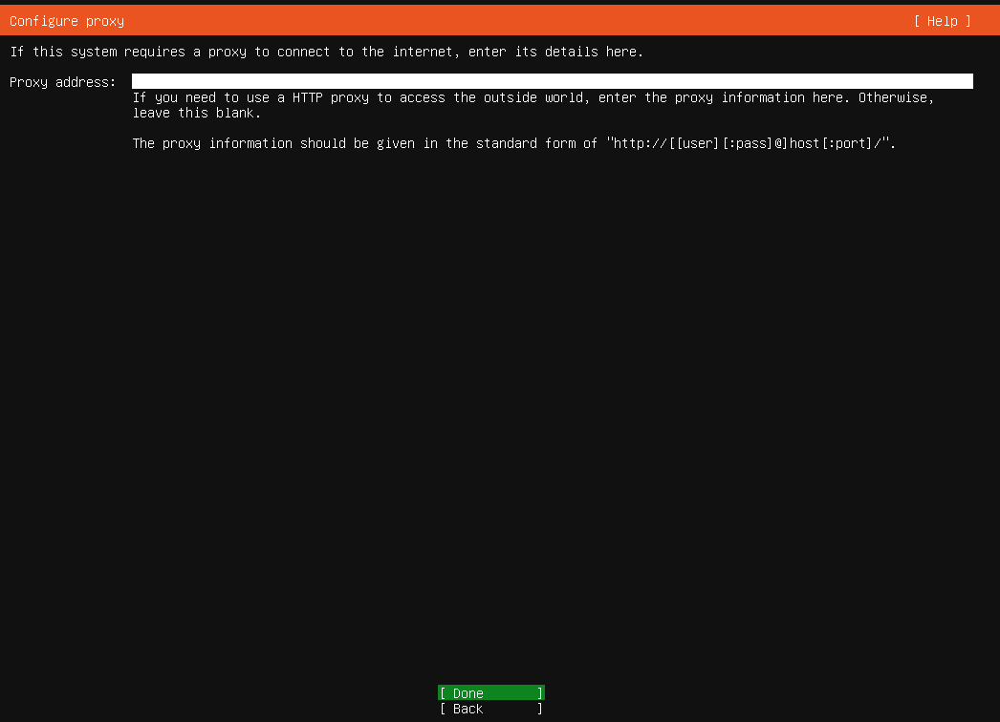

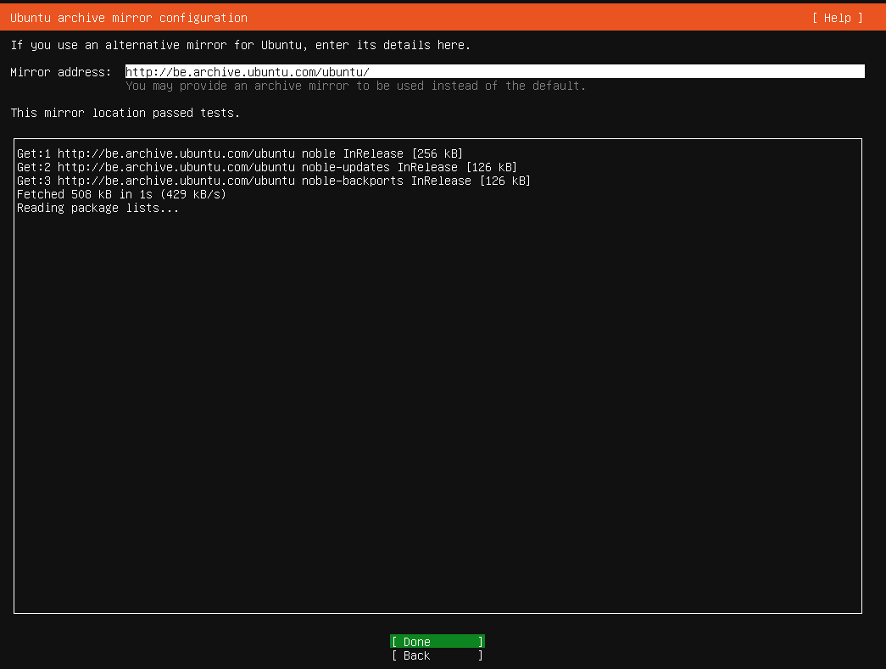


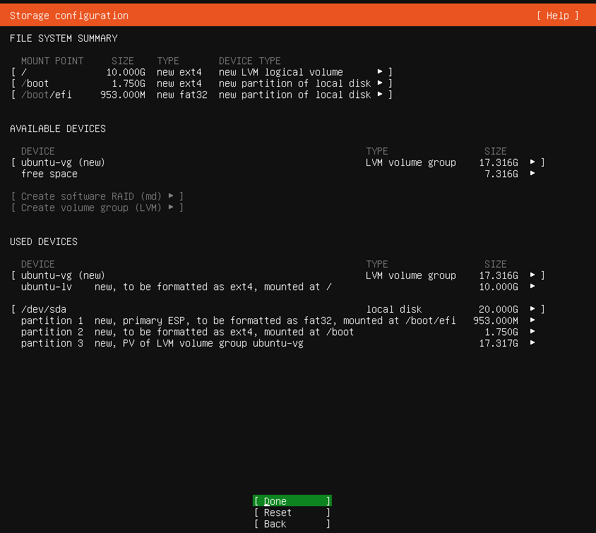

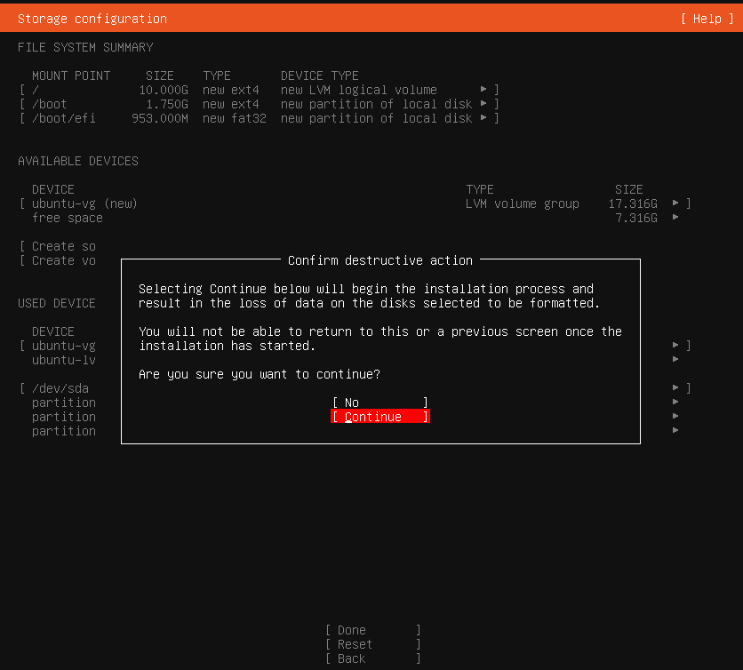

Next up we create a user account that we use to login to the operating system. We use following credentials:
```
username: student
server name: ubserv
password: pxl
```


We answer the question to upgrade to Ubuntu Pro with `Skip for now`

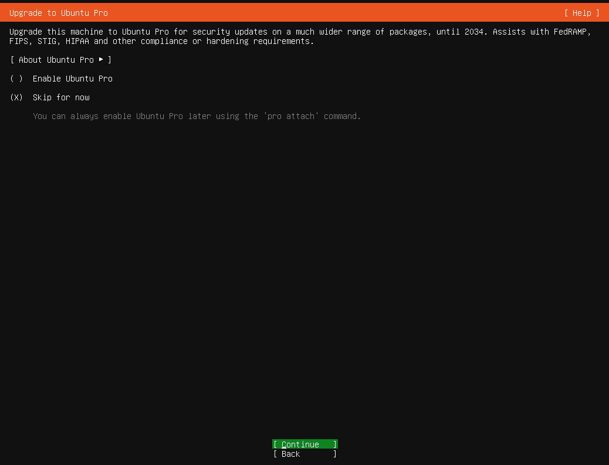  

For Extra Packages we will only opt to install `SSH server`:


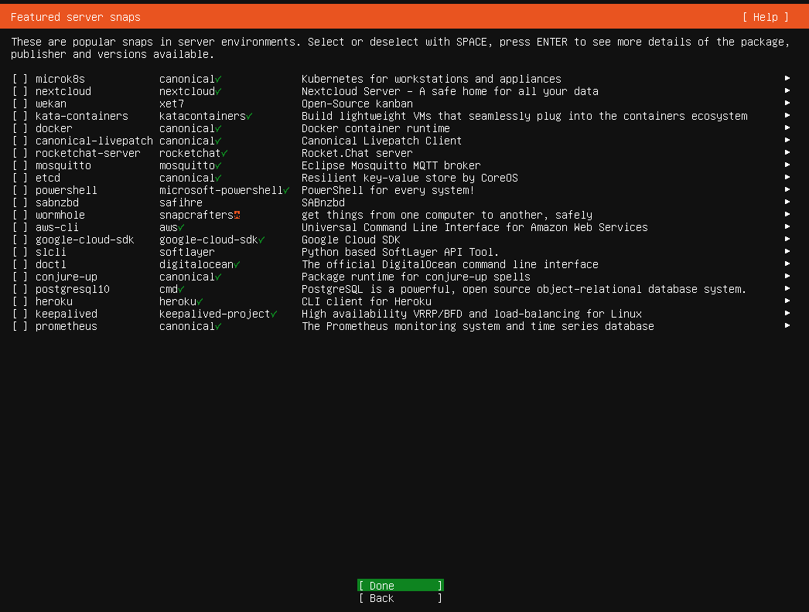

The operating system will be installed and configured. After a while the `Reboot now` option will appear. This indicates that the installation is complete:


When we see the screen where they ask to push the 'enter'-key, we first go into the settings of the Virtual Machine :


There we uncheck that the CD/DVD has to be connected at boot time (otherwise the installation will load again each time we boot)


And then we push the 'enter'-key


Once the server is rebooted, you will have to press the `enter` key again to see the login prompt.


  
Now you can log in and start working on your server. After the text login you can type `student` and push enter. Then you have to type your password (you don't see what you are typing) and push enter.


