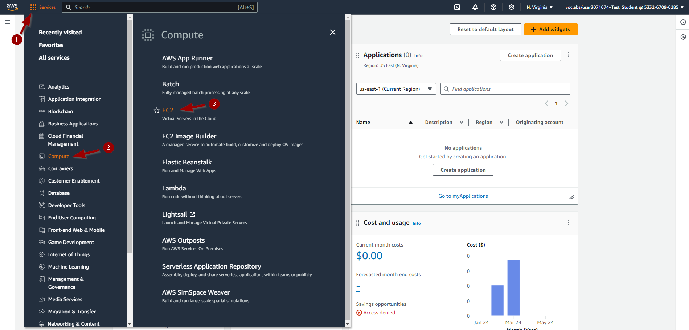
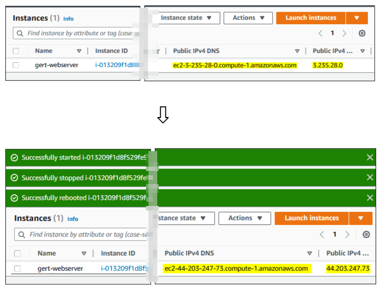
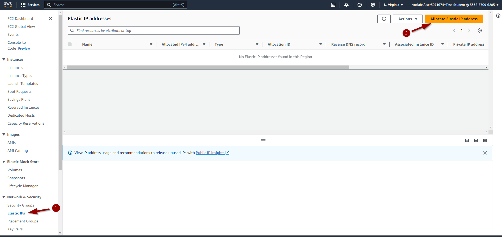

## Lab <!-- {docsify-ignore} -->
In the following chapters Linus will install a Webserver and Minetest Server. Before he can do that, he will need to have a Linux System up and running. In this lab he will create a Linux Cloud Instance on  Amazon Web Services (AWS). With this infrastructure set up he will be able to install, configure and maintain his Webserver and Minecraft Server at a later time.

### Creating the SSH keypair  

Before we can install the instance we need to create an SSH keypair so we will be able to connect (=login) to the instance af creation.

On *AWS*, go to *EC2*.

Go to *key pairs* and create a new one.

The private key wil automatically be downloaded by your browser to the *Downloads* folder.

Move this key to the folder .*ssh* under your account *"C:\Users\\<your loginname>"*. Create this folder if it doesn't exit.

### Creating the Cloud instance 

The Web server and Minecraft Server run in a Linux Server Environment. More specifically, an Ubuntu Server.

On *AWS*, go to *EC2*.

Make sure you are in the *"N. Virginia"* Region and click *Launch instance*.

Fill in the correct details.

You will receive a message that the instance was successfully created.

After a while, the Pending status also changes to Running to indicate that the server has also started successfully.

### Giving the instance a static IP address (Elastic IP)

Everytime we restart the instance it wil get another IP address (and DNS name). 

We use this IP address (or DNS name) to connect to the server. Het is dus veel makkelijker indien de server hetzelfde IP adres (en DNS naam) zou houden in de toekomst.

To prevent changing the IP address, we will have to give the instance an Elastic (=static) IP.

On *AWS*, go to *EC2*.

Click on *Elastic IPs* and then *Allocate Elastic IP address*.

We create a new Elastic IP by clicking *Allocate*.

  

Click on *Actions* and then on *Associate Elastic IP address*.

Select the *Instance* to which this Elastic IP address should be linked and click on *Associate*.

The Elastic IP address has been successfully linked to our server instance.

We see that this has been successful when we look at the Instance again. If we now stop the instance and restart it afterwards, the IP address and associated DNS name will remain the same.

### Connecting to the Cloud instance

To work on the server instance, it is best to start a connection from our laptop via SSH. To request the data required for this, we do the following.

Click *Instances*. Then select the server instance and click *Connect*.

AWS suggests an SSH command with a certain key. 
But please note, our key on the laptop may be named differently if you followed different steps while creating the SSH keypair or if you already had a keypair.

We start a Powershell or Windows Terminal and paste the command, but change the name of our key should this be necessary.

You can paste into a Powershell window by clicking the right mouse button.

As you can see in the previous screenshot, we are now logged in to the server. If you wish to leave the connection you can give the command *exit* or *logout*.
