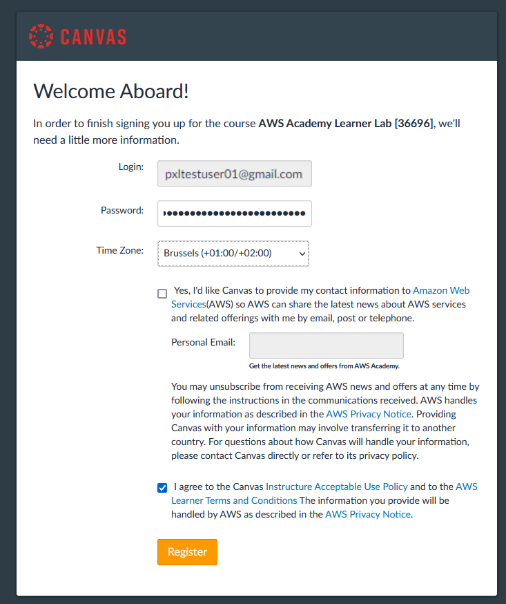
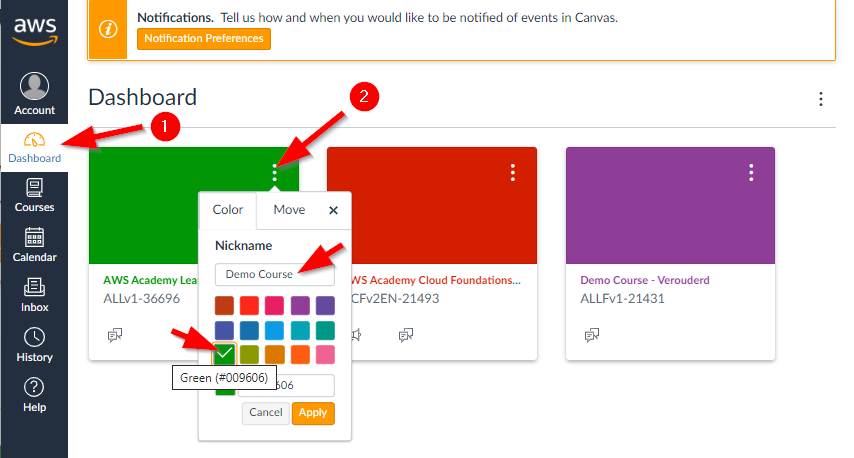
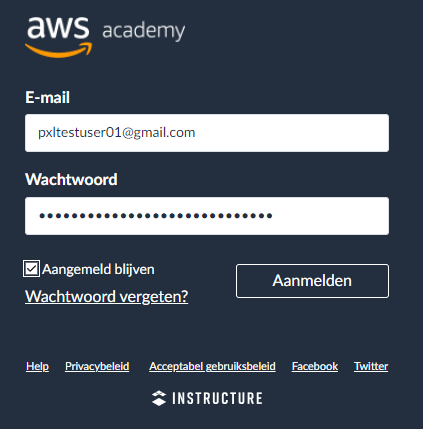
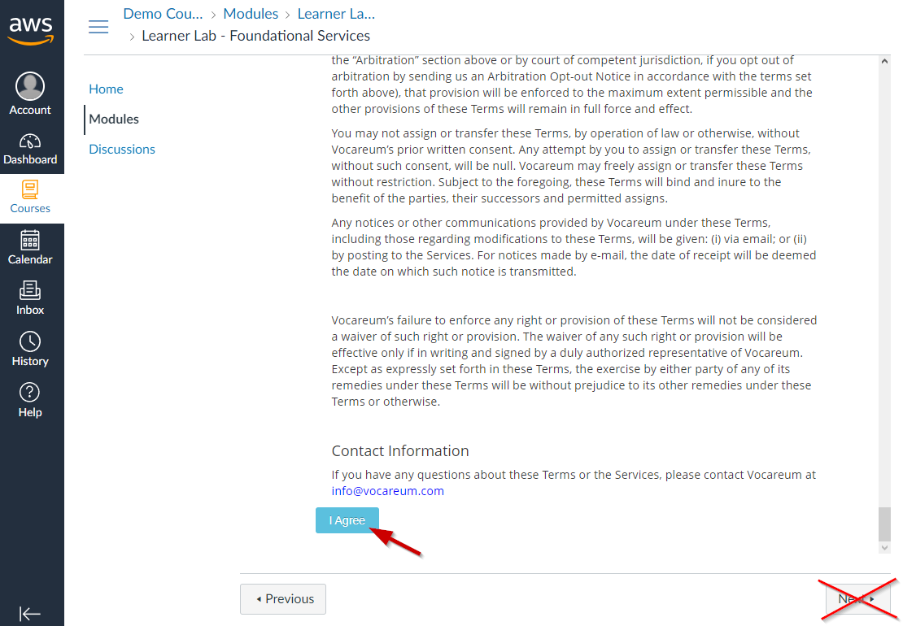
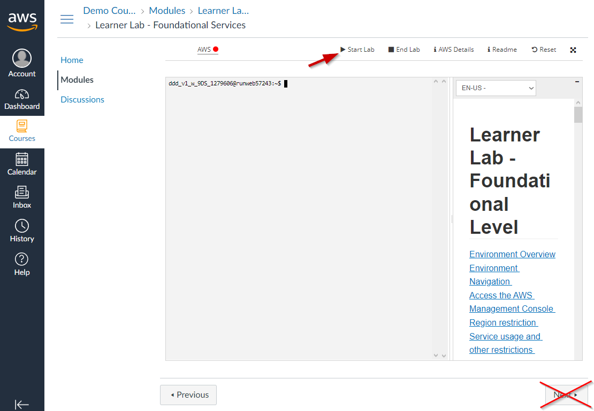
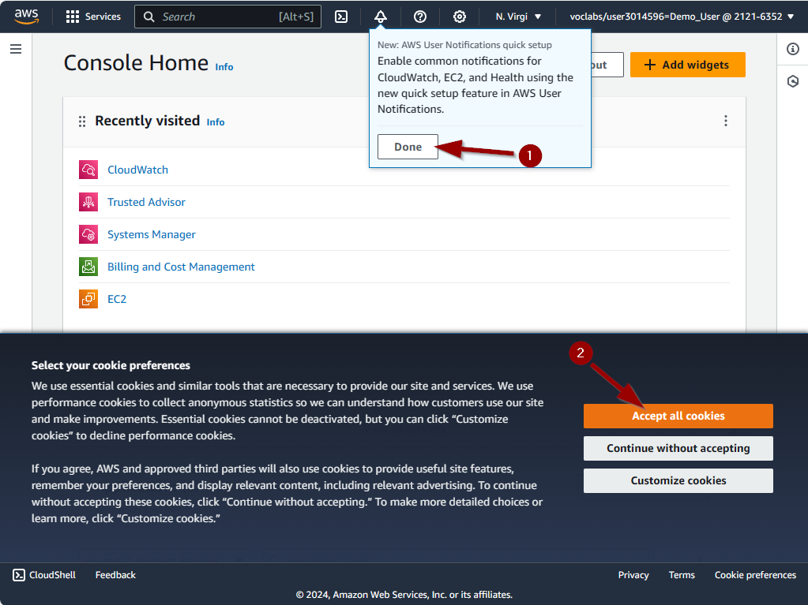

## Lab <!-- {docsify-ignore} -->
### Intro

Linus will use an instance (=server) in the Amazon Web Services (AWS) cloud. 

Before we can create servers there, we will have to arrange our license.

### Course invitation email

Linus wants to use the Cloud to host his server. He will use Amazon Web Services.

To complete the labs, we first need to set up our AWS account.  The school gives you free access to AWS Cloud via the AWS Academy.

Normally you have received a *Course Invitation email* from *AWS Academy*.

Click on *Get Started*.

A Web browser opens with the option to register for the *Course*.

Click on *Create My Account*.

Create a secure password and choose *Brussels* as the Time Zone. Check *I agree … Policy* and click *Register*.

Now you enter the *Course*.

### Change nickname and color of the Course

Click on *Dashboard* and then on the Course's *Hamburger Menu* to adjust the *Nickname* and *color*.

### **Opening a certain Course**

Can be done either via the *Dashboard*, or via *Courses*.

Via the *Dashboard*.

Via *Courses*.

Via *Courses* and then *All courses*.

### **Logging in as a Student on Canvas in the future**

If you want to log in to the course again in the future, surf to 

https://awsacademy.instructure.com/ 

This links to [https://www.awsacademy.com/LMS_Login](https://www.awsacademy.com/vforcesite/LMS_Login)

Click on *Student Login*.

Enter your *PXL email address* as login and your *password*.

Check *Stay signed in* and click *Sign in*.

You are now logged in.

### **Starting the Lab (via Vocareum)**

Attention!  Every time you want to use AWS Cloud in your course, you will have to go to *Courses,* then *Modules* and finally *Learner Lab*.

Get in the right Class.

In the Class, click on *Modules* and then on *Learner Lab*.

The first time you must approve the License Agreement. *Scroll* down and **don't** click *Next*.

Click *I Agree* and **not** *Next*.

Click on *Start Lab* and **not** on *Next*.

The *Lab* is being started. This will take several minutes. As soon as the lab is fully started, we see a green dot behind *AWS* 

There is now also a clock running behind AWS. This indicates how long the servers will be *up and running*. It starts counting down from four hours remaining. You can always click Start Lab again to reset the timer to four hours.

After four hours the servers will be shut down, but can simply be restarted at a later time by clicking *Start Lab* again.

We also see how much of our $100 ($50 in the future) has already been spent. This may have a delay of about 8 hours.

Attention! Once you have used up the entire money, you will no longer be able to do anything on the Cloud Platform.

Click on *AWS* to go to the *AWS Cloud Platform*.

If a new tab is not opened, it is blocked by your web browser. You must then allow this for this website. Below is an example with the Firefox web browser.

Click on *Accept all cookies* and on *Next*.

We are ready to start working.

We will use some of these *MenuItems* in this course.

# **Vocareum AWS Details**

The gray box with Interface is a terminal window and can be used, for example, to fire AWS CLI commands or Python code (via an AWS SDK). Or connect to your Instances (=Servers) with SSH.

At the top we also find some useful buttons. Below an overview

**AWS** : By clicking on this text we navigate to AWS Management 
		Console. It is through this interface that we create a Cloud Infrastructure 
		can start setting up. Tip! If there is no new tab 
 		open, click on the text at the top of the window to get *Popups* 
 		to allow

**Used $0 till $100** : How much budget you have already used. Attention! This just keeps changing 
 		updated every 8 to 12 hours

**03:39** : Remaining time until the Cloud infrastructure is brought down. You 
		can then click on *Start Lab* again to restart the infrastructure.
 		Tip! You can click *Start Lab* again at any time to restart the timer 
 		to be brought back to four hours

**Start Lab** : To (re)start the Cloud Infrastructure. Some services 
 		will have to be restarted manually

**End Lab** : To bring down the Cloud Infrastructure. You can do these afterwards 
		restart with *Start Lab*

**AWS Details** : Shows how long the Cloud infrastructure has now and in total 
 		turned. Also provides the opportunity to use your personal SSH keys
 		view/download

**Readme** : Contains links to pages explaining how the *AWS Cloud Platform*

**Reset**: Everything on AWS under your account (= linked to this course) will be reset 
 		reset. In other words, everything you've ever done ends 
		 AWS removed from this account. You don't get any money spent 
 		budget back.

**⤱ <maximize>** : To maximize the Vocareum window. To undo this press the *Esc* key
