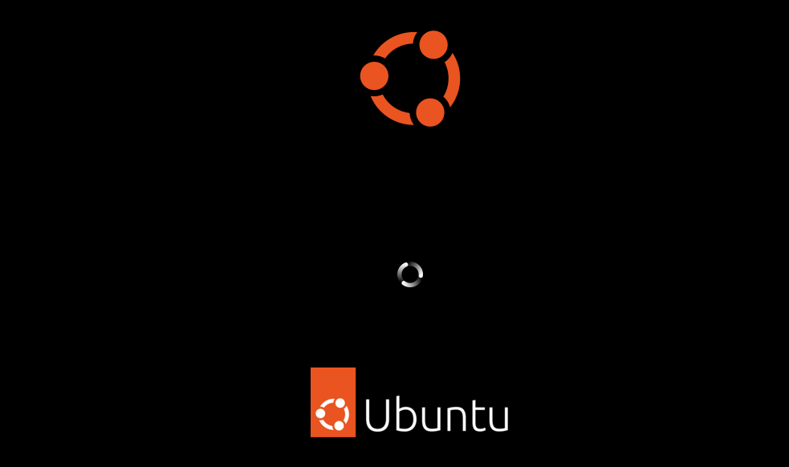

# Assignment on installation

## Task 1 - Download Ubuntu Desktop

Linux also has a desktop version. Download [Ubuntu Desktop](https://ubuntu.com/download/desktop).

## Task 2 - Install Ubuntu Desktop

Install [Ubuntu Desktop](https://ubuntu.com/download/desktop) in a new virtual machine and explore the interface.

### Create the new VM

To create a new virtual machine (VM) in VMWare you go to the menu `file`>`New virtual machine`. The wizard to create a new VM will appear.

In the first screen we select the option `Typical`:

Next we choose to `install the operating system later`:

Next we choose the operating system `Linux`. In the version dropdown we select `Ubuntu 64 bit`. This is the Linux distribution that we will use during this course.

In the next screen we give the virtual machine a name. You can also specify a different folder to store the virtual machine on your computer.

?> <i class="fa fa-exclamation-circle" style="font-size:48px;color:red"></i> Let op dat je de bestanden van de VM niet opslaat in een map die gesynced wordt met de cloud (OneDrive, Dropbox, Google Drive)?. Je VM zal crashen en je zal alles in de VM kwijt zijn!

In the next screen we configure the virtual harddisk size for the VM. We will create a disk that has 30GB of storage. Keep in mind that the disk space will be allocated while saving files (max 30GB):

We have to click on `Customize Hardware` to configure the virtual machine a little more:

We still have to link the Ubuntu-server ISO file to the virtual CD-rom drive. We do this by selecting `New CD/DVD` and browsing to the downloaded `iso` file:

Click on `Finish` and the virtual machine will be created.

All that's left to set is the UEFI bios. Click on `Edit virtual machine settings`.

Go to the tab `Options`, click on `Advanced` and select the option `UEFI`. Note that you'll also find the setting `Side channel mitigations` here if you should see a warning when you start this Virtual Machine later on.

You can now boot the VM by clicking the green arrow icon. This will boot the virtual machine and run the installation process.

### Installation Ubuntu Desktop

?> <i class="fa-solid fa-circle-info"></i> Does booting the VM result in the error `This host supports Intel VT-x, but Intel VT-x is diabled`? You will have to activate the VT-X option in the BIOS of your laptop. More information can be found in [this article](https://www.qtithow.com/2020/12/fix-error-this-host-supports-Intel-VT-x.html).

When booting the VM for the first time we need to press `enter` or wait 30 seconds:

We have to wait a few seconds for the boot to finish:

In the next few steps there will be an installation process that we need to go through.

We choose the language:

We don't specify anything for Accessibility:

We choose the correct keyboard layout. For `azerty` we select `Belgian`:

?> <i class="fa-solid fa-circle-info"></i> If you have a QWERTY keyboard you have to stick with `English (US)`:

We have to choose the wired connection because we are using virtualisation:

We make the choice to Install:

We choose to do the installation interactively:

We choose to have only the default selection of apps installed:

We choose to have third-party software installed for drivers and multimedia formats:

We choose to erase the disk and install Ubuntu Desktop on it:

?> <i class="fa-solid fa-circle-info"></i> Mind that you erase the Virtual Disk of your VM, but it's a clean disk on which we are installing. `The hard disk of your computer/laptop will not be erased!`

We specify the username and password, and the computername:

For the TimeZone we pinpoint Brussels on the map or write it in the textbox:

Click on Install to continue:

Now we have to wait untill the installation has finished:

Once the installation is finished we have to click on `Restart Now` to reboot the VM:

When we see the screen where they ask to push the 'enter'-key, we first go into the settings of the Virtual Machine :

There we uncheck that the CD/DVD has to be connected at boot time (otherwise the installation will load again each time we boot)

And then we push the 'enter'-key to finilize the installation with rebooting the Virtual Machine

## Task 3 - Login for the first time

The very first time we log\`in we have to go through some configuration screens:

Now we are ready to explore Ubuntu Desktop:

## Task 4 - Take a snapshot of the VM

Before doing anything else, it's good practice to take a snapshot. If, at a later time, our Ubuntu Desktop breaks, we can allways return to this snapshot.
Being able to roll back to this point is a time saver, because otherwise we have to reinstall the Linux system again from scratch.

When there are some updates waiting it is always nice to do these first.

`Take a snapshot of the Ubuntu Desktop VM, named "Clean Install"` as follows:

*First shutdown the VM...*

*VM/Snapshot/Take Snapshot...*

?> <i class="fa-solid fa-circle-info"></i> At a later time you can always go back to this savepoint in time with:

*VM/Snapshot/Revert to Snapshot...*

## Task 5 - Explore the Desktop Environment

In the Ubuntu desktop machine, try to execute the following subtasks:

* Change the wallpaper
* Create a new text file with the tool "Text Editor" (=gedit) and try to save it in your documents folder
* Check with the file explorer (Files) if the file exists
* Delete the file and empty the trash
* Pin (=Favorite) the Terminal -application to the Dock (=launcher)
* Surf with Firefox to the school website
* Install the Chromium webbrowser, start the app, pin it to the Dock and place it above the Firefox icon
* Surf with Chromium to your school webmail portal
* Install wps-office and test the apps
* Install Spotify and test the app
* Install Visual Studio Code and test the app
* Install Gimp and take a look at the app