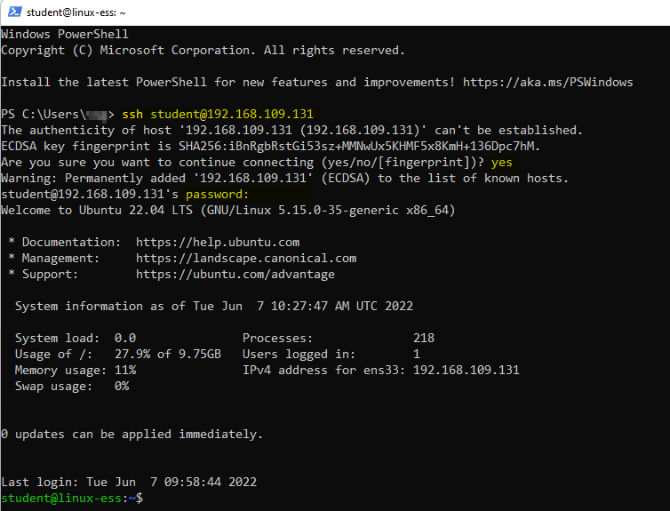

# Lab <!-- {docsify-ignore} -->


## Setting up a SSH connection to your Virtual Machine in VMware Workstation

Linus tries to connect to his server over SSH. The procedure is as follows:

*First* he needs to get the IP adres of the server. He types `ip a` and looks for the IP address of the network interface (ens33)
```bash
ip a
```


<br />

*Second* he decides to open Powershell on the Desktop and make a ssh-connection to the server. He is now working on the server from his desktop. Cool, isn't it?
```bash
ssh student@<server-ip>
```


<br />

As you can see he now gets a prompt new prompt. This is a shell on his Ubuntu server running in VMWare. The idea might sound weird because he has the virtual machine with a CLI running on his laptop. But imagine a scenario where the virtual machine wouldn't be running on his laptop but instead would be hosted somewhere on Amazon web services in the cloud. He would use the `ssh user@server-ip` command on his device to connect to that server.

You can choose to stay working on your desktop using the `ssh` command in Powershell or go back to your VM in the interface of VMware Workstation.
