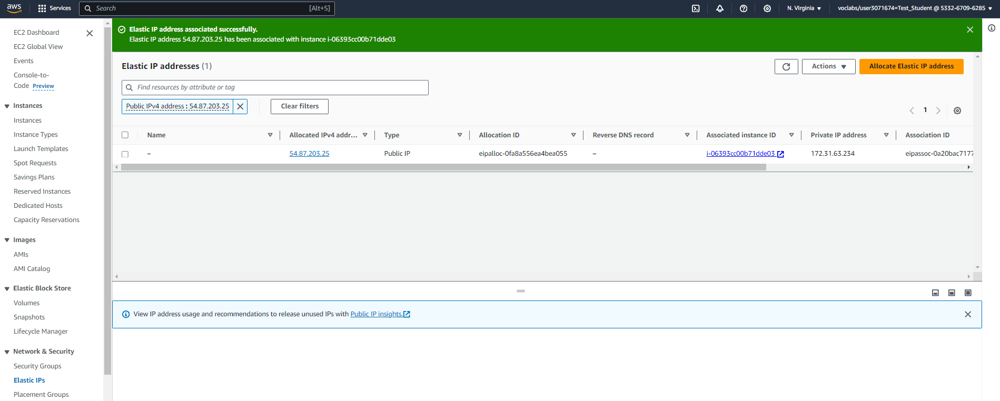

# Lab <!-- {docsify-ignore} -->

In the following chapters Linus will install a Webserver and Minetest Server. Before he can do that, he will need to have a Linux System up and running. In this lab he will create a Linux Cloud Instance on  Amazon Web Services (AWS). With this infrastructure set up he will be able to install, configure and maintain his Webserver and Minecraft Server at a later time.

### Creating the SSH keypair  

Before we can install the instance we need to create an SSH keypair so we will be able to connect (=login) to the instance af creation.

On *AWS*, go to *EC2*.


Go to *key pairs* and create a new one.


The private key wil automatically be downloaded by your browser to the *Downloads* folder.


Move this key to the folder .*ssh* under your account *"C:\Users\\<your loginname>"*. Create this folder if it doesn't exit.


### Creating the Cloud instance 

The Web server and Minecraft Server run in a Linux Server Environment. More specifically, an Ubuntu Server.

On *AWS*, go to *EC2*.


Make sure you are in the *"N. Virginia"* Region and click *Launch instance*.


Fill in the correct details.


You will receive a message that the instance was successfully created.


After a while, the Pending status also changes to Running to indicate that the server has also started successfully.


### Giving the instance a static IP address (Elastic IP)

Everytime we restart the instance it wil get another IP address (and DNS name). 


We use this IP address (or DNS name) to connect to the server. Het is dus veel makkelijker indien de server hetzelfde IP adres (en DNS naam) zou houden in de toekomst.

To prevent changing the IP address, we will have to give the instance an Elastic (=static) IP.

On *AWS*, go to *EC2*.


Click on *Elastic IPs* and then *Allocate Elastic IP address*.


We create a new Elastic IP by clicking *Allocate*.


  

Click on *Actions* and then on *Associate Elastic IP address*.


Select the *Instance* to which this Elastic IP address should be linked and click on *Associate*.


The Elastic IP address has been successfully linked to our server instance.




We see that this has been successful when we look at the Instance again. If we now stop the instance and restart it afterwards, the IP address and associated DNS name will remain the same.


### Connecting to the Cloud instance

To work on the server instance, it is best to start a connection from our laptop via SSH. To request the data required for this, we do the following.

Click *Instances*. Then select the server instance and click *Connect*.


AWS suggests an SSH command with a certain key. 
But please note, our key on the laptop may be named differently if you followed different steps while creating the SSH keypair or if you already had a keypair.


We start a Powershell or Windows Terminal and paste the command, but change the name of our key should this be necessary.

You can paste into a Powershell window by clicking the right mouse button.


As you can see in the previous screenshot, we are now logged in to the server. If you wish to leave the connection you can give the command *exit* or *logout*.


As an exercise, restart an ssh session with the instance and change the *name* of the server to *linux-ess* with the command:

***sudo hostnamectl set-hostname linux-ess***


The name change will be visible in the prompt the next time you make an ssh connection.


We log in again to check a number of things about the instance.

We know we are connecting over ssh to the user ubuntu on the server. We can check this with ***whoami***.

```bash
ubuntu@linux-ess:~$ whoami
ubuntu
```


We will sometimes also have to execute commands that require more rights to be executed correctly. For example, with commands that adjust system settings. We can execute commands with more rights by typing an extra command before the command, namely the command *sudo*. We can use the command *sudo* because we are also in the group *sudo*. We can check this with ***groups***.

```bash
ubuntu@linux-ess:~$ groups
ubuntu adm cdrom sudo dip lxd
```


As soon as we are logged in, we end up in our home folder. To see which folder we are in, we use the command ***pwd***.

```bash
ubuntu@linux-ess:~$ pwd
/home/ubuntu
```


If we want to see the contents of the folder we are in, we can use the command ***ls***. It seems like there is no content here.

```bash
ubuntu@linux-ess:~$ ls
ubuntu@linux-ess:~$ 
```


But be careful! You can only be sure once you also request the hidden files and directories. You do this with the command ***ls -a***.

```bash
ubuntu@linux-ess:~$ ls -a
.   .bash_history  .bashrc  .config   .local    .ssh
..  .bash_logout   .cache   .lesshst  .profile  .sudo_as_admin_successful
```


If you have no colors (directories in blue) you can still find out which are the files and which are the directories. You do this with the command ***ls -la***. The lines with the directories then start with the letter *d*.

```bash
ubuntu@linux-ess:~$ ls -la
total 44
drwxr-x--- 6 ubuntu ubuntu 4096 Jun 19 07:36 .
drwxr-xr-x 3 root   root   4096 Jun  8 11:20 ..
-rw------- 1 ubuntu ubuntu 2718 Jun 19 09:48 .bash_history
-rw-r--r-- 1 ubuntu ubuntu  220 Mar 31 08:41 .bash_logout
-rw-r--r-- 1 ubuntu ubuntu 3771 Mar 31 08:41 .bashrc
drwx------ 2 ubuntu ubuntu 4096 Jun 12 08:46 .cache
drwx------ 4 ubuntu ubuntu 4096 Jun 19 06:53 .config
-rw------- 1 ubuntu ubuntu   44 Jun 19 07:30 .lesshst
drwxrwxr-x 3 ubuntu ubuntu 4096 Jun 13 19:11 .local
-rw-r--r-- 1 ubuntu ubuntu  807 Mar 31 08:41 .profile
drwx------ 2 ubuntu ubuntu 4096 Jun  8 11:20 .ssh
-rw-r--r-- 1 ubuntu ubuntu    0 Jun 13 06:09 .sudo_as_admin_successful
```


Furthermore, we had to choose a certain type while creating the Instance. We opted for a t2.medium with Ubuntu. This had 2 vCPUs, 4GiB Memory.   We can check the CPU information with the command **lscpu**. We see that we have one CPU (in 1 socket) with 2 cores, each of which can execute 1 thread.

```bash
ubuntu@linux-ess:~$ lscpu
Architecture:             x86_64
  CPU op-mode(s):         32-bit, 64-bit
  Address sizes:          46 bits physical, 48 bits virtual
  Byte Order:             Little Endian
CPU(s):                   2
  On-line CPU(s) list:    0,1
Vendor ID:                GenuineIntel
  Model name:             Intel(R) Xeon(R) CPU E5-2676 v3 @ 2.40GHz
    CPU family:           6
    Model:                63
    Thread(s) per core:   1
    Core(s) per socket:   2
    Socket(s):            1
```


We can also check the RAM with the command ***free -h***. We see that there is still 3.4Gi available. So more than enough for now.

```bash
ubuntu@linux-ess:~$ free -h
               total        used        free      shared  buff/cache   available
Mem:           3.8Gi       438Mi       3.2Gi       880Ki       447Mi       3.4Gi
Swap:             0B          0B          0B
```


If we want to check the size of the hard drive, we use the command ***df -h***. We see here that the size of /dev/root (/) is 6.8 G, of which 33% is in use and therefore 4.6G is still free. This is sufficient for our server.

```bash
ubuntu@linux-ess:~$ df -h
Filesystem      Size  Used Avail Use% Mounted on
/dev/root       6.8G  2.2G  4.6G  33% /
tmpfs           2.0G     0  2.0G   0% /dev/shm
tmpfs           783M  864K  782M   1% /run
tmpfs           5.0M     0  5.0M   0% /run/lock
/dev/xvda16     881M  133M  687M  17% /boot
/dev/xvda15     105M  6.1M   99M   6% /boot/efi
tmpfs           392M   12K  392M   1% /run/user/1000
```


The 7G from the previous point is a part (=partition) of the entire hard drive. To see which partitions the disk is divided into, we can use the command ***lsblk -e7***.

```bash
ubuntu@linux-ess:~$ lsblk -e7
NAME     MAJ:MIN RM  SIZE RO TYPE MOUNTPOINTS
xvda     202:0    0    8G  0 disk
├─xvda1  202:1    0    7G  0 part /
├─xvda14 202:14   0    4M  0 part
├─xvda15 202:15   0  106M  0 part /boot/efi
└─xvda16 259:0    0  913M  0 part /boot
```


The server has an IP address for communication within the Private Cloud Environment. To see the name of the network card or its settings we can use the command ***ip a***. Here we see the loopback device *lo* with IP address *127.0.0.1*. We also see the device *enX0* with IP address 172.31.63.234.

```bash
ubuntu@linux-ess:~$ ip a
1: lo: <LOOPBACK,UP,LOWER_UP> mtu 65536 qdisc noqueue state UNKNOWN group default qlen 1000
    link/loopback 00:00:00:00:00:00 brd 00:00:00:00:00:00
    inet 127.0.0.1/8 scope host lo
       valid_lft forever preferred_lft forever
    inet6 ::1/128 scope host noprefixroute
       valid_lft forever preferred_lft forever
2: enX0: <BROADCAST,MULTICAST,UP,LOWER_UP> mtu 9001 qdisc mq state UP group default qlen 1000
    link/ether 06:75:d5:9f:d8:b3 brd ff:ff:ff:ff:ff:ff
    inet 172.31.63.234/20 metric 100 brd 172.31.63.255 scope global dynamic enX0
       valid_lft 2866sec preferred_lft 2866sec
    inet6 fe80::475:d5ff:fe9f:d8b3/64 scope link
       valid_lft forever preferred_lft forever
```


But the server can also be reached from the Internet with a public IP address (here through an Elastic IP). To find out the Public IP address we can use the following command: ***curl checkip.amazonaws.com***

```bash
ubuntu@linux-ess:~$ curl checkip.amazonaws.com
54.87.203.25
```


We know we are working on the server over an SSH connection. To see if the SSH server is running on the server we can use the command: ***systemctl status ssh --no-pager***. We see that the service is *active (running)*.

```bash
ubuntu@linux-ess:~$ systemctl status ssh --no-pager
● ssh.service - OpenBSD Secure Shell server
     Loaded: loaded (/usr/lib/systemd/system/ssh.service; disabled; preset: enabled)
    Drop-In: /usr/lib/systemd/system/ssh.service.d
             └─ec2-instance-connect.conf
     Active: active (running) since Wed 2024-06-19 06:34:04 UTC; 56min ago
TriggeredBy: ● ssh.socket
       Docs: man:sshd(8)
             man:sshd_config(5)
   Main PID: 899 (sshd)
      Tasks: 1 (limit: 4676)
     Memory: 4.1M (peak: 4.6M)
        CPU: 45ms
     CGroup: /system.slice/ssh.service
             └─899 "sshd: /usr/sbin/sshd -D -o AuthorizedKeysCommand /usr/share/ec2-instance-connect/eic_run_authorized…

Jun 19 06:34:04 linux-ess systemd[1]: Starting ssh.service - OpenBSD Secure Shell server...
Jun 19 06:34:04 linux-ess sshd[899]: Server listening on :: port 22.
Jun 19 06:34:04 linux-ess systemd[1]: Started ssh.service - OpenBSD Secure Shell server.
Jun 19 06:34:05 linux-ess sshd[900]: Accepted publickey for ubuntu from 84.195.122.178 port 57085 ssh2: ED25519…LE3PFz3E
Jun 19 06:34:05 linux-ess sshd[900]: pam_unix(sshd:session): session opened for user ubuntu(uid=1000) by ubuntu(uid=0)
Hint: Some lines were ellipsized, use -l to show in full.
```


Each service listens on a well-known port. For SSH this is port 22. We can query the status of the ports from our server with: ***ss -ltn***. We see here that there is listening (LISTEN) on port 22.

```bash
ubuntu@linux-ess:~$ ss -ltn
State         Recv-Q        Send-Q               Local Address:Port               Peer Address:Port       Process
LISTEN        0             4096                    127.0.0.54:53                      0.0.0.0:*
LISTEN        0             4096                 127.0.0.53%lo:53                      0.0.0.0:*
LISTEN        0             4096                             *:22                            *:*
```

