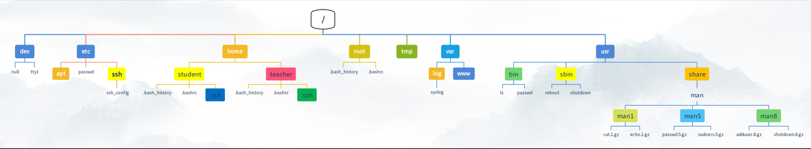
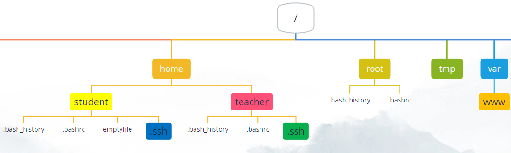
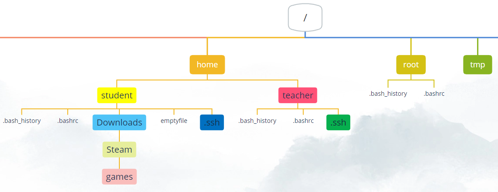
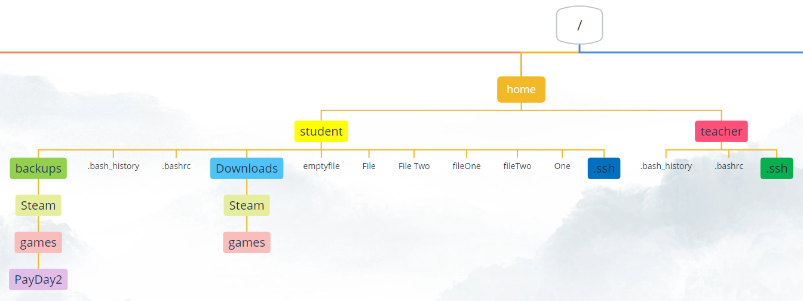
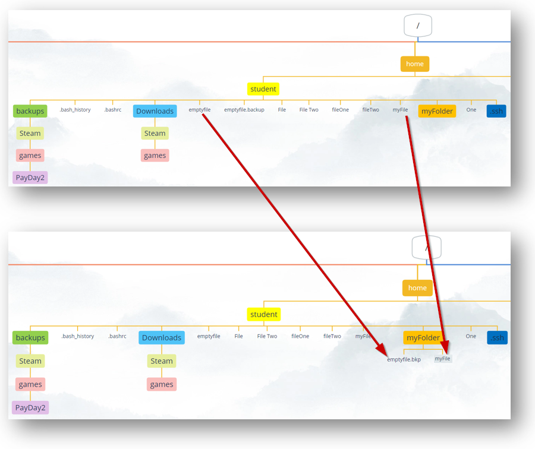

# Files and Directories

## Working with directories

### Print working directory (pwd)

The first command we will look at is the `pwd` command. The man pages gives an accurate description of what the command does:
```
student@linux-ess:~$ whatis pwd
pwd - print name of current/working directory
```

This command prints the current working directory. The working directory refers to the directory where the prompt is active in. 

```bash
student@linux-ess:~$ pwd
/home/student
```
In Windows, an _absolute path_ starts with `C:\...`. In Linux we do not use Drive letters. The C:\ drive in Windows is called the _root directory_ in Linux. This directory is referred to as a `/` at the beginning of a path. More about _absolute_ and _relative_ paths later in this chapter.

The folder `student` is our current working directory. This folder is a subfolder of the folder `home` which on his turn is a subfolder of the _root directory_ `/`.



?> <i class="fa-solid fa-circle-info"></i> Remember the prompt which contained an active path? The `~` sign was an abbreviation for the folder `/home/student`. This is called the _home folder_. Every user on the operating system will get their own _home folder_ in the folder `/home` just like in Windows, where every user has his own folder under `C:\Users`. A user has all permissions (read, write, execute) in his own home folder. Outside of that folder he often only has _read_ permissions.

### Change working directory (cd)
You can change the current working directory with the `cd` command (change directory):
```bash
student@linux-ess:~$ pwd
/home/student
student@linux-ess:~$ cd /etc
student@linux-ess:/etc$ pwd
/etc
student@linux-ess:/etc$ cd ~
student@linux-ess:~$ pwd
/home/student
```
The command takes a path as an argument. In the example above we will navigate to the folder `etc` on the root directory `/`. We can see this in the output of the `pwd` command and in the prompt definition. As shown in the second part of the example above we can also use the `~` sign to quickly navigate to the user's home folder.

?> <i class="fa-solid fa-circle-info"></i> We could also use the `cd` command without any argument. This will navigate back to the users home folder as well:
```bash
student@linux-ess:~$ cd /home/student
student@linux-ess:~$ pwd
/home/student
student@linux-ess:~$ touch emptyfile
student@linux-ess:~$ ls
emptyfile
student@linux-ess:~$ cd /etc
student@linux-ess:/etc$ pwd
/etc
student@linux-ess:/etc$ cd
student@linux-ess:~$ pwd
/home/student
student@linux-ess:~$ ls
emptyfile
```

?> <i class="fa-solid fa-circle-info"></i> The command `touch` is used here to create an empty file named `emptyfile`. The command is explained later on in this chapter.




?> <i class="fa-solid fa-circle-info"></i> We can also use the command `cd -`. This navigates back to the folder where you were working, before coming to this folder: 
```bash
student@linux-ess:~$ cd /etc/netplan
student@linux-ess:/etc/netplan$ ls
50-cloud-init.yaml
student@linux-ess:/etc/netplan$ cd /var/log
student@linux-ess:/var/log$ ls
alternatives.log  apt  btmp  dist-upgrade  dpkg.log  journal  landscape  lastlog  unattended-upgrades  wtmp
student@linux-ess:/var/log$ cd -
student@linux-ess:/etc/netplan$ pwd
/etc/netplan
student@linux-ess:/etc/netplan$ ls
50-cloud-init.yaml
```


### Display a tree view in the shell (tree)
You can display a tree view of a directory with its subdirectories with the `tree` command:
```bash
student@linux-ess:~$ tree
.
└── emptyfile

0 directories, 1 file
```

?> <i class="fa-solid fa-circle-info"></i> If you are prompted that tree isn't yet installed just run the command he is proposing.


We could also use the `-a` option to view the hidden files (files starting with a dot):
```bash
student@linux-ess:~$ tree -a
.
├── .bash_history
├── .bash_logout
├── .bashrc
├── .cache
│   └── motd.legal-displayed
├── .lesshst
├── .local
│   └── share
│       └── nano
├── .profile
├── emptyfile
├── .ssh
│   └── authorized_keys
├── .sudo_as_admin_successful
└── .wget-hsts

5 directories, 10 files
```

We can also specify a path as a parameter to get a view of a certain directory:

```bash
student@linux-ess:~$ tree /etc/dhcp
/etc/dhcp
├── debug
├── dhclient.conf
├── dhclient-enter-hooks.d
│   └── debug -> ../debug
└── dhclient-exit-hooks.d
    ├── debug -> ../debug
    ├── hook-dhclient
    ├── resolved
    ├── rfc3442-classless-routes
    └── timesyncd

2 directories, 8 files
```

### Absolute & relative paths
When using commands we often have to use paths to certain folders or files. The `cd` command for example requires a path to navigate to.

Paths are used to point towards files and folders on the filesystem. We can use two types of paths: _relative_ and _absolute_ paths. 



#### Absolute path
Absolute paths must start with a `/` sign. This means that an absolute path will start from the _root_ (`/`) directory (the highest level on the filesystem) and will work its way down. For example:
```bash
student@linux-ess:/tmp$ pwd
/tmp
student@linux-ess:/tmp$ cd /home/student/
student@linux-ess:~/$ pwd
/home/student
```

?> <i class="fa-solid fa-circle-info"></i> In Windows an absolute path will start with `C:\` rather than `/`!


?> <i class="fa-solid fa-circle-info"></i> Did you know the Linux CLI has command- and pathcompletion? Try pressing the `tab` key when typing part of a command, file or folder name. If any command, file or folder matches the first part of the text you typed it will automatically complete the word for you!

?> <i class="fa-solid fa-circle-info"></i> When using tab completion on a directory it will end with a slash (/), e.g. `cd /home/student/`. The last slash (/) is optional, so it is exactly the same as `cd /home/student`  


#### Relative path
A relative path will always start from _the current working directory_ and will point to another file or folder from there. For example:
```bash
student@linux-ess:~$ pwd
/home/student
student@linux-ess:~$ cd Downloads/Steam/games
student@linux-ess:~/Downloads/Steam/games$ pwd
/home/student/Downloads/Steam/games
```
When using relative paths, we can use some shortcuts:
```
.(one dot): Refers to the current directory
..(two dots): Refers to the parent directory 
~ (tilde): Refers to the current user's home folder
```
This means that, when in the folder `/home/student/Downloads`, we could use `..` to navigate to the parent directory `/home/student`
```bash
student@linux-ess:~/Downloads$ pwd
/home/student/Downloads
student@linux-ess:~/Downloads$ cd ..
student@linux-ess:~$ pwd
/home/student
```
We could integrate these shortcuts in relative paths as well:
```bash
student@linux-ess:/etc$ pwd
/etc
student@linux-ess:/etc$ cd /home/student/Downloads # Absolute path
student@linux-ess:~/Downloads$ pwd
/home/student/Downloads
student@linux-ess:~/Downloads$ cd ../../teacher # Relative path
student@linux-ess:/home/teacher$ pwd
/home/teacher
```
?> <i class="fa-solid fa-circle-info"></i> A number sign `# ` tells the shell that everything behind it is considered a comment and will not be interpreted as a command or argument!

### Listing directory contents (ls)

To list the contents of a directory, we can use the `ls` command. Using the command without any options or arguments will list de contents of the current working directory:
```bash
student@linux-ess:~$ ls
emptyfile  Downloads
```

We can also go in a certain directory to list its contents:
```bash
student@linux-ess:~$ cd /
student@linux-ess:/$ ls     
bin   dev  home  lib32  libx32      media  opt   root  sbin  srv  tmp  var
boot  etc  lib   lib64  lost+found  mnt    proc  run   snap  sys  usr
```


The `ls` command can also take one argument. This argument is a path which can be absolute or relative. The `ls` command will then show the contents of that folder.
```bash
student@linux-essentials:~$ ls
emptyfile  Downloads
student@linux-essentials:~$ ls /
bin   dev  home  lib32  libx32      media  opt   root  sbin  srv  tmp  var
boot  etc  lib   lib64  lost+found  mnt    proc  run   snap  sys  usr
student@linux-essentials:~$ 
```

The `ls` command has different options as well. The options can be found in the manpage using `man ls`. For example:
```bash
student@linux-ess:~$ ls -alh .       # The dot sign refers to the current directory, which in this case would be optional
total 45M
drwxr-xr-x 5 student student 4.0K Mar 27 16:36 .
drwxr-xr-x 3 root    root    4.0K Oct  5 13:40 ..
-rw------- 1 student student 1.7K Mar 17 12:14 .bash_history
-rw-r--r-- 1 student student  220 Oct  5 13:40 .bash_logout
-rw-r--r-- 1 student student 3.7K Oct  5 13:40 .bashrc
drwxrwxr-x 2 student student 4.0K Oct  1 14:31 Downloads
-rw-r--r-- 1 student student    0 Feb 28 11:48 emptyfile
-rw-r--r-- 1 student student  807 Oct  5 13:40 .profile
drwxr-xr-x 2 student student 4.0K Oct  5 13:40 .ssh
-rw-r--r-- 1 student student    0 Oct  6 08:20 .sudo_as_admin_successful
```
Notice how we combined 3 options in the command above. Both `ls -a -l -h` and `ls -alh` will function exactly the same and will use all 3 options. The options can be put in any order, so `ls -hal` is also correct. These 3 options are used most often when it comes to the `ls` command. You could search for them in the manpage but we will give an overview:
* the `-a` option will _also show hidden files and folders_. **In Linux, hidden files and folders start with a dot (.). e.g. the `.bashrc` file.**
* the `-l` option will show a _long listing_. This means that it will show all the extra output\* and not just the file and folder names.
* the `-h` option refers to _human readable_ and will make filesizes appear with the proper measuring unit rather than showing all sizes in bytes.

\* The `-rw-r--r--` column refers to permissions on that specific file/folder. We will explain this in the chapter `users & permissions`. The columns containing `student  student` refer to the owner and groupowner of that specific file/folder and are linked to the permissions column. The `3.7K` on the line of the file .bashrc refers to the file size and `Oct 5 13:40` refers to the timestamp of the last modification of the file.

?> <i class="fa-solid fa-circle-info"></i> Everything in Linux is a file. Not just the files, but folders too! They are just defined as _special_ files. Your hard disk? A file. A USB drive? A File. Hardware such as your keyboard? You guessed it, a file!

### Create directories (mkdir)


To create new directories we can use the `mkdir` (make directory) command, which takes a path as an argument:
```bash
student@linux-ess:~$ mkdir backups
student@linux-ess:~$ ls
backups  Downloads  emptyfile
```
In the example above the `mkdir` command will create a folder named `backups` in the current working directory (`~` or `/home/student`). The folder name here is a _relative path_. 

#### paths with subdirectories
When using _relative_ or _absolute_ paths we could do the following:
```bash
student@linux-ess:~$ mkdir backups/Steam/games/PayDay2
mkdir: cannot create directory ‘backups/Steam/games/PayDay2’: No such file or directory
```
The command tries to make a folder named `PayDay2` in the folder `games` which is located in the folder `Steam` which is located in the folder `Backups`. However we get an error because the folders `games` or `Steam` do not exist. We can tell to create any missing subfolders in the path by using the `-p` option:
```
student@linux-ess:~$ mkdir -p backups/Steam/games/PayDay2
student@linux-ess:~$ tree backups
backups
└── Steam
    └── games
        └── PayDay2

3 directories, 0 files
```
This will create the folders `Steam` and `games` if they don't exist.

?> <i class="fa-solid fa-circle-info"></i> As mentioned earlier everything in Linux is case sensitive. This is also applicable when creating files and folders. Try running the command `mkdir walkthroughs Walkthroughs`. This will create 2 folders: one with the name `walkthroughs` and one with the name `Walkthroughs`.

## Working with files
### Create an empty file (touch)


One way to create an empty file is with the `touch` command. In the example below we use this command to create 2 files:
```bash
student@linux-ess:~$ ls -l
total 8
drwxrwxr-x 3 student student 4096 Oct  1 14:34 backups
drwxrwxr-x 2 student student 4096 Oct  1 14:31 Downloads
-rw-rw-r-- 1 student student    0 Oct  1 14:31 emptyfile
student@linux-ess:~$ touch fileOne
student@linux-ess:~$ touch fileTwo
student@linux-ess:~$ ls -l
total 0
drwxrwxr-x 3 student student 4096 Oct  1 14:34 backups
drwxrwxr-x 2 student student 4096 Oct  1 14:31 Downloads
-rw-rw-r-- 1 student student    0 Oct  1 14:31 emptyfile
-rw-r--r-- 1 student student 0 Feb 12 09:50 fileOne
-rw-r--r-- 1 student student 0 Feb 12 09:50 fileTwo
```
?> <i class="fa-solid fa-circle-info"></i> Note that both of these files are empty as seen by the file size. In the next chapter we will look into ways to create files with contents.


### Files with spaces in the name



If we want to work with files with spaces in the name we can put the name between double quotes:
```bash
student@linux-ess:~$ ls -l
total 0
drwxrwxr-x 3 student student 4096 Oct  1 14:34 backups
drwxrwxr-x 2 student student 4096 Oct  1 14:31 Downloads
-rw-rw-r-- 1 student student    0 Oct  1 14:31 emptyfile
-rw-r--r-- 1 student student 0 Feb 12 09:50 fileOne
-rw-r--r-- 1 student student 0 Feb 12 09:50 fileTwo
student@linux-ess:~$ touch File One
student@linux-ess:~$ ls -l
total 0
drwxrwxr-x 3 student student 4096 Oct  1 14:34 backups
drwxrwxr-x 2 student student 4096 Oct  1 14:31 Downloads
-rw-rw-r-- 1 student student    0 Oct  1 14:31 emptyfile
-rw-r--r-- 1 student student 0 Feb 12 09:50 fileOne
-rw-r--r-- 1 student student 0 Feb 12 09:50 fileTwo
-rw-r--r-- 1 student student 0 Feb 12 09:50 File
-rw-r--r-- 1 student student 0 Feb 12 09:50 One
student@linux-ess:~$ touch "File Two"
student@linux-ess:~$ ls -l
total 0
drwxrwxr-x 3 student student 4096 Oct  1 14:34 backups
drwxrwxr-x 2 student student 4096 Oct  1 14:31 Downloads
-rw-rw-r-- 1 student student    0 Oct  1 14:31 emptyfile
-rw-r--r-- 1 student student 0 Feb 12 09:50 fileOne
-rw-r--r-- 1 student student 0 Feb 12 09:50 fileTwo
-rw-r--r-- 1 student student 0 Feb 12 09:50 File
-rw-r--r-- 1 student student 0 Feb 12 09:50 'File Two'
-rw-r--r-- 1 student student 0 Feb 12 09:50 One
```
?> <i class="fa-solid fa-circle-info"></i> Note that we could also use single quotes `touch 'File Two'` or a backslash to escape the space `touch File\ Two`.


### Move files (mv)

  

To move a file to another folder we can use the `mv` (move) command. This command takes two arguments: the source file/folder and the destination file/folder:
```bash
student@linux-ess:~$ ls
aFile  aFolder  backups  Downloads  emptyfile  File  fileOne  fileTwo  'File Two'  One
student@linux-ess:~$ mv aFile aFolder/
student@linux-ess:~$ ls
aFolder  backups  Downloads  emptyfile  File  fileOne  fileTwo  'File Two'  One
student@linux-ess:~$ ls aFolder
aFile
```


  


Since the second argument is a destination file or folder, we could use this command to rename a file as well. In the example below we use the `mv` command to move the file back to the home folder but also renaming it:
```bash
student@linux-ess:~/aFolder$ ls 
aFile
student@linux-ess:~/aFolder$ mv aFile ../newFileName
student@linux-ess:~/aFolder$ ls 
student@linux-ess:~/aFolder$ ls ~
aFolder  backups  Downloads  emptyfile  File  fileOne  fileTwo  'File Two'  newFileName  One
```


 

  

For renaming single files or folders we can use the `mv` (move) command:
```bash
student@linux-ess:~$ ls 
aFolder  backups  Downloads  emptyfile  File  fileOne  fileTwo  'File Two'  newFileName  One
student@linux-ess:~$ mv newFileName myFile 
student@linux-ess:~$ mv aFolder myFolder 
student@linux-ess:~$ ls
backups  Downloads  emptyfile  File  fileOne  fileTwo  'File Two'  myFile  myFolder  One
```

### Copy files (cp)

  

To make a copy of a file we can use the `cp` (copy) command as follows:
```bash
student@linux-ess:~$ ls
backups  Downloads  emptyfile  File  fileOne  fileTwo  'File Two'  myFile  myFolder  One
student@linux-ess:~$ cp emptyfile emptyfile.backup
student@linux-ess:~$ ls
backups  Downloads  emptyfile  emptyfile.backup  File  fileOne  fileTwo  'File Two'  myFile  myFolder  One
```
Both arguments are paths. The first path is the original file/folder. The second path is a path to the new location and (optional) filename/foldername. We can use the cp command to copy both files and folders to the same directory or a different directory.

#### Copy to another directory

  

The example below shows us how we can use the arguments in the `cp` command to copy files or folders to another directory. In this example we copy the file named _myFile_ into the directory called _myFolder_ using a _relative_ path. We also copy the file named _emptyfile_ into the directory called _myFolder_ and give it the new name _emptyFile.bkp_. We do this by using an absolute path. 
```bash
student@linux-ess:~$ ls
backups  Downloads  emptyfile  emptyfile.backup  File  fileOne  fileTwo  'File Two'  myFile  myFolder  One
student@linux-ess:~$ cp myFile myFolder/
student@linux-ess:~$ ls myFolder
myFile
student@linux-ess:~$ ls
backups  Downloads  emptyfile  emptyfile.backup  File  fileOne  fileTwo  'File Two'  myFile  myFolder  One
student@linux-ess:~$ cp /home/student/emptyFile /home/student/myFolder/emptyFile.bkp
student@linux-ess:~$ ls myFolder
myFile  emptyFile.bkp
student@linux-ess:~$ ls
backups  Downloads  emptyfile  emptyfile.backup  File  fileOne  fileTwo  'File Two'  myFile  myFolder  One
```
?> <i class="fa-solid fa-circle-info"></i> Note that we can use both _relative_ and _absolute_ paths in the copy command for both the original file/folder and the destination file/folder.

#### Copy recursive

 

To copy complete directories (meaning all subfolders and files inside the directory) we will have to use the `-r` (recursive) option:
```bash
student@linux-ess:~$ ls
backups  Downloads  emptyfile  emptyfile.backup  File  fileOne  fileTwo  'File Two'  myFile  myFolder  One
student@linux-ess:~$ ls myFolder
myFile  emptyFile.bkp
student@linux-ess:~$ cp -r myFolder/ myFolder.backup
student@linux-ess:~$ ls
backups  Downloads  emptyfile  emptyfile.backup  File  fileOne  fileTwo  'File Two'  myFile  myFolder  myFolder.backup  One
student@linux-ess:~$ ls myFolder.backup
myFile  emptyFile.bkp
```

#### Overwrite files
We have to be aware that the `cp` command will overwrite existing files by default. We can use the `-i` (interactive) option to get a prompt where we have to confirm if we want to overwrite the file as seen in the example below:
```bash
student@linux-ess:~$ ls
backups  Downloads  emptyfile  emptyfile.backup  File  fileOne  fileTwo  'File Two'  myFile  myFolder  myFolder.backup  One
student@linux-ess:~$ ls myFolder
myFile  emptyFile.bkp
student@linux-ess:~$ cp myFile myFolder/emptyFile.bkp     # No error, the file gets overwritten
student@linux-ess:~$ ls myFolder
myFile  emptyFile.bkp
student@linux-ess:~$ cp -i myFile myFolder/emptyFile.bkp     # you will be asked to overwrite or not
cp: overwrite `emptyFile.bkp'? y
```

### Rename files (rename)

 


We saw that we could use the `mv` command to rename files and folders. This works and is often very easy but when you have to rename files in bulk you might want to consider another approach. The `rename` command is designed specifically to rename multiple files and folders with one command. To do this it uses a _regular expression_ (Regex). A Regex is a sequence of characters that define a search pattern. We will learn more about regular expressions later in this course. It uses this search pattern to make certain changes to the filenames:
```bash
student@linux-ess:~$ mkdir renamedir 
student@linux-ess:~$ cd renamedir
student@linux-ess:~/renamedir$ touch aFile  aFile.backup  afile.txt  anotherfile.txt  backup.txt  profiles.backup  profiles.txt  profiles2.ODT  yaay.txt
student@linux-ess:~/renamedir$ ls
aFile  aFile.backup  afile.txt  anotherfile.txt  backup.txt  profiles.backup  profiles.txt  profiles2.ODT  yaay.txt
student@linux-ess:~/renamedir$ rename 's/file/document/' *.txt
student@linux-ess:~/renamedir$ ls
aFile  aFile.backup  adocument.txt  anotherdocument.txt  backup.txt  prodocuments.txt  profiles.backup  profiles2.ODT  yaay.txt
```

?> <i class="fa-solid fa-circle-info"></i> If rename is not yet installed you can do this with the command `sudo apt -y install rename`.   

A lot is going on in the example above, let's summarize what is present:

* The folder we are in contains some `txt` files, some `backup` files and files with `no extension`. Some of the files contain the word `file` that we want to replace with `document`. Remember that by default Linux is case-sensitive, so `file`is not the same as `File`.
* the `rename` command takes a _string_ with the value `s/file/document/`. This is the _regex_ that is being used by the command to search (`s`)for names containing the word `file` and replace it with the word `document`.
* the last argument is `*.txt`. We use this to tell the `rename` command to only run the replacement regex on files ending in `.txt`

?> <i class="fa-solid fa-circle-info"></i> a `*` (asterisk) is considered a wildcard character in bash. It refers to _zero, one or more characters_. So in the example above this translates to: "run this replacement regex on all files containing zero,one or more characters of any kind, following and ending with the string `.txt`.

We could also use the `rename` command to change the file extentions of all files and folders:

 

```bash
student@linux-ess:~/renamedir$ ls
aFile  aFile.backup  adocument.txt  anotherdocument.txt  backup.txt  prodocuments.txt  profiles.backup  profiles2.ODT  yaay.txt
student@linux-ess:~/renamedir$ rename 's/\.txt/.odt/' *
student@linux-ess:~/renamedir$ ls
aFile  aFile.backup  adocument.odt  anotherdocument.odt  backup.odt  prodocuments.odt  profiles.backup  profiles2.ODT  yaay.odt
```
?> <i class="fa-solid fa-circle-info"></i> Notice how we put a `\` (backslash) in front of the `.` sign in the search-string? Some characters have special meanings in regular expressions (for example: `* . $ [ ] ( ) / { }`). If we want the bash shell to see this character as a string we have to use _escaping_. This is the concept of using the `\` to indicate that the character that follows is interpreted as a string rather than a special character.


We could also use the `rename` command to change multiple file extentions at once:

 

```bash
student@linux-ess:~/renamedir$ ls
aFile  aFile.backup  adocument.odt  anotherdocument.odt  backup.odt  prodocuments.odt  profiles.backup  profiles2.ODT  yaay.odt
student@linux-ess:~/renamedir$ rename -E 's/\.odt/.doc/i' -E 's/\.backup/.doc/' *
student@linux-ess:~/renamedir$ ls
aFile  aFile.doc  adocument.doc  anotherdocument.doc  backup.doc  prodocuments.doc  profiles.doc  profiles2.doc  yaay.doc
```

?> <i class="fa-solid fa-circle-info"></i> Notice how we put an `i` at the end of the perl expression to search case-insensitive. So the ` rename -E 's/\.odt/.doc/i' ` renames the odt extensions to doc regardless of the casing.


### Identifying files (file)
In Linux we don't have to use file extentions. This means we don't always know the file type. We can use the `file` command to identify the type of a file:
```bash
student@linux-ess:~$ wget --cipher 'DEFAULT:!DH' http://www.pxl.be/img/logo.png
student@linux-ess:~$ file logo.png
logo.png: PNG image data, 150 x 150, 8-bit/color RGBA, non-interlaced
student@linux-ess:~$ file /etc/passwd
/etc/passwd: ASCII text
```

## Delete files & folders (rm)
For deleting folders we could use the `rmdir` command but keep in mind that it wont delete folders containing other files or folders.


For deleting both files and folders we mostly use the `rm` command:
```bash
student@linux-ess:~/renamedir$ ls
aFile  aFile.doc  adocument.doc  anotherdocument.doc  backup.doc  prodocuments.doc  profiles.doc  profiles2.doc  yaay.doc
student@linux-ess:~/renamedir$ rm profiles2.doc
student@linux-ess:~/renamedir$ ls
aFile  aFile.doc  adocument.doc  anotherdocument.doc  backup.doc  prodocuments.doc  profiles.doc  yaay.doc
```


The `rm` command has different options as well, the most used combination is `rm -rf`:

* `-r` will mean it will remove files & folders recursive
* `-f` will force the command to remove non-empty directories as well. Something that wont happen out of the box.
```bash
student@linux-ess:~$ ls
backups  Downloads  emptyfile  emptyfile.backup  File  fileOne  fileTwo  'File Two'  myFile  myFolder  myFolder.backup  One renamedir
student@linux-ess:~$ ls renamedir
aFile  aFile.doc  adocument.doc  anotherdocument.doc  backup.doc  prodocuments.doc  profiles.doc  yaay.doc
student@linux-ess:~$ rm -rf renamedir
student@linux-ess:~$ ls
backups  Downloads  emptyfile  emptyfile.backup  File  fileOne  fileTwo  'File Two'  myFile  myFolder  myFolder.backup  One
```

Be mindfull when using the `rm -rf` command as the root user!

?> <i class="fa-solid fa-circle-info"></i> There is no garbage bin in linux. Removing a file means its gone forever!


## Searching for files
### Searching on the filesystem (find)
The first command to search for files is `find`. It searches through the filesystem to locate files that we search for. We can specify in which directory the search starts (down the tree) and what the filename has to look like (with fileglobbing):

?> <i class="fa-solid fa-circle-info"></i> If you do not specify a directory the search begins in the current working directory. By default the search always continues down the tree into the subdirectories.

```bash
student@linux-ess:~$ find -name "*sh*"
./.bash_logout
./.local/share
./.lesshst
./.ssh
./.bashrc
./.bash_history
```

We can also specify a directory from where to start the search:
```bash
student@linux-ess:~$ find / -name "modem*"
...
find: ‘/snap/core/17200/var/spool/cron/crontabs’: Permission denied
find: ‘/snap/core/17200/var/spool/rsyslog’: Permission denied
find: ‘/tmp/systemd-private-41192bfd59a644f3aabea034752dc85e-systemd-timesyncd.service-y5dhWM’: Permission denied
find: ‘/tmp/snap-private-tmp’: Permission denied
find: ‘/tmp/systemd-private-41192bfd59a644f3aabea034752dc85e-upower.service-quWyki’: Permission denied
find: ‘/tmp/vmware-root_766-2990744190’: Permission denied
find: ‘/tmp/systemd-private-41192bfd59a644f3aabea034752dc85e-polkit.service-zl4vVd’: Permission denied
find: ‘/tmp/systemd-private-41192bfd59a644f3aabea034752dc85e-ModemManager.service-jhvr5E’: Permission denied
find: ‘/tmp/systemd-private-41192bfd59a644f3aabea034752dc85e-systemd-resolved.service-T7IstT’: Permission denied
find: ‘/tmp/systemd-private-41192bfd59a644f3aabea034752dc85e-systemd-logind.service-zMuUdp’: Permission denied
find: ‘/boot/lost+found’: Permission denied
find: ‘/root’: Permission denied
/usr/share/lintian/overrides/modemmanager
/usr/share/doc/modemmanager
/usr/share/doc/util-linux/modems-with-agetty.txt
/usr/share/doc/netplan/examples/modem.yaml
/usr/lib/firmware/qcom/sdm845/modemuw.jsn
/usr/lib/firmware/qcom/sdm845/modem_nm.mbn.zst
/usr/lib/firmware/qcom/sdm845/modem.mbn.zst
/usr/lib/firmware/qcom/qrb4210/modemuw.jsn
/usr/lib/firmware/qcom/qrb4210/modem.mbn.zst
/usr/lib/firmware/qcom/qrb4210/modemr.jsn
/usr/lib/firmware/qcom/apq8016/modem.mbn.zst
/usr/lib/firmware/qcom/apq8096/modem.mbn.zst
/usr/lib/firmware/qcom/apq8096/modemr.jsn
/usr/lib/firmware/qcom/qcm2290/modemuw.jsn
/usr/lib/firmware/qcom/qcm2290/modem.mbn.zst
/usr/lib/firmware/qcom/qcm2290/modemr.jsn
```

We see too many error messages. It clutters the view and we don't get any results back from the directories where we have no privileges to view their contents.
The solution is to use the `sudo` command:
```bash
student@linux-ess:~$ sudo find / -name "modem*"
[sudo] password for student:
/var/lib/dpkg/info/modemmanager.conffiles
/var/lib/dpkg/info/modemmanager.md5sums
/var/lib/dpkg/info/modemmanager.postinst
/var/lib/dpkg/info/modemmanager.postrm
/var/lib/dpkg/info/modemmanager.prerm
/var/lib/dpkg/info/modemmanager.list
/usr/share/lintian/overrides/modemmanager
/usr/share/doc/modemmanager
/usr/share/doc/util-linux/modems-with-agetty.txt
/usr/share/doc/netplan/examples/modem.yaml
/usr/lib/firmware/qcom/sdm845/modemuw.jsn
/usr/lib/firmware/qcom/sdm845/modem_nm.mbn.zst
/usr/lib/firmware/qcom/sdm845/modem.mbn.zst
/usr/lib/firmware/qcom/qrb4210/modemuw.jsn
/usr/lib/firmware/qcom/qrb4210/modem.mbn.zst
/usr/lib/firmware/qcom/qrb4210/modemr.jsn
/usr/lib/firmware/qcom/apq8016/modem.mbn.zst
/usr/lib/firmware/qcom/apq8096/modem.mbn.zst
/usr/lib/firmware/qcom/apq8096/modemr.jsn
/usr/lib/firmware/qcom/qcm2290/modemuw.jsn
/usr/lib/firmware/qcom/qcm2290/modem.mbn.zst
/usr/lib/firmware/qcom/qcm2290/modemr.jsn
...
```

If we want our search to be case insensitive we can use `-iname` instead of `-name`:
```bash
student@linux-ess:~$ sudo find / -iname "modem*"
/sys/fs/cgroup/system.slice/ModemManager.service
/run/systemd/propagate/ModemManager.service
/etc/ModemManager
/etc/systemd/system/multi-user.target.wants/ModemManager.service
/var/lib/dpkg/info/modemmanager.conffiles
/var/lib/dpkg/info/modemmanager.md5sums
/var/lib/dpkg/info/modemmanager.postinst
/var/lib/dpkg/info/modemmanager.postrm
/var/lib/dpkg/info/modemmanager.prerm
/var/lib/dpkg/info/modemmanager.list
/var/lib/systemd/deb-systemd-helper-enabled/multi-user.target.wants/ModemManager.service
/var/lib/systemd/deb-systemd-helper-enabled/ModemManager.service.dsh-also
/usr/share/ModemManager
/usr/share/man/man8/ModemManager.8.gz
...
```


### Searching through a filesystem database (locate)
Another way to search for files is to use the `locate` command. It searches through a database that holds information about the files in the filesystem. 

?> <i class="fa-solid fa-circle-info"></i> Before we use the command to search for the file(s) it is always good practice to update the database.

It's noticable that searching a database with `locate` is much faster than searching through the filesystem itself with `find`.
Make note that we do not specify a directory here. The search will always be done through all the files of the filesystem:
```bash
student@linux-ess:~$ touch testfile
student@linux-ess:~$ ls
  emptyfile  emptyfile.backup  testfile
student@linux-ess:~$ find -name "testfile"
./testfile
student@linux-ess:~$ locate testfile
student@linux-ess:~$ sudo updatedb
student@linux-ess:~$ locate testfile
/home/student/testfile
student@linux-ess:~$ locate .profile
/snap/core20/1405/etc/skel/.profile
/snap/core20/1405/usr/share/base-files/dot.profile
...
```

If we also want to see files that we do not have the privileges for, then we have to use `sudo`:
```bash
student@linux-ess:~$ sudo locate .profile
/home/student/.profile
/root/.profile
/snap/core20/1405/etc/skel/.profile
/snap/core20/1405/root/.profile
...
```

If we also want to search case insensitive, then we have to use the `-i` option:
```bash
student@linux-ess:~$ sudo locate -i modem
/boot/grub/x86_64-efi/spkmodem.mod
/etc/ModemManager
/etc/ModemManager/connection.d
/etc/ModemManager/fcc-unlock.d
/etc/systemd/system/dbus-org.freedesktop.ModemManager1.service
/etc/systemd/system/multi-user.target.wants/ModemManager.service
/usr/include/linux/if_cablemodem.h
/usr/lib/firmware/qcom/apq8016/modem.mbn.zst
/usr/lib/firmware/qcom/apq8096/modem.mbn.zst
/usr/lib/firmware/qcom/apq8096/modemr.jsn
...
```

If we only want to search in filenames and not in directorynames we have to use the `-b` option:
```bash
student@linux-ess:~$ sudo locate -i -b modem
/boot/grub/x86_64-efi/spkmodem.mod
/etc/ModemManager
/etc/systemd/system/dbus-org.freedesktop.ModemManager1.service
/etc/systemd/system/multi-user.target.wants/ModemManager.service
/usr/include/linux/if_cablemodem.h
/usr/lib/firmware/qcom/apq8016/modem.mbn.zst
/usr/lib/firmware/qcom/apq8096/modem.mbn.zst
/usr/lib/firmware/qcom/apq8096/modemr.jsn
...
```