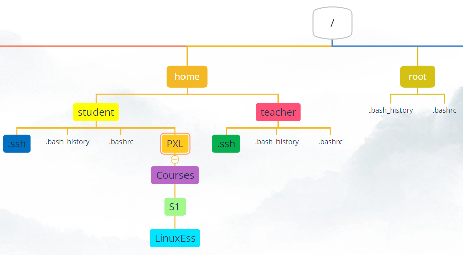
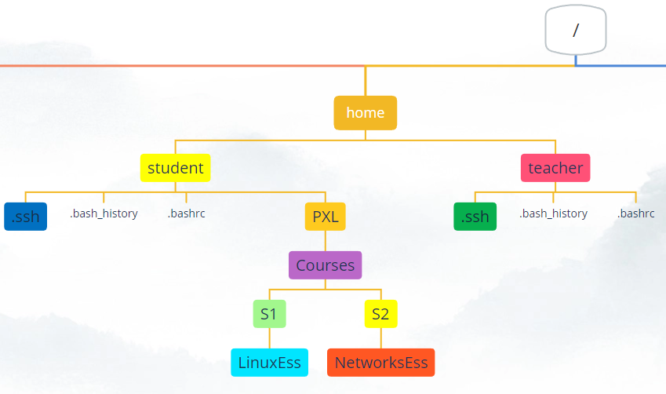
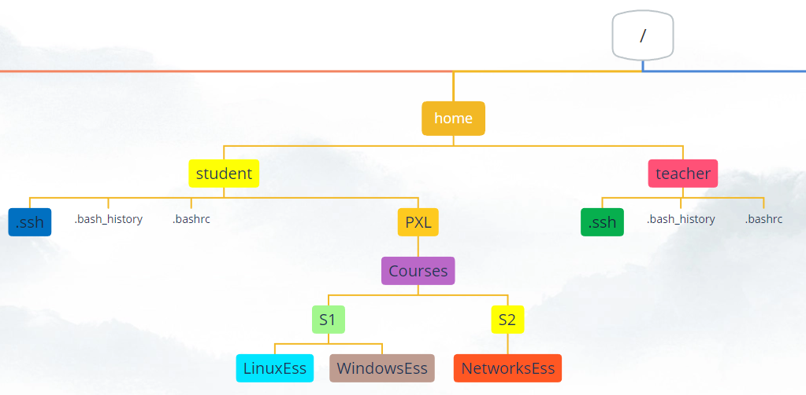
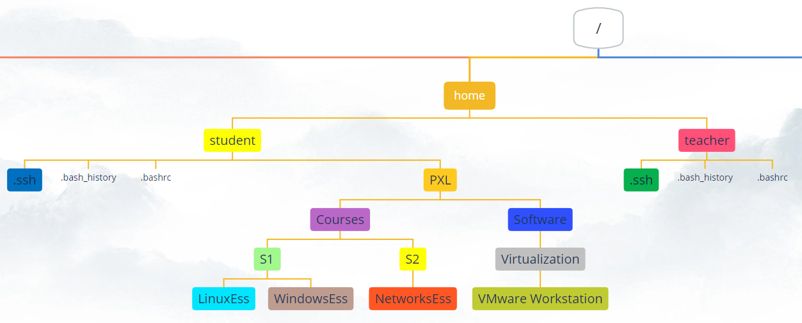

# Assignment on working with files and folders

`Connect over ssh to you server to do the exercises`

## Task 1
Navigate to your home directory with the least number of keystrokes (three to be exact)
What is the command to show the full path of where you are in the filetree?
What is the full path of your homefolder?

## Task 2
In your homedirectory, create the following structure:
`
PXL/Courses/S1/LinuxEss
`  
Do this by going into each created directory to create the next one.
  

?> <i class="fa-solid fa-circle-info"></i> You'll need this structure in a next Task

## Task 3
Go back to your homefolder.
While staying in your homefolder create the directory _S2_ as a subdirectory of _Courses_. Do this by using an _absolute path_.
While staying in your homefolder create the directory _NetworksEss_ as a subdirectory of _S2_. Do this also by using an _absolute path_.

Please use tab-completion whenever you can!  
  

## Task 4
While in your homefolder create the directory _WindowsEss_ as a subdirectory of _S1_. Do this by using an _relative path_.

Please use tab-completion whenever you can!  
  

## Task 5
While in your homedirectory, create the following structure with _just one command_:
`
PXL/Software/Virtualization/VMware Workstation
`  
Mind the space in the filename!   
You will have to search the manpage for the option to use. It will make all parent directories that are needed. Here it means that to create the directory _VMware Workstation_ the server will create all the other directories first if they do not yet exist (PXL, Software and Virtualization)
   

## Task 6
Install the command `tree` on your ubuntu machine. You can use this command to get an overview of directorystructures on your system. Search the manpage of tree to show the contents of the root directory and one extra level.

## Task 7
Why doesn't tab-completion work when executing the following command to open .bashrc?:
`cat /home/student/.bash<tab>`

## Task 8
Go to the directory _/etc_.
Use an absolute path to go to the directory PXL/Software/Virtualization/VMware Workstation

## Task 9
You are in the directory _VMware Workstation_.
Use a __relative path__ to go to the directory _LinuxEss_

## Task 10
You are in the directory _LinuxEss_.
Use  __the ~__ to go to the directory _.ssh_ in your homefolder.

## Task 11
Go to your homefolder  
list the files and folders  
list the files and folders in a long listing  
also list the hidden files  
list the files of the directory _/etc_ in a long listing with the filesizes in a _human readable_ format  
 
## Task 12
Create a new folder "My Pictures" in your homefolder. Go into this folder and create, with just one command, these following files (notice the capitalization):
- Picture1.JPG
- picture2.JPG
- Picture3.jpg
- picture4.jpg
  

## Task 13
Use the command `rename` twice to rename all files so no capitals exist anymore in any of the filenames from the previous exercise.

## Task 14
Make sure you are located in your homedirectory (~).    
Create a new directory named `backup` in your homefolder.  
Copy all 'files' within your homedirectory into the subdirectory named `backup`. You don't need to copy the subdirectories, but you need to copy the hidden files too.
 

## Task 15
Remove, with just one command, the folder `PXL` with all contents created in Task 5

## Task 16
Create this directorystructure with just 1 command:
`/home/student/school/semester/1/courses/ubuntuserver/exercises/chapter5`

## Task 17
Create, in the folder named 'exercises', a folder named 'chapter6'

## Task 18
Remove the folder named 'chapter5' without using the `rm` command

## Task 19
Recreate the directory 'chapter5'   

## Task 20
Navigate using absolute-path into the directory log which is a subdirectory of the directory var

## Task 21
Navigate to your own home directory

## Task 22
use cat to print the contents of the .bashrc file that is located in root's homefolder. Use a relative-path syntax. Use bang bang (!!) if you need more privileges!

## Task 23
Try to navigate to the directory /etc/dhcp with a maximum of 10 keystrokes

## Task 24
Clear the screen

## Task 25
Multiple people can have a ssh connection to the same server and meanwhile a person can be working on the server itself. Each person will have it's own screen (terminal window). 
Make sure you are logged in on the server itself and are also logged in over ssh. Make sure you see both screens at the same time.  

Search for commands that have the text "logged on" in their short description of the manpage
  
## Task 26
In the shell of your ssh session type one of the two commands you found in the previous task.
You will see two screens, tty1 and pts/0.
  
Everything is a file in linux. This is also true for the screen/window you're working in. When you are connected over _ssh_, your screen name is _pts/0_. When you are working _on the server_ itself, your screen name is _tty1_.  
  
In the shell of your ssh session type `echo hello there > /dev/tty1`. The greater than sign will redirect the output of the text _hello there_ to the tty1 device. The text appears on the screen on the server.
  
Try the following command in the shell of you ssh connection: `sl > /dev/tty1`.
  
If you want to see your prompt again on the server itself, you just have to press _enter_

## Task 27
While in the homefolder:
create an empty file, named _sourcefile_ in _~/school/semester/1/courses/ubuntuserver/exercises/chapter5_
show a tree of the directory _school_
show a long listing of the directory _chapter5_

## Task 28
Search the manpage of touch to find out what this command is used for. Try to explain in own words

## Task 29
Move the file _sourcefile_ from the directory _chapter5_ to the directory _chapter6_

## Task 30
Move the file _sourcefile_ back from the directory _chapter6_ to the directory _chapter5_, but also rename it to _SourceFile_ while moving. Mind the capitals

## Task 31
Copy the file _SourceFile_ to _chapter6_

## Task 32
Copy the file _SourceFile_ from _chapter6_ to your homefolder, but also rename it to _SourceFile.backup_ while copying

## Task 33
Copy the directory _school_ with all files and subdirectories to the directory _/tmp_.
View a directorylisting of _/tmp_
View the directory tree of _/tmp/school_
Reboot the server
See if the directory tree of _school_ is still present in _/tmp_
Use `man hier` to search for _/tmp_ and find out why

## Task 34
Find out what type of files _/etc/passwd_ , _/dev/tty1_ and _/dev/sda_ are

## Task 35
Use `sudo` to `find` all files on the filesystem which have 'SourceFile' as the __exact name__

## Task 36
`find` all files in your homefolder which have 'file' __in the name__, but this time do it __case insensitive__

## Task 37
Use `sudo` to `locate` all files that have 'SourceFile' in their name
If you can't find any files, search in the manpage of `locate` to the string __update__ to see which command you have to give to update the database. View the manpage of this command if necessary and then run this command to update the database. Then try the `locate` command again.

## Task 38
`locate` all files that have 'sourcefile' __in the name__, but this time do it __case insensitive__
Search the manpage of `locate` and search for 'case'

## Task 39
Delete the file _SourceFile.backup_ from your homefolder

 ## Task 40
`Shutdown` the server via the ssh session
