# Lab <!-- {docsify-ignore} -->

### **Disabling the systembell in the Ubuntu instance**

If you find it quite annoying to always hear the system bell during a tab completion, you can turn it off:

- via the file */etc/inputrc*

OR

- via removing the pcspkr kernel module

***sudo nano /etc/inputrc***

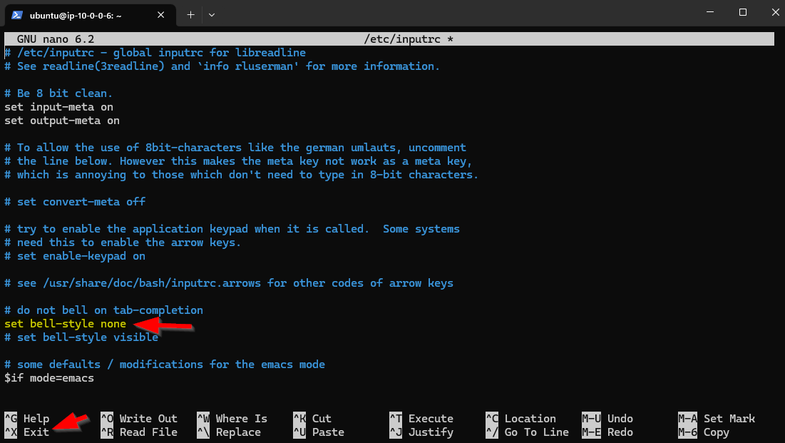

Uncomment the line *set bell-style none* by removing the hash sign at the front.

Leave the ssh session and log in again over ssh to get the result.

If that doesn't work, you can try removing the PC speaker kernel module (if it is implemented) with

***sudo rmmod pcspkr***

### **Installing the web server** 

We install the nginx web server. But first we upgrade all the packages to their latest version.

***sudo apt update*** 

this ensures that the computer knows the latest versions of all packages

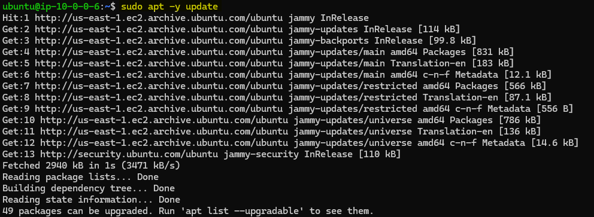

***sudo apt -y upgrade***

 		- updates all packages to their latest version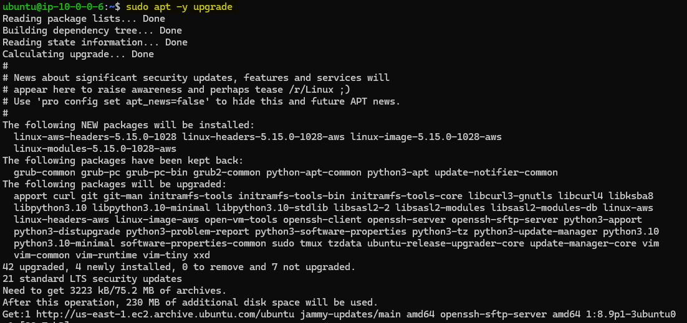

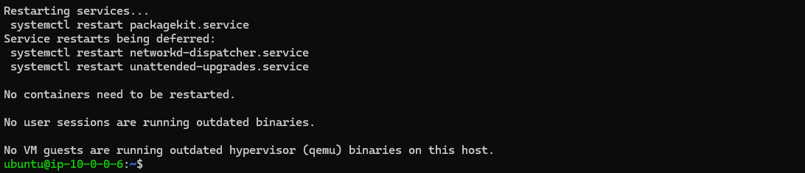

Restart the Webserver-Instance with

 ***sudo reboot***

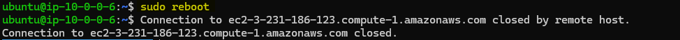

Now we install the webserver with

**sudo apt -y install nginx**

   - this installs the nginx-webserver

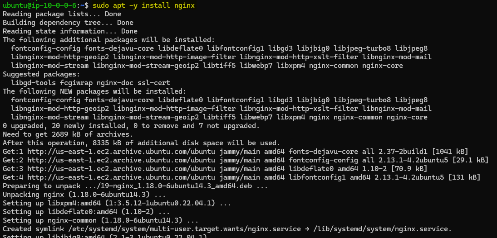

We check whether 

- nginx is running
- listening is done on port 80

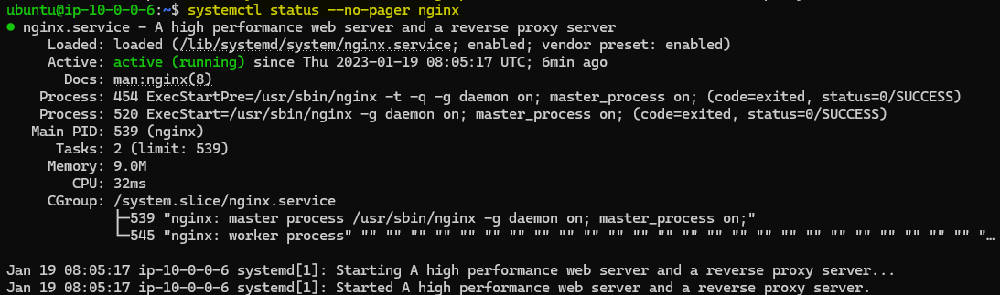

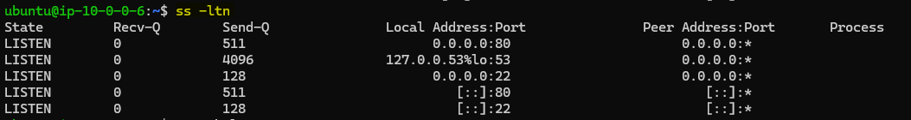

- ### **Test the web server locally** 

  We test locally whether the web server works. Because we are on a Linux Server and do not have a GUI, we have to do this with a Text-based browser

  - install lynx

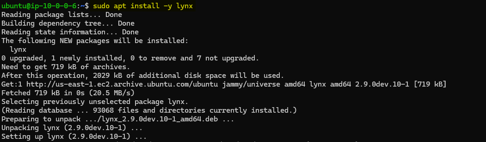

- and surf to
- 127.0.0.1

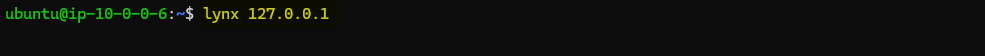

- localhost

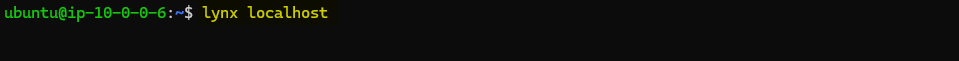

You should arrive at the page below. You can leave the web browser with *Q*

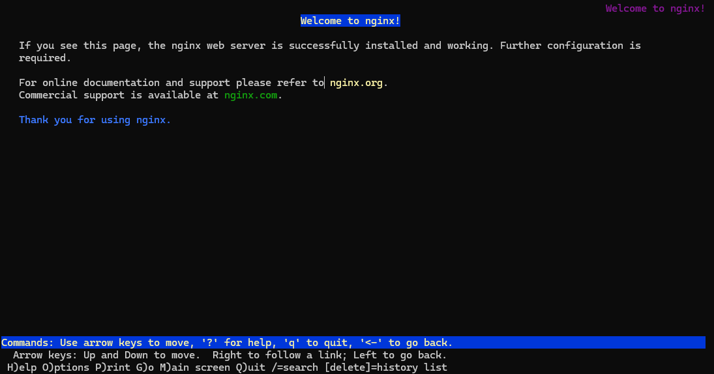

### **Test the web server from the laptop and adjust the firewall**

Surf from your laptop to the public IP of the website via **http** (for testing port 80)

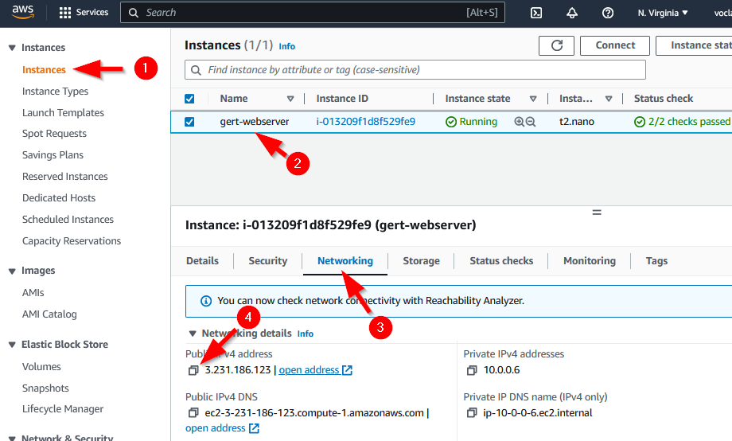

The website hangs for several minutes while loading

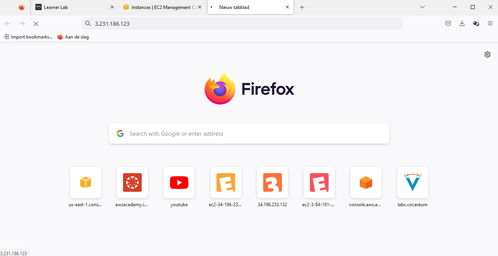

After a long time we get *The connection was reset*.  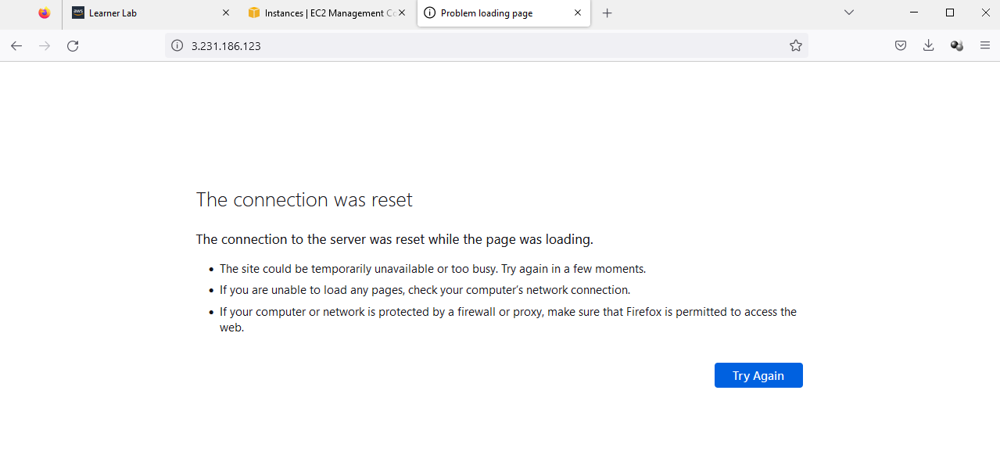

- So it doesn't seem to work yet!

  

  Because this does not work, we check whether there is http traffic arriving on the Web server

  - ***sudo tcpdump -i enX0 port 80*** (if enX0 is the name of your NIC, which you see with the command *ip a*. The name could also be somthing like eth0 or enp0s3 or ens33 or ...)
  - We surf over http from the laptop to the external IP address of the Web server (or refresh)
  - We look at what arrives and leaves packets on the Web server

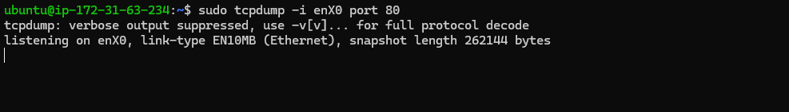

We see that not a single package arrives. So no external traffic enters the web server. The traffic is already filtered out somewhere beforehand.

Stop the sniffing with *CTRL-C*

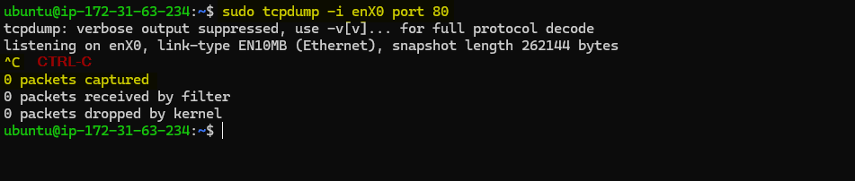

PS: You may still see some packets that come from an APIPA address (=169.254.0.0/16), but not from an external IP

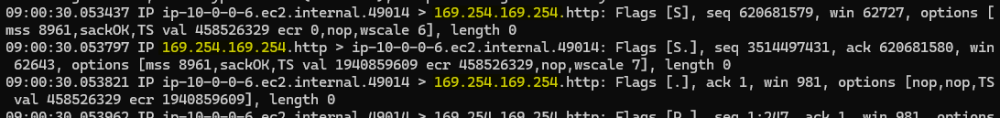

Surfing does not work because the traffic is filtered at AWS level and more specifically via the Security Group. So we have to solve this.

### **Add a new inbound rule in the Security Group that allows incoming traffic to port 80.**

Click on the *Security Group* to change te configuration

Click on *Edit inbound rules*

Click on *Add rule* and add a rule that allows incoming HTTP traffic over IPv4 from anywhere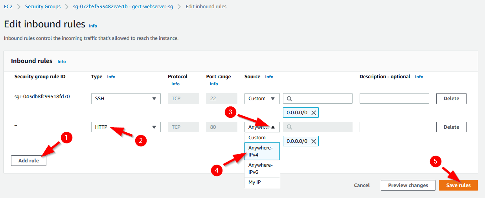

The addition was successful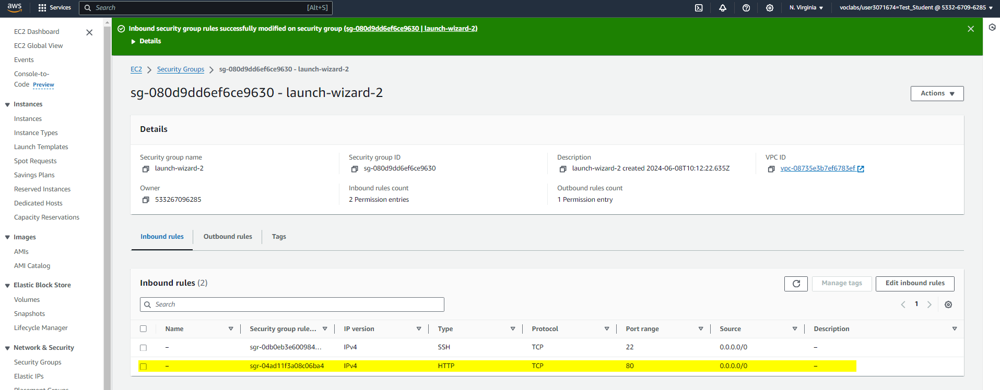

We are going to test again whether surfing works

We start with sniffing first…

- *sudo tcpdump -i eth0 port 80* (if eth0 is the name of your NIC)
- We surf again from the laptop to the external IP address of the Web server via http (or Refresh)
- We look at what arrives and leaves packages

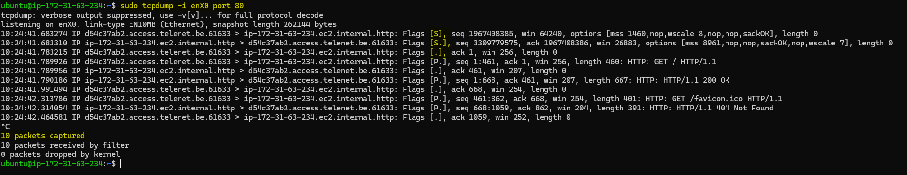

We now see that packets arrive from an external address and depart back to that external address.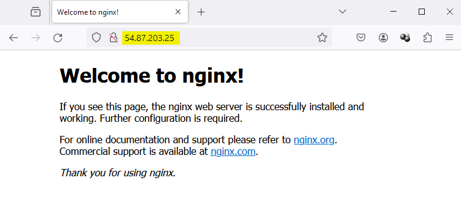

The website works!
