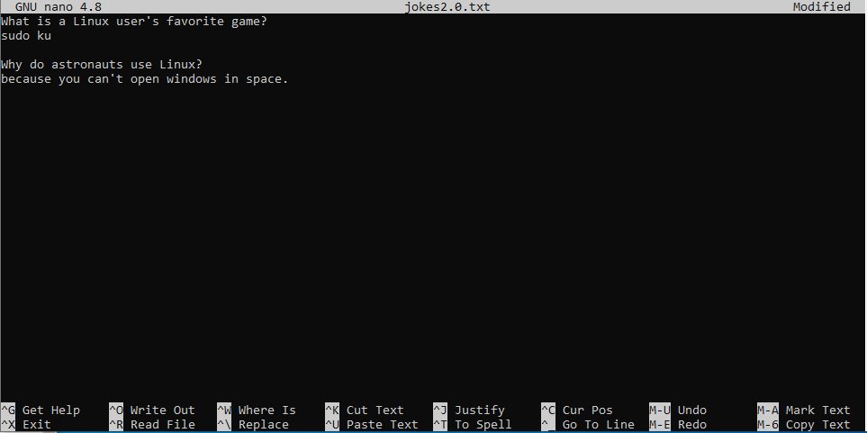

# File contents
## View a file completely (cat & tac)
To view file contents we can use the `cat` command. This command takes in a path to a file as an argument:
```bash
student@linux-ess:~$ cat /etc/os-release
PRETTY_NAME="Ubuntu 22.04.3 LTS"
NAME="Ubuntu"
VERSION_ID="22.04"
VERSION="22.04.3 LTS (Jammy Jellyfish)"
VERSION_CODENAME=jammy
ID=ubuntu
ID_LIKE=debian
HOME_URL="https://www.ubuntu.com/"
SUPPORT_URL="https://help.ubuntu.com/"
BUG_REPORT_URL="https://bugs.launchpad.net/ubuntu/"
PRIVACY_POLICY_URL="https://www.ubuntu.com/legal/terms-and-policies/privacy-policy"
UBUNTU_CODENAME=jammy
```
This will print the entire file contents in the terminal.

?> <i class="fa-solid fa-circle-info"></i> Note that you cannot scroll in a server CLI environment. If the file content is too big for the terminal size it will scroll over the screen and you will only be able to see the last 30 to 40 lines! You could swap to commands such as `more` or `less` (see further) to solve this issue.

The `tac` command is the `cat` command written in reverse order. This is also exactly what this command does, it outputs the file contents in reverse order (from bottom to top):
```bash
student@linux-ess:~$ tac /etc/os-release
UBUNTU_CODENAME=jammy
PRIVACY_POLICY_URL="https://www.ubuntu.com/legal/terms-and-policies/privacy-policy"
BUG_REPORT_URL="https://bugs.launchpad.net/ubuntu/"
SUPPORT_URL="https://help.ubuntu.com/"
HOME_URL="https://www.ubuntu.com/"
ID_LIKE=debian
ID=ubuntu
VERSION_CODENAME=jammy
VERSION="22.04.3 LTS (Jammy Jellyfish)"
VERSION_ID="22.04"
NAME="Ubuntu"
PRETTY_NAME="Ubuntu 22.04.3 LTS"
```

The `cat` and `tac` commands can take multiple files as arguments and will concatenate the contents in the terminal as follows:
```bash
student@linux-ess:~$ cat count1.txt
1 2 3
student@linux-ess:~$ cat count2.txt
4 5 6
student@linux-ess:~$ cat count1.txt count2.txt
1 2 3
4 5 6
```
All arguments in the cat command could have a preceding path. So in the example above we use _relative_ paths to the files that are in the current working directory (`/home/student`). This means that the command `cat /home/student/count1.txt /home/student/count2.txt` would give the exact same output.

## View first or last region of a file (head & tail)
Sometimes you don't want to view the entire file contents. Only the first or last couple of lines will suffice (in log files for example). To achieve this we can use the `head` or `tail` commands:
```bash
student@linux-ess:~$ head /etc/passwd
root:x:0:0:root:/root:/bin/bash
daemon:x:1:1:daemon:/usr/sbin:/usr/sbin/nologin
bin:x:2:2:bin:/bin:/usr/sbin/nologin
sys:x:3:3:sys:/dev:/usr/sbin/nologin
sync:x:4:65534:sync:/bin:/bin/sync
games:x:5:60:games:/usr/games:/usr/sbin/nologin
man:x:6:12:man:/var/cache/man:/usr/sbin/nologin
lp:x:7:7:lp:/var/spool/lpd:/usr/sbin/nologin
mail:x:8:8:mail:/var/mail:/usr/sbin/nologin
news:x:9:9:news:/var/spool/news:/usr/sbin/nologin
```
By default this command will show the first 10 lines of a file. When using `tail` it will show the last 10 lines:
```bash
student@linux-ess:~$ tail /etc/passwd
pollinate:x:105:1::/var/cache/pollinate:/bin/false
sshd:x:106:65534::/run/sshd:/usr/sbin/nologin
syslog:x:107:113::/home/syslog:/usr/sbin/nologin
uuidd:x:108:114::/run/uuidd:/usr/sbin/nologin
tcpdump:x:109:115::/nonexistent:/usr/sbin/nologin
tss:x:110:116:TPM software stack,,,:/var/lib/tpm:/bin/false
landscape:x:111:117::/var/lib/landscape:/usr/sbin/nologin
usbmux:x:112:46:usbmux daemon,,,:/var/lib/usbmux:/usr/sbin/nologin
student:x:1000:1000:student:/home/student:/bin/bash
lxd:x:999:100::/var/snap/lxd/common/lxd:/bin/false
```

We can manipulate the amount of lines in the command output as follows (you can change the number `2` by any number):
```bash
student@linux-ess:~$ head -2 /etc/passwd
root:x:0:0:root:/root:/bin/bash
daemon:x:1:1:daemon:/usr/sbin:/usr/sbin/nologin
```

This command is often used for log files, where the last lines usually have information about the latest events. eg:
```bash
student@linux-ess:~$ tail -5 /var/log/auth.log
Oct  7 16:23:06 ubuntu-server systemd-logind[840]: Watching system buttons on /dev/input/event1 (AT Translated Set 2 keyboard)
Oct  7 16:23:26 ubuntu-server sshd[1100]: Accepted password for student from 192.168.109.1 port 63147 ssh2
Oct  7 16:23:26 ubuntu-server sshd[1100]: pam_unix(sshd:session): session opened for user student(uid=1000) by (uid=0)
Oct  7 16:23:26 ubuntu-server systemd-logind[840]: New session 1 of user student.
Oct  7 16:23:26 ubuntu-server systemd: pam_unix(systemd-user:session): session opened for user student(uid=1000) by (uid=0)
```

?> <i class="fa-solid fa-circle-info"></i> We can even view log files in realtime by using `tail -f` (`-f` stands for _follow_). This will start an active process that at first will show the last 10 lines of a file. When something gets added to this file, it will be added in realtime in the command output. To terminate this active process use `ctrl+c`.

## Scrolling through several screens of the contents of a file (less)
When viewing big files with `cat` you might have noticed that the terminal will only show the last bit of the content. We can use commands such as `more` and `less` to view (and scroll through) the entire content. With `more` you can only scroll down and this one screen at a time by pressing the _spacebar_ or _page down_. With `less` you can also scroll up by pressing _page up_.  With `less` scrolling only one line can also be done by using the _up arrow_ or _down arrow_. To exit `more`or `less` you can simply press _q_ or _ctrl+c_.
```bash
student@linux-ess:~$ less /var/log/dpkg.log
2022-09-19 21:52:34 startup packages remove
2022-09-19 21:52:34 status installed linux-virtual:amd64 5.4.0.81.85
... output omitted
2022-09-19 21:52:34 status half-configured linux-headers-5.4.0-81:all 5.4.0-81.91
2022-09-19 21:52:34 status half-installed linux-headers-5.4.0-81:all 5.4.0-81.91
```
?> <i class="fa-solid fa-circle-info"></i> Did you know that by default manpages are also opened with `less`. So you can also search within files opened with `less` by using _/_ and _n_ for next, _N_ for previous. If you want to search case insensitive you can type _-i_. You can also go to the first line by pressing _g_ and to the last line by pressing _G_.

## Create files with contents
### Using echo
There are several ways to create files and add content to them. One of these ways is by using the `echo` command. The default behaviour of this command is that it  prints out to the screen whatever you use as an argument:
```bash
student@linux-ess:~$ echo hello world
hello world
```
You could use quotes to make it more obvious as to what the argument of the `echo` command is (This also impacts the command's behaviour which we will see in a later chapter):
```bash
student@linux-ess:~$ echo "hello world"
hello world
```
Now this is where it gets interesting. We can use a `>` sign to tell the shell to take the output of the previous command and write it to a file instead of to the screen:
```bash
student@linux-ess:~$ echo hello world > demofile
```
So this actually makes it so that the output of the `echo` command is not shown in the shell, but rather is written (or _redirected_) to the file `demofile`. We can confirm this as follows:
```bash
student@linux-ess:~$ ls
demofile
student@linux-ess:~$ cat demofile
hello world
```
By default a file get overwritten by using the `>` sign. If you want to add to a file instead of overwriting it, you can do this with `>>`
```bash
student@linux-ess:~$ cat demofile
hello world
student@linux-ess:~$ echo hello everyone >> demofile
student@linux-ess:~$ cat demofile
hello world
hello everyone
```
The concept we use here is called _output redirection_ which we will talk about in a later chapter.

### Using cat
We can also use the cat command in combination with the _output redirection (`>`)_ as shown in the example below. After typing the command we can type one or more lines. When you are done typing the file contents you can use the keyboard combination `ctrl` and `d` (ctrl+d) to tell the shell you are done (this will send an _end of file_ (EOF) signal to the running process):
```bash
student@linux-ess:~$ cat > jokes.txt    
What is a Linux user's favorite game?
sudo ku
student@linux-ess:~$ cat jokes.txt
What is a Linux user's favorite game?
sudo ku
```
We pressed __ctrl+d__ after the line `sudo ku`

#### Copy files using cat
Knowing what we learnt about using _output redirection_ (`>`) we can actually use this to copy file contents to another file as follows:
```bash
student@linux-ess:~$ cat jokes.txt > jokes2.0.txt
student@linux-ess:~$ cat jokes2.0.txt
What is a Linux user's favorite game?
sudo ku
```

### Using a custom end marker
Another method of creating files with a certain content is to define a _custom end marker_ for the `cat > FILENAME` command as shown in the example below. By doing this you won't have to use the `crtl+d` keyboard combination to stop the input and write the text to the file but you can just type the word (`end` in the example) given as the custom end marker:
```bash
student@linux-ess:~$ cat > schooltasks.txt << end
> create new vm
> learn new commands
> play minecraft
> end
student@linux-ess:~$ cat schooltasks.txt
create new vm
learn new commands
play minecraft
```

### Using nano
Lastly we could use a text editor to edit/add file contents. There are many text-editors available. `nano` is one that is installed by default on a Ubuntu machine. You can use this editor by using the `nano` command followed by the path to a new or existing file:
```bash
student@linux-ess:~$ nano jokes2.0.txt
```
A text editor window will open as shown in the figure below where you can navigate using the arrow keys. You can add/edit/delete content by using your keyboard.



At the bottom of the screen it shows some of the shortcuts you can use. Some of the most interesting ones are:

* _ctrl+s_: this is used to save the changes to the same file.
* _ctrl+o_: this is used to save the changes to another filename. This will prompt for a filename and will overwrite the file if a file with the same name already exists.
* _ctrl+x_: quit the text editor and go back to the prompt. When you made changes to the file you will be asked if you want to save the changes and ifso you will have to enter a filename and press enter. It will overwrite the file if a file with the same name already exists.  
  
* _shift+arrows_: select a portion of the text.  
* _ctrl+k_: cut selected text or the whole line (if no text is selected).
* _ctrl+u_: paste any cut content.  
  
* _ctrl+w_: find a certain text in the file (ctrl+q to search in the opposite direction).
* _ctrl+\_: search and replace - give the word to search for and then give the word to replace it with (then use yes, no, all, ...) (you can type ctrl+< ) 
* _ctrl+/_: goto a certain line (and column). (you can also type _ctrl+-_)
  
* _alt+u_: undo the last change.
* _alt+e_: redo the last change.  
  
* _alt+s_: enable/disable auto wrap text over lines.    
* _alt+n_: show/hide line numbers.
  
* _ctrl+home_: goto first line
* _ctrl+end_: goto last line  
  

?> <i class="fa-solid fa-circle-info"></i> If you want to cut a specific text you can select it first by pressing _shift+arrow keys_. Then use _ctrl+k_ to cut and afterwards _ctrl+u_ to paste. 

?> <i class="fa-solid fa-circle-info"></i> The fastest way to 'save and quit nano' is to type _ctrl+s_ (to save the changes) followed by _ctrl+x_ (to exit nano). 

?> Another very popular text editor in Linux systems is `vi`. This editor is really powerfull but also has a steep learning curve. In this course we will not cover `vi`, but feel free to experiment on your own. `vim`, an easier option of `vi` is also installed on your system. To learn more about this, a tutor is available with the command: `vimtutor`.   

