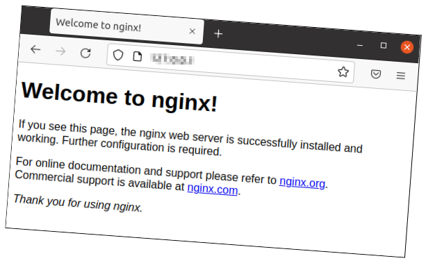

# Lab <!-- {docsify-ignore} -->

### **The Default Website**

If you surf to the IP address or DNS name of the web server, you will see the Default website. 

#### **Surf to the Default website**

If we surf to the IP address (or DNS name) we will see a standard web page. This will be shown until we place our own web pages on the web server.

### **Customizing the Default website**

#### **Search for the configuration file**

We found out the name of the nginx configuration file via the man page. 

Usually a configuration file of a service is prepared as follows: *servicename.conf*

In this case that would be *nginx.conf*. 

Configuration files are usually located somewhere in */etc*

If we want to search for this file, we can also do this via the *find* and *locate* methods.

Locate the file *nginx.conf* with find in */etc/* or one of its subdirectories.

→ ***sudo find /etc -name "nginx.conf"***

Also search for the file with ***locate nginx.conf*** 

TIP: if *locate* appears to not have been installed yet, you can install the package with *sudo apt install plocate* 

→ ***sudo apt install plocate***

→ ***locate nginx.conf*** (or *up arrow* for history or find with *CTRL-R* and then reverse search for the letters *loc*)

TIP: Use *CTRL-R* as much as possible to reverse search for a previous command and then adjust it before executing it.

#### **Viewing the configuration file with *cat***

View the configuration file with *cat*

***cat /etc/nginx/nginx.conf***

  => the lines scroll past several screens 

#### **Viewing the configuration file with a pager**

View the configuration file with *less*

***less /etc/nginx/nginx.conf***

=> you can now navigate through the file with the arrows or *PgUp* and *PgDn*. 

Within *less*, search for the lines with the text *log*

TIP: You can search by typing the *slash* (/) and then your *search string*. You can go to the next occurrence by pressing the letter *n*. To the previous one by pressing the *capital letter N*.
*g* takes you back to the first line. *G* takes you to the last line.

=> you will see an *access log* and an *error log*

  => view both files with *less*

 => in the *access-log* file you can see when people came to your website

 => the *error-log* file contains the error messages (and possibly nothing) 

 => with the command ***file /var/log/nginx/access.log*** you can see that the file has ASCII text 
 		contains or that the file is still empty

 => you can also view the size of a file with *ls -lh*

→ ***ls -lh /var/log/nginx***

**Editing the configuration file with nano**

The general configuration of our web server is written in the *nginx.conf* file

Edit this file with nano.

→ ***nano /etc/nginx/nginx.conf***

  => we see that the file is opened read-only

Close the editor with CTRL-X

Run the command again with *sudo !!*

→ ***sudo !!***

Delete the bottom 21 lines (from #mail { )

  → with ***CTRL-K*** you can suddenly delete an entire line

Save changes and exit nano 

→ ***CTRL-X , y(es) , <enter>***

#### **Viewing the configuration file with tail**

View the last 10 lines of the configuration file with the *tail* command

→ ***tail /etc/nginx/nginx.conf*** 

  → or *tail !$* because *!$* is the last parameter of the previous command

On the penultimate line you will see an include of all files in the *sites-enabled* folder.

Tip: All websites are configured in the *sites-available* folder. Only the websites that also have their configuration files in *sites-enabled* will be started when starting the nginx web server. 
The configuration of a website is created by default in *sites-available*. In *sites-enabled* we see configuration files return, but as a *link* to the same file in *sites-available*.

You can view this with

 ***ls -l /etc/nginx/sites-enabled/***

→ **l**rwxrwxrwx 1 root root 34 Feb 8 13:54 default **->** /etc/nginx/sites-available/default

View, with *less*, the only file you find in the *sites-enabled* folder.

Search for the text *root* and see which folder this *Directive* points to.

=> The *root directive* indicates in which directory the html files (= web pages) and therefore also the *index file* (= main page or landing page) are searched for when visiting this website.

→ ***less /etc/nginx/sites-available/default***

  → ***/root*** (search for lines with root)

List what is in */var/www/html*

→ ***ls -l /var/www/html***

Edit, with *nano*, the only file in this directory

→ ***sudo nano /var/www/html/index.nginx-debian.html***

Change the text *Welcome to nginx!* twice to ***Welcome to LinusCraft**!** and save with *CTRL+s* and then *CTRL+x*

(the first occurrence provides the title in the tab of your web browser, the second occurrence is the text visible in the Web page)

Surf to your website again over HTTP via the IP address or DNS name.

If you don't see the modified content yet, press *CTRL-F5*. This ensures that the page in your web browser is certainly refreshed.

So we see that the web server will search for its website files in the directory /var/www/html by default.  Linus can therefore place his website files there.

### Transfer **Own Website** files

Linus has developed his own website on his laptop and wants to transfer it to the Web server. He has zipped the website files and can transfer them with *SCP* because *SSH* already works. 

#### Transfer website

First download the zip file by clicking <a href="https://vwgert.github.io/be-nl/06_filecontents/LinusCraft.zip" download>here</a>.

Use scp (from Powershell) to transfer your downloaded file to your Web server.

***scp -i "\<path to ssh-key\>" \<path to zip file\> ubuntu\@<webserver-ip\>:*** 

Attention!  Don't forget the colon at the end of the command line!

After uploading to the server, the file is located in the home folder of the Ubuntu user.

### **Unzip the website files**

We are looking for a package with the text "unzip".

→ ***sudo apt search unzip***

Third and last in the list we see the package unzip.

Install the package unzip

→ ***sudo apt install unzip***

Find out in the unzip man page how to unzip the downloaded file. You can also always search for 'EXAMPLES' to see examples.

Hint: If there are spaces in a file name, you must always escape them with a backslash (\), or you must enclose the entire file name with double quotes (") or single quotes ('). Of course, you can always use TAB completion to use!

→ ***man unzip*** → Search with the slash (/) for *EXAMPLES*

→ ***unzip "LinusCraft.zip"***

Check if you have added a directory called *LinusCraft*

Do a tree of the dir "be" to view the file tree

→ ***sudo apt install tree***

→ tree LinusCraft

You will see the files that the website contains.

### **Copy the Website files to a new web directory**

Copy the contents of the directory *LinusCraft* to */var/www/html*

→ ***sudo cp ~/LinusCraft/`*`  /var/www/html***

Run ls -l /var/www/html to see if this worked

Run a tree /var/www/html to see if this worked

**View the result in your browser**

Surf to the Website from your laptop

Hint: You may only see the new website after pressing CTRL-F5

