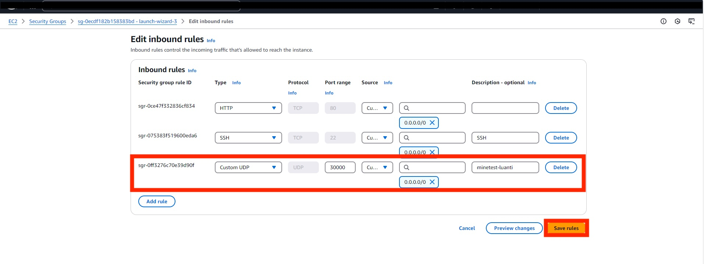

c# Lab <!-- {docsify-ignore} -->

## Finding useful commands

On the [downloads page of the Minetest website](https://www.minetest.net/downloads/) we see a link that points to a specific ubuntu url called `packages.ubuntu.com/...`. This means that you can install the `minetest` package using a CLI tool.


## Finding ways to install minetest

Linus needs to install this minetest on his server in some way. He needs to find a command that allows him to install packages.

Linus uses the `man` command to find a list of commands that have the keyword _package_ in their description:
```bash
man -k package                    or                    apropos package
```
The command will give the following output:
```
ubuntu@aws-linux-ess:~$ man -k package
apt-extracttemplates (1) - Utility to extract debconf config and templates from Debian packages
apt-get (8)          - APT package handling utility -- command-line interface
apt-mark (8)         - show, set and unset various settings for a package
apt-sortpkgs (1)     - Utility to sort package index files
check-language-support (1) - returns the list of missing packages in order to provide a complete language environment
debconf-apt-progress (1) - install packages using debconf to display a progress bar
dh_bash-completion (1) - install bash completions for package
```
The `apt-get` command in this list looks promising. Linus decides to investigate the `apt-get` command. First of he does this by using the `whatis` command:
```bash
whatis apt-get
```
He wants to get more information about the usage of the command so he decides to view te manpage:
```bash
man apt-get
```
This command gives us the full _manual_ of the `apt-get` command:

```
APT-GET(8)                                               APT                                               APT-GET(8)

NAME
       apt-get - APT package handling utility -- command-line interface

SYNOPSIS
       apt-get [-asqdyfmubV] [-o=config_string] [-c=config_file] [-t=target_release] [-a=architecture] {update |
               upgrade | dselect-upgrade | dist-upgrade | install pkg [{=pkg_version_number | /target_release}]...  |
               remove pkg...  | purge pkg...  | source pkg [{=pkg_version_number | /target_release}]...  |
               build-dep pkg [{=pkg_version_number | /target_release}]...  |
               download pkg [{=pkg_version_number | /target_release}]...  | check | clean | autoclean | autoremove |
               {-v | --version} | {-h | --help}}

DESCRIPTION
       apt-get is the command-line tool for handling packages, and may be considered the user's "back-end" to other
       tools using the APT library. Several "front-end" interfaces exist, such as aptitude(8), synaptic(8) and
       wajig(1).

       Unless the -h, or --help option is given, one of the commands below must be present.

       update
           update is used to resynchronize the package index files from their sources. The indexes of available
           packages are fetched from the location(s) specified in /etc/apt/sources.list. For example, when using a
           Debian archive, this command retrieves and scans the Packages.gz files, so that information about new and
           updated packages is available. An update should always be performed before an upgrade or dist-upgrade.
           Please be aware that the overall progress meter will be incorrect as the size of the package files cannot
           be known in advance.

       upgrade
       ...
       install
           install is followed by one or more packages desired for installation or upgrading. Each package is a
           package name, not a fully qualified filename (for instance, in a Debian system, apt-utils would be the
           argument provided, not apt-utils_2.0.6_amd64.deb). All packages required by the package(s) specified for
           installation will also be retrieved and installed. The /etc/apt/sources.list file is used to locate the
           desired packages. If a hyphen is appended to the package name (with no intervening space), the identified
           package will be removed if it is installed. Similarly a plus sign can be used to designate a package to
           install. These latter features may be used to override decisions made by apt-get's conflict resolution
           system.

           A specific version of a package can be selected for installation by following the package name with an
           equals and the version of the package to select. This will cause that version to be located and selected
           for install. Alternatively a specific distribution can be selected by following the package name with a
           slash and the version of the distribution or the Archive name (stable, testing, unstable).

           Both of the version selection mechanisms can downgrade packages and must be used with care.

           This is also the target to use if you want to upgrade one or more already-installed packages without
           upgrading every package you have on your system. Unlike the "upgrade" target, which installs the newest
           version of all currently installed packages, "install" will install the newest version of only the
           package(s) specified. Simply provide the name of the package(s) you wish to upgrade, and if a newer
           version is available, it (and its dependencies, as described above) will be downloaded and installed.

           Finally, the apt_preferences(5) mechanism allows you to create an alternative installation policy for
           individual packages.
       ...
```
He can navigate the manpage using the arrow keys on the keyboard. After reading through the manpage he closes it by pressing the `q` key on his keyboard. Using the info in the manpage. We can see that the `apt-get` command has a sub command called `install`. Linus figures out he can use this to install minetest on his system.

## Installing Minetest
With the knowledge he just gathered he tries to install Minetest:

```bash
ubuntu@aws-linux-ess:~$ apt-get install minetest
E: Could not open lock file /var/lib/dpkg/lock-frontend - open (13: Permission denied)
E: Unable to acquire the dpkg frontend lock (/var/lib/dpkg/lock-frontend), are you root?
```

He sees an error (`permission denied`). It is important to learn to analyse error messages. As he can see the error also refers to the user `root`. In this chapter we've seen that some commands require _administrator rights_ to run. `apt-get` is a system command that impacts the entire system, so this command requires special rights. Linus can run this command as a super user by using the `sudo` command:

?> <i class="fa-solid fa-circle-info"></i> Use the `up arrow` to use the _history_ and use the `left arrow` or `home key` to go to the _beginning of the line_ to type sudo.

```bash
ubuntu@aws-linux-ess:~$ sudo apt-get install minetest
[sudo] password for student:
Reading package lists... Done
Building dependency tree
Reading state information... Done
The following additional packages will be installed:
...
After this operation, 38,8 MB of additional disk space will be used.
Do you want to continue? [Y/n] Y
...
Setting up minetest (5.1.1+repack-1build1) ...
Processing triggers for mime-support (3.64ubuntu1) ...
Processing triggers for libc-bin (2.31-0ubuntu9.2) ...
Processing triggers for man-db (2.9.1-1) ...
...
ubuntu@aws-linux-ess:~$
```

?> <i class="fa-solid fa-circle-info"></i> If you get an error running the command above, try running `sudo apt-get update` and run the `sudo apt-get install minetest` command again.

The command above will prompt you for your password and might also prompt to ask you if you are sure you want to install a bunch of packages. 

The installation is successful (he thinks, because we don't really get a success message or anything).

We've learnt that this command actually uses the package manager to go look for (and install) a package called `minetest` in its repositories. It also installs all the needed dependencies and sets up the operating system so we can actually use the `minetest` command.

To learn more about the command we can first run the `man minetest` command:

```bash
minetest(6)                                                                                               minetest(6)

NAME
       minetest, minetestserver - Multiplayer infinite-world block sandbox

SYNOPSIS
       minetest [--server SERVER OPTIONS | CLIENT OPTIONS] [COMMON OPTIONS] [WORLD PATH]

       minetestserver [SERVER OPTIONS] [COMMON OPTIONS] [WORLD PATH]

DESCRIPTION
       Minetest  is  one  of the first InfiniMiner/Minecraft(/whatever) inspired games (started October 2010), with a
       goal of taking the survival multiplayer gameplay in a slightly different direction.

       The main design philosophy is to keep it technically simple, stable and portable. It will be kept  lightweight
       enough to run on fairly old hardware.

COMMON OPTIONS
       --help Print allowed options and exit

       --version
              Print version information and exit

       --config <value>
              Load configuration from specified file

       --logfile <value>
              Set logfile path ('' for no logging)

 Manual page minetest(6) line 1 (press h for help or q to quit)
```

## Running the server

 We notice there is an option: `--server`. The package we installed has both the client version (the one you load up to connect to the server and play) and the server version (the one you run to actually host a server where other players can connect to using a client).

 We also check where the executable file is located using the `which minetest` command:

 ```bash
ubuntu@aws-linux-ess:~$ which minetest
/usr/games/minetest
 ```

?> We could both run the commands `minetest` and `/usr/games/minetest`. Both would run the same executable. This is possible because of the `$PATH` variable which contains the folder `/usr/games`. When you type a command, the CLI will look for an executable file in all of the folders in the `$PATH` variable and then run that file. This makes it easier to run commands as we don't always need the full path to a file. You can type `echo $PATH` to see the value of the PATH variable.

 When running the `minetest` command you will notice that you will get an error: 

 ```bash
 student@linux-ess:~/linuscraft$ minetest
ALSA lib confmisc.c:767:(parse_card) cannot find card '0'
ALSA lib conf.c:4732:(_snd_config_evaluate) function snd_func_card_driver returned error: No such file or directory
ALSA lib confmisc.c:392:(snd_func_concat) error evaluating strings
ALSA lib conf.c:4732:(_snd_config_evaluate) function snd_func_concat returned error: No such file or directory
ALSA lib confmisc.c:1246:(snd_func_refer) error evaluating name
ALSA lib conf.c:4732:(_snd_config_evaluate) function snd_func_refer returned error: No such file or directory
ALSA lib conf.c:5220:(snd_config_expand) Evaluate error: No such file or directory
ALSA lib pcm.c:2642:(snd_pcm_open_noupdate) Unknown PCM default
AL lib: (EE) ALCplaybackAlsa_open: Could not open playback device 'default': No such file or directory
terminate called after throwing an instance of 'std::runtime_error'
  what():  Audio: Global Initialization: Device Open
Aborted
 ```

We notice that we get an error message saying `cannot find card '0'`. Remember that we are trying to run the client version of the game. This client is an actual graphical user interface that would look something like this:


We get this error because we are running an Ubuntu server using a command line interface. There is no graphical user interface present so the actual GUI of the client cannot be loaded. We will install the client version of the game later on in this lab on our laptop.

So to get our server up and running we will have to focus on using the `minetest --server` command:

```bash
ubuntu@aws-linux-ess:~$ minetest --server
        .__               __                   __
  _____ |__| ____   _____/  |_  ____   _______/  |_
 /     \|  |/    \_/ __ \   __\/ __ \ /  ___/\   __\
|  Y Y  \  |   |  \  ___/|  | \  ___/ \___ \  |  |
|__|_|  /__|___|  /\___  >__|  \___  >____  > |__|
      \/        \/     \/          \/     \/
2022-08-25 09:36:24: ACTION[Main]: World at [/home/student/.minetest/worlds/world]
2022-08-25 09:36:24: ACTION[Main]: Server for gameid="minetest" listening on 0.0.0.0:30000.
```

We don't get our prompt back. This is because the server application is an active running process. We can always interrupt this process by using the keyboard combination `ctrl+c`.

?> Note that we need to have the `minetest` executable running if we want to actually connect to the server later on!

When running the command using the `--server` option, we can see that it created a `worlds/world` folder in `/home/student/.minetest`. This is interesting because, by default, this is where `minetest` stores all the configuration files of our actual server. We also notice that the server is _listening_ for connections on port `30000`.  

Linus does not want to use the default configuration though. He made a folder `~/linuscraft/serverfiles` for exactly the purpose of managing the world files. Using the manpage we see that we can tell the server to use this path as to where the world files have to be saved:

```bash
ubuntu@aws-linux-ess:~$  mkdir -p ~/linuscraft/serverfiles/
ubuntu@aws-linux-ess:~$  minetest --server --world ~/linuscraft/serverfiles/myworld --logfile ~/linuscraft/serverfiles/logfile.txt
        .__               __                   __
  _____ |__| ____   _____/  |_  ____   _______/  |_
 /     \|  |/    \_/ __ \   __\/ __ \ /  ___/\   __\
|  Y Y  \  |   |  \  ___/|  | \  ___/ \___ \  |  |
|__|_|  /__|___|  /\___  >__|  \___  >____  > |__|
      \/        \/     \/          \/     \/
2022-08-25 09:45:01: ACTION[Main]: World at [/home/student/linuscraft/serverfiles/myworld]
2022-08-25 09:45:01: ACTION[Main]: Server for gameid="minetest" listening on 0.0.0.0:30000.
```

We also used the `--logfile` option to save all the server logs to a specific file. We now see that the world has been created in `~/linuscraft/serverfiles/myworld`. We can check this by pushing 'ctrl+c' (this will shutdown the minetest server) and running an `ls` command:

```bash
ubuntu@aws-linux-ess:~$ tree linuscraft
linuscraft
└── serverfiles
    ├── logfile.txt
    └── myworld
        ├── env_meta.txt
        ├── force_loaded.txt
        ├── ipban.txt
        ├── map.sqlite
        ├── map_meta.txt
        ├── mod_storage.sqlite
        └── world.mt

3 directories, 8 files
```

## Connecting to the server

*First* we need to give an inbound security rule so our server will see a connection request on UDP port 30000. To do this we need to go to our security group and add a new rule.
Click on the *Security Group* to change te configuration

Click on *Edit inbound rules*

Add another rule of the type custom UDP, allow 'any-where IPv4' and give it a usefull comment. Save and now we can go on.


*Second* we need to get the IP adres of the server. This is the same IP adres you use to connect via SSH.

*Third* we need make sure the server is actually running by using the `minetest` command we created above. We leave this process active:

```bash
ubuntu@aws-linux-ess:~$  minetest --server --world ~/linuscraft/serverfiles/myworld --logfile ~/linuscraft/serverfiles/logfile.txt
        .__               __                   __
  _____ |__| ____   _____/  |_  ____   _______/  |_
 /     \|  |/    \_/ __ \   __\/ __ \ /  ___/\   __\
|  Y Y  \  |   |  \  ___/|  | \  ___/ \___ \  |  |
|__|_|  /__|___|  /\___  >__|  \___  >____  > |__|
      \/        \/     \/          \/     \/
2022-08-25 09:45:01: ACTION[Main]: World at [/home/student/linuscraft/serverfiles/myworld]
2022-08-25 09:45:01: ACTION[Main]: Server for gameid="minetest" listening on 0.0.0.0:30000.
```

### Download the client

Next up we need to download the client on our Windows laptop. You can download the client on https://www.minetest.net/downloads/. Download and extract the `Minetest x.x.x - portable, 64-bit (recommended)`. After extracting the folder, you will find a file named `minetest.exe` in the subfolder `bin` which you can doubleclick:


### Connecting to our server

When booting up the client on our Windows machine you will get a menu with several options. Since we want to join a server and not play locally we click the _join game_ tab.


On the right side of the menu we can enter the ip address that we found earlier on the server by running the command `ip a`. The port should be set to the value `30000` by default. We also provide a username and password and click on the `register` button:


?> The next time you join, you will have to click the login button and provide the selected password!

We set the password and click on the `Register` button:


After this process, the client should connect you to the server and you will be able to run around and build stuff!


?> Be careful. Dangerous creatures roam around the world at night!

When we hop back to the CLI of our server, you will also notice that output of our command has changed. It now shows that a player has connected (and disconnected) from the server:

```bash
ubuntu@aws-linux-ess:~$ minetest --server --world ~/linuscraft/serverfiles/myworld
        .__               __                   __
  _____ |__| ____   _____/  |_  ____   _______/  |_
 /     \|  |/    \_/ __ \   __\/ __ \ /  ___/\   __\
|  Y Y  \  |   |  \  ___/|  | \  ___/ \___ \  |  |
|__|_|  /__|___|  /\___  >__|  \___  >____  > |__|
      \/        \/     \/          \/     \/
2022-08-25 10:24:46: ACTION[Main]: World at [/home/dries/linuscraft/serverfiles/myworld]
2022-08-25 10:24:46: ACTION[Main]: Server for gameid="minetest" listening on 0.0.0.0:30000.
2022-08-25 10:32:51: ACTION[Server]: linus [172.25.xxx.x] joins game.
2022-08-25 10:32:51: ACTION[Server]: linus joins game. List of players: linus
2022-08-25 10:37:33: ACTION[Server]: linus digs default:acacia_tree at (6,5,3)
```

### Running a downloaded map

The default map is quite empty so Linus wants to impress his friends by downloading a prebuild map he found on Google. To do this we go into your `serverfiles` directory:

```bash
ubuntu@aws-linux-ess:~$ cd ~/linuscraft/serverfiles
```

After doing so we will download the zip file containing our new world by running the command below:

```bash
student@linux-ess:~/linuscraft/serverfiles$ wget https://vwgert.github.io/data/customworld.zip
```

If we want to take a look into the zip, we can use ```less customworld.zip```  

This will give us a `zip` file that we need to extract by running ```unzip customworld.zip```.

We can remove the zipfile as we no longer need this:

```bash
student@linux-ess:~/linuscraft/serverfiles$ rm customworld.zip
student@linux-ess:~/linuscraft/serverfiles$ ls
pxl-world  logfile.txt  myworld
```

As seen in the output above, the new world is called `pxl-world`. We can now use the command we saw earlier to start the server using the new map files:

```bash
student@linux-ess:~/linuscraft/serverfiles$ minetest --server --world ~/linuscraft/serverfiles/pxl-world/ --logfile ~/linuscraft/serverfiles/logfile.txt
```

If you join now, you should be in a world that contains a lake/sea with the PXL university college logo floating in the air!
