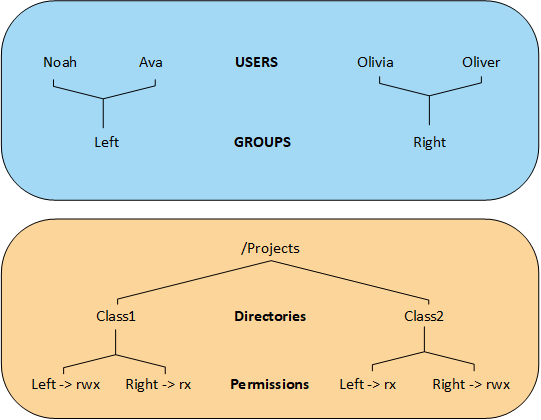
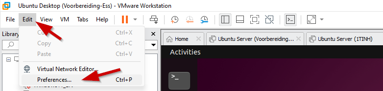
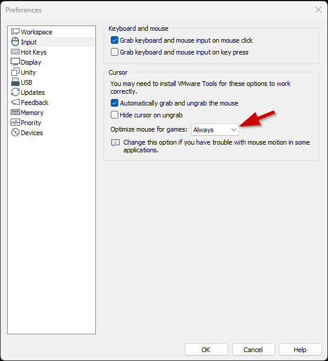

# Assignment on Users, Groups, Permissions - Extra exercises

## Task 1
Create a group named pxl and a user itstudent. This user's primary group is pxl. Set the password for the user to test123. The home directory for this user is /home/itstudent and for the shell the user uses /bin/bash.

## Task 2
Make sure the user itstudent becomes a sudoer. Test if this works. 

## Task 3
Copy the file /etc/hosts to your home directory (do not do this as root!). Set the permissions with the chmod command as follows: 
r-x for others, rw- for group and no permissions (---) for the file owner. Check with the ls -l command if everything is changed. 
- Can the file owner check the file contents? Why / Why not?
- Can he change permissions?
- Can he delete the file? 

## Task 4
Create 7 users named:  
Walter, Michael, Ben, James, Mia, Emma and Charlotte 
 
Emma, Charlotte and Mia have the group _users_ as their primary group, their secondary group should be _Sales_. 
Walter and Michael are member of the group _Planning_  
Ben and James are part of both the departments and are because of this member of both groups 
 
Alle users have their home directory in _/home/username_. 
There are 3 extra directories, which can be found in _/home_: 
_/home/planning_: contains the planning, customizable for all members of planning.  
_/home/sales_: contains information about sales, customizable for all members of sales 
_/home/general_: contains general information for everyone? James is responsible for this folder and therefore only James has writing permissions on this directory and its content.   

Make sure that the users who need to work together can also change eachother's files. Make use of setgid and do not use ACLs.

All users have reading permissions for these directories.   
Test the scenario!

## Task 5
Find out how to copy the ACL-configurations of one folder to another one. 

## Task 6
Find out how to create a backup of the ACL-configurations set on a directory.

## Task 7

Suppose you work in a company where devices are designed, created, repaired and sold. Engineers are appointed to design the devices. Technicians are appointed to create and repair these devices and for selling them, sellers are appointed. Alle employees of this company work on a central Linux system. The users of this system should be defined so the __engineers have their own home directory and have a shared directory /home/shared/design (where they have all permissions)__. All __technicians share one home directory /home/technicians__ and all __Sales personnel have their own home directory but share a directory /home/shared/info (where they have all permissions)__ where all technical/marketing data is stored about the devices. The __engineers also need access to the directory /home/shared/info (all permissions)__.  

The groups for the different employments are:

| Employment | Linux group | User | Password |
| --- | --- | --- | --- |
| Engineers | engineers | George | summer1 |
| | | Isla | summer2 |
| Technicians | technicians (primary group) | Leo | winter1 |
| | | Amelia | winter2 |
| Sales | sales | Jack | spring1 |
| | | Grace | spring2 |

The special groups for the shared directories:  

| Directory | Linux group with all permissions | 
| --- | --- |
| /home/shared/design | engineers | 
| /home/shared/info | sales, engineers | 

The userowner of the shared directories is the `root` user

### Task 7.1
Create the folders, groups and users as mentioned in the situation above. 

### Task 7.2
Give all users the correct groups as mentioned in the situation above.

### Task 7.3
Set all the permissions and ACL's for the scenario mentioned above. Do not use the special bit setgid, but make sure that the ACL's are inherited to subdirectories which might be created.   
     
    
## Task 8
Create the directory structure with the necessary users, groups and ACLs as shown in the image below.

Test where the users Ava and Oliver have read and write permissions.

## Task 9

Try to install the minetest client on your Ubuntu Desktop and connect with the server to play the game. After installation you will find minetest between your applicataions in the GUI.  Make sure that your minetest server is running. If not, use ctrl+r and search for minetest untill you see the following command: minetest --server --world ~/linuscraft/serverfiles/pxl-world --logfile ~/linuscraft/serverfiles/logfile.txt    

If your mouse interaction isn't working, you have to change it to play games:  

  

  

