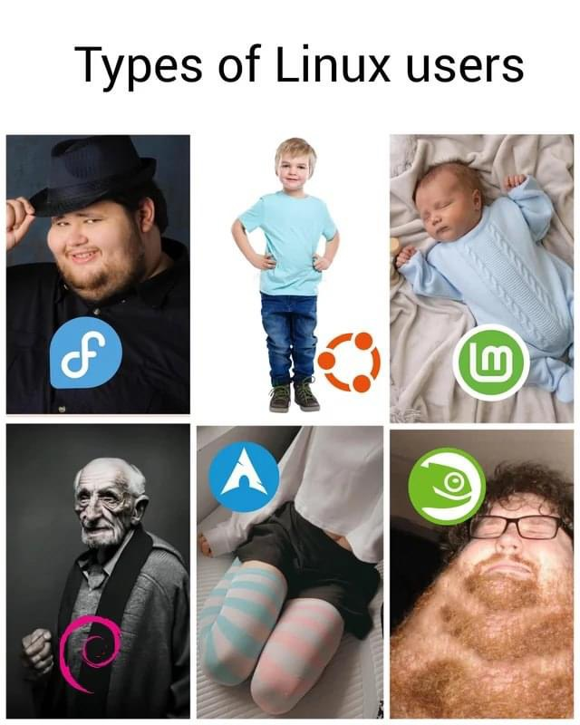

# Introductie

## Linux
Windows, gemaakt door Microsoft, is een bekend besturingssysteem dat meestal wordt gebruikt op desktopcomputers, maar er zijn ook andere alternatieven. Enkele van de meer populaire zijn MacOSX, ChromeOS en, natuurlijk, Linux. Linux, met desktopomgeving, is minder prominent aanwezig dan de andere.

In server / IOT / mobiele omgevingen vond er een zekere verschuiving in gebruikte besturingssysteem plaats. Linux is een van de meest populaire besturingssystemen in deze markten. Enkele interessante uitspraken:
* [De meeste supercomputers draaien op Linux](https://www.top500.org/statistics/details/osfam/1/)
* [111+ Linux statistieken en feiten – Linux Rocks!](https://webtribunal.net/blog/linux-statistics/)
* [De populairste cloudinfrastructuurproviders gebruiken Linux](https://www.linuxfoundation.org/blog/how-amazon-web-services-uses-linux-and-open-source/)

Linux wordt gebruikt in smartphones, (web)servers, tablets, IoT-apparaten, slimme wasmachines, zelfrijdende auto's, modems, routers, PlayStations, ... Kortom: Linux wordt veel meer gebruikt dan je in eerste instantie zou denken. Linux heeft zelfs zijn eigen mascotte, de pinguïn genaamd Tux! 

### Unix
Dennis Ritchie en Ken Thompson creëerden het Unix-besturingssysteem in 1969. De broncode van dit besturingssysteem werd destijds gedeeld. Na een tijdje besloot het bedrijf AT&T Bell Labs dat ze Unix commercieel wilden verkopen. BSD ontwikkelde tegelijkertijd het besturingssysteem verder onafhankelijk van Unix. Dit leidde tot volgende versies:
* Unix: De commerciële versie
* BSD Unix: De open source versie

In de jaren '80 waren er verschillende versies van Unix. Omdat Unix werd gecommercialiseerd (AT&T), werd de broncode van Unix herschreven: GNU project ("GNU is niet unix"). Het doel van GNU was de ontwikkeling van een open source besturingssysteem waar iedereen als gemeenschap aan kon werken. Het GNU-project miste wel een kernel.

### Linux
Een student, genaamd Linus Torvalds, maakte in de jaren '90 een bericht in een nieuwsgroep over zijn eigen besturingssysteem: 

We gebruiken vandaag de dag nog steeds de Linux kernel. De kernel wordt elke dag nog verder ontwikkeld. 

* [De geschiedenis van Linux - Tijdlijn 1](https://en.wikipedia.org/wiki/Linux#/media/File:Unix_timeline.en.svg)  
* [De geschiedenis van Linux - Tijdlijn 2](https://www.linuxbe.com/images/linux_events30.jpg)  

#### Linux distributies
Linux-distributies (kortweg distro's) vereenvoudigen het proces van het installeren van gnu/linux en andere apps op je computer. Bekende distro's zijn Ubuntu, RedHat, Fedora, CentOS, Debian, Archlinux en Oracle Linux. Omdat linux erg schaalbaar is, zijn er ook speciale distro's voor bepaalde doelen, bijvoorbeeld clonezilla. 

<i class="fa-solid fa-film"></i> [Unix vs Linux (Eerste 10:30 minuten)](https://www.youtube.com/watch?v=jowCUo_UGts)  

<i class="fa-solid fa-film"></i>  [Wat is linux?](https://www.youtube.com/watch?v=zA3vmx0GaO8)

<i class="fa-solid fa-earth-europe"></i> [High level overview Linux](https://www.linux.com/what-is-linux/)

<i class="fa-solid fa-earth-europe"></i> [Meest populaire linux distros](https://distrowatch.com/dwres.php?resource=popularity)
