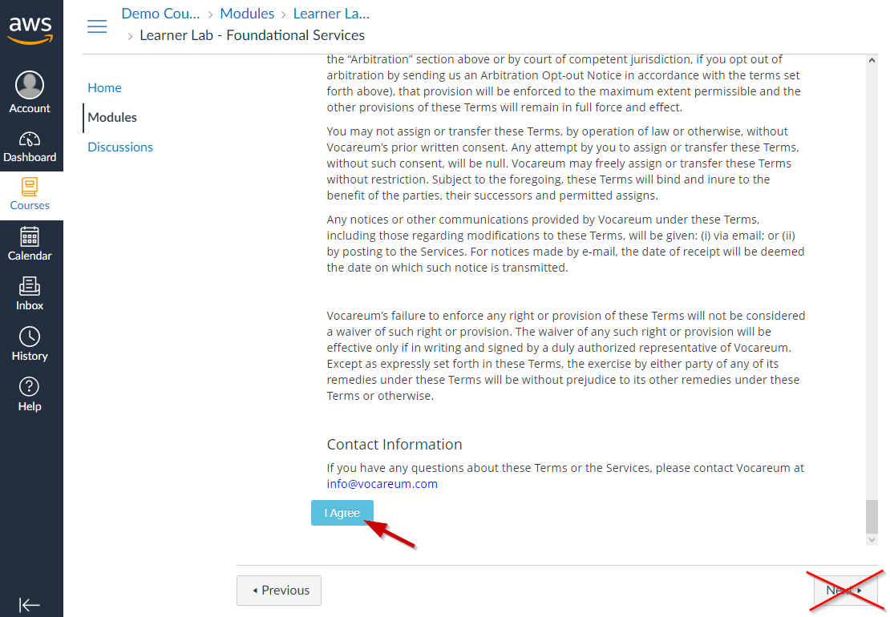
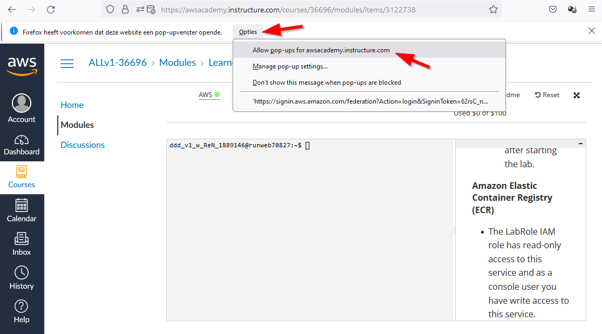

# Lab <!-- {docsify-ignore} -->
### Intro

In deze cursus volgen we Linus. Linus is eerstejaars informaticastudent aan de hogeschool PXL. Zijn hobby's zijn muziek maken, uitgaan en gamen. 

Hij kocht onlangs Minecraft, een zeer populaire sandbox-game. Hij heeft uren doorgebracht in zijn eigen offline wereld en beschouwt zichzelf als een Minecraft-meester. Zijn vrienden willen het spel ook spelen en ze delen vaak verhalen over hun avonturen en bouwwerken.  

Ze hebben allemaal naar Twitch gekeken, waar ze merkten dat streamers vaak samen spelen in een gedeelde wereld. Geïntrigeerd door het idee van een gedeelde wereld, zoekt Linus naar opties om zelf een van die werelden te hosten. Hij leest online dat hij een *minecraft server* nodig heeft. Dit is een computer die de wereld host en naar waar alle spelers kunnen verbinden met behulp van het internet. 

Dit is *precies* wat Linus zoekt. Na wat onderzoek komt hij erachter dat het opzetten van zo'n server geen gemakkelijke taak is. Hij leest over allerlei concepten zoals Linux, Unix, chmod, apt, ... waar hij nog nooit van gehoord had. Hoe vastberaden Linus ook is, hij zal niet rusten voordat hij een minecraft-server genaamd *LinusCraft* heeft opgezet, zodat hij met zijn vrienden kan spelen. 

 

Hier begint ons verhaal. In deze cursus volgen we Linus in een reeks labs waar we nieuwe concepten zullen gebruiken en leren met als doel het opzetten en onderhouden van een minecraft-server.  Vooraleer hij deze minecraft-server opzet, wil hij ook de nodige reclame maken via een eigen webserver en website.

Voor de labs in deze cursus gebruiken we [Minetest](https://www.minetest.net/). Dit is een _open source_ project dat veel lijkt op het echte minecraft. Het voordeel van het gebruik van Minetest is dat het gratis is om te spelen en verschillende besturingssystemen ondersteund.

### Cursus-uitnodigings-mail

Linus wil gebruik maken van de Cloud om zijn server te hosten. Hij zal gebruik maken van Amazon Web Services.

Om de labs af te werken dienen we eerst ons account voor AWS in orde te brengen.  Via de school krijg je gratis toegang tot AWS Cloud via de AWS Academy.

Normaal gezien heb je een *Course Invitation mail* ontvangen van *AWS Academy*.

Klik op *Get Started*.

Er opent een Webbrowser met de mogelijkheid om in te schrijven voor de *Cursus*.

Klik op *Create My Account*.

Maak een veilig wachtwoord en kies als Time Zone *Brussels*. Vink *I agree … Policy*  aan en klik op *Register*.

Nu kom je terecht in de *Cursus*.

### Bijnaam en kleur wijzigen van de Cursus

Klik op *Dashboard* en vervolgens op het *Hamburgermenu* van de Cursus om de *Bijnaam* en de *kleur* aan te passen.

### **Openen van een bepaalde Cursus**

Kan ofwel via het *Dashboard*, ofwel via *Cursussen*.

Via het *Dashboard*.

Via *Cursussen*.

Via *Cursussen* en vervolgens *Alle cursussen*.

### **Inloggen als Student op Canvas**

Als je in de toekomst opnieuw wilt inloggen op de cursus surf je naar 

https://awsacademy.instructure.com/ 

Dit linkt door naar [https://www.awsacademy.com/LMS_Login](https://www.awsacademy.com/vforcesite/LMS_Login) 

Klik op *Student Login*.

Geef je *PXL email adres* als login en je *wachtwoord*.

Vink *Aangemeld blijven* aan en klik op *Aanmelden*.

Je bent nu ingelogd.

### **Starten van het Lab (via Vocareum)**

Opgelet!  Je zal telkens je gebruik wilt maken van AWS Cloud in je cursus moeten gaan en vervolgens op *Courses,* dan *Modules* en als laatste *Learner Lab* moeten klikken.

Ga in de juiste Class.

Klik in de Class op *Modules* en vervolgens op *Learner Lab*.

De eerste keer moet je de License Agreement goedkeuren. *Scroll* naar onder en klik **niet** op *Next*.

Klik op *I Agree* en **niet** op *Next*.

Klik op *Start Lab* en **niet** op *Next*.

Het *Lab* wordt gestart. Dit duurt wel enkele minuten. Van zodra het lab volledig is opgestart zien we een groen bolletje achter *AWS* 

Er loopt nu ook een klok achter AWS. Deze geeft aan hoelang de servers nog *up and running* zullen zijn. Het begint af te tellen vanaf vier uur resterend. Je kan altijd opnieuw op Start Lab klikken om de timer opnieuw op vier uur te zetten.

Na vier uur worden de servers afgesloten, maar kunnen op een later tijdstip gewoon opnieuw worden opgestart door opnieuw op *Start Lab* te klikken.

Tevens zien we hoeveel er reeds van onze $100 ($50 in de toekomst) is gespendeerd. Dit kan wel een vertraging hebben van een 8-tal uur.

Opgelet! Van zodra als je het volledige $geld hebt opgebruikt zal je niets meer kunnen doen op het Cloudplatform.

Klik op *AWS* om naar het *AWS Cloudplatform* te gaan.

Indien er geen nieuw tabblad wordt geopend, wordt dit geblokkeerd door je webbrowser. Je dient dit dan toe te laten voor deze website. Hieronder een voorbeeld met de Firefox-webbrowser.

Klik op *Accept all cookies* en op *Next*.

We zijn klaar om te beginnen werken.

Een aantal van deze *MenuItems* zullen we in deze cursus gaan gebruiken.

# **Vocareum AWS Details**

De grijze kader met Interface is een terminal venster en kan gebruikt worden om bijvoorbeeld AWS CLI commando's of python code (via een AWS SDK) af te vuren. Of met SSH te verbinden naar je Instances (=Servers)

Bovenaan vinden we ook nog wat nuttige knoppen. Hieronder een overzicht

**AWS** 			: Door op deze tekst te klikken navigeren we naar de AWS Management 
			 	  Console. Het is via deze interface dat we een Cloud Infrastructuur 
			 	  kunnen gaan opzetten. Tip! Indien er geen nieuw tabblad wordt 
 			 	  geopend dien je bovenaan het venster te klikken op de tekst om *Popups* 
 			 	  toe te laten

**Used $0 of $100**	: Hoeveel budget je reeds hebt opgebruikt. Opgelet! Dit wordt maar om 
 			 	  de 8 à 12 uur geupdated

**03:39**			: Resterende tijd totdat de Cloud-infrastructuur wordt down gebracht. Je 
			 	  kan nadien opnieuw op *Start Lab* klikken om de infra weer op te starten.
 			 	  Tip! Je kan op ieder moment opnieuw op *Start Lab* klikken om de timer 
 			 	  opnieuw op vier uur te brengen

**Start Lab**		: Om de Cloud Infrastructuur (opnieuw) op te starten. Sommige services 
 			 	  zullen wel handmatig opnieuw moeten worden opgestart

**End Lab**		: Om de Cloud Infrastructuur down te brengen. Je kan deze nadien 
			 	  opnieuw opstarten met *Start Lab*

**AWS Details**		: Toont hoelang de Cloud infrastructuur nu en in het totaal heeft 
 			 	  gedraaid. Geeft ook de gelegenheid om je persoonlijke SSH keys te
 			 	  bekijken/downloaden

**Readme** 		: Bevat linken naar paginas met uitleg over de werking van het *AWS Cloud Platform*

**Reset**			: Alles op AWS onder je account (=gekoppeld aan deze course) wordt 
 			 	  gereset. Met andere woorden wordt alles wat je ooit gedaan hebt op 
			 	   AWS onder dit account verwijderd. Je krijgt wel geen gespendeerd 
 			 	  budget terug.

**⤱ <maximize>**	: Om het Vocareum venster te maximaliseren. Om dit ongedaan te maken
			 	  druk je op de *Esc* toets

