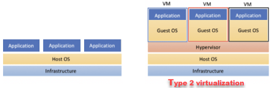
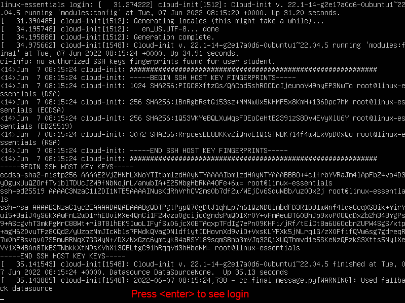

# Installatie

## Virtualisatie
Om servers te installeren die diensten aanbieden (zoals een minecraft server!) heb je een server nodig met een openbaar IP-adres. Meestal zou je naar een cloudprovider gaan waar je voor een vast bedrag/maand een server kunt huren. Voor deze cursus zullen we dit proces ook simuleren met behulp van een lokale virtuele machine.  Dit kan ons dan ook helpen voor wanneer we eens geen Internet-connectie hebben bijvoorbeeld.

Virtualisatie is een concept waarbij je een computersysteem met een besturingssysteem virtueel op een ander systeem kunt laten draaien. Dit maakt het mogelijk om meerdere _gast besturingssystemen_ met hun eigen virtuele hardware op één _host system_ te hebben. 



In deze cursus zullen we dus een lokale Virtuele Machine installeren als backup voor een Cloud instance waarin we normaal gezien zullen werken.


## Ubuntu Server Image

Voor deze cursus willen we het besturingssysteem [Ubuntu-server](https://ubuntu.com/download/server) gebruiken en installeren in een virtuele omgeving. Dit is een  op Debian gebaseerde distro. 

?> :fa-solid fa-list-check: _Download het `.iso` bestand voor Ubuntu server met behulp van [deze link](https://ubuntu.com/download/server). Een `.iso` bestand is een exacte kopie van een CD/DVD. Je gebruikt dit later om het besturingssysteem in de virtuele machine te installeren._


## Virtualisatie software 
Om virtualisatie te gebruiken zijn er verschillende opties. De meest voorkomende virtualisatiesoftware is: 
- VMware Workstation
- Virtualbox 
- Hyper-V 

In deze cursus zullen we VMware Workstation gebruiken en ondersteunen, maar de andere softwarepakketten hebben hetzelfde doel. 

## Een nieuwe VM maken 
Om een nieuwe virtuele machine (VM) aan te maken in VMWare ga je naar het menu `File`>`New Virtual Machine`. De wizard om een nieuwe VM te maken wordt weergegeven. 

 

In het eerste scherm selecteren we de optie `Typical`: 

 

Vervolgens kiezen we voor `I will install the operating system later`: 

 

Vervolgens kiezen we voor het besturingssysteem `Linux`. In de versie dropdown selecteren we `Ubuntu 64 bit`. Dit is de Linux-distributie die we tijdens deze cursus zullen gebruiken. 

 

In het volgende scherm geven we de virtuele machine een naam. Je kunt ook een andere map opgeven om de virtuele machine op je computer op te slaan.  

?> <i class="fa fa-exclamation-circle" style="font-size:48px;color:red"></i> Let op dat je de bestanden van de VM niet opslaat in een map die gesynced wordt met de cloud (OneDrive, Dropbox, Google Drive)?. Je VM zal crashen en je zal alles in de VM kwijt zijn!

 

In het volgende scherm configureren we de grootte van de virtuele harde schijf voor de VM. We zullen een schijf maken met 20 GB opslag. We kunnen dit later uitbreiden als dat nodig is: 

 

We moeten op `Customize Hardware` klikken om de virtuele machine verder te configureren: 

 

We moeten nog steeds het ISO-bestand van de Ubuntu-server koppelen aan het virtuele cd-rom-station. Dit doen we door `New CD/DVD` te selecteren en naar het gedownloade `iso` bestand te bladeren: 

 

Klik op `Finish` en de virtuele machine wordt gemaakt. 

 

We kunnen nu de UEFI bios nog instellen. Klik hiervoor op `Edit virtual machine settings`. 

 

Ga naar het tabblad `Options`, klik op `Advanced` en selecteer de optie `UEFI`. Hier vind je ook de instelling omtrent `Side channel mitigations` zou je daar straks een waarschuwing van krijgen tijdens het starten van de Virtuele Machine. 

 

Je kunt de VM nu opstarten door op het groene pijltje te klikken. Hiermee wordt de virtuele machine opgestart en wordt het installatieproces uitgevoerd. 

 

## Installatie Ubuntu-server 
Zoals eerder beschreven zullen we de distro Ubuntu gebruiken. Na het maken en opstarten van de virtuele machine is er een installatieproces dat we moeten doorlopen. Je zal merken dat er geen muisaanwijzer beschikbaar is. We gebruiken de pijltjestoetsen en enter om door de stappen te navigeren. 

?> <i class="fa-solid fa-circle-info"></i> Resulteert het opstarten van de VM in de fout `This host supports Intel VT-x, but Intel VT-x is diabled`? Dan moet je de VT-X-optie activeren in de BIOS van je laptop. Meer informatie is te vinden in [dit artikel](https://www.qtithow.com/2020/12/fix-error-this-host-supports-Intel-VT-x.html). 

?> <i class="fa-solid fa-circle-info"></i> Als je je VM wilt verlaten en je muis terug wilt krijgen in het besturingssysteem van je laptop (=Windows), moet je op `CTRL + ALT` drukken! 

We maken de keuze om Ubuntu te proberen of te installeren: 


We starten het installatieproces door een taal te selecteren. We kiezen voor Engels: 


We slaan de update van het installatieprogramma over indien je dit schermpje krijgt: 


Kies de juiste toetsenbordindeling. Voor `azerty` selecteert je `Belgian`: 


In de volgende 7 stappen brengen we geen wijzigingen aan. We drukken gewoon op `Done` of `Continue` : 


Vervolgens maken we een gebruikersaccount aan dat we gebruiken om in te loggen op het besturingssysteem. We gebruiken de volgende inloggegevens: 
``` 
Gebruikersnaam: student 
Servernaam: ubserv 
wachtwoord: pxl 
```

  

Op de vraag om te upgraden naar Ubuntu Pro behouden we het antwoord `Skip for now`

  


Als extra pakket kiezen we er voor om enkel `OpenSSH server` te installeren: 


Het besturingssysteem wordt geïnstalleerd en geconfigureerd. Na een tijdje verschijnt de optie `Reboot now`. Dit geeft aan dat de installatie is voltooid: 


Vervolgens zien we een venster dat vraagt om de 'enter'-toets te drukken, maar eerst gaan we in de settings van de Virtuele Machine :


Daar vinken we uit dat de CD/DVD moet geconnecteerd worden bij het opstarten (anders blijft de installatie laden telkens we de Virtuele Machine opstarten)


En dan drukken we op de 'enter'-toets


Zodra de server opnieuw is opgestart, moet je nogmaals op de `entertoets` drukken om de inlogprompt te zien. 



Je kan nu inloggen en beginnen werken op de server. Achter login type je `student` en druk je enter. Vervolgens type je je wachtwoord (je ziet niet wat je intypt) en drukt op enter.


