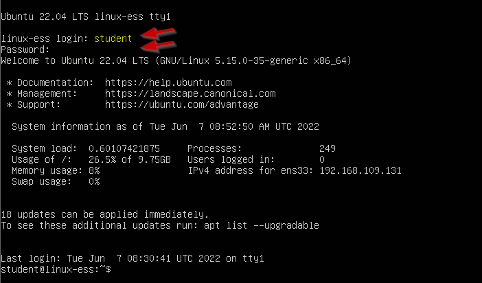

# Command line interface 
Bij het opstarten van de virtuele machine wordt alleen een zwart scherm weergegeven met wat witte tekst: 
 

Je zal merken dat er geen muisaanwijzer beschikbaar is. We gebruiken alleen maar ons toetsenbord als invoerapparaat. Deze omgeving wordt een _command line interface (CLI)_ genoemd. Er is geen _graphical user interface (GUI)_ aanwezig in Ubuntu-server. Een van de redenen waarom ze hiervoor hebben gekozen, is omdat het hebben van geen GUI systeembronnen bespaart en het aanvalsoppervlak verkleint. Een CLI is ook bewezen een zeer efficiënte en betrouwbare manier van werken met een besturingssysteem en zijn diensten te zijn. 

?>Je kunt inloggen met je gebruikersnaam `student` en het wachtwoord dat je hebt ingesteld `pxl`. Merk op dat je niet ziet wat je typt voor het wachtwoord. Typ gewoon het wachtwoord in en druk op `enter`. 

CLIs zullen interessanter worden in het deel automatisering, iets dat moeilijker is bij het gebruik van een GUI. We kunnen deze trend ook zien in Windows-systemen, waar _Powershell_ steeds populairder wordt om Windows-servers te configureren en automatiseringstaken uit te voeren. 

## De prompt 
Na het inloggen krijgt je de volgende regel in de CLI te zien. Dit wordt de _prompt_ genoemd: 
 

De prompt bestaat uit meerdere onderdelen die ons meer informatie geven over het systeem dat we gebruiken. We zien informatie over onze gebruiker en de hostnaam van de server waarop we zijn ingelogd. 

Het `~` symbool is een afkorting van de homefolder van de ingelogde gebruiker (in ons geval de map `/home/student`). We zullen in een later hoofdstuk meer te weten komen over paden en mappen. Voor nu kun je dit vergelijken met het pad `C:\Users\student` in Windows. Dus wat we eigenlijk zien tussen de `:` en het `$` teken is een pad dat verwijst naar de map waarin we momenteel werken. 

<i class="fa-solid fa-earth-europe"></i> [Linux prompt definitie](http://www.linfo.org/prompt.html#:~:text=A%20commd%20prompt%2C%20also%20referred,terminal%20window%20by%20a%20shell.) 


 

## commando's, argumenten en opties 
Wanneer je iets typt met behulp van het toetsenbord, verschijnt de invoer na het `$`-teken. Het `$`-teken geeft het einde van de prompt en het begin van de invoer van de gebruiker (= een commando/opdracht) aan. Om het besturingssysteem te gebruiken met behulp van een CLI, zullen we commando's moeten gebruiken. Het eerste commando dat we zullen gebruiken is het `echo` commando: 
```bash 
echo hello world 
```
De string `hello world` wordt beschouwd als een _argument_ van het `echo` commando. Deze opdracht drukt gewoon het argument af dat we geven. 

Het tweede commando dat we zullen leren gebruiken is het `shutdown` commando: 
```bash 
sudo shutdown now 
``` 
Met deze opdracht wordt de Ubuntu-servermachine afgesloten. Dit is ook de correcte manier om de virtuele machine af te sluiten! Het `sudo` commando staat voor _super user do_. Voor sommige opdrachten zijn beheerdersrechten vereist. Door het commando `sudo` vooraan toe te voegen, voer je dit commando uit als de _super user_. Deze gebruiker wordt in Linux _root_ genoemd (vergeleken met de administrator-gebruiker in Windows). Het voorbeeld bestaat eigenlijk uit 2 commando's. Het `sudo` commando gevolgd door het `shutdown` commando. Het commando `shutdown` gebruikt _de parameter_ `now`. 

Commando's hebben vaak allerlei opties (beginnend met een koppelteken (-)) en paramaters (gescheiden door spaties) om de functionaliteit van een commando uit te breiden. Het commando `shutdown` neemt een (optionele) waarde die definieert wanneer de server daadwerkelijk moet worden afgesloten. Als er geen waarde wordt gegeven, wordt de afsluittaak 1 minuut na het uitvoeren van de opdracht gepland. Laten we eens kijken naar enkele andere opties met het commando `man shutdown`: 
```bash
SHUTDOWN(8)                                            shutdown                                           SHUTDOWN(8)

NAME
       shutdown - Halt, power-off or reboot the machine

SYNOPSIS
       shutdown [OPTIONS...] [TIME] [WALL...]

DESCRIPTION
       ...

OPTIONS
       The following options are understood:

       --help
           Print a short help text and exit.
       -H, --halt
           Halt the machine.
       -P, --poweroff
           Power-off the machine (the default).
       -r, --reboot
           Reboot the machine.
       -h
           Equivalent to --poweroff, unless --halt is specified.
       -k
           Do not halt, power-off, reboot, just write wall message.
       --no-wall
           Do not send wall message before halt, power-off, reboot.
       -c
           Cancel a pending shutdown. This may be used to cancel the effect of an invocation of shutdown with a time
           argument that is not "+0" or "now".
```

Zoals je kan zien, heeft het commando `shutdown` veel opties die we kunnen gebruiken om de basisfunctionaliteit van het commando uit te breiden. 
Zo kunnen we bijvoorbeeld de optie meegeven om te herstarten met het commando `shutdown -r`.

Er zijn veel commando's met opties en ieder commando heeft zijn eigen set unieke opties. 

?> <i class="fa-solid fa-circle-info"></i> Alles in Linux is hoofdlettergevoelig: commando's, opties, argumenten, bestands- en mapnamen, ... <i class="fa-solid fa-earth-europe"></i>  
[Linux commandostructuur](https://uofabioinformaticshub.github.io/BASH-Intro/notes/extra_command_syntax.html) 

## manpages 
### man 
In Linux gebruiken we een CLI. Daarom zullen we met verschillende commando's moeten werken. Onze Ubuntu-installatie heeft allerlei ingebouwde commando's. Om commando's te vinden die we kunnen gebruiken zouden we Google kunnen gebruiken, maar het besturingssysteem zelf heeft ook informatie over alle geïnstalleerde commando's. Deze info is gebundeld in _manpages_ (afkorting voor manual pages). Je hebt toegang tot deze manpages via het commando `man`. 

Typ man gevolgd door een commando (waarvoor je hulp wilt) en begin met lezen: 
```bash
man shutdown
```
Niet alleen commando's hebben hun eigen manpage, configuratie-/systeembestanden kunnen ook een manpage hebben. De onderstaande opdracht toont de manpage van het bestand `sudo.conf`: 
```bash
man sudo.conf
``` 

?> <i class="fa-solid fa-circle-info"></i> manpages zijn behoorlijk groot en bestaan uit meerdere pagina's en/of secties. Om de volgende pagina in een manpage te bekijken kun je op de `spatiebalk` drukken of je kunt de `pijltjestoetsen` gebruiken. Manpages zijn vrij eenvoudig te doorzoeken. Typ gewoon `/` gevolgd door een zoekwoord. De manpage markeert het eerste voorkomen van dat zoekwoord. je kunt de sneltoets `n` (_next_) gebruiken om naar de volgende instantie van het zoekwoord te gaan. Het verlaten van een manpage kan worden gedaan door op de `q`-toets(_quit_) te drukken. Meer weten over manpages? Typ `man man`! 

Je kan als volgt zoeken in de beschrijving van geïnstalleerde commando's met behulp van de optie `-k` (of het commando apropos gebruiken): 
```bash
man -k shutdown                        or                  apropos shutdown
```

### manpage secties 
Soms wordt `man <sleutelwoord>` gebruikt om hulp te krijgen van een commando, maar het wordt ook gebruikt om de hulp te krijgen van een (configuratie)file, daemon, ... Dit is een probleem omdat `man <sleutelwoord>` de manpage moet openen die je zoekt. Wat als het sleutelwoord bestaat als een commando en als een configuratiebestand? Een perfect voorbeeld hiervan is `passwd`: 
```
student@linux-ess:~$ apropos passwd
...
passwd (1)           - change user password
passwd (1ssl)        - compute password hashes
passwd (5)           - the password file
```
Als we naar de bovenstaande uitvoer kijken, zien we 3 ```passwd``` items met verschillende nummers tussen de ronde haakjes. De getallen verwijzen naar de _secties_ van de manpage. Standaard opent het commando `man` de eerste sectie dat het vindt. In dit geval _sectie 1_, die informatie bevat over het commando `passwd`. We kunnen zien dat er ook een _sectie 5_ is die informatie bevat over het configuratiebestand `/etc/passwd`. We kunnen deze sectie openen door deze als volgt op te geven: 
```bash
man 5 passwd
```
Deze opdracht toont nu de manpage van het configuratiebestand in plaats van het commando `passwd`. 


### Handige manpage sneltoetsen
Je kan naar de eerste regel gaan door _g_ te typen. Om naar de laatste regel te gaan, moet je hoofdletter _G_ indrukken. 
Om hulp te krijgen kun je altijd op _h_ drukken. 

### Zoeken door een man pagina 
Je kan door een manpage zoeken door een schuine streep (/) te typen, gevolgd door een string (woord, letter, ...) en vervolgens op de enter-toets te drukken. 
Om naar de volgende overeenkomst te gaan, kan je op de letter _n_ drukken. Om naar de vorige overeenkomst te gaan, moet je op de hoofdletter _N_ drukken. 

?> <i class="fa-solid fa-circle-info"></i>Het is altijd een goed idee om eerst _g_ te typen om naar de eerste regel te gaan voordat je begint met zoeken! 

 
### whereis & whatis
We kunnen snel de beschrijving van een commando bekijken zonder de volledige manpage te openen met behulp van het commando `whatis`: 
```bash
student@linux-ess:~$ whatis route
route (8) - show / manipulate the IP routing table
```

Om de locatie van de manpage zelf te bekijken kunnen we het commando `whereis` gebruiken: 
```bash
student@linux-ess:~$ whereis -m ls
ls: /usr/share/man/man1/ls.1.gz
```
De manpages worden opgeslagen in archieven met een `.gz` extentie. Dit is vergelijkbaar met een `zip` bestand met tekstbestanden. Bij het typen van het commando `man ls` opent het eigenlijk het tekstbestand in het archief `/usr/share/man/man1/ls.1.gz`. 

## Shell geschiedenis 
Een command line interface in een Linux-omgevingen wordt een _shell_ genoemd. Een shell houdt vaak alle commando's bij die we in het verleden hebben gebruikt. Dit betekent dat we dit kunnen gebruiken om eerder gebruikte opdrachten eenvoudig te herhalen, te bewerken of op te zoeken. 

?> Probeer de toetsen `pijl omhoog` en `pijl omlaag` te gebruiken na het gebruik van enkele opdrachten. Je zal merken dat deze opdrachten na de prompt opnieuw verschijnen. 

Het herhalen van het laatste commando is ook heel eenvoudig. We kunnen `!!` (vaak aangeduid als _bang bang_) typen en dit zal het commando dat we het laatst hebben gebruikt opnieuw uitvoeren. We gebruiken het vaak wanneer we niet genoeg privileges hebben en we hetzelfde commando opnieuw willen uitvoeren met sudo: 
```bash
student@linux-ess:~$ cat /etc/shadow
cat: /etc/shadow: Permission denied
student@linux-ess:~$ sudo !!
sudo cat /etc/shadow
[sudo] password for student:
root:*:19103:0:99999:7:::
daemon:*:19103:0:99999:7:::
bin:*:19103:0:99999:7:::
...
usbmux:*:19150:0:99999:7:::
student:$6$2YcjTQ1OiAVeexi5$MgKJ3MAZBx5P2ZfGIkIjbYYLtcPjxKBVAJx.RnuzPn.EJk/rQgQqAXiiR3jMfq4sDn31e9k5HkuwwR5vKy/D.0:19150:0:99999:7:::
lxd:!:19150::::::
```
  
?> We zien in het voorbeeld hierboven dat we het commando `cat` kunnen gebruiken om de inhoud van een bestand te tonen!
  
?> Merk op dat het shadow bestand de wachtwoorden van de gebruikers bevat en alleen door root kan worden bekeken om veiligheidsredenen! 

Om de geschiedenis van onze laatst gebruikte commando's te bekijken kunnen we het commando  `history` gebruiken: 
```bash
student@linux-ess:~/linuscraft$ history 10
  257  ls
  258  pwd
  259  cd
  260  cd linuscraft
  261  mkdir testfolder
  262  rm -rf testfolder
  263  pwd
  264  ls /
  265  ls -alh /
  266  history 10
```
Het getal dat we als argument gebruiken, is het aantal commando's dat de uitvoer zal weergeven. We kunnen elk van deze opdrachten uitvoeren door de id te gebruiken die vóór de opdracht als volgt wordt vermeld: `!n`. Dus als je bijvoorbeeld `!261` uitvoert, wordt het commando `mkdir testfolder` uitgevoerd. 

?> Merk op dat in sommige distributies standaard opdrachtregels die beginnen met een spatie niet aan de geschiedenis worden toegevoegd. Als het commando identiek is aan het vorige commando, wordt het commando ook niet opgeslagen: 
```bash
student@linux-ess:~$ echo Start
Start
student@linux-ess:~$ echo "echo commando dat niet begint met een spatie"
echo echo commando dat niet begint met een spatie
student@linux-ess:~$ echo "echo commando dat niet begint met een spatie"
echo echo commando dat niet begint met een spatie
student@linux-ess:~$  echo "echo commando dat wel begint met een spatie"
echo echo commando dat wel begint met een spatie
student@linux-ess:~$ echo Einde
End
student@linux-ess:~$ history 4
  220  echo Start
  221  echo "echo commando dat niet begint met een spatie"
  222  echo Einde
  223  history 4
```

?> Het is een goede gewoonte om `CTRL-R` te gebruiken om een omgekeerde zoekopdracht (nieuwste naar oudste) door je geschiedenis te doen. Druk gewoon op `CTRL-R` en typ je zoekstring. Gebruik `CTRL-R` opnieuw om naar het volgende commando te zoeken. Gebruik de pijltoetsen om in de opdrachtregel te gaan en deze te wijzigen. Gebruik `CTRL-C` om af te sluiten en terug te gaan naar een lege opdrachtregel. Gebruik `enter` om het commando uit te voeren. 

## Extra cursusmateriaal <!-- {docsify-ignore} --> 

<i class="fa-solid fa-earth-europe"></i> [Linux manpages guide](https://itsfoss.com/linux-man-page-guide/) 

