## Lab <!-- {docsify-ignore} -->

In de volgende hoofdstukken installeert Linus een Webserver en Minetest Server. Voordat hij dat kan doen, moet hij een Linux-systeem in gebruik hebben. In dit lab zal hij een Linux Cloud Instance aanmaken op Amazon Web Services (AWS). Met deze infrastructuur opgezet zal hij in staat zijn om zijn Webserver en Minecraft Server op een later tijdstip te installeren, configureren en onderhouden. 

### Aanmaken van SSH keypair  

Vooraleer we de instance kunnen aanmaken hebben we een SSH keypair nodig om na creatie veilig te kunnen verbinden (= in te loggen) met deze instance.

Ga op *AWS* naar *EC2*.

Ga naar *Key Pairs* en maak een nieuwe aan

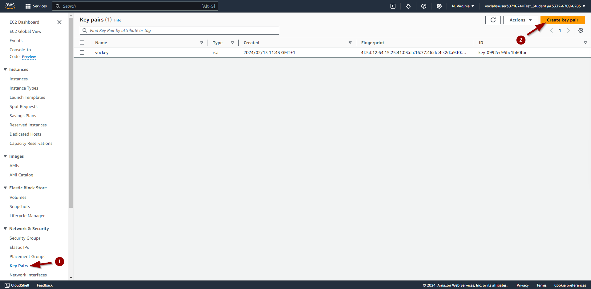

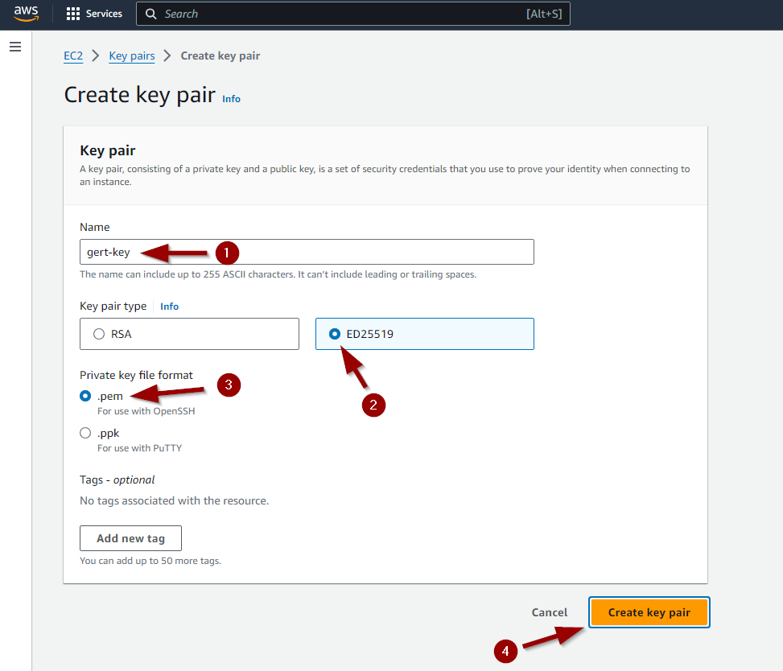

De private key zal automatisch gedownload worden door jouw browser naar het *Downloads*-mapje.

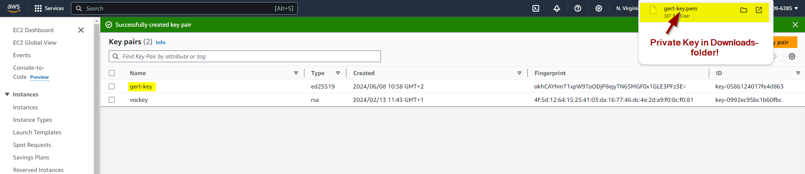

Verplaats deze key naar het mapje .ssh onder jouw account *"C:\Users\\<jouw loginnaam>"*. Indien nodig maak je dit mapje zelf aan.

### Aanmaken van de Cloud instance 

De Webserver en Minecraft Server draaien in een Linux Server Envrironment. Meer bepaald een Ubuntu Server.   

Ga op *AWS* naar *EC2*.

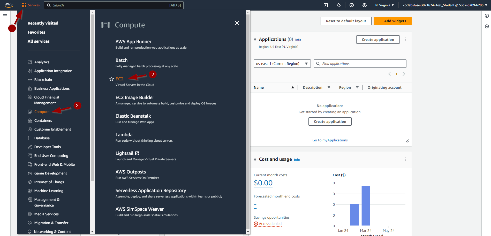

Zorg dat je je in de Regio *"N. Virginia"* bevindt en klik op *Launch instance*.

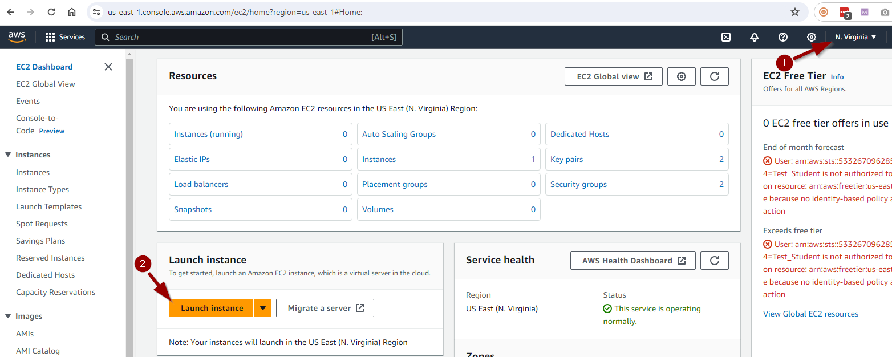

Vul de juiste gegevens in.

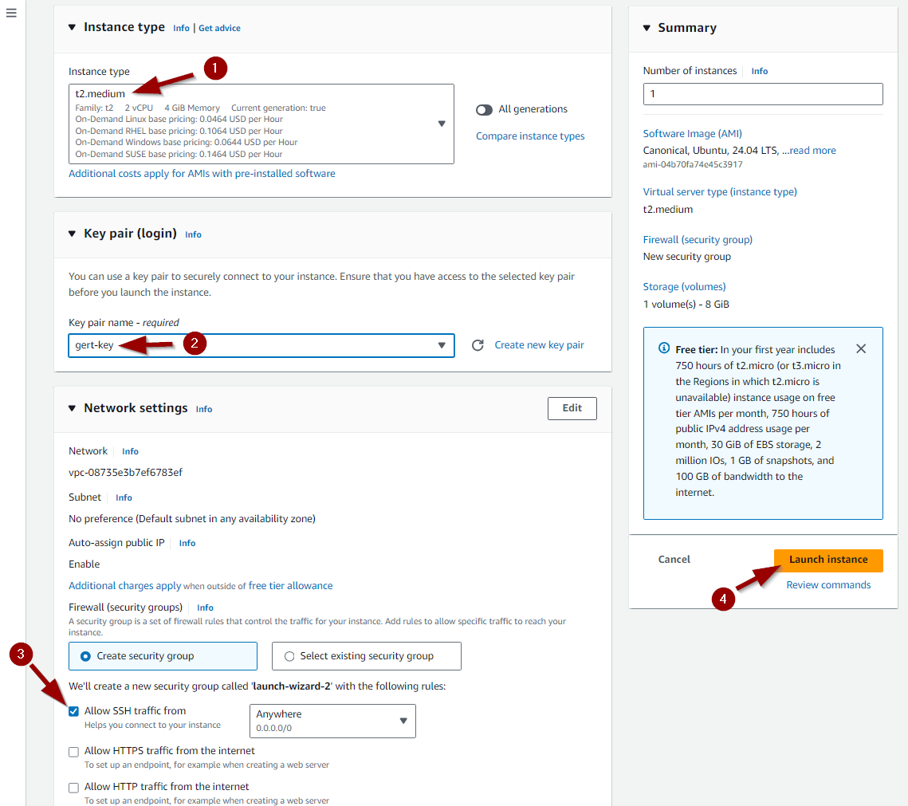

Je krijgt de melding dat de instance succesvol werd aangemaakt.

Na een tijdje verandert de status Pending ook naar Running om aan te geven dat de server ook succesvol is  opgestart.

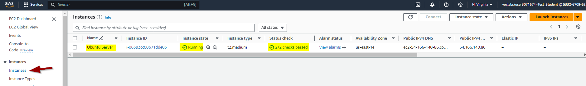

### Een vast IP-adres toekennen (Elastic IP)

Iedere keer dat we een instance herstarten zal deze een ander IP adres (en DNS naam) krijgen. 

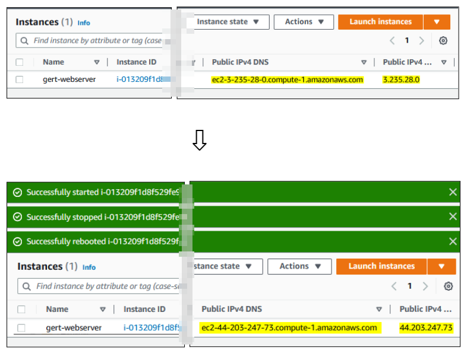

We gebruiken dit IP adres (of DNS naam) om te connecteren naar de server. Het is dus veel makkelijker indien de server hetzelfde IP adres (en DNS naam) zou houden in de toekomst. 

Om het veranderen van IP adres te voorkomen, zullen we de instance een Elastic (=static) IP moeten geven.

Ga op *AWS* naar *EC2*.

Klik op *Elastic IPs* en vervolgens op *Allocate Elastic IP address*.

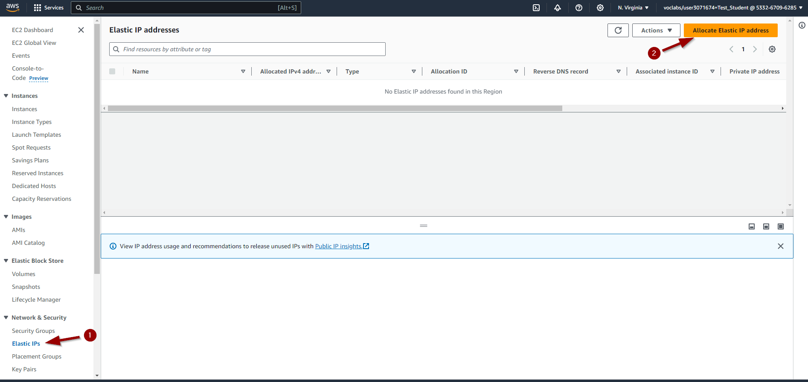

We maken een nieuw Elastic IP aan door op *Allocate* te klikken.

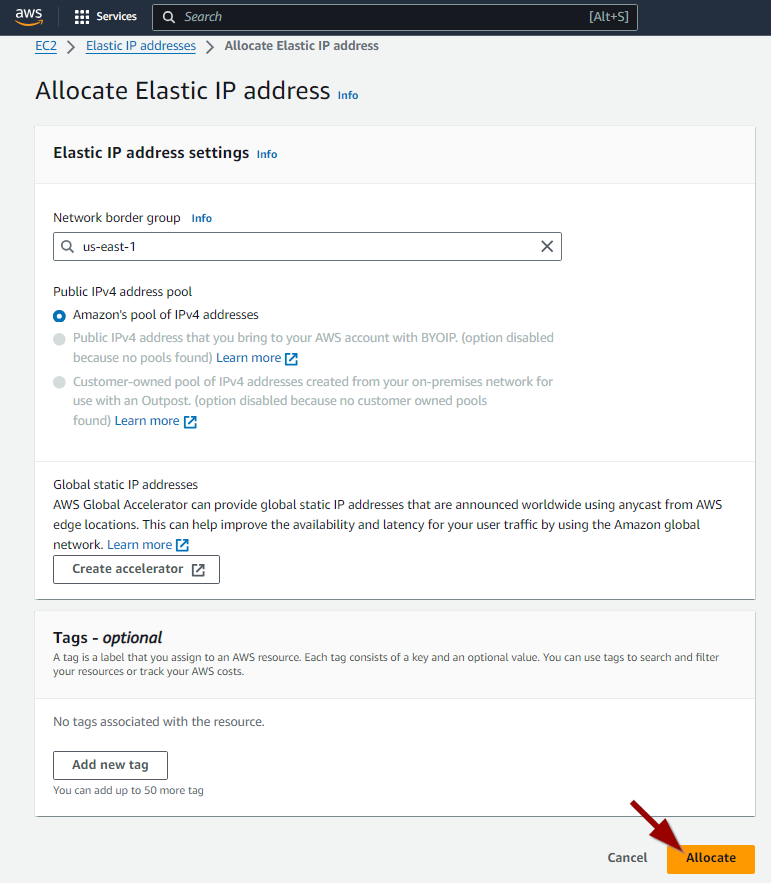

Klik op *Actions* en vervolgens op *Associate Elastic IP address*.

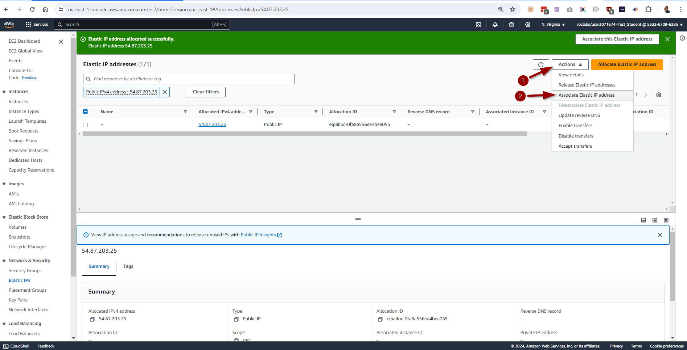

Selecteer de *Instance* waar dit Elastic IP adres aan gekoppeld moet worden en klik op *Associate*.

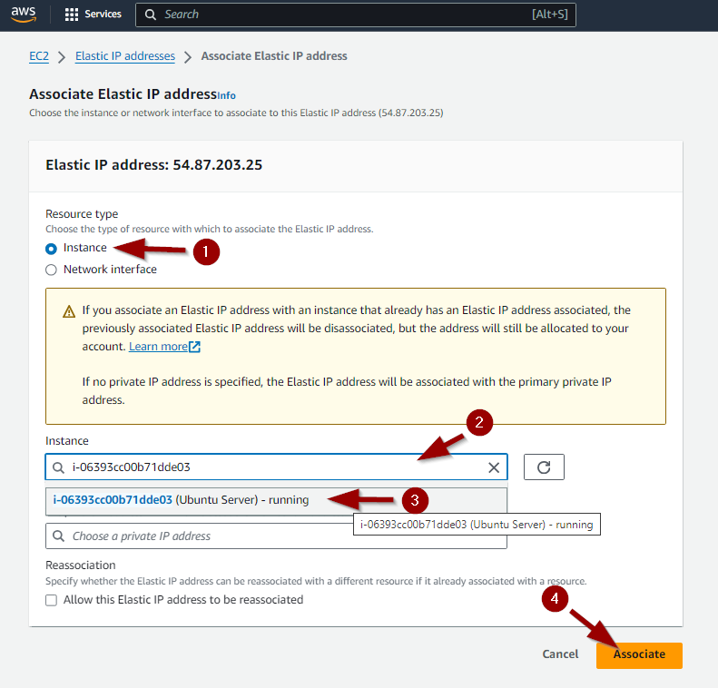

Het Elastic IP adres is succesvol gekoppeld aan onze server instance.

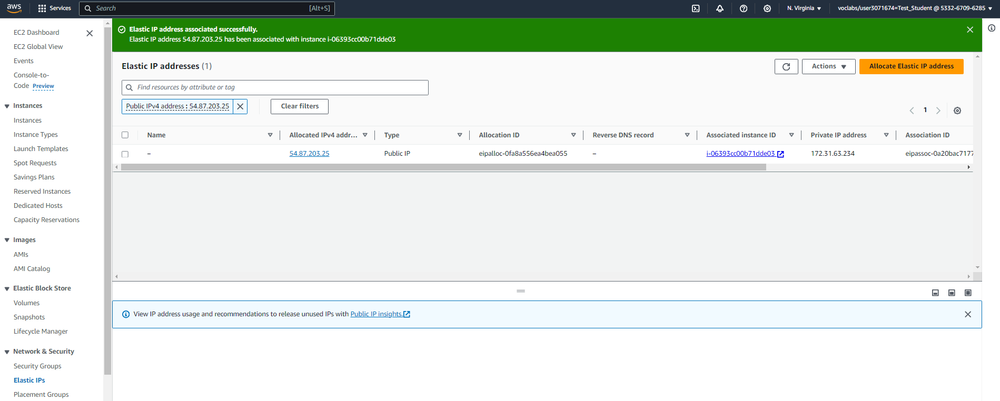

We zien dat dit gelukt is als we opnieuw naar de Instance gaan kijken. Wanneer we nu de instance gaan stoppen en nadien opnieuw starten, dan zal het IP adres en bijhorende DNS naam hetzelfde blijven.

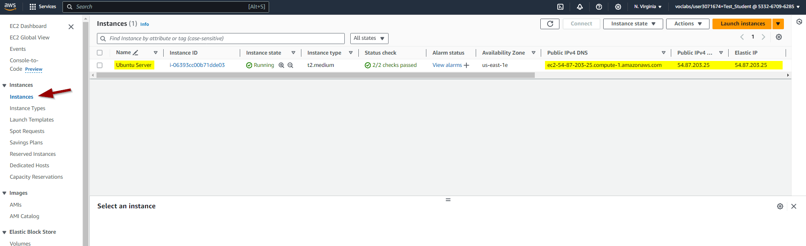

### Connecteren naar de Cloud instance

Om op de server instance te werken gaan we best over SSH een connectie starten vanop onze laptop. Om de gegevens die hiervoor nodig zijn op te vragen doen we het volgende.

Klik *Instances*. Selecteer vervolgens de server-instance en klik op *Connect*.

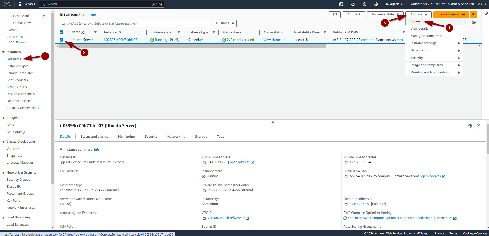

AWS stelt een SSH-commando voor met een bepaalde key. 
Maar let op, onze key op de laptop kan anders noemen als je andere stappen hebt gevolgd tijdens het aanmaken van het SSH-keypair of indien je reeds een keypair had.

We starten een Powershell of Windows Terminal en plakken het commando, maar passen indien nodig de naam van onze key aan.

Plakken kan in een Powershell venster door op de rechtermuisknop te klikken.

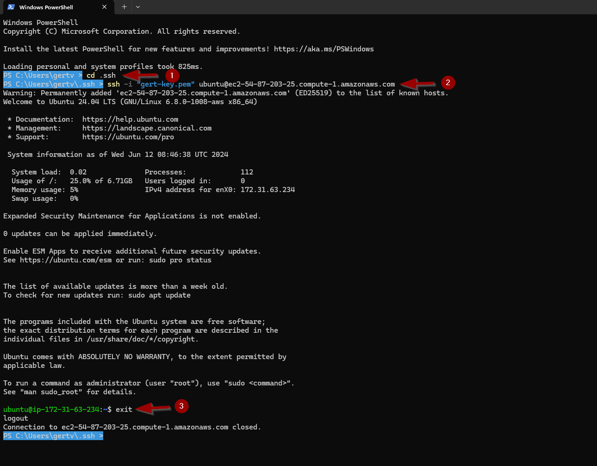

Zoals je in vorige screenshot kan zien zijn we dan ingelogd op de server. Indien je de connectie wenst te verlaten kan je het commando *exit* of *logout* geven.

Als wijze van oefening start je opnieuw een ssh-sessie met de instance en pas je de *naam* van de server aan naar *linux-ess* met het commando:

***sudo hostnamectl set-hostname linux-ess***

