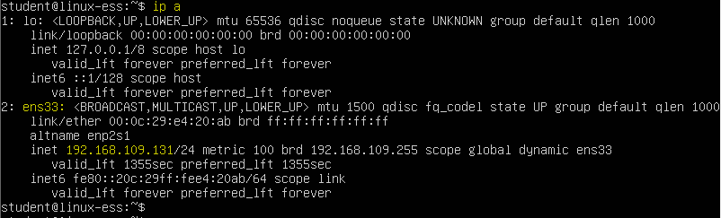
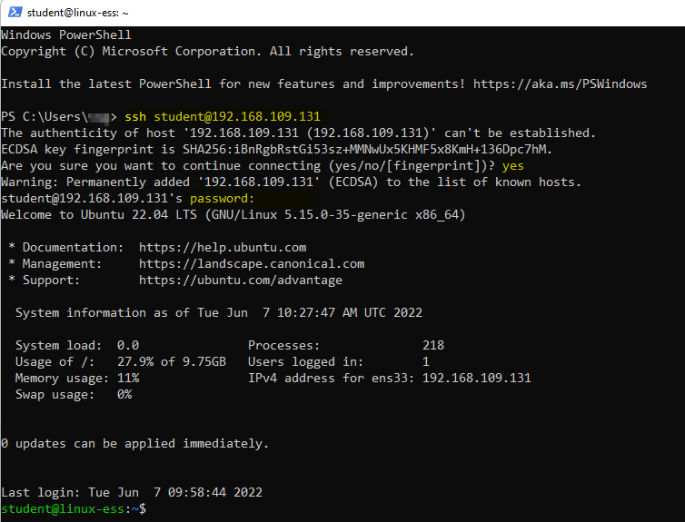

# Lab <!-- {docsify-ignore} -->


## Een SSH-verbinding instellen naar je Virtuele Machine van VMware Workstation

Linus probeert verbinding te maken met zijn server via SSH. De procedure is als volgt: 

*Eerst* moet hij het IP-adres van de server krijgen. Hij typt `ip a` en zoekt naar het IP-adres van de netwerkinterface (ens33) 
```bash
ip a
```


<br />

*Als tweede* besluit hij Powershell te openen en een ssh-verbinding met de server te maken. Hij werkt nu vanaf zijn desktop aan de server. Cool, nietwaar? 
```bash
ssh student@<server-ip>
```


<br />

Zoals je kunt zien krijgt hij nu een prompt new prompt. Dit is een shell op zijn Ubuntu-server die in VMWare draait. Het idee klinkt misschien raar omdat hij de virtuele machine met een CLI op zijn laptop heeft draaien. Maar stel je een scenario voor waarin de virtuele machine niet op zijn laptop zou draaien, maar in plaats daarvan ergens op Amazon-webservices in de cloud zou worden gehost. Hij zou het `ssh user@server-ip`-commando op zijn apparaat gebruiken om verbinding te maken met die server. 

Je kan ervoor kiezen om te blijven werken met behulp van het commando `ssh` in Powershell of terug te gaan naar je VM in de interface van VMware Workstation.