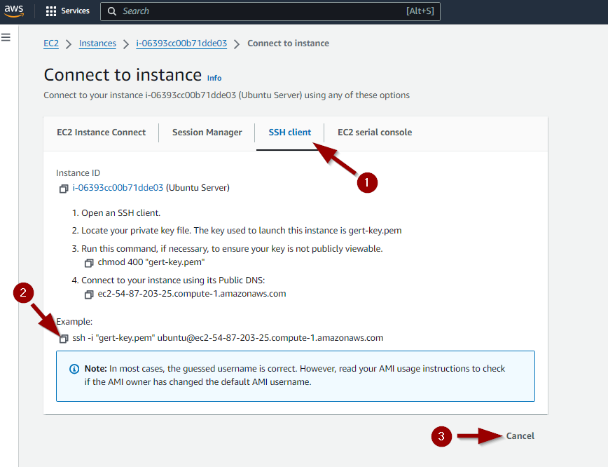

## Lab <!-- {docsify-ignore} -->

In de volgende hoofdstukken installeert Linus een Webserver en Minetest Server. Voordat hij dat kan doen, moet hij een Linux-systeem in gebruik hebben. In dit lab zal hij een Linux Cloud Instance aanmaken op Amazon Web Services (AWS). Met deze infrastructuur opgezet zal hij in staat zijn om zijn Webserver en Minecraft Server op een later tijdstip te installeren, configureren en onderhouden. 

### Aanmaken van SSH keypair  

Vooraleer we de instance kunnen aanmaken hebben we een SSH keypair nodig om na creatie veilig te kunnen verbinden (= in te loggen) met deze instance.

Ga op *AWS* naar *EC2*.


Ga naar *Key Pairs* en maak een nieuwe aan


De private key zal automatisch gedownload worden door jouw browser naar het *Downloads*-mapje.


Verplaats deze key naar het mapje .ssh onder jouw account *"C:\Users\\<jouw loginnaam>"*. Indien nodig maak je dit mapje zelf aan.


### Aanmaken van de Cloud instance 

De Webserver en Minecraft Server draaien in een Linux Server Envrironment. Meer bepaald een Ubuntu Server.   

Ga op *AWS* naar *EC2*.


Zorg dat je je in de Regio *"N. Virginia"* bevindt en klik op *Launch instance*.


Vul de juiste gegevens in.


Je krijgt de melding dat de instance succesvol werd aangemaakt.


Na een tijdje verandert de status Pending ook naar Running om aan te geven dat de server ook succesvol is  opgestart.


### Een vast IP-adres toekennen (Elastic IP)

Iedere keer dat we een instance herstarten zal deze een ander IP adres (en DNS naam) krijgen. 


We gebruiken dit IP adres (of DNS naam) om te connecteren naar de server. Het is dus veel makkelijker indien de server hetzelfde IP adres (en DNS naam) zou houden in de toekomst. 

Om het veranderen van IP adres te voorkomen, zullen we de instance een Elastic (=static) IP moeten geven.

Ga op *AWS* naar *EC2*.


Klik op *Elastic IPs* en vervolgens op *Allocate Elastic IP address*.


We maken een nieuw Elastic IP aan door op *Allocate* te klikken.


Klik op *Actions* en vervolgens op *Associate Elastic IP address*.


Selecteer de *Instance* waar dit Elastic IP adres aan gekoppeld moet worden en klik op *Associate*.


Het Elastic IP adres is succesvol gekoppeld aan onze server instance.


We zien dat dit gelukt is als we opnieuw naar de Instance gaan kijken. Wanneer we nu de instance gaan stoppen en nadien opnieuw starten, dan zal het IP adres en bijhorende DNS naam hetzelfde blijven.


### Connecteren naar de Cloud instance

Om op de server instance te werken gaan we best over SSH een connectie starten vanop onze laptop. Om de gegevens die hiervoor nodig zijn op te vragen doen we het volgende.

Klik *Instances*. Selecteer vervolgens de server-instance en klik op *Connect*.


AWS stelt een SSH-commando voor met een bepaalde key. 
Maar let op, onze key op de laptop kan anders noemen als je andere stappen hebt gevolgd tijdens het aanmaken van het SSH-keypair of indien je reeds een keypair had.




We starten een Powershell of Windows Terminal en plakken het commando, maar passen indien nodig de naam van onze key aan.

Plakken kan in een Powershell venster door op de rechtermuisknop te klikken.


Zoals je in vorige screenshot kan zien zijn we dan ingelogd op de server. Indien je de connectie wenst te verlaten kan je het commando *exit* of *logout* geven.


Als wijze van oefening start je opnieuw een ssh-sessie met de instance en pas je de *naam* van de server aan naar *linux-ess* met het commando:

***sudo hostnamectl set-hostname linux-ess***


De naamswijziging zal in de prompt zichtbaar zijn de volgende keer dat je inlogt.


We loggen even opnieuw in om een aantal zaken van de instance te checken.

We weten dat we een connectie maken over ssh naar de gebruiker ubuntu op de server. Dit kunnen we checken met ***whoami***.

```bash
ubuntu@linux-ess:~$ whoami
ubuntu
```


We zullen soms ook commando's moeten gaan uitvoeren die even meer rechten nodig hebben om correct uitgevoerd te kunnen worden. Bijvoorbeeld bij commando's die systeeminstellingen aanpassen. We kunnen commando's uitvoeren met meer rechten door voor het commando een extra commando te typen, namelijk het commando *sudo*. We mogen het commando *sudo* gebruiken omdat we ook in de group *sudo* zitten. Dit kunnen we controleren met  ***groups***.

```bash
ubuntu@linux-ess:~$ groups
ubuntu adm cdrom sudo dip lxd
```


Van zodra we ingelogd zijn, komen we in onze homefolder terecht. Om te kijken in welke folder we ons bevinden gebruiken we het commando ***pwd***.

```bash
ubuntu@linux-ess:~$ pwd
/home/ubuntu
```


Indien we de inhoud wensen te zien van de folder waarin we ons bevinden, kunnen we gebruik maken van het commando ***ls***. Het lijkt hier alsof er geen inhoud aanwezig is.

```bash
ubuntu@linux-ess:~$ ls
ubuntu@linux-ess:~$ 
```


Maar opgelet! Je bent pas zeker van zodra je ook de verborgen bestanden en directories opvraagt. Dit doe je met het commando ***ls -a***.

```bash
ubuntu@linux-ess:~$ ls -a
.   .bash_history  .bashrc  .config   .local    .ssh
..  .bash_logout   .cache   .lesshst  .profile  .sudo_as_admin_successful
```


Indien je geen kleuren hebt (directories in blauw) kan je nog achterhalen welke de files zijn en welke de directories. Dit doe je met het commando ***ls -la***. De regels met de directories beginnen dan met de letter *d*.

```bash
ubuntu@linux-ess:~$ ls -la
total 44
drwxr-x--- 6 ubuntu ubuntu 4096 Jun 19 07:36 .
drwxr-xr-x 3 root   root   4096 Jun  8 11:20 ..
-rw------- 1 ubuntu ubuntu 2718 Jun 19 09:48 .bash_history
-rw-r--r-- 1 ubuntu ubuntu  220 Mar 31 08:41 .bash_logout
-rw-r--r-- 1 ubuntu ubuntu 3771 Mar 31 08:41 .bashrc
drwx------ 2 ubuntu ubuntu 4096 Jun 12 08:46 .cache
drwx------ 4 ubuntu ubuntu 4096 Jun 19 06:53 .config
-rw------- 1 ubuntu ubuntu   44 Jun 19 07:30 .lesshst
drwxrwxr-x 3 ubuntu ubuntu 4096 Jun 13 19:11 .local
-rw-r--r-- 1 ubuntu ubuntu  807 Mar 31 08:41 .profile
drwx------ 2 ubuntu ubuntu 4096 Jun  8 11:20 .ssh
-rw-r--r-- 1 ubuntu ubuntu    0 Jun 13 06:09 .sudo_as_admin_successful
```


Verder hebben we tijdens het aanmaken van de Instance een bepaald type moeten kiezen. Wij hebben gekozen voor een t2.medium met Ubuntu. Dit had 2 vCPU's, 4GiB Memory.   De cpu-informatie kunnen we controleren met het commando **lscpu**. We zien dat we één CPU hebben (in 1 socket) met 2 cores, die elk 1 thread kunnen uitvoeren.

```bash
ubuntu@linux-ess:~$ lscpu
Architecture:             x86_64
  CPU op-mode(s):         32-bit, 64-bit
  Address sizes:          46 bits physical, 48 bits virtual
  Byte Order:             Little Endian
CPU(s):                   2
  On-line CPU(s) list:    0,1
Vendor ID:                GenuineIntel
  Model name:             Intel(R) Xeon(R) CPU E5-2676 v3 @ 2.40GHz
    CPU family:           6
    Model:                63
    Thread(s) per core:   1
    Core(s) per socket:   2
    Socket(s):            1
```


We kunnen ook het RAM geheugen checken met het commando ***free -h***. We zien dat er nog 3.4Gi vrij is. Dus voorlopig nog meer als genoeg.

```bash
ubuntu@linux-ess:~$ free -h
               total        used        free      shared  buff/cache   available
Mem:           3.8Gi       438Mi       3.2Gi       880Ki       447Mi       3.4Gi
Swap:             0B          0B          0B
```


Als we grootte van de harde schijf willen controleren, dan gebruiken we het commando ***df -h***. We zien hier dat de grootte van /dev/root (/) 6.8 G is, waarvan 33% in gebruik en dus nog 4.6G vrij. Dit is voldoende voor onze server.

```bash
ubuntu@linux-ess:~$ df -h
Filesystem      Size  Used Avail Use% Mounted on
/dev/root       6.8G  2.2G  4.6G  33% /
tmpfs           2.0G     0  2.0G   0% /dev/shm
tmpfs           783M  864K  782M   1% /run
tmpfs           5.0M     0  5.0M   0% /run/lock
/dev/xvda16     881M  133M  687M  17% /boot
/dev/xvda15     105M  6.1M   99M   6% /boot/efi
tmpfs           392M   12K  392M   1% /run/user/1000
```


De 7G van vorig puntje is een stuk (=partitie) van de volledige harde schijf. Om te kijken in welke partities de schijf is ingedeeld kunnen we gebruik maken van het commando ***lsblk -e7***.

```bash
ubuntu@linux-ess:~$ lsblk -e7
NAME     MAJ:MIN RM  SIZE RO TYPE MOUNTPOINTS
xvda     202:0    0    8G  0 disk
├─xvda1  202:1    0    7G  0 part /
├─xvda14 202:14   0    4M  0 part
├─xvda15 202:15   0  106M  0 part /boot/efi
└─xvda16 259:0    0  913M  0 part /boot
```


De server heeft een IP adres om communicatie te hebben binnen de Private Cloud Omgeving. Om de naam van de netwerkkaart of zijn instellingen te zien kunnen we gebruik maken van het commando ***ip a***. We zien hier het loopback device *lo* met IP adres *127.0.0.1*. We zien ook het device *enX0* met IP adres 172.31.63.234.

```bash
ubuntu@linux-ess:~$ ip a
1: lo: <LOOPBACK,UP,LOWER_UP> mtu 65536 qdisc noqueue state UNKNOWN group default qlen 1000
    link/loopback 00:00:00:00:00:00 brd 00:00:00:00:00:00
    inet 127.0.0.1/8 scope host lo
       valid_lft forever preferred_lft forever
    inet6 ::1/128 scope host noprefixroute
       valid_lft forever preferred_lft forever
2: enX0: <BROADCAST,MULTICAST,UP,LOWER_UP> mtu 9001 qdisc mq state UP group default qlen 1000
    link/ether 06:75:d5:9f:d8:b3 brd ff:ff:ff:ff:ff:ff
    inet 172.31.63.234/20 metric 100 brd 172.31.63.255 scope global dynamic enX0
       valid_lft 2866sec preferred_lft 2866sec
    inet6 fe80::475:d5ff:fe9f:d8b3/64 scope link
       valid_lft forever preferred_lft forever
```


Maar de server is ook bereikbaar vanaf het Internet met een publiek IP adres (hier door een Elastic IP). Om het Publiek IP adres te achterhalen kunnen we onderandere volgend commando gebruiken: ***curl checkip.amazonaws.com***

```bash
ubuntu@linux-ess:~$ curl checkip.amazonaws.com
54.87.203.25
```


We weten dat we op de server aan het werken zijn over een SSH-verbinding. Om te kijken of de SSH-server runt op de server kunnen we gebruik maken van het commando:  ***systemctl status ssh --no-pager***. We zien dat de service *active (running)* is.

```bash
ubuntu@linux-ess:~$ systemctl status ssh --no-pager
● ssh.service - OpenBSD Secure Shell server
     Loaded: loaded (/usr/lib/systemd/system/ssh.service; disabled; preset: enabled)
    Drop-In: /usr/lib/systemd/system/ssh.service.d
             └─ec2-instance-connect.conf
     Active: active (running) since Wed 2024-06-19 06:34:04 UTC; 56min ago
TriggeredBy: ● ssh.socket
       Docs: man:sshd(8)
             man:sshd_config(5)
   Main PID: 899 (sshd)
      Tasks: 1 (limit: 4676)
     Memory: 4.1M (peak: 4.6M)
        CPU: 45ms
     CGroup: /system.slice/ssh.service
             └─899 "sshd: /usr/sbin/sshd -D -o AuthorizedKeysCommand /usr/share/ec2-instance-connect/eic_run_authorized…

Jun 19 06:34:04 linux-ess systemd[1]: Starting ssh.service - OpenBSD Secure Shell server...
Jun 19 06:34:04 linux-ess sshd[899]: Server listening on :: port 22.
Jun 19 06:34:04 linux-ess systemd[1]: Started ssh.service - OpenBSD Secure Shell server.
Jun 19 06:34:05 linux-ess sshd[900]: Accepted publickey for ubuntu from 84.195.122.178 port 57085 ssh2: ED25519…LE3PFz3E
Jun 19 06:34:05 linux-ess sshd[900]: pam_unix(sshd:session): session opened for user ubuntu(uid=1000) by ubuntu(uid=0)
Hint: Some lines were ellipsized, use -l to show in full.
```


Iedere service luistert op een welgekende poort. Voor SSH is dit poort 22. We kunnen de status van de poorten van onze server opvragen met: ***ss -ltn***. We zien hier dat er geluisterd (LISTEN) wordt op poort 22.

```bash
ubuntu@linux-ess:~$ ss -ltn
State         Recv-Q        Send-Q               Local Address:Port               Peer Address:Port       Process
LISTEN        0             4096                    127.0.0.54:53                      0.0.0.0:*
LISTEN        0             4096                 127.0.0.53%lo:53                      0.0.0.0:*
LISTEN        0             4096                             *:22                            *:*
```

