# Bestanden en mappen 
## Werken met mappen 

### huidige map tonen (pwd) 
Het eerste commando waar we naar zullen kijken is het `pwd` commando. De manpages geven een nauwkeurige beschrijving van wat het commando doet: 
```bash
student@linux-ess:~$ whatis pwd
pwd - print name of current/working directory
```

Met deze opdracht wordt de huidige werkmap afgedrukt. De werkmap verwijst naar de map waarin de prompt actief is.  
```bash
student@linux-ess:~$ pwd
/home/student
```
In Windows begint een _absoluut pad_ met `C:\...`. In Linux gebruiken we geen schijfletters. De C:\ schijf in Windows wordt in Linux de _root directory_ genoemd. Deze map wordt aan het begin van een pad aangeduid als een `/`. Meer over _absolute_ en _relatieve_ paden komt verderop in dit hoofdstuk. 

De map `student` is onze huidige werkmap. Deze map is een submap van de map `home` die op zijn beurt een submap is van de _root directory_ `/`. 

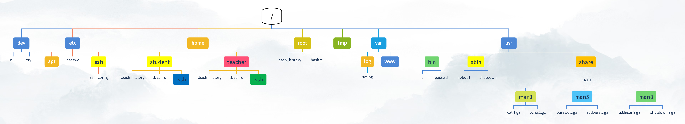

?> <i class="fa-solid fa-circle-info"></i> Herinner je je de prompt die een actief pad bevatte? Het '~' teken was een afkorting voor de map `/home/student`. Dit wordt de _homefolder_ genoemd. Elke gebruiker op het besturingssysteem krijgt zijn eigen _homefolder_ in de map `/home` net als in Windows, waar elke gebruiker zijn eigen map heeft onder `C:\Users`. Een gebruiker heeft alle machtigingen (lezen, schrijven, uitvoeren) in zijn eigen homefolder. Buiten die map heeft hij vaak alleen _lees_ rechten. 

### Werkmap wijzigen (cd) 
Je kan de huidige werkmap wijzigen met het commando `cd` (change directory): 
```bash
student@linux-ess:~$ pwd
/home/student
student@linux-ess:~$ cd /etc
student@linux-ess:/etc$ pwd
/etc
student@linux-ess:/etc$ cd ~
student@linux-ess:~$ pwd
/home/student
```
Dit commando neemt een pad als argument. In het bovenstaande voorbeeld navigeren we naar de map `etc` in de hoofdmap (ook root-directory genoemd) `/`. We kunnen dit zien in de uitvoer van het `pwd`-commando en aan de prompt. Zoals getoond in het tweede deel van het bovenstaande voorbeeld kunnen we ook het `~` teken gebruiken om snel naar de homefolder van de gebruiker te navigeren. 

?> <i class="fa-solid fa-circle-info"></i> We zouden ook het commando `cd` zonder enig argument kunnen gebruiken. Dit navigeert ook terug naar de homefolder van de gebruiker: 
```bash
student@linux-ess:~$ cd /home/student
student@linux-ess:~$ pwd
/home/student
student@linux-ess:~$ touch emptyfile
student@linux-ess:~$ ls
emptyfile
student@linux-ess:~$ cd /etc
student@linux-ess:/etc$ pwd
/etc
student@linux-ess:/etc$ cd
student@linux-ess:~$ pwd
/home/student
student@linux-ess:~$ ls
emptyfile
```

?> <i class="fa-solid fa-circle-info"></i> Het commando `touch` wordt hier gebruikt om een leeg bestand aan te maken met de naam `emptyfile`. Het commando wordt verderop in dit hoofdstuk nog uitgelegd. 

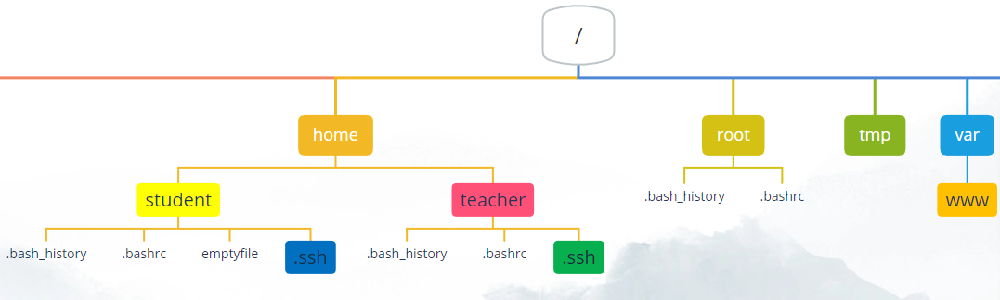


?> <i class="fa-solid fa-circle-info"></i> We zouden ook het commando `cd -` kunnen gebruiken. Dit navigeert terug naar de folder waar je je bevond vooraleer je naar deze folder kwam: 
```bash
student@linux-ess:~$ cd /etc/netplan
student@linux-ess:/etc/netplan$ ls
50-cloud-init.yaml
student@linux-ess:/etc/netplan$ cd /var/log
student@linux-ess:/var/log$ ls
alternatives.log                dmesg                           syslog
apport.log                      dpkg.log                        ubuntu-advantage.log
apt                             faillog                         ubuntu-advantage-timer.log
auth.log                        installer                       unattended-upgrades
bootstrap.log                   journal                         vmware-network.log
btmp                            kern.log                        vmware-vmsvc-root.log
cloud-init.log                  landscape                       vmware-vmtoolsd-root.log
cloud-init-output.log           lastlog                         wtmp
dist-upgrade                    private
student@linux-ess:/var/log$ cd -
student@linux-ess:/etc/netplan$ pwd
/etc/netplan
student@linux-ess:/etc/netplan$ ls
50-cloud-init.yaml
```


### Een boomstructuur weergeven in de shell (tree) 

Je kan een boomstructuur van een map met zijn submappen weergeven met het commando `tree`: 
```bash
student@linux-ess:~$ tree
.
└── emptyfile

0 directories, 1 file
```

?> <i class="fa-solid fa-circle-info"></i> Als je wordt gezegd dat tree nog niet is geïnstalleerd, voer je gewoon de opdracht uit die hij voorstelt. 

We kunnen ook de optie '-a' gebruiken om de verborgen bestanden te bekijken (bestanden die beginnen met een punt): 
```bash
student@linux-ess:~$ tree -a
.
├── .bash_history
├── .bash_logout
├── .bashrc
├── .cache
│   └── motd.legal-displayed
├── .lesshst
├── .local
│   └── share
│       └── nano
├── .profile
├── emptyfile
├── .ssh
│   └── authorized_keys
├── .sudo_as_admin_successful
└── .wget-hsts

5 directories, 10 files
```

We kunnen ook een pad opgeven als parameter om een weergave van die bepaalde map te krijgen: 

```bash
student@linux-ess:~$ tree /etc/dhcp
/etc/dhcp
├── debug
├── dhclient.conf
├── dhclient-enter-hooks.d
│   └── debug -> ../debug
└── dhclient-exit-hooks.d
    ├── debug -> ../debug
    ├── hook-dhclient
    ├── resolved
    ├── rfc3442-classless-routes
    └── timesyncd

2 directories, 8 files
```

### Absolute & relatieve paden 
Bij het gebruik van commando's moeten we vaak paden naar bepaalde mappen of bestanden gebruiken. Het commando `cd` vereist bijvoorbeeld een pad om naartoe te navigeren. 

Paden worden gebruikt om naar bestanden en mappen op het bestandssysteem te wijzen. We kunnen twee soorten paden gebruiken: _relatieve_ en _absolute_ paden. 

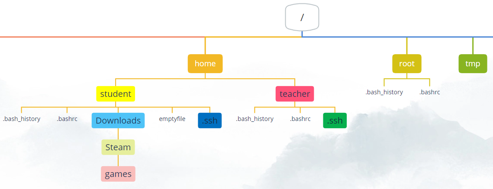

#### Absoluut pad 

Absolute paden moeten beginnen met een `/` teken. Dit betekent dat een absoluut pad begint vanuit de _rootmap_ (`/`) (het hoogste niveau op het bestandssysteem) en zich een weg naar beneden baant. Bijvoorbeeld: 
```bash
student@linux-ess:/tmp$ pwd
/tmp
student@linux-ess:/tmp$ cd /home/student/
student@linux-ess:~/$ pwd
/home/student
```

?> <i class="fa-solid fa-circle-info"></i> In Windows begint een absoluut pad met `C:\` in plaats van `/`! 

?> <i class="fa-solid fa-circle-info"></i> Wist je dat de Linux CLI commando- en pathcompletion heeft? Probeer eens op de `tab`-toets te drukken wanneer je een deel van een commando, bestands- of mapnaam typt. Als een commando, bestand of map overeenkomt met het eerste deel van de tekst die je hebt getypt, wordt het woord automatisch voor je voltooid! 

?> <i class="fa-solid fa-circle-info"></i> Wanneer je tabcompletion op een directory gebruikt, eindigt deze met een schuine streep (/), bijvoorbeeld `cd /home/student/`. De laatste schuine streep (/) is optioneel, dus is het precies hetzelfde als `cd /home/student`  

#### Relatief pad 

Een relatief pad begint altijd vanaf _de huidige directory_ en verwijst van daaruit naar een ander bestand of een andere map. Bijvoorbeeld: 
```bash
student@linux-ess:~$ pwd
/home/student
student@linux-ess:~$ cd Downloads/Steam/games
student@linux-ess:~/Downloads/Steam/games$ pwd
/home/student/Downloads/Steam/games
```
Wanneer je relatieve paden gebruikt, kunnen we enkele afkortingen gebruiken: 
```
. (één punt): verwijst naar de huidige map 
.. (twee puntjes): Verwijst naar de bovenliggende map  
~ (tilde): Verwijst naar de thuismap van de huidige gebruiker 
```
Dit betekent dat we, wanneer we in de map `/home/student/Downloads` staan, `..` kunnen gebruiken om naar de bovenliggende directory `/home/student` te navigeren 
```bash
student@linux-ess:~/Downloads$ pwd
/home/student/Downloads
student@linux-ess:~/Downloads$ cd ..
student@linux-ess:~$ pwd
/home/student
```
We kunnen deze afkortingen ook integreren in relatieve paden: 
```bash
student@linux-ess:/etc$ pwd
/etc
student@linux-ess:/etc$ cd /home/student/Downloads # Absoluut pad
student@linux-ess:~/Downloads$ pwd
/home/student/Downloads
student@linux-ess:~/Downloads$ cd ../../teacher # Relatief pad
student@linux-ess:/home/teacher$ pwd
/home/teacher
```
?> <i class="fa-solid fa-circle-info"></i> Een hekje `# ` vertelt de shell dat alles erachter als een opmerking wordt beschouwd en niet als een commando of argument zal worden geïnterpreteerd! 

### mapinhoud tonen (ls) 

Om de inhoud van een map weer te geven, kunnen we het commando `ls` gebruiken. Als je dit commando zonder opties of argumenten gebruikt, wordt de inhoud van de huidige werkmap weergegeven: 
```bash
student@linux-ess:~$ ls
emptyfile  Downloads
```

We kunnen ook in een bepaalde map gaan om de inhoud ervan te tonen: 
```bash
student@linux-ess:~$ cd /
student@linux-ess:/$ ls     
bin   dev  home  lib32  libx32      media  opt   root  sbin  srv  tmp  var
boot  etc  lib   lib64  lost+found  mnt    proc  run   snap  sys  usr
```

Het commando `ls` kan ook één argument gebruiken. Dit argument is een pad dat absoluut of relatief kan zijn. Het commando `ls` toont dan de inhoud van die map. 
```bash
student@linux-essentials:~$ ls
emptyfile  Downloads
student@linux-essentials:~$ ls /
bin   dev  home  lib32  libx32      media  opt   root  sbin  srv  tmp  var
boot  etc  lib   lib64  lost+found  mnt    proc  run   snap  sys  usr
student@linux-essentials:~$ 
```

Het commando `ls` heeft ook verschillende opties. Deze opties zijn te vinden in de manpage met `man ls`. Bijvoorbeeld: 
```bash
student@linux-ess:~$ ls -alh .       # Het puntje verwijst naar de huidige map, die in dit geval optioneel zou zijn 
total 45M
drwxr-xr-x 5 student student 4.0K Mar 27 16:36 .
drwxr-xr-x 3 root    root    4.0K Oct  5 13:40 ..
-rw------- 1 student student 1.7K Mar 17 12:14 .bash_history
-rw-r--r-- 1 student student  220 Oct  5 13:40 .bash_logout
-rw-r--r-- 1 student student 3.7K Oct  5 13:40 .bashrc
drwxrwxr-x 2 student student 4.0K Oct  1 14:31 Downloads
-rw-r--r-- 1 student student    0 Feb 28 11:48 emptyfile
-rw-r--r-- 1 student student  807 Oct  5 13:40 .profile
drwxr-xr-x 2 student student 4.0K Oct  5 13:40 .ssh
-rw-r--r-- 1 student student    0 Oct  6 08:20 .sudo_as_admin_successful
```
Merk op hoe we 3 opties hebben gecombineerd in het bovenstaande commando. Zowel `ls -a -l -h` als `ls -alh` werken precies hetzelfde en gebruiken alle 3 de opties. De opties kunnen in elke volgorde gezet worden, dus `ls -hal` is ook correct. Deze 3 opties worden het vaakst gebruikt als het gaat om het `ls` commando. Je zou ze kunnen zoeken in de manpage, maar we zullen een overzicht geven: 
* De optie '-a' toont _ook verborgen bestanden en folders_. **In Linux beginnen verborgen bestanden en mappen met een punt (.). bijvoorbeeld het `.bashrc`-bestand.** 
* De optie '-l' toont een _long listing_. Dit betekent dat het alle extra uitvoer toont\* en niet alleen de bestands- en mapnamen. 
* De optie '-h' verwijst naar _human readable_ en zorgt ervoor dat bestandsgroottes worden weergegeven met de juiste maateenheid in plaats van alle groottes in bytes weer te geven. 

\* De kolom `-rw-r--r--` verwijst naar machtigingen voor dat specifieke bestand/map. We zullen dit uitleggen in het hoofdstuk `gebruikers & machtigingen`. De kolommen met `student  student` verwijzen naar de eigenaar en groepseigenaar van dat specifieke bestand/die specifieke map en zijn gekoppeld aan de kolom met machtigingen. De `3.7K` op de regel van het bestand .bashrc verwijst naar de bestandsgrootte en `Oct 5 13:40` verwijst naar de tijdstempel van de laatste wijziging van het bestand. 

?> <i class="fa-solid fa-circle-info"></i> Alles in Linux is een bestand. Niet alleen de bestanden, maar ook de mappen! Ze zijn gewoon gedefinieerd als _speciale_ bestanden. Je harde schijf? Een bestand. Een USB-stick? Een bestand. Hardware zoals je toetsenbord? Je raadt het al, een bestand! 

### Mappen maken (mkdir) 

 

Om nieuwe mappen aan te maken kunnen we het commando `mkdir` (make directory) gebruiken. Dit commando neemt een pad als argument: 
```bash
student@linux-ess:~$ mkdir backups
student@linux-ess:~$ ls
backups  Downloads  emptyfile
```
In het bovenstaande voorbeeld maakt het commando `mkdir` een map met de naam `backups` aan in de huidige werkmap (`~` of `/home/student`). De mapnaam hier is een _relatief path_. 

#### paden met submappen 
Bij het gebruik van _relatieve_ of _absolute_ paden kunnen we het volgende doen: 
```bash
student@linux-ess:~$ mkdir backups/Steam/games/PayDay2
mkdir: cannot create directory ‘backups/Steam/games/PayDay2’: No such file or directory
```
Het commando probeert een map met de naam `PayDay2` te maken in de map `games` die zich in de map `Steam` bevindt die zich in de map `Backups` bevindt. We krijgen echter een foutmelding omdat de mappen `games` of `Steam` niet bestaan. We kunnen zeggen dat ontbrekende submappen in het pad gemaakt moeten worden met behulp van de optie `-p`: 
```
student@linux-ess:~$ mkdir -p backups/Steam/games/PayDay2
student@linux-ess:~$ tree backups
backups
└── Steam
    └── games
        └── PayDay2

3 directories, 0 files
```
Hiermee worden de mappen `Steam` en `games` gemaakt als deze niet bestaan. 

?> <i class="fa-solid fa-circle-info"></i> Zoals eerder vermeld is alles in Linux hoofdlettergevoelig. Dit is ook van toepassing bij het maken van bestanden en mappen. Probeer het commando `mkdir walkthroughs Walkthroughs` uit te voeren. Hiermee worden 2 mappen gemaakt: één met de naam `walkthroughs` en één met de naam `Walkthroughs`. 

## Werken met bestanden 

### Een leeg bestand maken (touch) 

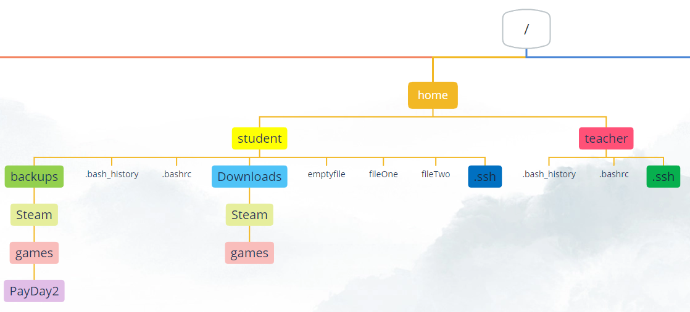 
Een eenvoudige manier om een leeg bestand te maken is met het touch commando. Het voorbeeld begint met een lege map, maakt twee bestanden met touch en vervolgens toont deze bestanden: 
```bash
student@linux-ess:~$ ls -l
total 8
drwxrwxr-x 3 student student 4096 Oct  1 14:34 backups
drwxrwxr-x 2 student student 4096 Oct  1 14:31 Downloads
-rw-rw-r-- 1 student student    0 Oct  1 14:31 emptyfile
student@linux-ess:~$ touch fileOne
student@linux-ess:~$ touch fileTwo
student@linux-ess:~$ ls -l
total 0
drwxrwxr-x 3 student student 4096 Oct  1 14:34 backups
drwxrwxr-x 2 student student 4096 Oct  1 14:31 Downloads
-rw-rw-r-- 1 student student    0 Oct  1 14:31 emptyfile
-rw-r--r-- 1 student student 0 Feb 12 09:50 fileOne
-rw-r--r-- 1 student student 0 Feb 12 09:50 fileTwo
```
?> <i class="fa-solid fa-circle-info"></i> Merk op dat beide bestanden leeg zijn, zoals te zien is aan de bestandsgrootte. In het volgende hoofdstuk zullen we kijken naar manieren om bestanden met inhoud te maken. 

### Bestanden met spaties in de naam 
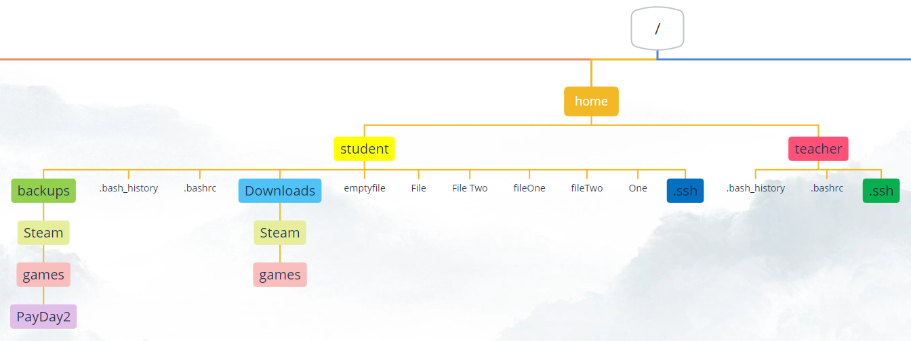 

Als we willen werken met bestanden met spaties in de naam, kunnen we de naam tussen dubbele aanhalingstekens plaatsen: 
```bash
student@linux-ess:~$ ls -l
total 0
drwxrwxr-x 3 student student 4096 Oct  1 14:34 backups
drwxrwxr-x 2 student student 4096 Oct  1 14:31 Downloads
-rw-rw-r-- 1 student student    0 Oct  1 14:31 emptyfile
-rw-r--r-- 1 student student 0 Feb 12 09:50 fileOne
-rw-r--r-- 1 student student 0 Feb 12 09:50 fileTwo
student@linux-ess:~$ touch File One
student@linux-ess:~$ ls -l
total 0
drwxrwxr-x 3 student student 4096 Oct  1 14:34 backups
drwxrwxr-x 2 student student 4096 Oct  1 14:31 Downloads
-rw-rw-r-- 1 student student    0 Oct  1 14:31 emptyfile
-rw-r--r-- 1 student student 0 Feb 12 09:50 fileOne
-rw-r--r-- 1 student student 0 Feb 12 09:50 fileTwo
-rw-r--r-- 1 student student 0 Feb 12 09:50 File
-rw-r--r-- 1 student student 0 Feb 12 09:50 One
student@linux-ess:~$ touch "File Two"
student@linux-ess:~$ ls -l
total 0
drwxrwxr-x 3 student student 4096 Oct  1 14:34 backups
drwxrwxr-x 2 student student 4096 Oct  1 14:31 Downloads
-rw-rw-r-- 1 student student    0 Oct  1 14:31 emptyfile
-rw-r--r-- 1 student student 0 Feb 12 09:50 fileOne
-rw-r--r-- 1 student student 0 Feb 12 09:50 fileTwo
-rw-r--r-- 1 student student 0 Feb 12 09:50 File
-rw-r--r-- 1 student student 0 Feb 12 09:50 'File Two'
-rw-r--r-- 1 student student 0 Feb 12 09:50 One
```
?> <i class="fa-solid fa-circle-info"></i> Merk op dat we ook enkele aanhalingstekens kunnen gebruiken `touch 'File Two'` of een backslash om de spatie als string te lezen `touch File\ Two`. 

### Bestanden verplaatsen (mv) 

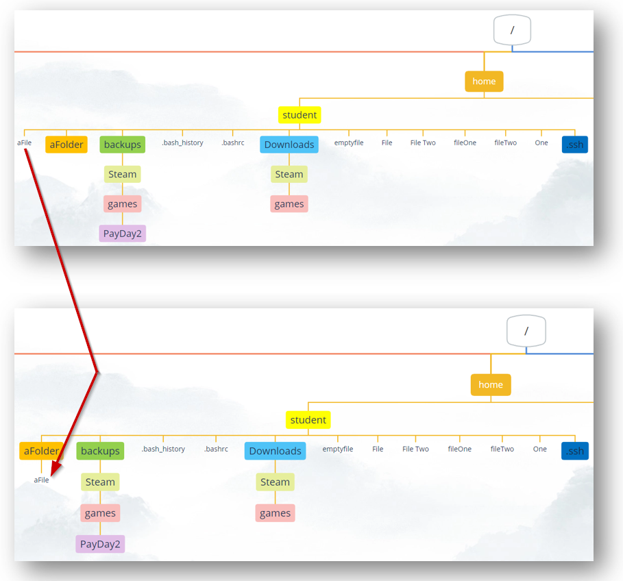  

Om een bestand naar een andere map te verplaatsen kunnen we het commando `mv` (move) gebruiken. Deze opdracht heeft twee argumenten: het bronbestand/de bronmap en het doelbestand/de doelmap: 
```bash
student@linux-ess:~$ ls
aFile  aFolder  backups  Downloads  emptyfile  File  fileOne  fileTwo  'File Two'  One
student@linux-ess:~$ mv aFile aFolder/
student@linux-ess:~$ ls
aFolder  backups  Downloads  emptyfile  File  fileOne  fileTwo  'File Two'  One
student@linux-ess:~$ ls aFolder
aFile
```


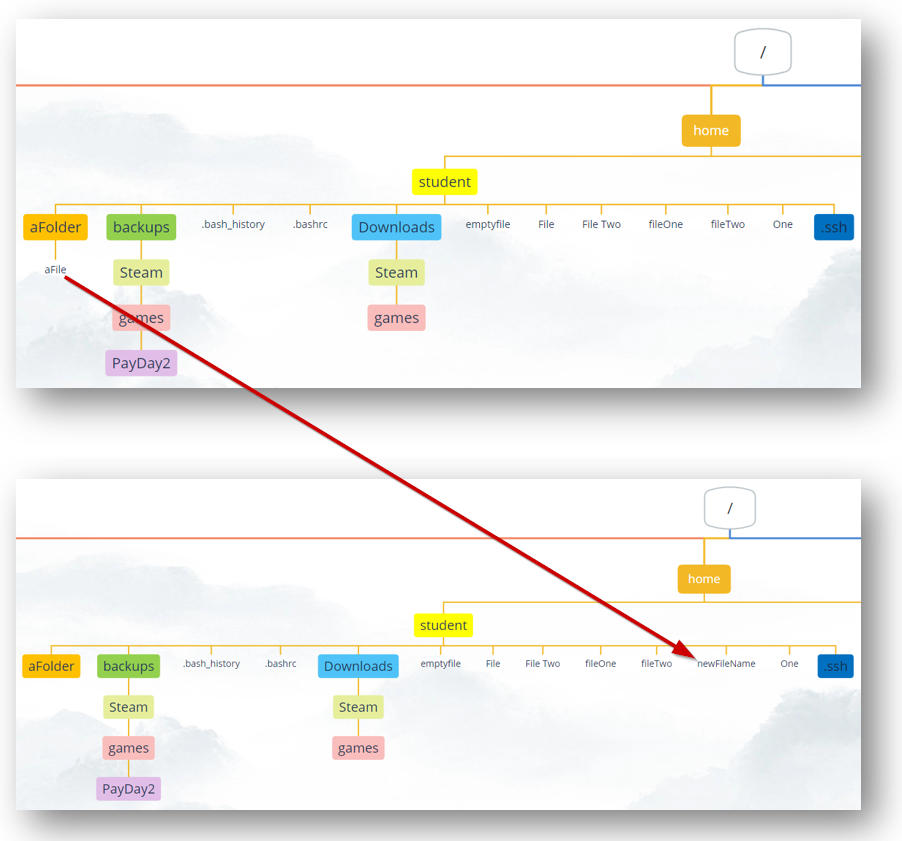  


Aangezien het tweede argument een doelbestand of -map is, kunnen we deze opdracht ook gebruiken om een bestand te hernoemen. In het onderstaande voorbeeld gebruiken we het commando `mv` om het bestand terug te verplaatsen naar de homefolder, maar ook om het te hernoemen: 
```bash
student@linux-ess:~/aFolder$ ls 
aFile
student@linux-ess:~/aFolder$ mv aFile ../newFileName
student@linux-ess:~/aFolder$ ls 
student@linux-ess:~/aFolder$ ls ~
aFolder  backups  Downloads  emptyfile  File  fileOne  fileTwo  'File Two'  newFileName  One
```


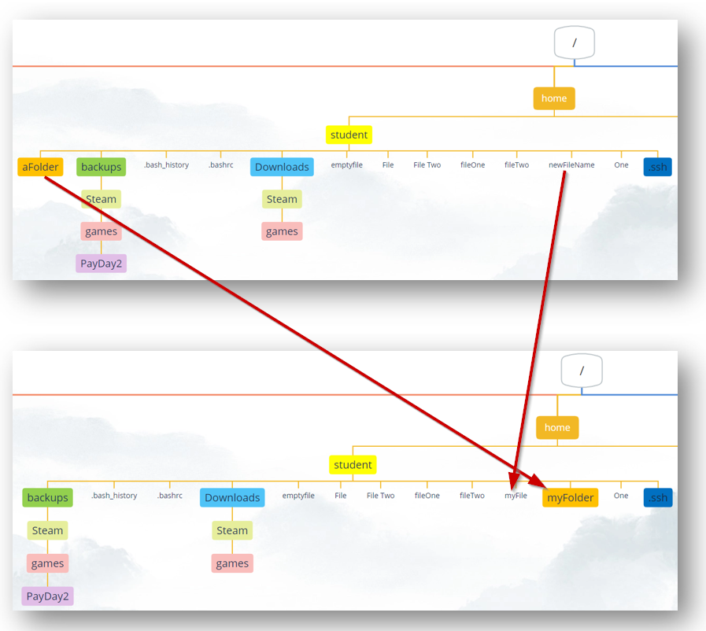 


Bij het hernoemen van slechts één bestand of map is `mv` het voorkeurscommando dat je wilt gebruiken. De voorbeelden gebruikten beide bestanden, maar dezelfde logica werkt ook voor het hernoemen en verplaatsen van mappen. 
```bash
student@linux-ess:~$ ls 
aFolder  backups  Downloads  emptyfile  File  fileOne  fileTwo  'File Two'  newFileName  One
student@linux-ess:~$ mv newFileName myFile 
student@linux-ess:~$ mv aFolder myFolder 
student@linux-ess:~$ ls
backups  Downloads  emptyfile  File  fileOne  fileTwo  'File Two'  myFile  myFolder  One
```

### Bestanden kopiëren (cp) 

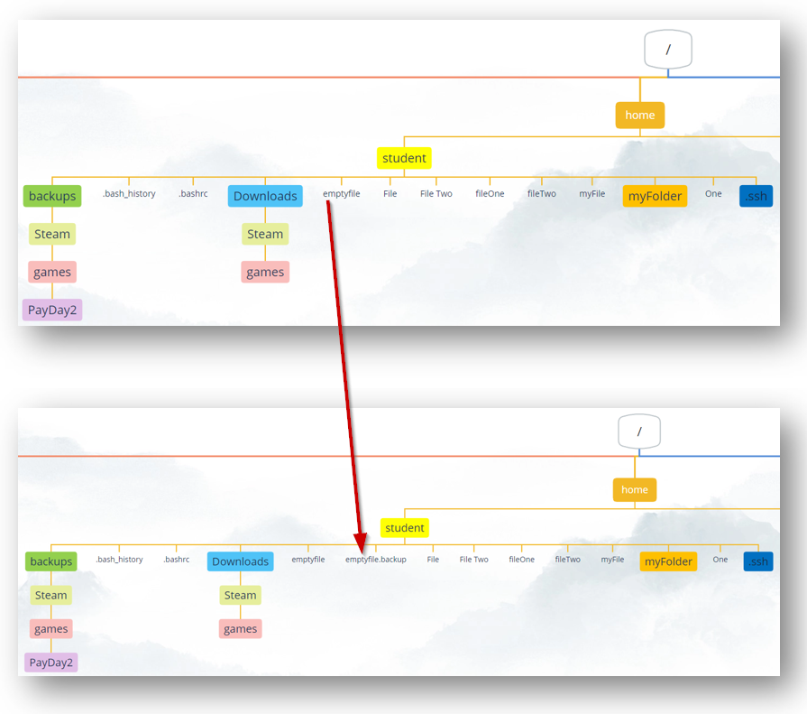  

Om een kopie van een bestand te maken kunnen we het commando `cp` (copy) als volgt gebruiken: 
```bash
student@linux-ess:~$ ls
backups  Downloads  emptyfile  File  fileOne  fileTwo  'File Two'  myFile  myFolder  One
student@linux-ess:~$ cp emptyfile emptyfile.backup
student@linux-ess:~$ ls
backups  Downloads  emptyfile  emptyfile.backup  File  fileOne  fileTwo  'File Two'  myFile  myFolder  One
```
Beide argumenten zijn paden. Het eerste pad is het oorspronkelijke bestand/map. Het tweede pad is een pad naar de nieuwe locatie en (optionele) bestandsnaam/mapnaam. We kunnen het cp-commando gebruiken om zowel bestanden als mappen naar dezelfde map of een andere map te kopiëren. 

#### Kopiëren naar een andere map 

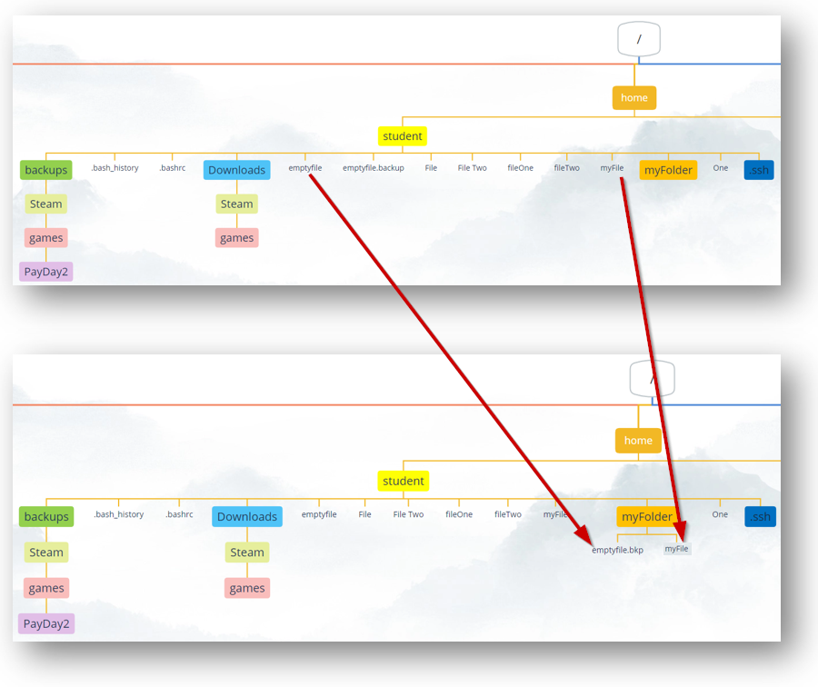  

Het onderstaande voorbeeld laat ons zien hoe we de argumenten in het commando `cp` kunnen gebruiken om bestanden of mappen naar een andere map te kopiëren. In dit voorbeeld kopiëren we het bestand met de naam _myFile_ naar de map _myFolder_ met behulp van een _relatief_ pad. We kopiëren ook het bestand met de naam _emptyfile_ naar de map met de naam _myFolder_ en geven het de nieuwe naam _emptyFile.bkp_. Dit doen we met behulp van een absoluut pad. 
```bash
student@linux-ess:~$ ls
backups  Downloads  emptyfile  emptyfile.backup  File  fileOne  fileTwo  'File Two'  myFile  myFolder  One
student@linux-ess:~$ cp myFile myFolder/
student@linux-ess:~$ ls myFolder
myFile
student@linux-ess:~$ ls
backups  Downloads  emptyfile  emptyfile.backup  File  fileOne  fileTwo  'File Two'  myFile  myFolder  One
student@linux-ess:~$ cp /home/student/emptyFile /home/student/myFolder/emptyFile.bkp
student@linux-ess:~$ ls myFolder
myFile  emptyFile.bkp
student@linux-ess:~$ ls
backups  Downloads  emptyfile  emptyfile.backup  File  fileOne  fileTwo  'File Two'  myFile  myFolder  One
```
?> <i class="fa-solid fa-circle-info"></i> Merk op dat we zowel _relatieve_ als _absolute_ paden kunnen gebruiken in het commando cp voor zowel het oorspronkelijke bestand/de oorspronkelijke map als het doelbestand/de doelmap. 

#### Recursief kopiëren 

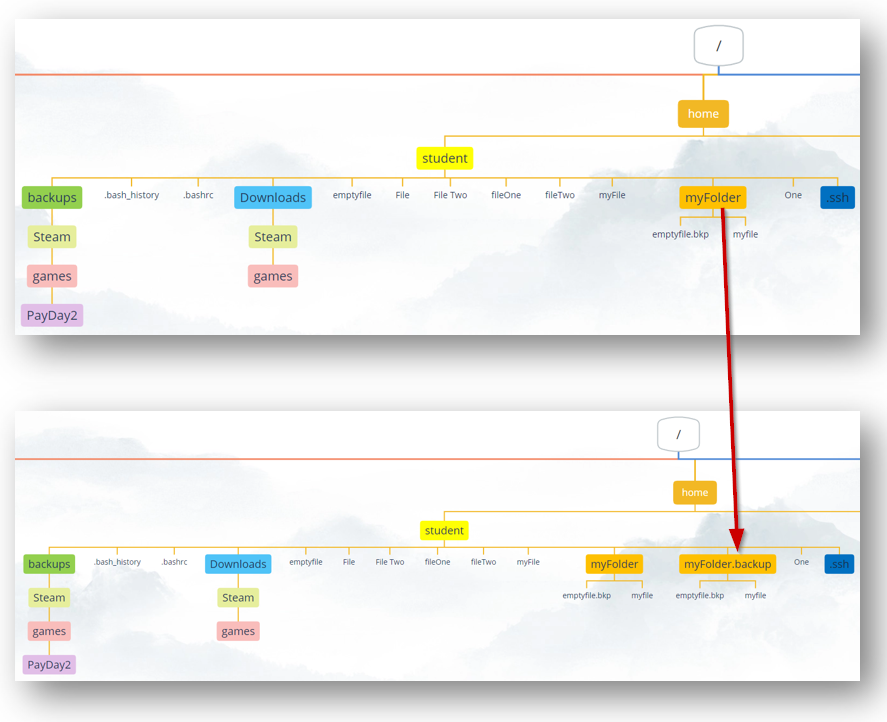 

Om volledige mappen (met alle submappen en files in deze map) te kopiëren moeten we de optie `-r` (recursief) gebruiken:
```bash
student@linux-ess:~$ ls
backups  Downloads  emptyfile  emptyfile.backup  File  fileOne  fileTwo  'File Two'  myFile  myFolder  One
student@linux-ess:~$ ls myFolder
myFile  emptyFile.bkp
student@linux-ess:~$ cp -r myFolder/ myFolder.backup
student@linux-ess:~$ ls
backups  Downloads  emptyfile  emptyfile.backup  File  fileOne  fileTwo  'File Two'  myFile  myFolder  myFolder.backup  One
student@linux-ess:~$ ls myFolder.backup
myFile  emptyFile.bkp
```

#### Bestanden overschrijven 
We moeten ons ervan bewust zijn dat het `cp`-commando standaard bestaande bestanden overschrijft. We kunnen de optie `-i` (interactief) gebruiken om een prompt te krijgen waarbij we moeten bevestigen of we het bestand willen overschrijven, zoals te zien is in het onderstaande voorbeeld: 
```bash
student@linux-ess:~$ ls
backups  Downloads  emptyfile  emptyfile.backup  File  fileOne  fileTwo  'File Two'  myFile  myFolder  myFolder.backup  One
student@linux-ess:~$ ls myFolder
myFile  emptyFile.bkp
student@linux-ess:~$ cp myFile myFolder/emptyFile.bkp     # Geen error, de file wordt overschreven
student@linux-ess:~$ ls myFolder
myFile  emptyFile.bkp
student@linux-ess:~$ cp -i myFile myFolder/emptyFile.bkp     # Je wordt gevraagd of je wil overschijven of niet
cp: overwrite `emptyFile.bkp'? y
```

### Bestanden hernoemen (rename) 

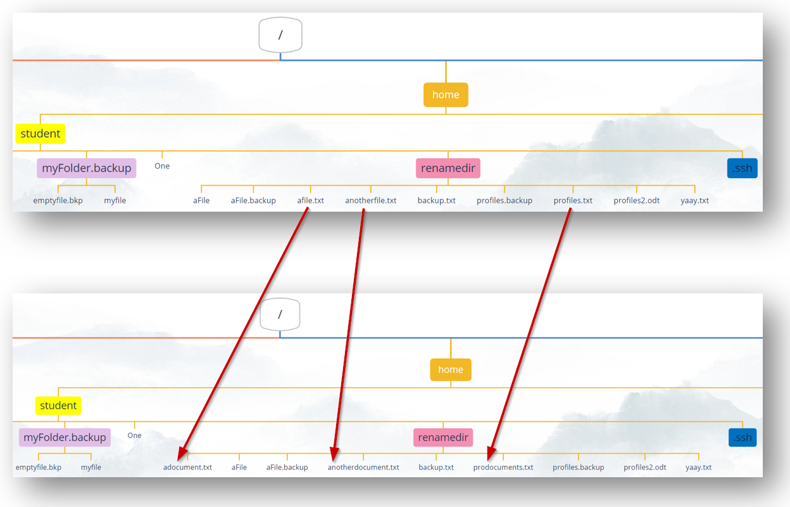 

We zagen dat we het commando `mv` konden gebruiken om bestanden en mappen te hernoemen. Dit werkt en is vaak heel eenvoudig, maar wanneer je bestanden in bulk moet hernoemen, wil je misschien een andere aanpak overwegen. Het commando `rename` is speciaal ontworpen om meerdere bestanden en mappen met één commando te hernoemen. Om dit te doen gebruikt het een _reguliere expressie/regular expression_ (Regex). Een Regex is een reeks tekens die een zoekpatroon definiëren. We zullen later in deze cursus meer leren over reguliere expressies. Het gebruikt dit zoekpatroon om bepaalde wijzigingen aan te brengen in de bestandsnamen: 
```bash
student@linux-ess:~$ mkdir renamedir 
student@linux-ess:~$ cd renamedir
student@linux-ess:~/renamedir$ touch aFile  aFile.backup  afile.txt  anotherfile.txt  backup.txt  profiles.backup  profiles.txt  profiles2.ODT  yaay.txt
student@linux-ess:~/renamedir$ ls
aFile  aFile.backup  afile.txt  anotherfile.txt  backup.txt  profiles.backup  profiles.txt  profiles2.ODT  yaay.txt
student@linux-ess:~/renamedir$ rename 's/file/document/' *.txt
student@linux-ess:~/renamedir$ ls
aFile  aFile.backup  adocument.txt  anotherdocument.txt  backup.txt  prodocuments.txt  profiles.backup  profiles2.ODT  yaay.txt
```

?> <i class="fa-solid fa-circle-info"></i> Als rename nog niet is geïnstalleerd, kan je dit doen met het commando `sudo apt -y install rename`.  

Er gebeurt veel in het bovenstaande voorbeeld, laten we samenvatten wat er aanwezig is: 
* De map waarin we ons bevinden bevat enkele `txt`-bestanden, enkele `backup`-bestanden en bestanden met `geen extensie`. Sommige bestanden bevatten het woord `file` dat we willen vervangen door `document`. Vergeet niet dat Linux standaard hoofdlettergevoelig is, dus `file` is niet hetzelfde als `File`. 
* het `rename` commando neemt een _string_ met de waarde `s/file/document/`. Dit is de _regex_ die door de opdracht wordt gebruikt om (`s`) te zoeken naar namen die het woord `file` bevatten en deze te vervangen door het woord `document`. 
* Het laatste argument is `*.txt`. We gebruiken dit om het commando `rename` te vertellen om alleen de vervangende regex uit te voeren op bestanden die eindigen op `.txt` 

?> <i class="fa-solid fa-circle-info"></i> een `*` (sterretje) wordt beschouwd als een joker-/wildcardteken in bash. Het verwijst naar _nul, een of meer karakters_. Dus in het bovenstaande voorbeeld vertaalt dit zich naar: "voer deze vervangende regex uit op alle bestanden die nul, een of meer tekens van welke aard dan ook bevatten, opgevolgd door en eindigend met de tekenreeks `.txt`. 

We kunnen ook het commando `rename` gebruiken om de bestandsextentie van alle bestanden en mappen te wijzigen: 

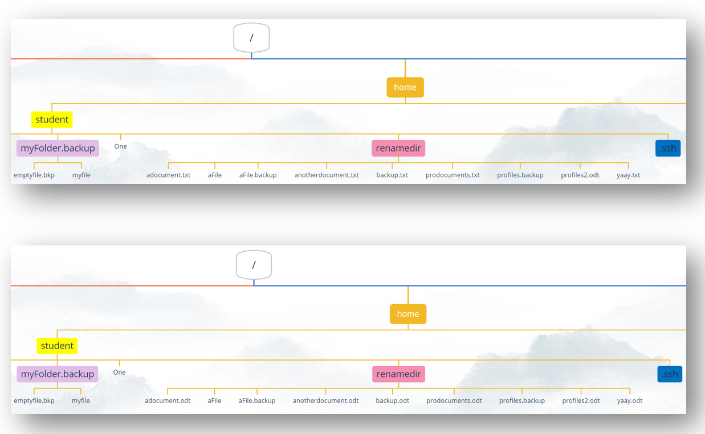 

```bash
student@linux-ess:~/renamedir$ ls
aFile  aFile.backup  adocument.txt  anotherdocument.txt  backup.txt  prodocuments.txt  profiles.backup  profiles2.ODT  yaay.txt
student@linux-ess:~/renamedir$ rename 's/\.txt/.odt/' *
student@linux-ess:~/renamedir$ ls
aFile  aFile.backup  adocument.odt  anotherdocument.odt  backup.odt  prodocuments.odt  profiles.backup  profiles2.ODT  yaay.odt
```
?> <i class="fa-solid fa-circle-info"></i> Merk je op hoe we een `\` (backslash) voor het `.` -teken in de zoekreeks plaatsen? Sommige tekens hebben een speciale betekenissen in reguliere expressies (bijvoorbeeld: `* . $ [ ] ( ) / { }`). Als we willen dat de bash shell dit teken als een string ziet, moeten we _escaping_ gebruiken. Dit is het concept van het gebruik van de `\` om aan te geven dat het teken dat volgt wordt geïnterpreteerd als een string in plaats van een speciaal teken. 

We kunnen ook het commando `rename` gebruiken om meerdere bestandsextensies tegelijk te wijzigen: 

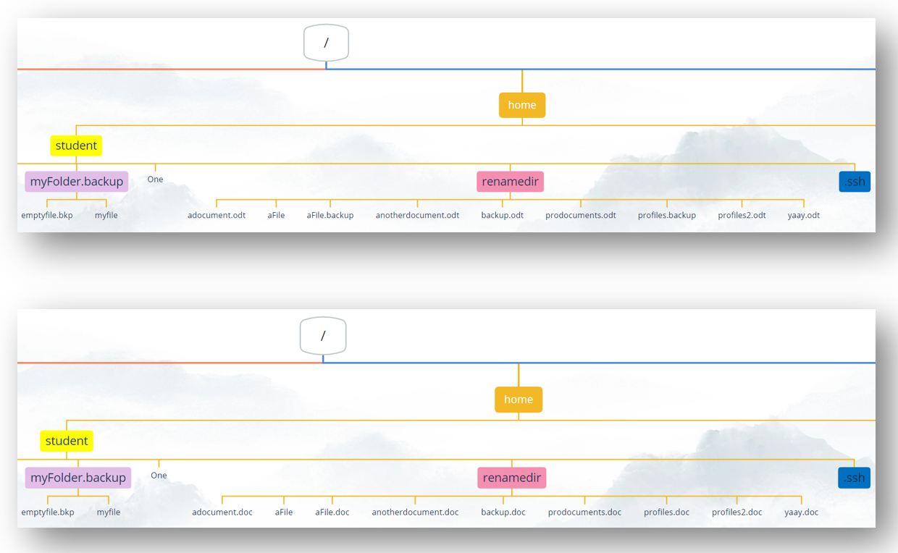 

```bash
student@linux-ess:~/renamedir$ ls
aFile  aFile.backup  adocument.odt  anotherdocument.odt  backup.odt  prodocuments.odt  profiles.backup  profiles2.ODT  yaay.odt
student@linux-ess:~/renamedir$ rename -E 's/\.odt/.doc/i' -E 's/\.backup/.doc/' *
student@linux-ess:~/renamedir$ ls
aFile  aFile.doc  adocument.doc  anotherdocument.doc  backup.doc  prodocuments.doc  profiles.doc  profiles2.doc  yaay.doc
```

?> <i class="fa-solid fa-circle-info"></i> Merk op hoe we een `i` aan het einde van de perl-expressie plaatsen om hoofdletterongevoelig te zoeken. Dus het `rename -E' 's/\.odt/.doc/i` commando hernoemt de odt-extensies naar doc, ongeacht of het hoofdletters heeft of niet. 

### Bestanden identificeren (file) 
In Linux hoeven we geen bestandsextenties te gebruiken. Dit betekent dat we het bestandstype niet altijd kennen. We kunnen het commando `file` gebruiken om het type van een bestand te identificeren: 
```bash
student@linux-ess:~$ wget --cipher 'DEFAULT:!DH' http://www.pxl.be/img/logo.png
student@linux-ess:~$ file logo.png
logo.png: PNG image data, 150 x 150, 8-bit/color RGBA, non-interlaced
student@linux-ess:~$ file /etc/passwd
/etc/passwd: ASCII text
```

## Verwijder bestanden & mappen (rm) 
Voor het verwijderen van mappen kunnen we het commando `rmdir` gebruiken, maar houd er rekening mee dat het geen mappen met andere bestanden of mappen in verwijdert. 

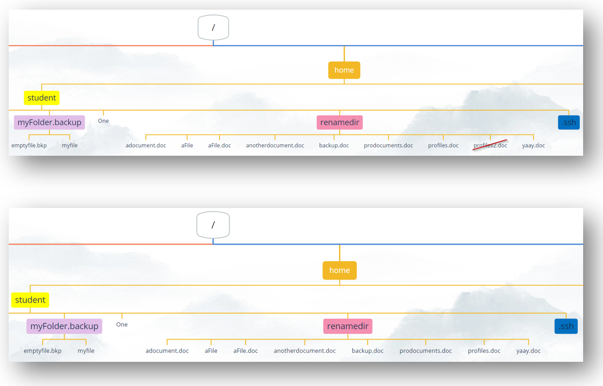

Voor het verwijderen van zowel bestanden als mappen gebruiken we meestal het commando `rm`: 
```bash
student@linux-ess:~/renamedir$ ls
aFile  aFile.doc  adocument.doc  anotherdocument.doc  backup.doc  prodocuments.doc  profiles.doc  profiles2.doc  yaay.doc
student@linux-ess:~/renamedir$ rm profiles2.doc
student@linux-ess:~/renamedir$ ls
aFile  aFile.doc  adocument.doc  anotherdocument.doc  backup.doc  prodocuments.doc  profiles.doc  yaay.doc
```

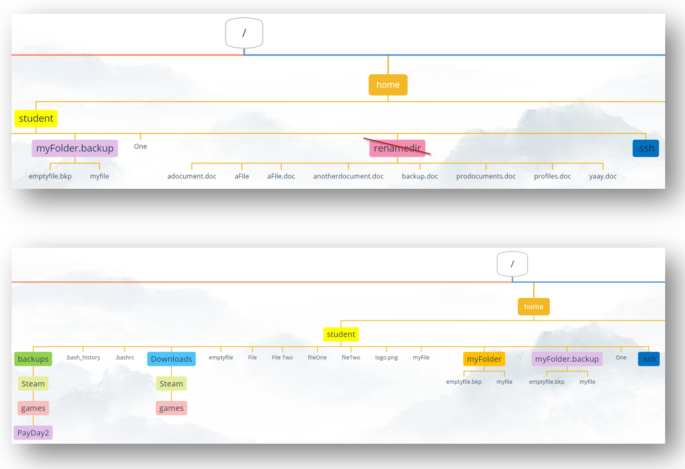

Het `rm` commando heeft ook verschillende opties, de meest gebruikte combinatie is `rm -rf`: 
* `-r` betekent dat het bestanden en mappen recursief zal verwijderen 
* `-f` dwingt (force) het commando om ook niet-lege mappen te verwijderen. Iets wat niet standaard zal gebeuren. 
```bash
student@linux-ess:~$ ls
backups  Downloads  emptyfile  emptyfile.backup  File  fileOne  fileTwo  'File Two'  myFile  myFolder  myFolder.backup  One renamedir
student@linux-ess:~$ ls renamedir
aFile  aFile.doc  adocument.doc  anotherdocument.doc  backup.doc  prodocuments.doc  profiles.doc  yaay.doc
student@linux-ess:~$ rm -rf renamedir
student@linux-ess:~$ ls
backups  Downloads  emptyfile  emptyfile.backup  File  fileOne  fileTwo  'File Two'  myFile  myFolder  myFolder.backup  One
```

Wees bedachtzaam bij het gebruik van het `rm -rf` commando als root gebruiker! 

?> <i class="fa-solid fa-circle-info"></i> Er is geen vuilnisbak in linux. Het verwijderen van een bestand betekent dat het voor altijd verdwenen is! 

## Zoeken naar bestanden 
### Zoeken op het bestandssysteem (find) 
Het eerste commando om naar bestanden te zoeken is `find`. Het doorzoekt het bestandssysteem om bestanden te vinden waarnaar we zoeken. We kunnen aangeven in welke directory de zoekopdracht begint (onderaan de boom) en hoe de bestandsnaam eruit moet zien (met fileglobbing): 

?> <i class="fa-solid fa-circle-info"></i> Als je geen map opgeeft, begint het zoeken in de huidige werkmap. Standaard gaat de zoekopdracht altijd verder in de boomstructuur naar de submappen. 

```bash
student@linux-ess:~$ find -name "*sh*"
./.bash_logout
./.local/share
./.lesshst
./.ssh
./.bashrc
./.bash_history
```

We kunnen ook een directory opgeven van waaruit de zoekopdracht moet worden gestart: 
```bash
student@linux-ess:~$ find / -name "modem*"
...
find: ‘/snap/core/17200/var/spool/cron/crontabs’: Permission denied
find: ‘/snap/core/17200/var/spool/rsyslog’: Permission denied
find: ‘/tmp/systemd-private-41192bfd59a644f3aabea034752dc85e-systemd-timesyncd.service-y5dhWM’: Permission denied
find: ‘/tmp/snap-private-tmp’: Permission denied
find: ‘/tmp/systemd-private-41192bfd59a644f3aabea034752dc85e-upower.service-quWyki’: Permission denied
find: ‘/tmp/vmware-root_766-2990744190’: Permission denied
find: ‘/tmp/systemd-private-41192bfd59a644f3aabea034752dc85e-polkit.service-zl4vVd’: Permission denied
find: ‘/tmp/systemd-private-41192bfd59a644f3aabea034752dc85e-ModemManager.service-jhvr5E’: Permission denied
find: ‘/tmp/systemd-private-41192bfd59a644f3aabea034752dc85e-systemd-resolved.service-T7IstT’: Permission denied
find: ‘/tmp/systemd-private-41192bfd59a644f3aabea034752dc85e-systemd-logind.service-zMuUdp’: Permission denied
find: ‘/boot/lost+found’: Permission denied
find: ‘/root’: Permission denied
/usr/share/lintian/overrides/modemmanager
/usr/share/doc/modemmanager
/usr/share/doc/util-linux/modems-with-agetty.txt
/usr/share/doc/netplan/examples/modem.yaml
/usr/lib/firmware/qcom/sdm845/modemuw.jsn
/usr/lib/firmware/qcom/sdm845/modem_nm.mbn.zst
/usr/lib/firmware/qcom/sdm845/modem.mbn.zst
/usr/lib/firmware/qcom/qrb4210/modemuw.jsn
/usr/lib/firmware/qcom/qrb4210/modem.mbn.zst
/usr/lib/firmware/qcom/qrb4210/modemr.jsn
/usr/lib/firmware/qcom/apq8016/modem.mbn.zst
/usr/lib/firmware/qcom/apq8096/modem.mbn.zst
/usr/lib/firmware/qcom/apq8096/modemr.jsn
/usr/lib/firmware/qcom/qcm2290/modemuw.jsn
/usr/lib/firmware/qcom/qcm2290/modem.mbn.zst
/usr/lib/firmware/qcom/qcm2290/modemr.jsn
```

We zien te veel foutmeldingen. Het rommelt de weergave en we krijgen geen resultaten terug van de mappen waar we geen rechten hebben om de inhoud weer te geven. 
De oplossing is om het commando `sudo` te gebruiken: 
```bash
student@linux-ess:~$ sudo find / -name "modem*"
[sudo] password for student:
/var/lib/dpkg/info/modemmanager.conffiles
/var/lib/dpkg/info/modemmanager.md5sums
/var/lib/dpkg/info/modemmanager.postinst
/var/lib/dpkg/info/modemmanager.postrm
/var/lib/dpkg/info/modemmanager.prerm
/var/lib/dpkg/info/modemmanager.list
/usr/share/lintian/overrides/modemmanager
/usr/share/doc/modemmanager
/usr/share/doc/util-linux/modems-with-agetty.txt
/usr/share/doc/netplan/examples/modem.yaml
/usr/lib/firmware/qcom/sdm845/modemuw.jsn
/usr/lib/firmware/qcom/sdm845/modem_nm.mbn.zst
/usr/lib/firmware/qcom/sdm845/modem.mbn.zst
/usr/lib/firmware/qcom/qrb4210/modemuw.jsn
/usr/lib/firmware/qcom/qrb4210/modem.mbn.zst
/usr/lib/firmware/qcom/qrb4210/modemr.jsn
/usr/lib/firmware/qcom/apq8016/modem.mbn.zst
/usr/lib/firmware/qcom/apq8096/modem.mbn.zst
/usr/lib/firmware/qcom/apq8096/modemr.jsn
/usr/lib/firmware/qcom/qcm2290/modemuw.jsn
/usr/lib/firmware/qcom/qcm2290/modem.mbn.zst
/usr/lib/firmware/qcom/qcm2290/modemr.jsn
...
```

Als we willen dat onze zoekopdracht hoofdletterongevoelig is, kunnen we `-iname` gebruiken in plaats van `-name`: 
```bash
student@linux-ess:~$ sudo find / -iname "modem*"
/sys/fs/cgroup/system.slice/ModemManager.service
/run/systemd/propagate/ModemManager.service
/etc/ModemManager
/etc/systemd/system/multi-user.target.wants/ModemManager.service
/var/lib/dpkg/info/modemmanager.conffiles
/var/lib/dpkg/info/modemmanager.md5sums
/var/lib/dpkg/info/modemmanager.postinst
/var/lib/dpkg/info/modemmanager.postrm
/var/lib/dpkg/info/modemmanager.prerm
/var/lib/dpkg/info/modemmanager.list
/var/lib/systemd/deb-systemd-helper-enabled/multi-user.target.wants/ModemManager.service
/var/lib/systemd/deb-systemd-helper-enabled/ModemManager.service.dsh-also
/usr/share/ModemManager
/usr/share/man/man8/ModemManager.8.gz
...
```

### Zoeken in een bestandssysteemdatabase (locate) 
Een andere manier om naar bestanden te zoeken, is door het commando `locate` te gebruiken. Het doorzoekt een database die informatie bevat over de bestanden in het bestandssysteem.  

?> <i class="fa-solid fa-circle-info"></i> Voordat we het commando gebruiken om naar de bestanden te zoeken, is het altijd een goede gewoonte om de database bij te werken. 

Het valt op dat het doorzoeken van een database met `locate` veel sneller gaat dan het doorzoeken van het bestandssysteem zelf met `find`. 
Houd er rekening mee dat we hier geen directory specificeren. Het zoeken zal altijd worden gedaan door alle bestanden van het bestandssysteem: 
```bash
student@linux-ess:~$ touch testfile
student@linux-ess:~$ ls
  emptyfile  emptyfile.backup  testfile
student@linux-ess:~$ find -name "testfile"
./testfile
student@linux-ess:~$ locate testfile
student@linux-ess:~$ sudo updatedb
student@linux-ess:~$ locate testfile
/home/student/testfile
student@linux-ess:~$ locate .profile
/etc/lvm/profile/cache-mq.profile
/etc/lvm/profile/cache-smq.profile
/etc/lvm/profile/command_profile_template.profile
/etc/lvm/profile/lvmdbusd.profile
/etc/lvm/profile/metadata_profile_template.profile
/etc/lvm/profile/thin-generic.profile
/etc/lvm/profile/thin-performance.profile
/etc/lvm/profile/vdo-small.profile
/etc/skel/.profile
/home/student/.profile
/snap/core20/1405/etc/skel/.profile
/snap/core20/1405/usr/share/base-files/dot.profile
...
```

Als we ook bestanden willen zien waar we de privileges niet voor hebben, dan moeten we `sudo` gebruiken: 
```bash
student@linux-ess:~$ sudo locate .profile
/etc/lvm/profile/cache-mq.profile
/etc/lvm/profile/cache-smq.profile
/etc/lvm/profile/command_profile_template.profile
/etc/lvm/profile/lvmdbusd.profile
/etc/lvm/profile/metadata_profile_template.profile
/etc/lvm/profile/thin-generic.profile
/etc/lvm/profile/thin-performance.profile
/etc/lvm/profile/vdo-small.profile
/etc/skel/.profile
/home/student/.profile
/root/.profile
/snap/core20/1405/etc/skel/.profile
/snap/core20/1405/root/.profile
...
```

Als we ook hoofdletterongevoelig willen zoeken, dan moeten we de optie `-i` gebruiken: 
```bash
student@linux-ess:~$ sudo locate -i modem
/boot/grub/x86_64-efi/spkmodem.mod
/etc/ModemManager
/etc/ModemManager/connection.d
/etc/ModemManager/fcc-unlock.d
/etc/systemd/system/dbus-org.freedesktop.ModemManager1.service
/etc/systemd/system/multi-user.target.wants/ModemManager.service
/usr/include/linux/if_cablemodem.h
/usr/lib/firmware/qcom/apq8016/modem.mbn.zst
/usr/lib/firmware/qcom/apq8096/modem.mbn.zst
/usr/lib/firmware/qcom/apq8096/modemr.jsn
...
```

Als we alleen in bestandsnamen willen zoeken en niet in mapnamen, moeten we de optie `-b` gebruiken: 
```bash
student@linux-ess:~$ sudo locate -i -b modem
/boot/grub/x86_64-efi/spkmodem.mod
/etc/ModemManager
/etc/systemd/system/dbus-org.freedesktop.ModemManager1.service
/etc/systemd/system/multi-user.target.wants/ModemManager.service
/usr/include/linux/if_cablemodem.h
/usr/lib/firmware/qcom/apq8016/modem.mbn.zst
/usr/lib/firmware/qcom/apq8096/modem.mbn.zst
/usr/lib/firmware/qcom/apq8096/modemr.jsn
```

