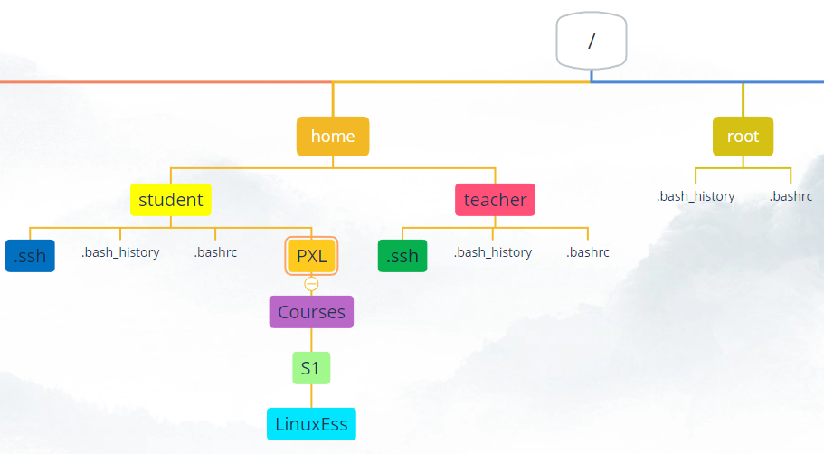
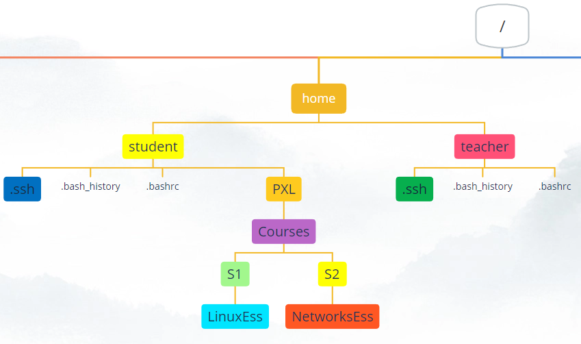
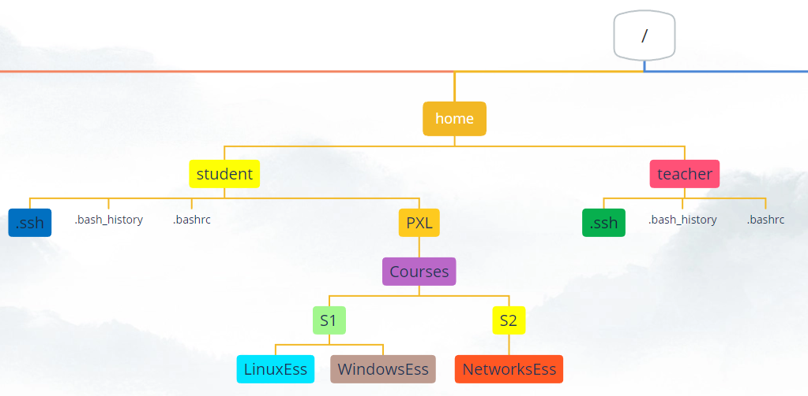
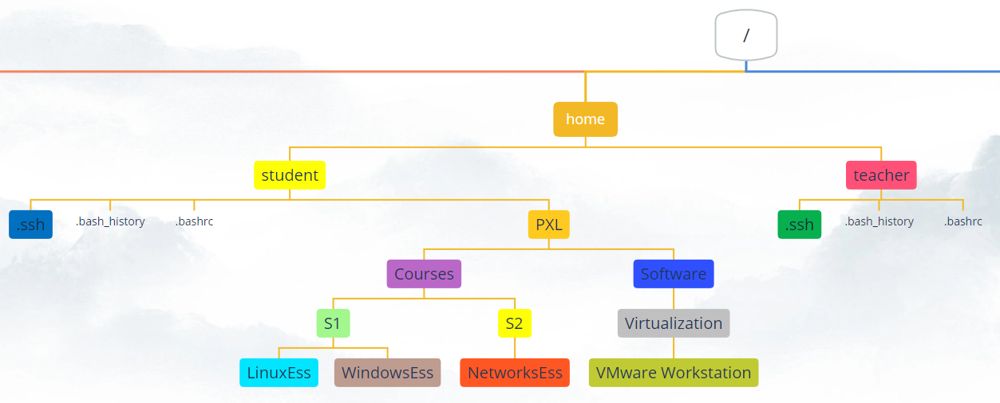

# Oefeningen op het werken met bestanden en mappen 

`Maak via ssh verbinding met je server om de oefeningen te doen`

## Oefening 1 
Navigeer naar je homefolder met het minste aantal toetsaanslagen mogelijk (drie om precies te zijn) 
Wat is het commando om het volledige pad weer te geven van waar je je in de bestandsstructuur bevindt? 
Wat is het volledige pad van je homefolder? 

## Oefening 2 
Maak in je homedirectory de volgende structuur: 
`
PXL/Courses/S1/LinuxEss 
`  
Doe dit door naar elke gemaakte map te gaan om de volgende te maken. 
  

?> <i class="fa-solid fa-circle-info"></i> Je hebt deze structuur nodig in een volgende oefening 

## Oefening 3 
Ga terug naar je homefolder. 
Terwijl je in je homefolder blijft, maak je de map _S2_ als een submap van _Courses_. Doe dit met behulp van een _absoluut pad_. 
Terwijl je in je homefolder blijft, maak je de map _NetworksEss_ als een submap van _S2_. Doe dit ook met behulp van een _absoluut pad_. 

Gebruik tab-completion wanneer je maar kunt!  
  

## Oefening 4 
Maak de map _WindowsEss_ als een submap van _S1_ terwijl je in je homefolder bent. Doe dit met behulp van een _relatief pad_. 

Gebruik tab-completion wanneer je maar kunt!  
 

## Oefening 5 
Maak in je homedirectory de volgende structuur met _slechts één commando_: 
`
PXL/Software/Virtualization/VMware Workstation 
`  
Let op de spatie in de bestandsnaam!  
Je moet in de manpage zoeken naar de optie om te gebruiken. Het maakt alle bovenliggende mappen die nodig zijn. Hier betekent het dat om de map _VMware Workstation_ te maken, de server eerst alle andere mappen zal maken als ze nog niet bestaan (PXL, Software en Virtualization) 
  

## Oefening 6 
Installeer het commando `tree` op je ubuntu machine. Je kan dit commando gebruiken om een overzicht te krijgen van directorystructuren op je systeem. Doorzoek de manpage van tree om de inhoud van de root directory en een extra level te tonen. 

## Oefening 7 
Waarom werkt het aanvullen met tab niet bij het uitvoeren van de volgende opdracht om .bashrc te openen?: 
`cat /home/student/.bash<tab>`

## Oefening 8 
Ga naar de map _/etc_. 
Gebruik een __absoluut pad__ om naar de directory PXL/Software/Virtualization/VMware Workstation te gaan 

## Oefening 9 
Je bevindt je in de map _VMware Workstation_. 
Gebruik een __relative path__ om naar de directory _LinuxEss_ te gaan 

## Oefening 10 
Je bevindt je in de directory _LinuxEss_. 
Gebruik __de ~__ om naar de map _.ssh_ in je homefolder te gaan. 

## Oefening 11 
Ga naar je homefolder 
Toon een lijst van de bestanden en mappen  
Toon een lijst van de bestanden en mappen in een lange lijst  
Toon ook de verborgen bestanden  
Toon de bestanden van de map _/etc_ in een lange lijst met de bestandsgrootten in een _human readable_-indeling 

## Oefening 12 
Maak een nieuwe map "My Pictures" in je homefolder. Ga naar deze map en maak, met slechts één commando, de volgende bestanden (let op het hoofdlettergebruik): 
- Picture1.JPG
- picture2.JPG
- Picture3.jpg
- picture4.jpg

## Oefening 13 
Gebruik twee keer het commando `rename` om alle bestanden te hernoemen, zodat er geen hoofdletters meer staan in de bestandsnamen van de vorige oefening. 

## Oefening 14 
Zorg ervoor dat je je in je homedirectory bevindt (~).    
Maak een nieuwe map met de naam `backup` in je homefolder.  
Kopieer alle `bestanden` in je homedirectory naar de submap met de naam `backup`. Je hoeft de submappen niet te kopiëren, maar je moet wel de verborgen bestanden kopiëren. 

## Oefening 15 
Verwijder, met slechts één commando, de map `PXL` met alle inhoud die is gemaakt in Oefening 5 

## Oefening 16 
Maak deze directorystructuur met slechts 1 commando: 
`/home/student/school/semester/1/courses/ubuntuserver/exercises/chapter5`

## Oefening 17 
Maak in de map met de naam 'exercises' een map met de naam 'chapter6'

## Oefening 18 
Verwijder de map met de naam 'chapter5' zonder het commando `rm` te gebruiken 

## Oefening 19 
Maak de directory 'chapter5' opnieuw aan  

## Oefening 20 
Navigeer met behulp van het absolute-pad naar de  map log dat een submap is van de directory var 

## Oefening 21 
Navigeer naar je homefolder 

## Oefening 22 
Gebruik cat om de inhoud af te drukken van het .bashrc-bestand dat zich in de thuismap van root bevindt. Gebruik de syntaxis van een relatief pad. Gebruik bang bang (!!) als je meer privileges nodig hebt! 

## Oefening 23 
Probeer naar de directory /etc/dhcp te navigeren met een maximum van 10 toetsaanslagen 

## Oefening 24 
maak het scherm leeg

## Oefening 25 
Meerdere mensen kunnen een ssh-verbinding hebben met dezelfde server en ondertussen kan een persoon op de server zelf werken. Elke persoon heeft zijn eigen scherm (terminalvenster).  
Zorg ervoor dat je bent ingelogd op de server zelf en ook bent ingelogd via ssh. Zorg ervoor dat je beide schermen tegelijkertijd ziet.  

Zoek naar commando's met de tekst "logged on" in hun korte beschrijving van de manpage 

## Oefening 26 
Typ in de shell van je ssh-sessie een van de twee commando's die je in de vorige oefening hebt gevonden. 
Je ziet twee schermen, tty1 en pts/0. 

Alles is een bestand in Linux. Dit geldt ook voor het scherm/venster waarin je werkt. Wanneer je verbonden bent via _ssh_, is je schermnaam _pts/0_. Wanneer je _op de server_ zelf werkt, wordt je schermnaam _tty1_.  

Typ in de shell van je ssh-sessie `echo hello there > /dev/tty1`. Het groter-dan-teken leidt de uitvoer van de tekst _hello there_ om naar het tty1-apparaat. De tekst verschijnt op het scherm op de server. 

Probeer het volgende commando in de shell van je ssh-verbinding: `sl > /dev/tty1`. 

Als je je prompt opnieuw op de server zelf wilt zien, hoeft je alleen maar op _enter_ te drukken 

## Oefening 27 
In de homefolder: 
Maak een leeg bestand met de naam _sourcefile_ in _~/school/semester/1/courses/ubuntuserver/exercises/chapter5_ 
toon een boomstructuur van de map _school_ 
toon een lange lijst van de map _chapter5_ 

## Oefening 28 
Zoek in de manpage van touch waarvoor dit commando wordt gebruikt. Probeer het in eigen woorden uit te leggen 

## Oefening 29 
Verplaats het bestand _sourcefile_ van de map _chapter5_ naar de map _chapter6_ 

## Oefening 30 
Verplaats het bestand _sourcefile_ terug van de map _chapter6_ naar de map _chapter5_, maar wijzig ook de naam naar _SourceFile_ tijdens het verplaatsen. Let op de hoofdletters 

## Oefening 31 
Kopieer het bestand _SourceFile_ naar _chapter6_ 

## Oefening 32 
Kopieer het bestand _SourceFile_ van _chapter6_ naar je homefolder, maar wijzig de naam ook naar _SourceFile.backup_ tijdens het kopiëren 

## Oefening 33 
Kopieer de map _school_ met alle bestanden en submappen naar de map _/tmp_. 
Bekijk een directorylijst van _/tmp_ 
Bekijk de directory tree van _/tmp/school_ 
Start de server opnieuw op 
Kijk of de directory tree van _school_ nog aanwezig is in _/tmp_ 
Gebruik `man hier` om te zoeken naar _/tmp_ en ontdek waarom 

## Oefening 34 
Zoek uit wat voor type bestanden _/etc/passwd_, _/dev/tty1_ en _/dev/sda_ zijn 

## Oefening 35 
Gebruik `sudo` om alle bestanden op het bestandssysteem te `vinden` die 'SourceFile' als __exacte naam__ hebben 

## Oefening 36 
`vind` alle bestanden in je homefolder die 'file' hebben __in hun naam__, maar doe het deze keer __hoofdletterongevoelig__ 

## Oefening 37 
Gebruik `sudo` om alle bestanden te `lokaliseren` die `SourceFile` in hun naam hebben 
Als je geen bestanden kunt vinden, zoekt je in de manpage van `locate` naar de string __update__ om te zien welk commando je moet geven om de database bij te werken. Bekijk indien nodig de manpage van dit commando en voer dit commando uit om de database bij te werken. Probeer vervolgens het commando `locate` opnieuw. 

## Oefening 38 
`Lokaliseer` alle bestanden die 'sourcefile' __in de naam__ hebben, maar doe het deze keer __hoofdletterongevoelig__
Zoek in de manpage van `locate` en zoek op 'case' 

## Oefening 39 
Verwijder het bestand _SourceFile.backup_ uit je homefolder

## Oefening 40 
sluit de server via de ssh-sessie af