# Lab <!-- {docsify-ignore} -->

 

### **Uitzetten van de systembell in de Ubuntu instance**

Indien je het vrij vervelend vindt om steeds de systembell te horen bij een tab-completion, dan kan je deze uitzetten:

- via de file */etc/inputrc*

OF

- via het verwijderen van de pcspkr -kernelmodule

***sudo nano /etc/inputrc***

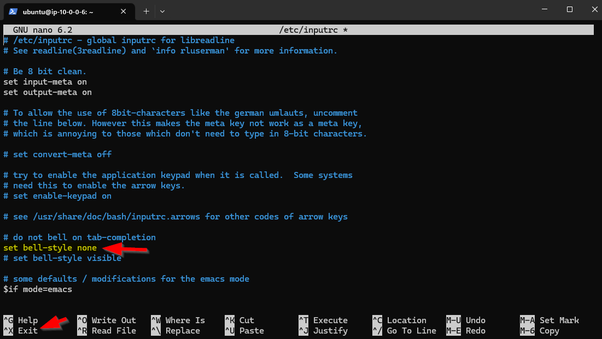

Haal de regel *set bell-style none* uit commentaar door het hekje vooraan weg te halen.

De ssh-sessie verlaten en opnieuw aanmelden over ssh om het resultaat te bekomen.

Als dat niet werkt, dan kan je het proberen met het verwijderen van de pc-speaker-kernelmodule (als deze geïmplementeerd is) met

***sudo rmmod pcspkr***

### **De webserver installeren** 

We installeren de nginx-webserver. Maar eerst updaten we alle geïnstalleerde pakketten naar hun laatste versie.

​	***sudo apt update*** 

​	- dit zorgt er voor dat de computer de laatste versies van alle pakketten kent

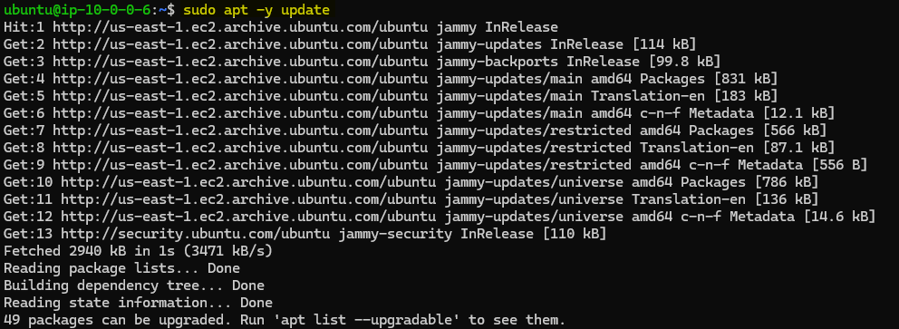

​	

***sudo apt -y upgrade***

​	- dit upgrade alle pakketten naar hun laatste versie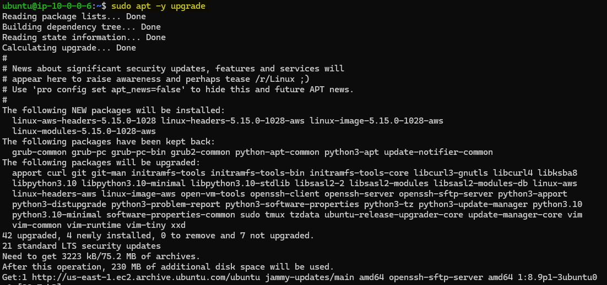

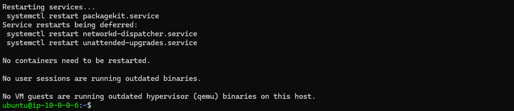

Herstart de Webserver-Instance met 
**sudo reboot**

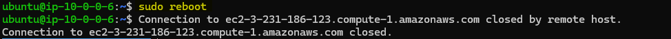

Nu installeren we de webserver met
***sudo apt -y install nginx***

​	- dit installeert de nginx-webserver

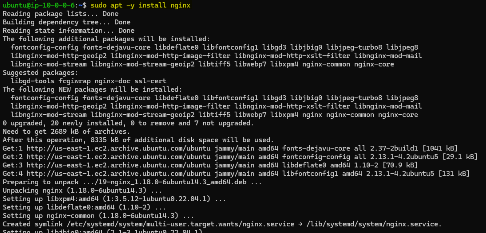

​	We controleren of 

- nginx draait
- er wordt geluisterd op  poort 80

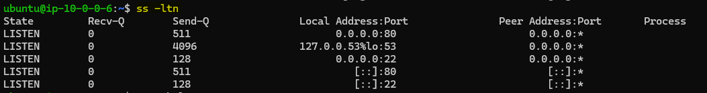

### **De webserver lokaal testen** 

We testen lokaal of de webserver werkt. Omdat we op een Linux Server zitten en geen GUI hebben, moeten we dit dus doen met een Text-based-browser

- installeer lynx 

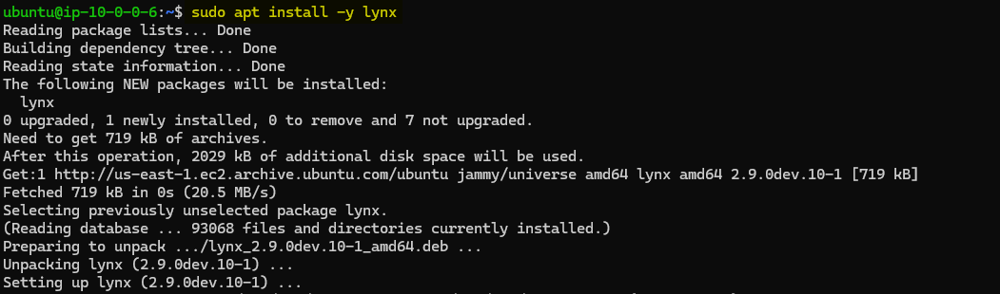

- en surf naar 127.0.0.1

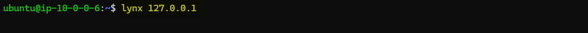

- of surf naar localhost

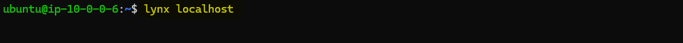

Je zou op onderstaande pagina moeten uitkomen. De webbrowser verlaten doe je met *Q*

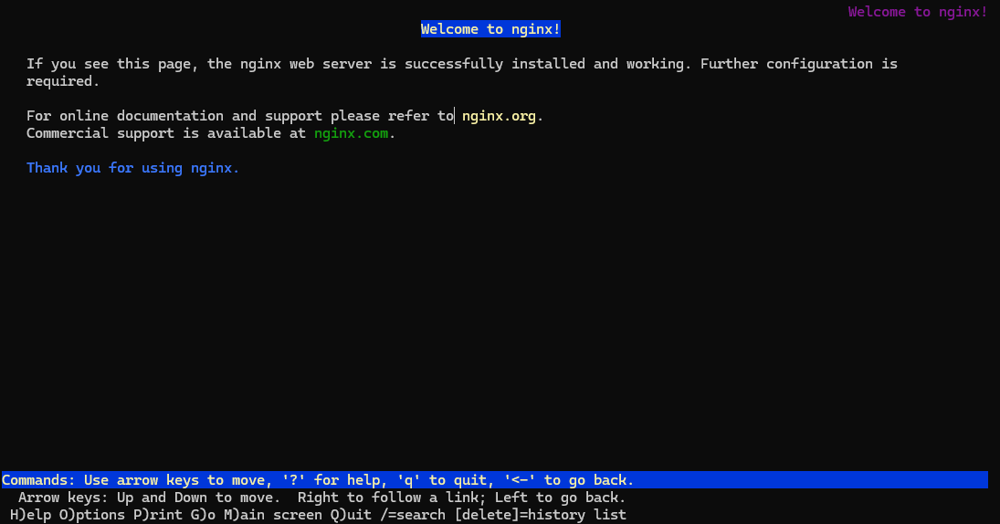

### **De webserver vanop de laptop testen en Firewall aanpassen**

Surf vanop je laptop naar het publieke IP van de website over **http** (voor het testen van poort 80)

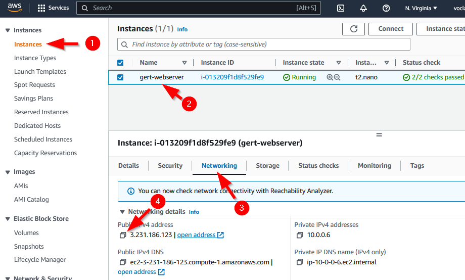

De website blijft een heel aantal minuten gewoon hangen bij het laden

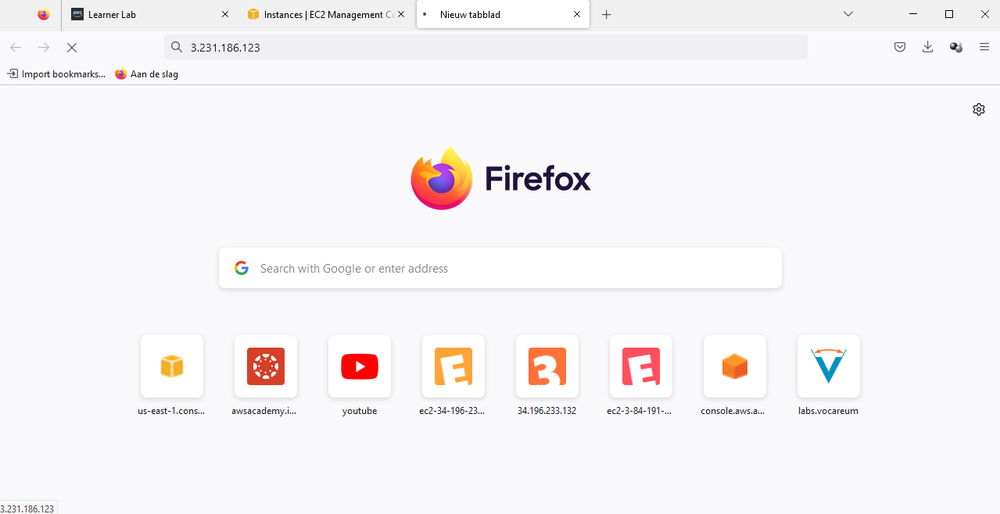

Na een hele tijd krijgen we *The connection was reset*.  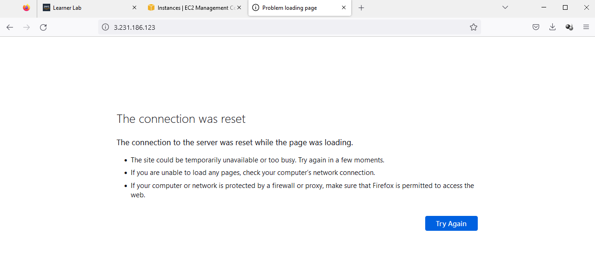

Het blijkt dus nog niet te werken!

Omdat dit niet werkt zoeken we uit of er http-traffic aankomt op de Webserver

- ***sudo tcpdump -i enX0 port 80***            (als enX0 de naam is van jouw NIC, wat je kan zien met het commando *ip a*. De naam had ook iets kunnen zijn als eth0 of enp0s3 of ens33 of ...)
- We surfen over http van de laptop naar het extern IP-adres van de Webserver (of refreshen)
- We kijken wat er toekomt en vertrekt van pakketjes op de Webserver

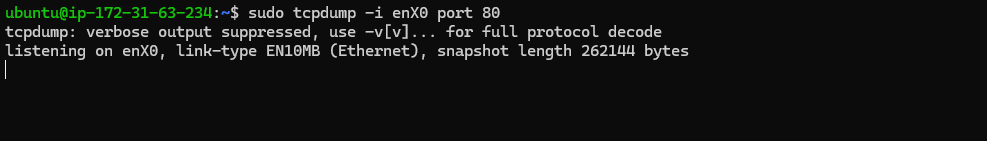

We zien dat er geen enkel pakketje aankomt. Er komt dus geen externe trafiek binnen op de webserver. De trafiek wordt voordien al ergens weggefilterd.

Stop het sniffen met *CTRL-C*

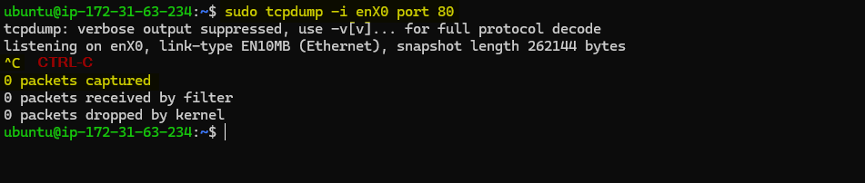

PS: Het kan zijn dat je toch wat pakketjes ziet die komen van een APIPA adres (=169.254.0.0/16), maar niet van een extern IP 

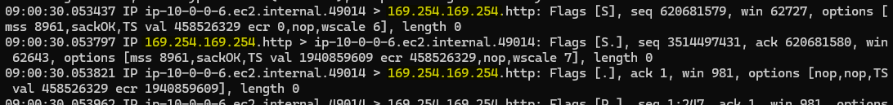

Het surfen werkt niet omdat de trafiek wordt weggefilterd op AWS-niveau en meer bepaald via de Security Group. Dit moeten we dus oplossen.

### **Toevoegen van een nieuwe inbound rule in de Security Group die inkomende trafiek naar poort 80 toelaat.**

Klik op de *Security Group* om deze aan te passen

Klik op *Edit inbound rules*

Klik op *Add rule* en voeg een rule toe die inkomend HTTP verkeer toelaat over IPv4 van overal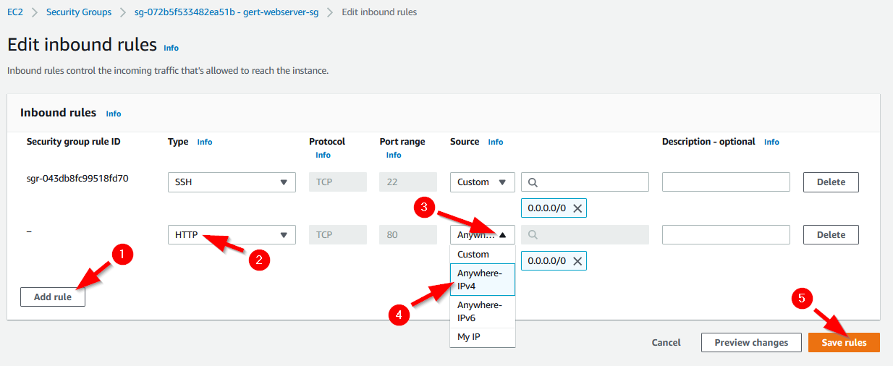

Het toevoegen is gelukt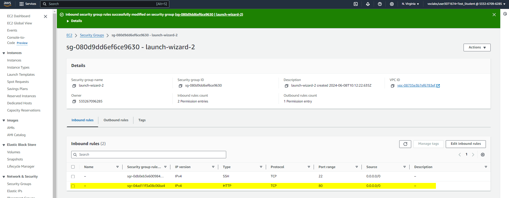

We gaan opnieuw testen of het surfen werkt

We beginnen eerst met sniffen…

- sudo tcpdump -i eth0 port 80            (als eth0 de naam is van jouw NIC)
- We surfen opnieuw vanaf de laptop naar het extern IP-adres van de Webserver via http (of Refresh)
- We kijken wat er toekomt en vertrekt van pakketjes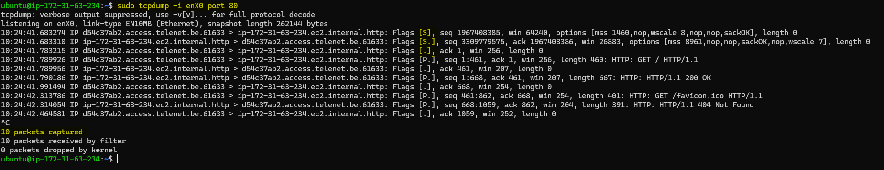

We zien dat er nu wel pakketjes aankomen van een extern adres en terug vertrekken naar dat extern adres.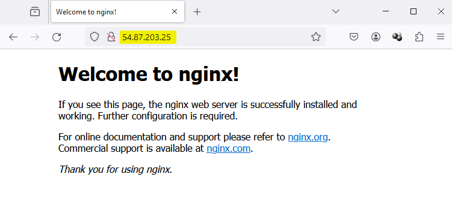

De website werkt!
