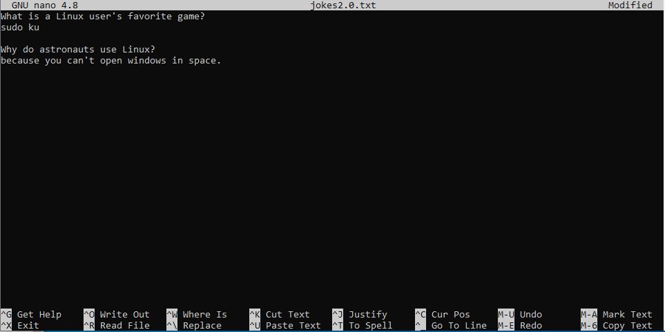
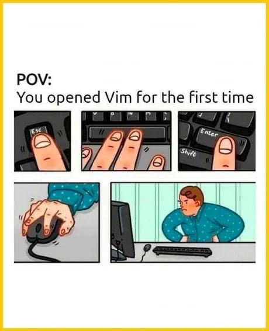

# Bestandsinhoud
## Bekijk een volledig bestand (cat & tac) 
Om de inhoud van bestanden te bekijken, kunnen we het commando `cat` gebruiken. Met dit commando wordt een pad naar een bestand als argument gebruikt: 
```bash
student@linux-ess:~$ cat /etc/os-release
PRETTY_NAME="Ubuntu 24.04.1 LTS"
NAME="Ubuntu"
VERSION_ID="24.04"
VERSION="24.04.1 LTS (Noble Numbat)"
VERSION_CODENAME=noble
ID=ubuntu
ID_LIKE=debian
HOME_URL="https://www.ubuntu.com/"
SUPPORT_URL="https://help.ubuntu.com/"
BUG_REPORT_URL="https://bugs.launchpad.net/ubuntu/"
PRIVACY_POLICY_URL="https://www.ubuntu.com/legal/terms-and-policies/privacy-policy"
UBUNTU_CODENAME=noble
LOGO=ubuntu-logo
```
Hiermee wordt de volledige bestandsinhoud in de terminal afgedrukt. 

?> <i class="fa-solid fa-circle-info"></i> Houd er rekening mee dat je niet kan scrollen in een CLI-serveromgeving. Als de inhoud van het bestand te groot is voor de terminalgrootte, scrolt het over het scherm en kan je alleen de laatste 30 tot 40 regels zien! Je kan overschakelen naar commando's zoals `more` of `less` (zie verder) om dit probleem op te lossen. 

Het `tac` commando is het `cat` commando geschreven in omgekeerde volgorde. Dit is ook precies wat dit commando doet, het toont de bestandsinhoud in omgekeerde volgorde (van onder naar boven): 
```bash
student@linux-ess:~$ tac /etc/os-release
LOGO=ubuntu-logo
UBUNTU_CODENAME=noble
PRIVACY_POLICY_URL="https://www.ubuntu.com/legal/terms-and-policies/privacy-policy"
BUG_REPORT_URL="https://bugs.launchpad.net/ubuntu/"
SUPPORT_URL="https://help.ubuntu.com/"
HOME_URL="https://www.ubuntu.com/"
ID_LIKE=debian
ID=ubuntu
VERSION_CODENAME=noble
VERSION="24.04.1 LTS (Noble Numbat)"
VERSION_ID="24.04"
NAME="Ubuntu"
PRETTY_NAME="Ubuntu 24.04.1 LTS"
```

De commando's `cat` en `tac` kunnen meerdere bestanden als argumenten gebruiken en zullen de inhoud in de terminal als volgt samenvoegen: 
```bash
student@linux-ess:~$ cat count1.txt
1 2 3
student@linux-ess:~$ cat count2.txt
4 5 6
student@linux-ess:~$ cat count1.txt count2.txt
1 2 3
4 5 6
```
Alle argumenten in het commando cat kunnen een voorafgaand pad hebben. In het bovenstaande voorbeeld gebruiken we dus _relatieve_ paden naar de bestanden die zich in de huidige werkmap bevinden (`/home/student`). Dit betekent dat het commando `cat /home/student/count1.txt /home/student/count2.txt` exact dezelfde output zou geven. 

## Eerste of laatste regels van een bestand weergeven (head & tail) 

Soms wil je niet de volledige inhoud van het bestand bekijken. Alleen de eerste of laatste paar regels volstaan (bijvoorbeeld in logbestanden). Om dit te bereiken kunnen we de commando's `head` of `tail` gebruiken: 
```bash
student@linux-ess:~$ head /etc/passwd
root:x:0:0:root:/root:/bin/bash
daemon:x:1:1:daemon:/usr/sbin:/usr/sbin/nologin
bin:x:2:2:bin:/bin:/usr/sbin/nologin
sys:x:3:3:sys:/dev:/usr/sbin/nologin
sync:x:4:65534:sync:/bin:/bin/sync
games:x:5:60:games:/usr/games:/usr/sbin/nologin
man:x:6:12:man:/var/cache/man:/usr/sbin/nologin
lp:x:7:7:lp:/var/spool/lpd:/usr/sbin/nologin
mail:x:8:8:mail:/var/mail:/usr/sbin/nologin
news:x:9:9:news:/var/spool/news:/usr/sbin/nologin
```
Standaard worden met dit commando de eerste 10 regels van een bestand weergegeven. Bij gebruik van `tail` worden de laatste 10 regels weergegeven: 
```bash
student@linux-ess:~$ tail /etc/passwd
polkitd:x:991:991:User for polkitd:/:/usr/sbin/nologin
syslog:x:103:104::/nonexistent:/usr/sbin/nologin
uuidd:x:104:105::/run/uuidd:/usr/sbin/nologin
tcpdump:x:105:107::/nonexistent:/usr/sbin/nologin
tss:x:106:108:TPM software stack,,,:/var/lib/tpm:/bin/false
landscape:x:107:109::/var/lib/landscape:/usr/sbin/nologin
fwupd-refresh:x:989:989:Firmware update daemon:/var/lib/fwupd:/usr/sbin/nologin
usbmux:x:108:46:usbmux daemon,,,:/var/lib/usbmux:/usr/sbin/nologin
sshd:x:109:65534::/run/sshd:/usr/sbin/nologin
student:x:1000:1000:student:/home/student:/bin/bash
```

We kunnen het aantal regels in de opdrachtuitvoer als volgt manipuleren (je kan het getal `2` door een willekeurig getal wijzigen): 
```bash
student@linux-ess:~$ head -2 /etc/passwd
root:x:0:0:root:/root:/bin/bash
daemon:x:1:1:daemon:/usr/sbin:/usr/sbin/nologin
```

Dit commando wordt vaak gebruikt voor logboekbestanden, waarbij de laatste regels meestal informatie bevatten over de laatste gebeurtenissen. bv: 
```bash
student@linux-ess:~$ tail -5 /var/log/auth.log
2024-10-09T19:30:48.004065+00:00 linux-ess sshd[1145]: Server listening on :: port 22.
2024-10-09T19:30:49.947204+00:00 linux-ess sshd[1147]: Accepted password for student from 192.168.234.1 port 52232 ssh2
2024-10-09T19:30:49.949910+00:00 linux-ess sshd[1147]: pam_unix(sshd:session): session opened for user student(uid=1000) by student(uid=0)
2024-10-09T19:30:49.964087+00:00 linux-ess systemd-logind[859]: New session 1 of user student.
2024-10-09T19:30:50.027265+00:00 linux-ess (systemd): pam_unix(systemd-user:session): session opened for user student(uid=1000) by student(uid=0)
```

?> <i class="fa-solid fa-circle-info"></i> We kunnen zelfs logbestanden live bekijken door `tail -f` (`-f` staat voor _follow_) te gebruiken. Hiermee wordt een actief proces gestart dat in eerste instantie de laatste 10 regels van een bestand weergeeft. Wanneer iets aan dit bestand wordt toegevoegd, wordt het live toegevoegd aan de opdrachtuitvoer. Om dit actieve proces te beëindigen, gebruik je `ctrl+c`. 

## Scrollen door verschillende schermen van de inhoud van een bestand (less) 

Bij het bekijken van grote bestanden met `cat` is het je misschien opgevallen dat de terminal alleen het laatste stukje van de inhoud toont. We kunnen commando's als `more` en `less` gebruiken om de hele content te bekijken (en er doorheen te scrollen). Bij `more` kun je alleen naar beneden scrollen en dit één scherm tegelijk door op de _spatiebalk_ of _page down_ te drukken. Met `less` kun je ook omhoog scrollen door op _page up_ te drukken. Met `less´` kan scrollen ook met maar één regel worden gedaan door het _pijltje omhoog_ of _pijltje omlaag_ te gebruiken. Om `more` of `less` af te sluiten kun je simpelweg op _q_ of _ctrl+c_ drukken. 
```bash
student@linux-ess:~$ less /var/log/dpkg.log
2024-10-06 13:17:28 startup archives unpack
2024-10-06 13:17:28 install unzip:amd64 <none> 6.0-28ubuntu4.1
... output omitted
2024-10-09 19:02:21 status half-configured man-db:amd64 2.12.0-4build2
2024-10-09 19:02:21 status installed man-db:amd64 2.12.0-4build2
```
?> <i class="fa-solid fa-circle-info"></i> Wist je dat manpages standaard ook geopend worden met `less`. Je kan dus ook zoeken in bestanden die zijn geopend met `less` door _/_ en _n_ te gebruiken voor volgende, _N_ voor vorige. Als je hoofdletterongevoelig wilt zoeken, kan je _-i_ typen. Je kan ook naar de eerste regel gaan door op _g_ te drukken en naar de laatste regel door op _G_ te drukken. 

## Maak bestanden met inhoud 
### Echo gebruiken 
Er zijn verschillende manieren om bestanden te maken en er inhoud aan toe te voegen. Een van deze manieren is door het commando `echo` te gebruiken. Het standaardgedrag van dit commando is dat deze op het scherm afdrukt wat je als argument gebruikt: 
```bash
student@linux-ess:~$ echo hello world
hello world
```
Je zou aanhalingstekens kunnen gebruiken om duidelijker te maken wat het argument van het `echo`-commando is (dit heeft ook invloed op het gedrag van het commando, wat we in een later hoofdstuk zullen zien): 
```bash
student@linux-ess:~$ echo "hello world"
hello world
```
Dit is waar het interessant wordt. We kunnen een `>`-teken gebruiken om de shell te vertellen de uitvoer van het vorige commado te nemen en deze naar een bestand te schrijven in plaats van naar het scherm: 
```bash
student@linux-ess:~$ echo hello world > demofile
```
Dit zorgt er dus eigenlijk voor dat de uitvoer van het `echo`-commando niet in de shell wordt getoond, maar wordt geschreven (of _omgeleid_) naar het bestand `demofile`. We kunnen dit als volgt bevestigen: 
```bash
student@linux-ess:~$ ls
demofile
student@linux-ess:~$ cat demofile
hello world
```
Standaard wordt een file overschreven bij het gebruik van het `>`-teken. Als je aan een bestand wilt toevoegen in plaats van het te overschrijven, kan je dit doen met `>>` 
```bash
student@linux-ess:~$ cat demofile
hello world
student@linux-ess:~$ echo hello everyone >> demofile
student@linux-ess:~$ cat demofile
hello world
hello everyone
```
Het concept dat we hier gebruiken heet _output redirection_ waar we het in een later hoofdstuk over zullen hebben. 

### cat gebruiken 
We kunnen ook het cat-commando gebruiken in combinatie met de _output redirection (`>`)_ zoals weergegeven in het onderstaande voorbeeld. Na het typen van de opdracht kunnen we een of meer regels typen. Wanneer je klaar bent met het typen van de bestandsinhoud, kan je de toetsenbordcombinatie `ctrl` en `d` (ctrl + d) gebruiken om de shell te vertellen dat je klaar bent (dit stuurt een _end of file_ (EOF) -signaal naar het lopende proces): 
```bash
student@linux-ess:~$ cat > jokes.txt    
What is a Linux user's favorite game?
sudo ku                                      CTRL+d
student@linux-ess:~$ cat jokes.txt
What is a Linux user's favorite game?
sudo ku
```
We drukten __ctrl+d__ na de regel `sudo ku`

#### Bestanden kopiëren met cat 
Wetende wat we hebben geleerd over het gebruik van _output redirection_ (`>`) kunnen we dit als volgt gebruiken om de inhoud van een bestand naar een ander bestand te kopiëren: 
```bash
student@linux-ess:~$ cat jokes.txt > jokes2.0.txt
student@linux-ess:~$ cat jokes2.0.txt
What is a Linux user's favorite game?
sudo ku
```

### Een aangepaste eindmarkering gebruiken 
Een andere methode voor het maken van bestanden met een bepaalde inhoud is het definiëren van een _aangepaste eindmarkering_ voor de opdracht `cat > FILENAME` zoals weergegeven in het onderstaande voorbeeld. Door dit te doen, hoef je de toetsenbordcombinatie `crtl + d` niet te gebruiken om de invoer te stoppen en de tekst naar het bestand te schrijven, maar kan je gewoon het woord typen (`end` in het voorbeeld) dat wordt gegeven als de aangepaste eindmarkering: 
```bash
student@linux-ess:~$ cat > schooltasks.txt << end
> create new vm
> learn new commands
> play minecraft
> end
student@linux-ess:~$ cat schooltasks.txt
create new vm
learn new commands
play minecraft
```

### nano gebruiken 
Ten slotte kunnen we een teksteditor gebruiken om bestandsinhoud te bewerken/toe te voegen. Er zijn veel teksteditors beschikbaar. `nano` is er een die standaard op een Ubuntu-machine is geïnstalleerd. Je kan deze editor gebruiken met het commando `nano`, gevolgd door het pad naar een nieuw of bestaand bestand: 
```bash
student@linux-ess:~$ nano jokes2.0.txt
```
Er wordt een teksteditorvenster geopend zoals weergegeven in de onderstaande afbeelding, waar je kan navigeren met de pijltoetsen. Je kan inhoud toevoegen/bewerken/verwijderen met behulp van je toetsenbord. 



Onderaan het scherm zie je enkele van de sneltoetsen die je kunt gebruiken. Enkele van de meest interessante zijn: 
* _ctrl+s_: dit wordt gebruikt om de wijzigingen in hetzelfde bestand op te slaan. 
* _ctrl+o_: dit wordt gebruikt om de wijzigingen in een andere bestandsnaam op te slaan. Dit vraagt om een bestandsnaam en overschrijft het bestand als er al een bestand met dezelfde naam bestaat. 
* _ctrl+x_: sluit de teksteditor af en ga terug naar de prompt. Wanneer je wijzigingen in het bestand hebt aangebracht, wordt je gevraagd of je de wijzigingen wilt opslaan en als dat het geval is, moet je een bestandsnaam invoeren en op enter drukken. Het overschrijft het bestand als er al een bestand met dezelfde naam bestaat.  
  
* _shift+pijltjes_: selecteer een deel van de tekst.  
* _ctrl+k_: knip geselecteerde tekst of de hele regel (als er geen tekst is geselecteerd). 
* _ctrl +u_: plak alle geknipte inhoud.  
  
* _ctrl+w_: zoek een bepaalde tekst in het bestand (ctrl+q om in de tegenovergestelde richting te zoeken). 
* alt+w: ga naar het volgend voorkomen van de gezochte tekst 
* _ctrl+\_: zoeken en vervangen - geef het woord om naar te zoeken en geef dan het woord om het te vervangen door (gebruik dan yes, no, all, ...) (je kan ctrl+< typen)  
* _ctrl+/_: ga naar een bepaalde regel (en kolom). (je kan ook _ctrl+-_ typen) 
  
* _alt+u_: maak de laatste wijziging ongedaan. 
* _alt+e_: voer de laatste wijziging opnieuw uit.  

* _alt+s_: schakel automatisch tekstterugloop over regels in/uit.  
* _alt+n_: toon/verberg regelnummers. 

* _ctrl+home_: ga naar de eerste lijn 
* _ctrl+end_: ga naar de laatste regel 
  

?> <i class="fa-solid fa-circle-info"></i> Als je een specifieke tekst wilt knippen, kan je deze eerst selecteren door op _shift+pijltjestoetsen_ te drukken. Gebruik vervolgens _ctrl+k_ om te knippen en daarna _ctrl+u_ om te plakken.  

?> <i class="fa-solid fa-circle-info"></i> De snelste manier om nano op te slaan en af te sluiten is door _ctrl+s_ te typen (om de wijzigingen op te slaan) gevolgd door _ctrl+x_ (om nano af te sluiten).  

?> Een andere zeer populaire teksteditor in Linux-systemen is `vi`. Deze editor is erg krachtig, maar heeft ook een steile leercurve. In deze cursus behandelen we `vi` niet, Maar voel je vrij om zelf te experimenteren. `vim`, een eenvoudigere variant van `vi` is ook op je systeem geïnstalleerd. Om hier meer over te leren, is er een tutor beschikbaar met het commando: `vimtutor`. 
 
