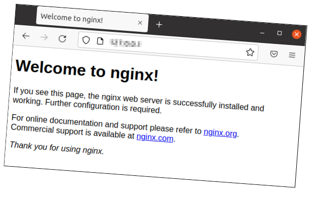

# Lab <!-- {docsify-ignore} --> 
### **De Default-website**

Indien men naar het IP adres of de DNS-naam van de webserver surft, ziet men de Default website. 

#### **Surfen naar de Default-website**

Indien we surfen naar het IP adres (of DNS naam) krijgen we een standaard webpagina te zien. Deze wordt getoond totdat we zelf eigen webpagina's gaan plaatsen op de webserver.

### **Aanpassen van de Default-website**

#### **Zoeken van de configuratiefile**

Via de manpage zijn we achter de naam van de nginx-configuratiefile gekomen. 

Meestal is het zo dat een configuratiefile van een service wordt opgesteld als volgt: *servicenaam.conf*

In dit geval zou dat *nginx.conf* zijn. 

Configuratiefiles staan meestal ergens in */etc*

Indien we deze file willen zoeken kunnen we dit ook via de methodes *find* en *locate*.

Zoek de file *nginx.conf* met find in */etc/* of één van zijn submappen.

→ ***sudo find /etc -name "nginx.conf"***

Zoek de file ook eens met  ***locate nginx.conf*** 

TIP: indien *locate* nog niet geïnstalleerd blijkt te zijn, installeer het pakket dan met *sudo apt install plocate* 

→ ***sudo apt install plocate***

→ ***locate nginx.conf***  (of *pijltje omhoog* voor historiek of vinden met *CTRL-R* en dan reverse zoeken naar de letters *loc*)

TIP: Gebruikt *CTRL-R* zoveel als mogelijk om reverse te zoeken naar een vorig commando en dit dan eventueel aan te passen vooraleer je het uitvoert.

#### **Bekijken van de configuratiefile met *cat***

Bekijk de configuratiefile met *cat*

***cat /etc/nginx/nginx.conf***

  => de lijnen scrollen over meerdere schermen voorbij 

#### **Bekijken van de configuratiefile met een pager**

Bekijk de configuratiefile met *less*

***less /etc/nginx/nginx.conf***

=> je kan nu navigeren doorheen de file met de pijltjes of *PgUp* en *PgDn*. 

Zoek binnen *less* naar de regels met de tekst *log*

TIP: Zoeken kan je door de *slash* (/) te typen en dan je *zoekstring*. Naar het volgende voorkomen gaan kan door het drukken van de letter *n*. Naar het vorige door het drukken van de *hoofdletter N*.
*g* brengt je terug naar de eerste lijn. *G* brengt je naar de laatste lijn.

=> je ziet een *access-log* en een *error-log*

  => bekijk beide files met *less*

​     => in de *access-log* file zie je wanneer er mensen naar je website zijn gekomen

​     => in de *error-log* file zitten de foutmeldingen (en eventueel nu nog niets) 

​       => met het commando ***file /var/log/nginx/access.log*** kan je zien dat de file ASCII-tekst 
 		bevat of dat de file nog leeg is

 => je kan de grootte van een bestand ook bekijken met *ls -lh*

→ ***ls -lh /var/log/nginx***

#### **Editeren van de configuratiefile met nano**

De algemene configuratie van onze webserver is neergeschreven in de *nginx.conf* file

Editeer deze file met nano.

→ ***nano /etc/nginx/nginx.conf***

  => we zien dat de file read-only wordt geopend

Sluit de editor met CTRL-X

Voer het commando opnieuw uit met *sudo !!*

→ ***sudo !!***

Verwijder de onderste 21 lijnen (vanaf  #mail {  )

  → met ***CTRL-K*** kan je ineens een volledige lijn weghalen

Sla de wijzigingen op en sluit nano af 

→ ***CTRL-X , y(es) , <enter>***

#### **Bekijken van de configuratiefile met tail**

Bekijk de laatste 10 lijnen van de configuratiefile met het *tail*-commando

→ ***tail /etc/nginx/nginx.conf*** 

  → of   *tail !$*  want *!$* is de laatste parameter van het vorig commando

Op de voorlaatste lijn zie je een include van alle bestanden in de map *sites-enabled*.

Tip: Alle websites worden geconfigureerd in de map *sites-available*. Enkel de websites die hun configuratiefiles ook in *sites-enabled* hebben staan, zullen worden opgestart bij het starten van de nginx webserver. 
De configuratie van een website wordt standaard aangemaakt in *sites-available*. In *sites-enabled* zien we configuratiefiles terugkomen, maar dan als *link* naar diezelfde file in *sites-available*.

Je kan dit bekijken met

 ***ls -l /etc/nginx/sites-enabled/***

→ **l**rwxrwxrwx 1 root root 34 Feb 8 13:54 default **->** /etc/nginx/sites-available/default

Bekijk, met *less*, de enige file die je vindt in de map *sites-enabled*.

Zoek naar de tekst *root* en kijk naar welke map dat deze *Directive* wijst.

=> De *root-directive* geeft aan in welke directory er gezocht wordt naar de html-files (=webpagina's) en dus ook naar de *index-file* (=hoofdpagina of landing-page) bij het bezoeken van deze website.

→ ***less /etc/nginx/sites-available/default***

  → ***/root*** (zoeken naar regels met root)

Doe een oplijsting van wat er in */var/www/html*  staat

→ ***ls -l /var/www/html***

Editeer, met *nano*, de enige file in deze directory

→ ***sudo nano /var/www/html/index.nginx-debian.html***

Verander tweemaal de tekst *Welcome to nginx!* naar ***Welcome to LinusCraft*!** en sla op met *CTRL+s* en dan *CTRL+x*

(het eerste voorkomen zorgt voor de titel in het tabblad van je webbrowser, het tweede voorkomen is de tekst zichtbaar in de Webpagina)

Surf opnieuw naar je Website over HTTP via het IP adres of DNS naam.

Indien je de aangepaste inhoud nog niet ziet, dien je te drukken op *CTRL-F5*. Dit zorgt ervoor dat de pagina in je webbrowser zeker gerefreshed wordt.

We zien dus dat de webserver zijn website-files standaard gaat zoeken in de directory /var/www/html.  Linus kan dus best daar zijn website-files plaatsen.

### **Eigen Website**-files overbrengen

Linus heeft op zijn laptop een eigen website ontwikkelt en wilt die overbrengen naar de Webserver. Hij heeft de website-files gezipped en kan deze overbrengen met *SCP* omdat *SSH* reeds werkt. 

#### Website overbrengen

Download eerst de zipfile door [hier](/06_filecontents/LinusCraft.zip) te klikken.

Gebruik scp (vanuit Powershell) om je gedownload bestand over te brengen naar je Webserver.

***scp   -i  "\<pad naar ssh-key\>"  \<pad naar zipfile\>  ubuntu@\<webserver-ip\>:*** 

Opgelet! Vergeet de dubbele punt niet achteraan de commandoregel!

De file bevindt zich na het uploaden op de server in de homefolder van de gebruiker ubuntu.

### **Unzippen van de website-files**

We zoeken naar een package met de tekst "unzip".

→ ***sudo apt search unzip***

We zien als derdelaatste in de lijst de package unzip.

Installeer de package unzip

→ ***sudo apt install unzip***

Zoek in de manpage van unzip uit hoe je de gedownloade file kan unzippen. Je kan ook altijd zoeken naar 'EXAMPLES' om voorbeelden te zien.

Hint: Indien er spaties in een bestandsnaam zitten, moet je deze telkens escapen met een backslash(\), of moet je de gehele bestandsnaam omsluiten met dubbele quotes (") of single quotes ('). Je kan natuurlijk ook altijd TAB-completion gebruiken!

→ ***man unzip*** → Zoek met de slash (/) naar *EXAMPLES*

→ ***unzip "LinusCraft.zip"***

Controleer of je een directory hebt bijgekregen, genaamd *LinusCraft*

Doe een tree van de dir "be" om de file-tree te bekijken

→ ***sudo apt install tree***

→ tree LinusCraft

Je ziet de files die de website bevat.

### **Kopiëren van de Website- files naar een nieuwe webdir**

Kopieer de inhoud van de directory *LinusCraft* naar */var/www/html*

→ ***sudo cp ~/LinusCraft/*  /var/www/html***

Doe een ls -l /var/www/html om te kijken of dit gelukt is

Doe een tree /var/www/html  om te kijken of dit gelukt is

**Bekijk het resultaat in je browser**

Surf vanaf je laptop naar de Website

Hint: Het kan zijn dat je de nieuwe website pas te zien krijgt na het drukken van CTRL-F5

