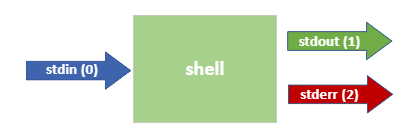

# Geavanceerde commandostructuren 

## shell expansion 

Alle woorden die je typt na de prompt om een commando te vormen, worden geïnterpreteerd door de shell. De command line interpreter, beter gekend als de shell, in ubuntu is `bash`, wat staat voor `Bourne Again SHell`. 

De opdrachtregel wordt in stukken gesneden telkens de interpreter een of meer `opeenvolgende spaties` of `tabs` ziet en dit argumenten vormt (de spaties en tabs worden verwijderd). Het eerste argument is het `commando` en alle andere argumenten worden als waarden aan dit commando gegeven. Dit mechanisme wordt `shell expansion` genoemd. Dit is de reden dat opeenvolgende spaties worden samengevoegd met het echo-commando:  
```bash
student@linux-ess:~$ echo I like to game                                                # één spatie tussen de woorden 
I like to game
student@linux-ess:~$ echo     I    like            to                   game            # meerdere spaties tussen de woorden
I like to game
student@linux-ess:~$ echo I    like     to     game                                     # één tab tussen de woorden
I like to game
student@linux-ess:~$ echo     I              like        to                     game    # meerdere tabs tussen de woorden
I like to game
student@linux-ess:~$ echo   I             like          to                      game    # meerdere spaties & tabs tussen de woorden
I like to game
```

### Enkele en dubbele aanhalingstekens 

Als we de spaties willen behouden, hebben we drie opties. 
De `eerste optie` is het gebruik van `dubbele aanhalingstekens`. Met deze optie blijven de spaties behouden en worden variabelen nog steeds geïnterpreteerd. 
```bash
student@linux-ess:~$ action="play       games"
student@linux-ess:~$ echo    I             like      to                  $action    # meerdere spaties & tabs tussen de woorden
I like to play games
student@linux-ess:~$ echo "    I             like      to                  $action"    # meerdere spaties & tabs tussen de woorden
    I             like      to                  play       games
```

De `tweede optie` is het gebruik van `enkele aanhalingstekens`. Met deze optie blijven de spaties behouden, maar wordt de tekst niet geïnterpreteerd. Variabelen worden dus niet gewijzigd in hun waarde. 
```bash
student@linux-ess:~$ action='play       games'
student@linux-ess:~$ echo    I             like      to                  $action    # meerdere spaties & tabs tussen de woorden
I like to play games
student@linux-ess:~$ echo "    I             like      to                  $action"    # meerdere spaties & tabs tussen de woorden ingesloten door dubbele quotes
    I             like      to                  play       games
student@linux-ess:~$ echo '    I             like      to                  $action'    # tussen single quotes wordt alles letterlijk geïnterpreteerd
    I             like      to                  $action
```

De `derde optie` is om  elke spatie te escapen. Gebruik dit mechanisme niet. Gebruik beter quotes! 
```bash
student@linux-ess:~$ action='play       games'  
student@linux-ess:~$ echo \ \  I \ \ \ \ \ \ \ like \ \ to \ \ \ \ \ \ \ \ \ \ \ \ \ \ $action
    I       like   to              play games
student@linux-ess:~$ echo \ \  I \ \ \ \ \ \ \ like \ \ to \ \ \ \ \ \ \ \ \ \ \ \ \ \ \$action
    I       like   to              $action
```

## File globbing 
Bij het zoeken naar bestanden kunnen we de shell de bestandsnamen dynamisch laten genereren door een bepaald patroon te geven. Bijvoorbeeld: we willen alle bestanden vinden die beginnen met `temp` gevolgd door welke tekst of extensie dan ook. Het concept waarbij we dynamisch bestandsnamen genereren, wordt _file globbing_ genoemd. Er zijn een paar speciale tekens die we kunnen gebruiken, zoals te zien is in het onderstaande voorbeeld: 
```text
student@linux-ess:~/globbing$ ls
a  afilea  file  File  file1  file2  file3  File4  File5  filea  fileabc  FileABC  fileb  filebc  Filec 
student@linux-ess:~/globbing$ ls file*
file  file1  file2  file3  filea  fileabc  fileb  filebc
student@linux-ess:~/globbing$ ls *a
a  afilea  filea
student@linux-ess:~/globbing$ ls *a*
a  afilea  filea  fileabc
student@linux-ess:~/globbing$ ls F*
File  File4  File5  FileABC  Filec
student@linux-ess:~/globbing$ ls f*c
fileabc  filebc
student@linux-ess:~/globbing$ ls F*ile*
File  File4  File5  FileABC  Filec
```
Een sterretje (`*`) in _file globbing_ betekent dat nul, één of meer tekens kunnen zijn wat ze willen. Dit wordt vaak een wildcard genoemd dat we één of meerdere keren in een bestandsnaam kunnen gebruiken. Een andere optie is een vraagteken (`?`) dat wordt geïnterpreteerd als precies _één karakter_ kan zijn wat het wil, zoals te zien is in het volgende voorbeeld: 
```text
student@linux-ess:~/globbing$ ls
a  afilea  file  File  file1  file2  file3  File4  File5  filea  fileabc  FileABC  fileb  filebc  Filec
student@linux-ess:~/globbing$ ls ?
a
student@linux-ess:~/globbing$ ls ????
file  File
student@linux-ess:~/globbing$ ls file?
file1  file2  file3  filea  fileb
student@linux-ess:~/globbing$ ls file??
filebc
student@linux-ess:~/globbing$ ls File??
ls: cannot access 'File??': No such file or directory
student@linux-ess:~/globbing$ ls ?fi*
afilea
```

Ten slotte kunnen we ook vierkante haken (`[ ]`) gebruiken die meestal een of meer tekens tussen de haakjes bevatten. De haakjes definiëren één teken dat overeenkomt met een van de tekens tussen de haakjes: 
```text
student@linux-ess:~/globbing$ ls
a  afilea  file  File  file1  file2  file3  File4  File5  filea  fileabc  FileABC  fileb  filebc  Filec
student@linux-ess:~/globbing$ ls file[12]
file1  file2
student@linux-ess:~/globbing$ ls file[a]
filea
student@linux-ess:~/globbing$ ls file[1ac]
file1  filea  
```
Bij het gebruik van haakjes kunnen we ook bereiken definiëren: 
```text
student@linux-ess:~/globbing$ ls
a  afilea  file  File  file1  file2  file3  File4  File5  filea  fileabc  FileABC  fileb  filebc  Filec
student@linux-ess:~/globbing$ ls file[a-z]
filea  fileb
student@linux-ess:~/globbing$ ls File[A-Z]*
FileABC
student@linux-ess:~/globbing$ ls File[a-zA-Z]*
FileABC  Filec
student@linux-ess:~/globbing$ ls file[0-9]
file1  file2  file3
```
Bij het gebruik van haakjes kunnen we ook het opgegeven bereik uitsluiten door aan het begin een hoedje (^) of een uitroepteken (!) op te geven: 
```text
student@linux-ess:~/globbing$ ls
a  afilea  file  File  file1  file2  file3  File4  File5  filea  fileabc  FileABC  fileb  filebc  Filec
student@linux-ess:~/globbing$ ls file[a-z]*
filea  fileabc  fileb  filebc
student@linux-ess:~/globbing$ ls file[^a-z]*
file1  file2  file3
student@linux-ess:~/globbing$ ls file[!a-z]*
file1  file2  file3
```

### Voorkom file globbing

We kunnen file globbing van bestanden voorkomen door de speciale tekens in onze opdracht te _escapen_. Escapen kan door een `\` voor het karakter te plaatsen. Dit vertelt de shell om het volgende teken te interpreteren als een regulier symbool in plaats van de speciale betekenis: 
```bash
student@linux-ess:~/globbing$ ls
 File4   File5   FileABC   Filec   afilea  'file*'   file1   file2   file3   filea   fileb   filebc
student@linux-ess:~/globbing$ ls file*
'file*'   file1   file2   file3   filea   fileb   filebc
student@linux-ess:~/globbing$ ls file\*
'file*'
student@linux-ess:~/globbing$ echo **** TITLE ****
File4   File5   FileABC   Filec   afilea  'file*'   file1   file2   file3   filea   fileb   filebc TITLE  File4   File5   FileABC   Filec   afilea  'file*'   file1   file2   file3   filea   fileb   filebc
student@linux-ess:~/globbing$ echo \*\*\*\* TITLE \*\*\*\*
**** TITLE ****
```

?> Je kan je voorstellen wat er zou gebeuren als we het bestand _file*_ zouden verwijderen zonder escaping te gebruiken. 


Je kan file globbing ook voorkomen door de tekst te omsluiten met dubbele- of enkele quotes:
```bash
student@linux-ess:~/globbing$ ls
 File4   File5   FileABC   Filec   afilea  'file*'   file1   file2   file3   filea   fileb   filebc
student@linux-ess:~/globbing$ echo **** TITLE ****
File4   File5   FileABC   Filec   afilea  'file*'   file1   file2   file3   filea   fileb   filebc TITLE  File4   File5   FileABC   Filec   afilea  'file*'   file1   file2   file3   filea   fileb   filebc
student@linux-ess:~/globbing$ echo "**** TITLE ****"
**** TITLE ****
student@linux-ess:~/globbing$ echo '**** TITLE ****'
**** TITLE ****
```


​    
## Aliases 
Aliassen zijn een manier om een eenvoudige naam te geven aan een vrij complex commando, zoals hieronder te zien is: 
```bash
student@linux-ess:~$ alias show='ls -lah'
student@linux-ess:~$ show
total 16K
drwxr-xr-x 1 student student  512 Jun  4 22:19 .
drwxr-xr-x 1 root  root       512 Mar  7 17:09 ..
-rw------- 1 student student 1.1K May 22 22:41 .bash_history
-rw-r--r-- 1 student student  220 Mar  7 17:09 .bash_logout
-rw-r--r-- 1 student student 3.7K Jun  4 21:25 .bashrc
...
```

Aliassen worden vaak gebruikt voor het implementeren van een extra beveiligingslaag: 
```bash
student@linux-ess:~$ alias rm='rm -i'
student@linux-ess:~$ rm jokes.txt
rm: remove regular file 'jokes.txt'? y
```

Je hebt al aliassen gebruikt. Bijvoorbeeld het ls commando dat we gebruiken drukt gekleurde tekst af in de uitvoer. Dit komt omdat we de alias gebruiken. Als we een `\` voor een commando plaatsen, wordt het commando gebruikt in plaats van de alias. 
```bash
student@linux-ess:~$ alias ls
alias ls='ls --color=auto'
```

Als we een alias willen verwijderen, kunnen we het unalias commando gebruiken: 
```bash
student@linux-ess:~$ unalias rm
```

?> Als je een alias wilt behouden voor toekomstig gebruik (telkens opnieuw bij het openen van een nieuwe shell, na een herstart, ...) kan je deze toevoegen aan een (nieuw) verborgen bestand in je homefolder met de naam `.bash_aliases` 

```bash
student@linux-ess:~$ cat .bash_aliases
alias memory='free --giga -h'
student@linux-ess:~$ alias
alias alert='notify-send --urgency=low -i "$([ $? = 0 ] && echo terminal || echo error)" "$(history|tail -n1|sed -e '\''s/^\s*[0-9]\+\s*//;s/[;&|]\s*alert$//'\'')"'
alias egrep='egrep --color=auto'
alias fgrep='fgrep --color=auto'
alias grep='grep --color=auto'
alias l='ls -CF'
alias la='ls -A'
alias ll='ls -alF'
alias ls='ls --color=auto'
alias memory='free --giga -h'
student@linux-ess:~$ memory
               total        used        free      shared  buff/cache   available
Mem:            3.9G        301M        3.1G        1.0M        492M        3.3G
Swap:             0B          0B          0B
student@linux-ess:~$
```

De volgorde waarin de shell controleert op opdrachten in de shell:  
* Aliassen. Namen die door de aliasopdracht zijn ingesteld en die een bepaald commando met een reeks opties vertegenwoordigen.  
* Ingebouwde commando's. Dit is een commando dat in de shell is ingebouwd. 
* Bestandssysteem commando's. Deze commando's worden opgeslagen in en uitgevoerd vanuit het bestandssysteem van de computer. (Dit zijn de commando's uit directories die worden aangegeven door de waarde van de variabele PATH). 

## I/O-redirection 
### I/O-streams 
Bij het werken met de shell werken we eigenlijk met iets dat streams wordt genoemd. Er zijn 3 basisstreams beschikbaar bij het gebruik van een shell: 


Het meest basic voorbeeld heet `stdin`. Dit is de stream die we gebruiken om gegevens in de shell in te voeren met behulp van ons toetsenbord. 

De uitvoer die wordt gegenereerd door commando's uit te voeren, wordt opgesplitst in twee afzonderlijke streams: 
* `stdout` geeft ons alle reguliere commando-uitvoer. Standaard wordt deze uitvoer op ons scherm afgedrukt. 
* `stderr` geeft ons alle foutmeldingen die een commando genereert. Standaard worden deze foutmeldingen op ons scherm afgedrukt. 
Omdat zowel `stdout` als `stderr` op ons scherm worden afgedrukt, merken we het verschil tussen de twee niet. 

Elke stream heeft zijn eigen identifier (=nummer) zoals te zien is in de afbeelding hierboven. Deze id's zijn belangrijk in de volgende paragrafen. 

### Stream redirection 
We kunnen elk van deze streams omleiden om de uitvoer _ergens anders_ te laten gaan. Vaak betekent 'ergens anders' naar een bestand. Dit betekent dat we reguliere uitvoer (stdout) en fouten (stderr) kunnen scheiden om in afzonderlijke bestanden te worden opgeslagen. Hieronder beginnen we met een voorbeeld van hoe je de standard output van een commando in een bestand kan opslaan: 
```bash
student@linux-ess:~$ ls / 1> listrootfolder
student@linux-ess:~$ head -6 listrootfolder
bin
boot
dev
etc
home
lib
```
De `1>` betekent dat we stream `1` omleiden naar het bestand `listrootfolder`. Stream `1` verwijst naar de `stdout` stream. Merk op dat in dit geval het nummer `1` optioneel is, dus het onderstaande commando werkt ook: 
```bash
student@linux-ess:~$ ls / > listrootfolder
```
Als de opdracht ook fouten genereert, worden deze nog steeds op ons scherm afgedrukt. 

?> Misschien herken je deze syntaxis zoals we hem eerder in hoofdstuk 5 hebben gebruikt. We gebruikten het commando `echo hello world > ourfile` om de string `hello world` naar het bestand `ourfile` te schrijven. 

Als we `stderr` willen omleiden, kunnen we hetzelfde concept als volgt gebruiken: 
```bash
student@linux-ess:~$ find / 2> /dev/null
```
In dit voorbeeld wordt elk bestand dat wordt gevonden (wat normale uitvoer is) op ons scherm afgedrukt. De fouten die worden gegenereerd (bijvoorbeeld niet in staat om in een bepaalde map te duiken om naar bestanden te zoeken vanwege gebrek aan privileges) worden niet op het scherm weergegeven omdat ze worden omgeleid naar het zwarte gat. 

Dit pad `/dev/null` wordt vaak `the void` of `the black hole/het zwarte gat` genoemd omdat we er zoveel "afval" in kunnen gooien als we willen. 

En we kunnen zelfs het omleiden van beide streams naar afzonderlijke bestanden in één opdracht combineren: 
```bash
student@linux-ess:~$ find / > results.txt 2> errors.txt
```

Als we zowel `stderr` als `stdout` naar hetzelfde bestand willen omleiden, kunnen we de operator `&>` als volgt gebruiken: 
```bash
student@linux-ess:~$ find / &> results_and_errors.txt
```

Als je naar een bestand wilt omleiden en de inhoud aan dat bestand wilt toevoegen, moet je twee `>>` gebruiken. Dit komt omdat slechts één `>` het bestand altijd leegmaakt voordat de inhoud wordt toegevoegd: 
```bash
student@linux-ess:~$ echo "text 1" > testfile
student@linux-ess:~$ cat testfile
text 1
student@linux-ess:~$ echo "text 2" > testfile
student@linux-ess:~$ cat testfile
text 2
student@linux-ess:~$ echo "text 3" >> testfile
student@linux-ess:~$ cat testfile
text 2
text 3
student@linux-ess:~$
```

## Control operators 
### Opdrachten scheiden 
We kunnen een `;` (puntkomma) gebruiken om meerdere commando's op één regel te scheiden. Elke opdracht kan zijn eigen opties en argumenten hebben en deze worden sequentieel uitgevoerd. De shell wacht tot een opdracht is voltooid voordat de volgende wordt gestart: 
```bash
student@linux-ess:~$ echo hello ; echo pxl ; pwd
hello
pxl
/home/student
```

### Logische operatoren 
De volgende zijn enkele control operators die we kunnen gebruiken die je misschien kent van andere gebruiksscenario's of omgevingen: 
* logische _AND_ operator (`&&`): Het tweede commando wordt alleen uitgevoerd als het eerste commando gelukt is 
```bash
student@linux-ess:~$ echo first && echo second
first
second
student@linux-ess:~$ zecho first && echo second
Command 'zecho' not found, did you mean:
  command 'echo' from deb coreutils (8.30-3ubuntu2)
Try: sudo apt install <deb name>
```

* logische _OR_ operator (`||`): Het tweede commando wordt alleen uitgevoerd als het eerste commando mislukt 
```bash
student@linux-ess:~$ echo first || echo second
first
student@linux-ess:~$ zecho first || echo second
Command 'zecho' not found, did you mean:
  command 'echo' from deb coreutils (8.30-3ubuntu2)
Try: sudo apt install <deb name>
second
```

We kunnen beide operatoren ook combineren om een _if-then-else_-achtige structuur als volgt te simuleren: 
```bash
student@linux-ess:~$ touch testfile
student@linux-ess:~$ ls test*
testfile
student@linux-ess:~$ rm testfile && echo file deleted || echo failed to delete
file deleted
student@linux-ess:~$ ls test*
ls: cannot access 'test*': No such file or directory
student@linux-ess:~$ rm testfile && echo file deleted || echo failed to delete
rm: cannot remove 'testfile': No such file or directory
failed to delete
```

In dit voorbeeld is het het beste om onze fouten te redirecten naar de _void/black hole_, omdat we nu onze eigen foutmelding genereren. Gebruik hiervoor `/dev/null` zoals eerder gezien in combinatie met de redirection van stderr als volgt: 
```bash
student@linux-ess:~$ touch testfile
student@linux-ess:~$ ls test*
testfile
student@linux-ess:~$ rm testfile 2> /dev/null && echo file deleted || echo failed to delete
file deleted
student@linux-ess:~$ ls test*
ls: cannot access 'test*': No such file or directory
student@linux-ess:~$ rm testfile 2>/dev/null && echo file deleted || echo failed to delete
failed to delete
```
