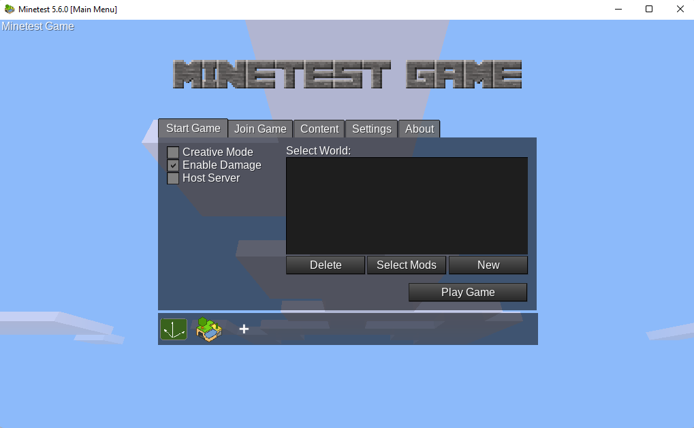
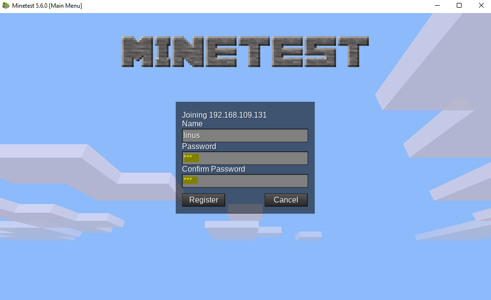

# Lab <!-- {docsify-ignore} -->

## Nuttige opdrachten vinden 

Op de [downloads pagina van de Minetest website](https://www.minetest.net/downloads/) zien we een link die verwijst naar een specifieke ubuntu url genaamd `packages.ubuntu.com/...`. Dit betekent dat je het `minetest`-pakket kunt installeren met behulp van een CLI-tool. 

 

## Manieren vinden om minetest te installeren 

Linus moet minetest op de een of andere manier op zijn server installeren. Hij moet een commando vinden waarmee hij pakketten kan installeren. 

Linus gebruikt het commando `man` om een lijst met commando's te vinden die het trefwoord _package_ in hun beschrijving hebben: 
```bash
man -k package                    or                    apropos package
```
De opdracht geeft de volgende uitvoer: 
```
student@linux-ess:~$ man -k package
apt-extracttemplates (1) - Utility to extract debconf config and templates from Debian packages
apt-get (8)          - APT package handling utility -- command-line interface
apt-mark (8)         - show, set and unset various settings for a package
apt-sortpkgs (1)     - Utility to sort package index files
check-language-support (1) - returns the list of missing packages in order to provide a complete language environment
debconf-apt-progress (1) - install packages using debconf to display a progress bar
dh_bash-completion (1) - install bash completions for package
```
Het `apt-get`-commando in deze lijst ziet er veelbelovend uit. Linus besluit het `apt-get`-commando te onderzoeken. Allereerst doet hij dit met het commando `whatis`: 
```bash
whatis apt-get
```
Hij wil meer informatie over het gebruik van het commando dus besluit hij de manpage te bekijken: 
```bash
man apt-get
```
Dit commando geeft ons de volledige _handleiding/manual_ van het `apt-get` commando: 

```
APT-GET(8)                                               APT                                               APT-GET(8)

NAME
       apt-get - APT package handling utility -- command-line interface

SYNOPSIS
       apt-get [-asqdyfmubV] [-o=config_string] [-c=config_file] [-t=target_release] [-a=architecture] {update |
               upgrade | dselect-upgrade | dist-upgrade | install pkg [{=pkg_version_number | /target_release}]...  |
               remove pkg...  | purge pkg...  | source pkg [{=pkg_version_number | /target_release}]...  |
               build-dep pkg [{=pkg_version_number | /target_release}]...  |
               download pkg [{=pkg_version_number | /target_release}]...  | check | clean | autoclean | autoremove |
               {-v | --version} | {-h | --help}}

DESCRIPTION
       apt-get is the command-line tool for handling packages, and may be considered the user's "back-end" to other
       tools using the APT library. Several "front-end" interfaces exist, such as aptitude(8), synaptic(8) and
       wajig(1).

       Unless the -h, or --help option is given, one of the commands below must be present.

       update
           update is used to resynchronize the package index files from their sources. The indexes of available
           packages are fetched from the location(s) specified in /etc/apt/sources.list. For example, when using a
           Debian archive, this command retrieves and scans the Packages.gz files, so that information about new and
           updated packages is available. An update should always be performed before an upgrade or dist-upgrade.
           Please be aware that the overall progress meter will be incorrect as the size of the package files cannot
           be known in advance.

       upgrade
       ...
       install
           install is followed by one or more packages desired for installation or upgrading. Each package is a
           package name, not a fully qualified filename (for instance, in a Debian system, apt-utils would be the
           argument provided, not apt-utils_2.0.6_amd64.deb). All packages required by the package(s) specified for
           installation will also be retrieved and installed. The /etc/apt/sources.list file is used to locate the
           desired packages. If a hyphen is appended to the package name (with no intervening space), the identified
           package will be removed if it is installed. Similarly a plus sign can be used to designate a package to
           install. These latter features may be used to override decisions made by apt-get's conflict resolution
           system.

           A specific version of a package can be selected for installation by following the package name with an
           equals and the version of the package to select. This will cause that version to be located and selected
           for install. Alternatively a specific distribution can be selected by following the package name with a
           slash and the version of the distribution or the Archive name (stable, testing, unstable).

           Both of the version selection mechanisms can downgrade packages and must be used with care.

           This is also the target to use if you want to upgrade one or more already-installed packages without
           upgrading every package you have on your system. Unlike the "upgrade" target, which installs the newest
           version of all currently installed packages, "install" will install the newest version of only the
           package(s) specified. Simply provide the name of the package(s) you wish to upgrade, and if a newer
           version is available, it (and its dependencies, as described above) will be downloaded and installed.

           Finally, the apt_preferences(5) mechanism allows you to create an alternative installation policy for
           individual packages.
       ...
```
Hij kan door de manpage navigeren met behulp van de pijltjestoetsen op het toetsenbord. Na het lezen van de manpage sluit hij deze af door op de `q`-toets op zijn toetsenbord te drukken. Met behulp van de info in de manpage, kunnen we zien dat het `apt-get` commando een subcommando heeft genaamd `install`. Linus komt erachter dat hij dit kan gebruiken om minetest op zijn systeem te installeren. 

## Minetest installeren 
Met de kennis die hij zojuist heeft verzameld, probeert hij Minetest te installeren: 

```bash
student@linux-ess:~$ apt-get install minetest
E: Could not open lock file /var/lib/dpkg/lock-frontend - open (13: Permission denied)
E: Unable to acquire the dpkg frontend lock (/var/lib/dpkg/lock-frontend), are you root?
```

Hij ziet een fout (`permission denied`). Het is belangrijk om foutmeldingen te leren analyseren. Zoals hij kan zien, verwijst de fout ook naar de gebruiker `root`. In dit hoofdstuk hebben we gezien dat sommige opdrachten _beheerdersrechten_ vereisen om te worden uitgevoerd. `apt-get` is een systeemcommando dat het hele systeem beïnvloedt, dus dit commando vereist speciale rechten. Linus kan dit commando als superuser uitvoeren met het commando `sudo`: 

?> <i class="fa-solid fa-circle-info"></i> Gebruik de `pijl-omhoog` om de _history_ te gebruiken en gebruik de `linkerpijl` of `home-toets` om naar het _begin van de lijn_ te gaan om sudo te typen. 

```bash
student@linux-ess:~$ sudo apt-get install minetest
[sudo] password for student:
Reading package lists... Done
Building dependency tree
Reading state information... Done
The following additional packages will be installed:
...
After this operation, 38,8 MB of additional disk space will be used.
Do you want to continue? [Y/n] Y
...
Setting up minetest (5.1.1+repack-1build1) ...
Processing triggers for mime-support (3.64ubuntu1) ...
Processing triggers for libc-bin (2.31-0ubuntu9.2) ...
Processing triggers for man-db (2.9.1-1) ...
...
student@linux-ess:~$
```

?> <i class="fa-solid fa-circle-info"></i> Als je een fout krijgt bij het uitvoeren van de bovenstaande opdracht, probeert `sudo apt-get update` uit te voeren en voert de opdracht `sudo apt-get install minetest` opnieuw uit. 

De bovenstaande opdracht vraagt je om je wachtwoord en kan je ook vragen of je zeker weet dat je een heleboel pakketten wilt installeren.  

De installatie is geslaagd (denkt hij, want we krijgen niet echt een succesboodschap ofzo). Linus ziet een hele hoop uitvoer, maar hij heeft geen idee waar minetest zich bevindt of hoe hij zelfs de serverbestanden kan uitvoeren. In het volgende hoofdstuk zullen we onderzoeken hoe bestanden en mappen in Linux werken. 

Soms is het nuttig dat we tekst kunnen kopiëren en plakken in onze CLI-omgeving. Bij het gebruik van de CLI in de virtuele machine kunnen we dit niet doen. We zouden verbinding kunnen maken met de virtuele machine met behulp van SSH. Dit is een protocol dat externe verbindingen mogelijk maakt met machines waartoe we fysiek geen toegang hebben. Bijvoorbeeld als je sever in de cloud staat. Een van de voordelen van het gebruik van SSH is dat we ook tekst in onze CLI kunnen kopiëren en plakken. 

We hebben geleerd dat dit commando eigenlijk de pakketbeheerder gebruikt om een pakket met de naam `minetest` in zijn repositories te zoeken (en te installeren). Het installeert ook alle benodigde dependencies en stelt het besturingssysteem in, zodat we het commando `minetest` daadwerkelijk kunnen gebruiken. 

Om meer te weten te komen over het commando kunnen we eerst het `man minetest` commando uitvoeren: 

```bash
minetest(6)                                                                                               minetest(6)

NAME
       minetest, minetestserver - Multiplayer infinite-world block sandbox

SYNOPSIS
       minetest [--server SERVER OPTIONS | CLIENT OPTIONS] [COMMON OPTIONS] [WORLD PATH]

       minetestserver [SERVER OPTIONS] [COMMON OPTIONS] [WORLD PATH]

DESCRIPTION
       Minetest  is  one  of the first InfiniMiner/Minecraft(/whatever) inspired games (started October 2010), with a
       goal of taking the survival multiplayer gameplay in a slightly different direction.

       The main design philosophy is to keep it technically simple, stable and portable. It will be kept  lightweight
       enough to run on fairly old hardware.

COMMON OPTIONS
       --help Print allowed options and exit

       --version
              Print version information and exit

       --config <value>
              Load configuration from specified file

       --logfile <value>
              Set logfile path ('' for no logging)

 Manual page minetest(6) line 1 (press h for help or q to quit)
```

## De server uitvoeren 

We merken dat er een optie is: `--server`. Het pakket dat we hebben geïnstalleerd, heeft zowel de clientversie (degene die je laadt om verbinding te maken met de server en af te spelen) als de serverversie (degene die je uitvoert om daadwerkelijk een server te hosten waarmee andere spelers verbinding kunnen maken via een client). 

We controleren ook waar het uitvoerbare bestand zich bevindt met behulp van het commando `which minetest`: 

 ```bash
student@linux-ess:~$ which minetest
/usr/games/minetest
 ```

?> We konden allebei de commando's `minetest` en `/usr/games/minetest` uitvoeren. Beide zouden hetzelfde uitvoerbare bestand uitvoeren. Dit is mogelijk door de variabele `$PATH` die de map `/usr/games` bevat. Wanneer je een commando typt, zoekt de CLI naar een uitvoerbaar bestand in alle mappen in de variabele `$PATH` en voert dat bestand vervolgens uit. Dit maakt het gemakkelijker om opdrachten uit te voeren, omdat we niet altijd het volledige pad naar een bestand nodig hebben. JE kan `echo $PATH` typen om de waarde van de PATH-variabele te zien. 

Bij het uitvoeren van het commando `minetest` zal je merken dat je een foutmelding krijgt: 

 ```bash
 student@linux-ess:~/linuscraft$ minetest
ALSA lib confmisc.c:767:(parse_card) cannot find card '0'
ALSA lib conf.c:4732:(_snd_config_evaluate) function snd_func_card_driver returned error: No such file or directory
ALSA lib confmisc.c:392:(snd_func_concat) error evaluating strings
ALSA lib conf.c:4732:(_snd_config_evaluate) function snd_func_concat returned error: No such file or directory
ALSA lib confmisc.c:1246:(snd_func_refer) error evaluating name
ALSA lib conf.c:4732:(_snd_config_evaluate) function snd_func_refer returned error: No such file or directory
ALSA lib conf.c:5220:(snd_config_expand) Evaluate error: No such file or directory
ALSA lib pcm.c:2642:(snd_pcm_open_noupdate) Unknown PCM default
AL lib: (EE) ALCplaybackAlsa_open: Could not open playback device 'default': No such file or directory
terminate called after throwing an instance of 'std::runtime_error'
  what():  Audio: Global Initialization: Device Open
Aborted
 ```

We merken dat we een foutmelding krijgen met de melding `cannot find card '0'`. Vergeet niet dat we proberen de clientversie van het spel uit te voeren. Deze client is een echte grafische gebruikersinterface die er ongeveer zo uit zou zien: 

 

We krijgen deze fout omdat we een Ubuntu-server uitvoeren met behulp van een command line interface. Er is geen grafische gebruikersinterface aanwezig, dus de eigenlijke GUI van de client kan niet worden geladen. De clientversie van het spel installeren we later in dit lab op onze laptop. 

Dus om onze server aan de praat te krijgen, zullen we ons moeten concentreren op het gebruik van het commando `minetest --server`: 

```bash
student@linux-ess:~$ minetest --server
        .__               __                   __
  _____ |__| ____   _____/  |_  ____   _______/  |_
 /     \|  |/    \_/ __ \   __\/ __ \ /  ___/\   __\
|  Y Y  \  |   |  \  ___/|  | \  ___/ \___ \  |  |
|__|_|  /__|___|  /\___  >__|  \___  >____  > |__|
      \/        \/     \/          \/     \/
2022-08-25 09:36:24: ACTION[Main]: World at [/home/student/.minetest/worlds/world]
2022-08-25 09:36:24: ACTION[Main]: Server for gameid="minetest" listening on 0.0.0.0:30000.
```

We krijgen onze prompt niet terug. Dit komt omdat de servertoepassing een actief proces is. We kunnen dit proces altijd onderbreken door de toetsenbordcombinatie `ctrl+c` te gebruiken. 

?> Merk op dat we het `minetest` uitvoerbare bestand actief moeten hebben als we later daadwerkelijk verbinding willen maken met de server! 

Bij het uitvoeren van het commando met behulp van de optie `--server`, kunnen we zien dat het een map `worlds/world` heeft gemaakt in `/home/student/.minetest`. Dit is interessant omdat hier `minetest` standaard alle configuratiebestanden van onze eigenlijke server opslaat. We merken ook dat de server _luisterd_ voor verbindingen op poort `30000`.  

Linus wil echter niet de standaardconfiguratie gebruiken. Hij maakte een map `~/linuscraft/serverfiles` met als doel de wereldbestanden te beheren. Met behulp van de manpage zien we dat we de server kunnen vertellen om dit pad te gebruiken over waar de wereldbestanden moeten worden opgeslagen: 

```bash
student@linux-ess:~$  minetest --server --world ~/linuscraft/serverfiles/myworld --logfile ~/linuscraft/serverfiles/logfile.txt
        .__               __                   __
  _____ |__| ____   _____/  |_  ____   _______/  |_
 /     \|  |/    \_/ __ \   __\/ __ \ /  ___/\   __\
|  Y Y  \  |   |  \  ___/|  | \  ___/ \___ \  |  |
|__|_|  /__|___|  /\___  >__|  \___  >____  > |__|
      \/        \/     \/          \/     \/
2022-08-25 09:45:01: ACTION[Main]: World at [/home/student/linuscraft/serverfiles/myworld]
2022-08-25 09:45:01: ACTION[Main]: Server for gameid="minetest" listening on 0.0.0.0:30000.
```

We hebben ook de optie `--logfile` gebruikt om alle serverlogboeken op te slaan in een specifiek bestand. We zien nu dat de wereld is gemaakt in `~/linuscraft/serverfiles/myworld`. We kunnen dit controleren door op `ctrl+c` te drukken (dit zal de minetest-server afsluiten) en een `ls`-commando uit te voeren: 

```bash
student@linux-ess:~$ ls linuscraft/serverfiles/myworld/
env_meta.txt  force_loaded.txt  ipban.txt  map_meta.txt  map.sqlite  world.mt
```

## Verbinding maken met de server 
*Eerst* moeten we een nieuwe ingaande veiligheidsregel toevoegen zodat de server onze request op UDP poort 30000 krijgt. Om dit te doen gaan je naar de security group en voeg je een nieuwe regel toe.

Klik op de *Security Group* om deze aan te passen

Klik op *Edit inbound rules*

Voeg nog een regel toe van het type custom UDP, laat 'any-where IPv4' toe en geeft het een bruikbaar commentaar. Sla op en dan kunnen we verder.


*Ten tweede* moeten we het IP-adres van de server krijgen. Dit is hetzelfde IP-adres als je gebruikt om via SSH te connecteren. 

*Ten derde* moeten we ervoor zorgen dat de server daadwerkelijk draait met behulp van het `minetest`-commando dat we hierboven hebben gemaakt. We laten dit proces actief: 

```bash
student@linux-ess:~$  minetest --server --world ~/linuscraft/serverfiles/myworld --logfile ~/linuscraft/serverfiles/logfile.txt
        .__               __                   __
  _____ |__| ____   _____/  |_  ____   _______/  |_
 /     \|  |/    \_/ __ \   __\/ __ \ /  ___/\   __\
|  Y Y  \  |   |  \  ___/|  | \  ___/ \___ \  |  |
|__|_|  /__|___|  /\___  >__|  \___  >____  > |__|
      \/        \/     \/          \/     \/
2022-08-25 09:45:01: ACTION[Main]: World at [/home/student/linuscraft/serverfiles/myworld]
2022-08-25 09:45:01: ACTION[Main]: Server for gameid="minetest" listening on 0.0.0.0:30000.
```

### Download de client 

Vervolgens moeten we de client downloaden op onze Windows-laptop. Je kan de client downloaden op https://www.minetest.net/downloads/. Download en pak de `Minetest x.x.x - portable, 64-bit (recommended)` uit. Na het uitpakken van de map vindt je een bestand met de naam `minetest.exe` in de submap `bin` waarop je kan dubbelklikken: 


### Verbinding maken met onze server 

Bij het opstarten van de client op onze Windows-machine krijg je een menu met verschillende opties. Omdat we lid willen worden van een server en niet lokaal willen spelen, klikken we op het tabblad _join game_. 



Aan de rechterkant van het menu kunnen we het ip-adres invoeren dat we eerder op de server hebben gevonden door het commando `ip a` uit te voeren. De poort zou standaard ingesteld moeten zijn met de waarde `30000`. We geven ook een gebruikersnaam en wachtwoord en klikken op de knop `register`: 


?> De volgende keer dat je lid wordt, moet je op de inlogknop klikken en het geselecteerde wachtwoord opgeven! 

We stellen het wachtwoord in en klikken op de knop `Register`: 


Na dit proces moet de client je verbinden met de server en kan je rondrennen en dingen bouwen! 


?> Wees voorzichtig. Gevaarlijke wezens zwerven 's nachts over de hele wereld! 

Wanneer we teruggaan naar de CLI van onze server, zal je merken dat de uitvoer van ons commando is gewijzigd. Het laat nu zien dat een speler verbinding heeft gemaakt (en de verbinding heeft verbroken) met de server: 

```bash
student@linux-ess:~$ minetest --server --world ~/linuscraft/serverfiles/myworld
        .__               __                   __
  _____ |__| ____   _____/  |_  ____   _______/  |_
 /     \|  |/    \_/ __ \   __\/ __ \ /  ___/\   __\
|  Y Y  \  |   |  \  ___/|  | \  ___/ \___ \  |  |
|__|_|  /__|___|  /\___  >__|  \___  >____  > |__|
      \/        \/     \/          \/     \/
2022-08-25 10:24:46: ACTION[Main]: World at [/home/dries/linuscraft/serverfiles/myworld]
2022-08-25 10:24:46: ACTION[Main]: Server for gameid="minetest" listening on 0.0.0.0:30000.
2022-08-25 10:32:51: ACTION[Server]: linus [172.25.xxx.x] joins game.
2022-08-25 10:32:51: ACTION[Server]: linus joins game. List of players: linus
2022-08-25 10:37:33: ACTION[Server]: linus digs default:acacia_tree at (6,5,3)
```

### Een gedownloade wereld gebruiken 

De standaard wereld is vrij leeg, dus Linus wil indruk maken op zijn vrienden door een vooraf gebouwde wereld te downloaden die hij op Google heeft gevonden. Om dit te doen gaan we naar je `serverfiles` directory: 

```bash
student@linux-ess:~$ cd ~/linuscraft/serverfiles
```

Nadat we dit hebben gedaan, downloaden we het zip-bestand met onze nieuwe wereld door de onderstaande opdracht uit te voeren: 

```bash
student@linux-ess:~/linuscraft/serverfiles$ wget https://vwgert.github.io/data/customworld.zip
```

Als we een kijkje willen nemen in het zip-bestand, kunnen we ```less customworld.zip``` gebruiken  

Dit geeft ons een `zip`-bestand dat we moeten uitpakken door ```unzip customworld.zip``` uit te voeren. 

We kunnen het zipbestand daarna verwijderen omdat we dit niet langer nodig hebben: 

```bash
student@linux-ess:~/linuscraft/serverfiles$ rm customworld.zip
student@linux-ess:~/linuscraft/serverfiles$ ls
pxl-world  logfile.txt  myworld
```

Zoals te zien is in de output hierboven, heet de nieuwe wereld `pxl-wereld`. We kunnen nu het commando gebruiken dat we eerder zagen om de server te starten met behulp van de nieuwe wereld bestanden: 

```bash
student@linux-ess:~/linuscraft/serverfiles$ minetest --server --world ~/linuscraft/serverfiles/pxl-world/ --logfile ~/linuscraft/serverfiles/logfile.txt
```

Als je nu lid wordt, zou je in een wereld moeten zijn die een meer/zee bevat met het Hogeschool PXL logo dat in de lucht zweeft! 

