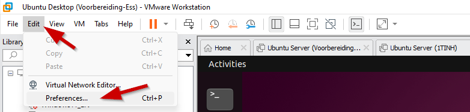

# Oefeningen op Users, Groups, Permissions - Extra oefeningen

## Oefening 1
Maak een groep met de naam pxl en een gebruiker itstudent. De primaire groep van deze gebruiker is pxl. Stel het wachtwoord voor de gebruiker in op test123. De home directory voor deze gebruiker is /home/itstudent en voor de shell gebruikt de gebruiker /bin/bash. 

## Oefening 2
Zorg ervoor dat de gebruiker itstudent een sudoer wordt. Test of dit werkt. 

## Oefening 3
Kopieer het bestand /etc/hosts naar je home directory (doe dit niet als root!). Stel de rechten met de opdracht chmod als volgt in:  
r-x voor anderen, rw- voor groep en geen rechten (---) voor de eigenaar van het bestand. Controleer met het ls -l commando of alles is gewijzigd.  
- Kan de eigenaar van het bestand de inhoud van het bestand bekijken? Waarom / Waarom niet? 
- Kan hij de rechten wijzigen? 
- Kan hij het bestand verwijderen? 

## Oefening 4
Maak 7 gebruikers aan met de naam:   
Walter, Michael, Ben, James, Mia, Emma en Charlotte  
  
Emma, Charlotte en Mia hebben de groep _users_ als primaire groep, hun secundaire groep moet _Sales_ zijn.  
Walter en Michael hebben hun eigen primaire groep en zijn bijkomstig lid van de groep _Planning_   
Ben en James hebben ook hun eigen primaire groep, maar maken deel uit van beide afdelingen en zijn daarom bijkomstig lid van beide groepen _Planning_ en _Sales_  
  
Alle gebruikers hebben hun home directory in _/home/gebruikersnaam_.  
Er zijn 3 extra mappen, die te vinden zijn in _/home_:  
_/home/planning_: bevat de planning, aanpasbaar voor alle leden van de planning.   
_/home/sales_: bevat informatie over de verkoop, aanpasbaar voor alle leden van sales  
_/home/general_: bevat algemene informatie voor iedereen? James is verantwoordelijk voor deze map en daarom heeft alleen James bewerkingsrechten voor deze map en de inhoud ervan.  

Zorg ervoor dat de gebruikers die moeten samenwerken ook de bestanden van elk van hen kunnen wijzigen. Maak gebruik van setgid en gebruik geen ACL's. 

Alle gebruikers hebben leesrechten voor deze mappen.  
Test het scenario! 

Extra Challenge!
Zorg er voor dat de personen binnen de sales-share elkaars bestanden niet kunnen verwijderen!

## Oefening 5
Zoek hoe je de ACL-configuraties van de ene map naar de andere kopieert. 

## Oefening 6
Zoek hoe je een back-up maakt van de ACL-configuraties die in een directory zijn ingesteld. 

## Oefening 7
Stel dat je in een bedrijf werkt waar apparaten worden ontworpen, gemaakt, gerepareerd en verkocht. Ingenieurs worden aangesteld om de apparaten te ontwerpen. Technici worden aangesteld om deze apparaten te maken en te repareren en voor de verkoop ervan worden verkopers aangesteld. Alle medewerkers van dit bedrijf werken binnen een centraal Linux-systeem. De gebruikers van dit systeem moeten zo worden gedefinieerd dat de __ingenieurs hun eigen homefolder hebben en een gedeelde map /home/shared/design hebben (waar ze alle rechten hebben)__. Alle __technici delen één homefolder /home/technicians__ en al het __sales personeel hebben hun eigen homefolder en delen een map /home/shared/info (waar ze alle rechten hebben)__ waar alle technische/marketinggegevens over de apparaten worden opgeslagen. De __ingenieurs hebben ook toegang nodig tot de map /home/shared/info (alle rechten)__.   

De groepen voor de verschillende banen zijn: 

| Job | Linux groep | Gebruiker | Wachtwoord |
| --- | --- | --- | --- |
| Ingenieurs | ingenieurs | George | summer1 |
| | | Isla | summer2 |
| Technici | technici (primary group) | Leo | winter1 |
| | | Amelia | winter2 |
| Sales | sales | Jack | spring1 |
| | | Grace | spring2 |

De speciale groepen voor de gedeelde mappen:   

| folder | Linux groep met alle rechten | 
| --- | --- |
| /home/shared/design | ingenieurs | 
| /home/shared/info | sales, ingenieurs | 

De userowner van de gedeelde directories is de `root` gebruiker 

### Oefening 7.1
Maak de mappen, groepen en gebruikers zoals vermeld in bovenstaande situatie. 

### Oefening 7.2
Geef alle gebruikers de juiste groepen zoals vermeld in bovenstaande situatie. 

### Oefening 7.3
Stel alle machtigingen en ACL's in voor het hierboven genoemde scenario. Gebruik de speciale bit setgid niet, maar zorg er toch voor dat de ACL's worden overgeërfd naar eventuele, later aangemaakte, submappen. 

## Oefening 8
Maak de directorystructuur met de benodigde gebruikers, groepen en ACL's zoals weergegeven in de onderstaande afbeelding. 

 

Test waar de gebruikers Ava en Oliver lees- en bewerkingsrechten hebben. 

## Oefening 9 

Probeer de minetest client op je Ubuntu Desktop te installeren en maak verbinding met de server om het spel te spelen. Na installatie vind je minetest tussen je applicaties in de GUI. Zorg ervoor dat je minetest server actief is. Zo niet, gebruik dan ctrl+r en zoek naar minetest totdat je het volgende commando ziet: minetest --server --world ~/linuscraft/serverfiles/pxl-world --logfile ~/linuscraft/serverfiles/logfile.txt

Als je muisinteractie niet werkt, moet je deze wijzigen om games te spelen: 

  

  

