# Assignment Basic Unix Tools

## Task 1
Take a screenshot of your Ubuntu Desktop by pressing the PrtSc butten. A Screenshot file has "Screenshot" in the name in Ubuntu. Find this file using the locate command. 

<br/>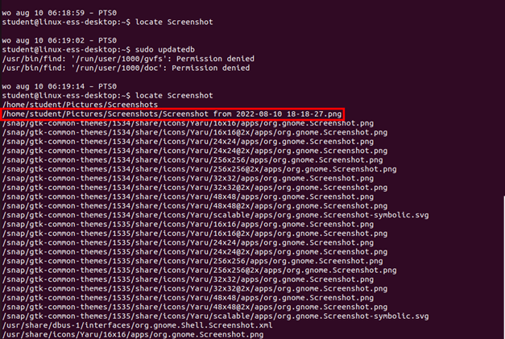

## Task 2
Create a summary of all files and folder from the root folder in the file "summary". Make sure you know how look this command took to execute. 

<br/>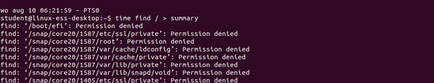
<br/>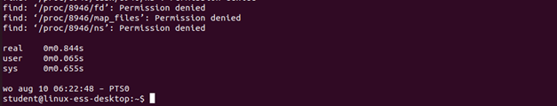

## Task 3
Show the size of the "summary" file in human readable format 

<br/>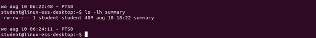

## Task 4
Compress this file using the two commands we’ve seen and compare the difference in size. Also time how long it takes the two commands to compress the file. 

<br/>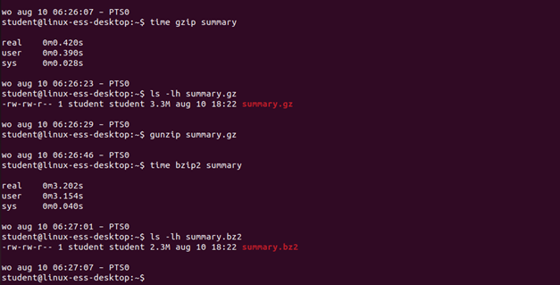

## Task 5
Look at the contents of the compressed files without decompressing them. Make sure you can scroll through them one screen at a time. 

<br/>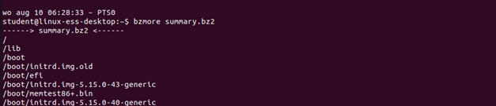
<br/>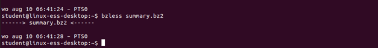
<br/>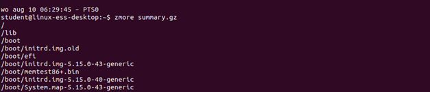
<br/>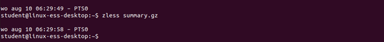

## Task 6
Decompress the file.

<br/>
<br/>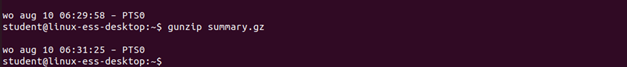

## Task 7
How can you delete the error messages in the following command (don’t show)?
```bash
find / -name output.txt
```

<br/>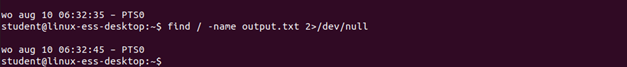

## Task 8
Create a backup of all home folders to a tarball named /tmp/backuphomefolders.tar.gz

<br/>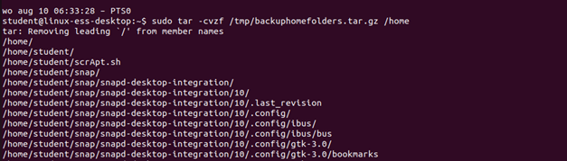


## Task 9
Create the folder /tmp/restorehome folders and restore the files of the tarball in this folder. 

<br/>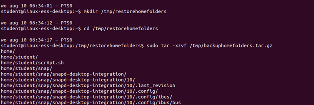

## Task 10
Look at the permissions of some files in the different home directories using the ls -l command. The files should have the permissions of the original users. 

<br/>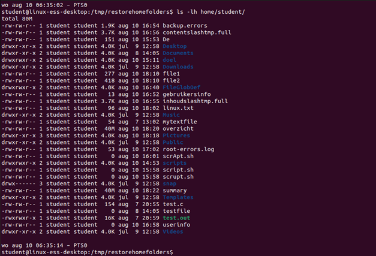
==> Yes

## Task 11
Find which weekday your birthday is in the year 2033?

<br/>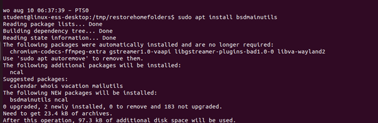
<br/>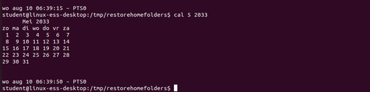
