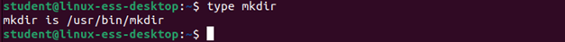
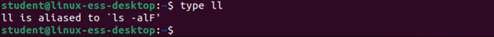
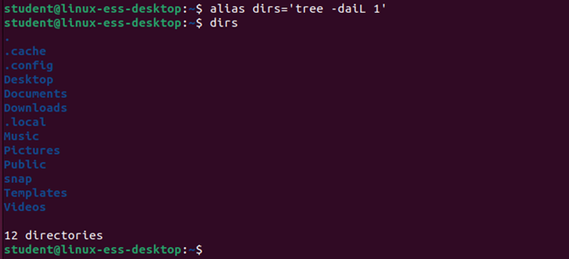
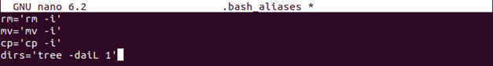
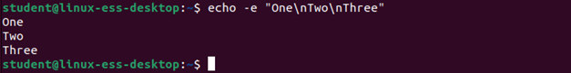
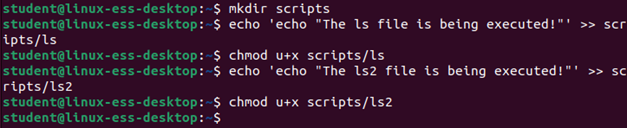
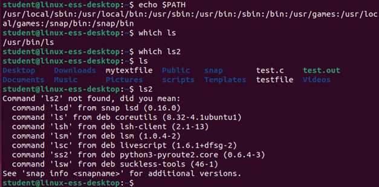
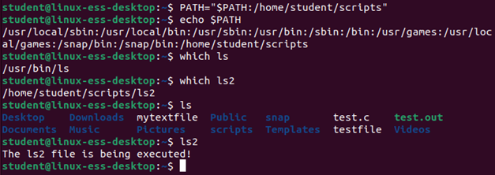
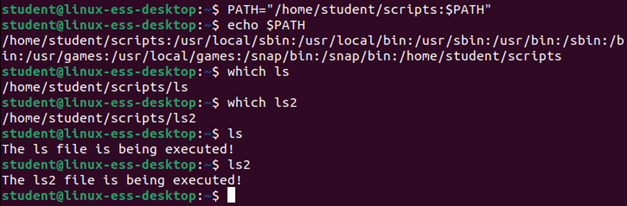

# Assignment Commands and arguments

## Task 1
Check if cd is a built-in command 

<br/>

## Task 2
Check if mkdir is a built-in command

<br/>

## Task 3
If the command ll is used to check the contents of a directory, what command is being executed exactly? 

<br/>

## Task 4
Give the command that shows that the kill-command is simultaneously a built-in and external command.

```bash
type -a kill
```

## Task 5

Put a new line in the file name ".bash_aliases" of your home folder, so that in the future the following command exists:

Dirs 	→ uses the tree command
		→ only shows directories (no files)
		→ also shows hidden directories
		→ does not show subdirectories, only 1 level
		→ does not have indentation-symbols 

?> <i class="fa-solid fa-circle-info"></i> Note that you cannot scroll in a server CLI environment. If the file content is to big for the terminal size it will 
Try and create the alias first in your command line $ alias = ‘…’
If this works, put the command at the bottom of the .bash_aliases file

<br/>
<br/>

## Task 6
Try with only one echo-command to print the following three numbers, on different lines:
```
One
Two
Three
```

<br/>


## Task 7

Create a folder named "scripts" in the home folder of student. 

- Create a file names "ls" in this folder with the content:
	```bash
	echo "The ls file is being executed!"
	```

- Make this file an executable by entering the following command:
	```bash
	chmod u+x ls
	```

- Create a file names "ls2" in this folder with the content:
	```bash
	echo "The ls2 file is being executed!"
	```

- Make this file an executable by entering the following command:
	```bash
	chmod u+x ls2
	```

<br/>

## Task 8

Go to your home folder
- What does the command "echo $PATH" show
- What does the command "which ls" show
- What does the command "which ls2" show
- Execute the command "ls"
- Execute the command "ls2"

<br/>

## Task 9

Execute the command: PATH="$PATH:/home/student/scripts"
- What does the command "echo $PATH" show
- What does the command "which ls" show
- What does the command "which ls2" show
- Execute the command "ls"
- Execute the command "ls2"

<br/>


## Task 10

Execute the command: PATH="/home/student/scripts:$PATH"
- What does the command "echo $PATH" show
- What does the command "which ls" show
- What does the command "which ls2" show
- Execute the command "ls"
- Execute the command "ls2"

<br/>
