# Assignment Shell variables

## Task 1
Change the shell prompt to look like the following. Use man bash and search PROMPT for the options.

```
<empty line>
Fri Jan 18 10:24:45 – PTS4
student@ubuntu:~$ ls
dir1 dir2 file1
<empty line>
Fri Jan 18 10:24:59 – PTS4
student@ubuntu:~$
```
<br/>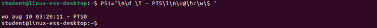

## Task 2
Make sure to always use this prompt
<br/>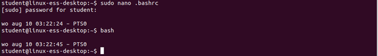
<br/>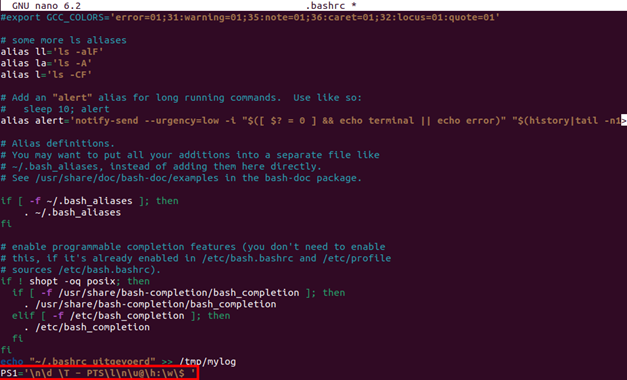


## Task 3
Use a command to show all set variables 
<br/>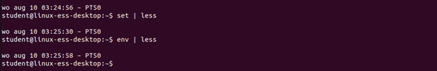
<br/>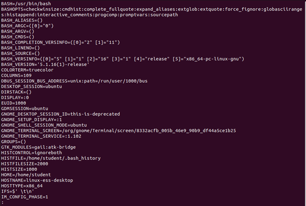
<br/>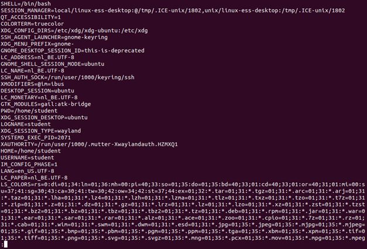

## Task 4
Try to show following text with the echo command on your screen. (Hint: Use multiple environment variables to show the text in bold underneath)
Hello, I am `student` and my home folder is `/home/student` on the pc with name `linux-ess-desktop`. You are now working in folder `/tmp`.

<br/>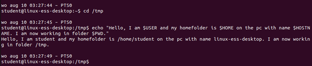

## Task 5
Create a variable named "myvar" with its content the text "super". Show the following text on screen using this variable.
```
Hello superwoman, I am superman !
```
<br/>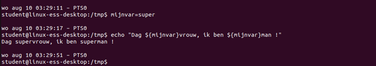

## Task 6
Delete the previous variable and reprint the text.

<br/>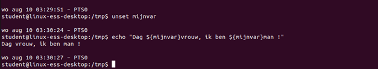


## Task 7
Search for the command timedatectl in the man pages. How can we list alle time zones to set one of them. Set the time zone to Brussel. 

<br/>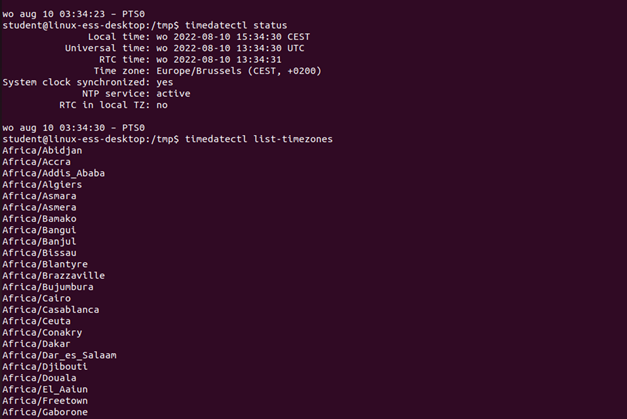
<br/>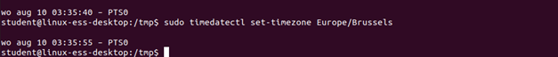


## Task 8
Search on the internet how to use "locale -a" and editing the file "/etc/default/locale" to change the date to English instead of German 

<br/>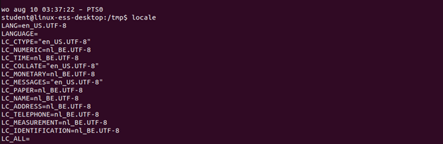
<br/>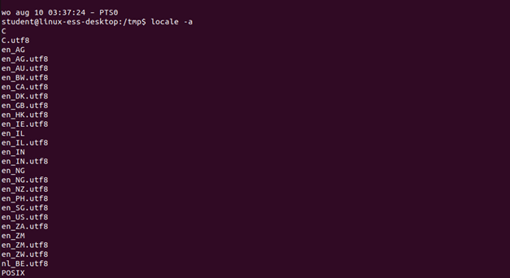
<br/>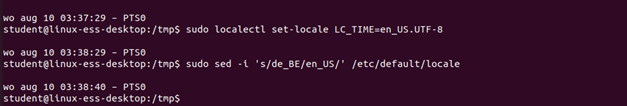

?> <i class="fa-solid fa-circle-info"></i>You will need to log out and log in to let the changes take effect.

## Task 9
Create a command that shows the following text with the current date on screen. (Hint: Use embedded shells.)

```
Today, it is <weekday>, <day> <month> <year>. The time is <hour>:<minute>
Example → Today, it is Wednesday, 10 August 2022. The time is 15:47.
```

<br/>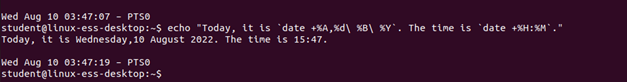

## Task 10
Try and set the time to Dutch. Search the internet for "locale-gen"

<br/>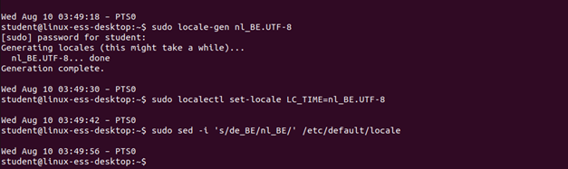

?> <i class="fa-solid fa-circle-info"></i> You will need to log out and log in to let the changes take effect.

<br/>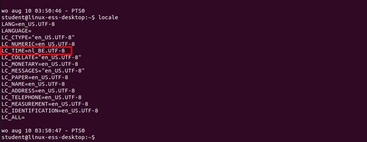


## Task 11
Try to print the following text on screen, make sure this is correct for each user. (Hint: Try this with and without quotes.)

```
=> The contents of my home folder:
Desktop
Documents
Downloads
examples.desktop
Music
Pictures
Public
Templates
Videos
```

<br/>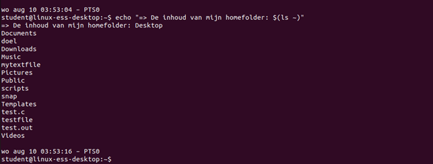

?> <i class="fa-solid fa-circle-info"></i>  without the " " you’ll need to remove the arrow => to get an output. But the output will print everything on 1 
line. 

<br/>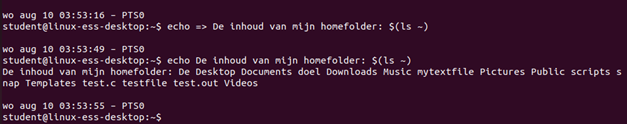