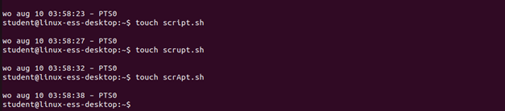
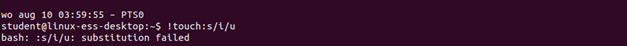
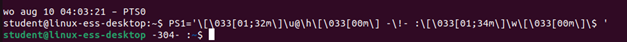
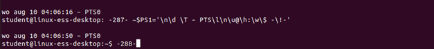
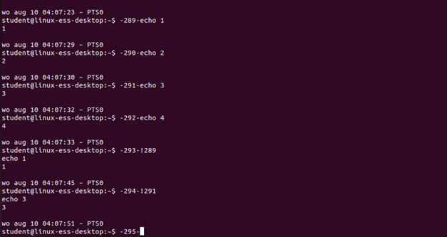

# Assignment Shell history

## Task 1
Create the files sript.sh, scrupt.sh and scrApt.sh. Do this by using the touch commando three times. 

<br/>

## Task 2
Type CTRL-R to search in the bash_history and type some letters scr. You will see the last command that has been used with these letters, normally this would be "touch scrApt.sh".

<br/>

## Task 3
Type
```bash
echo "just an intermediate command"
```
<br/>


## Task 4
Execute the last touch from your history but change the letter "i" to the letter "u". Use regular expressions. 

<br/>

## Task 5
Change the prompt (PS1) so that the history number of the command you’re about the type is shown at the end of the prompt. 

<br/>
<br/>


## Task 6

Execute four commands. Try running the command you executed thee steps back using its history number.

<br/>
